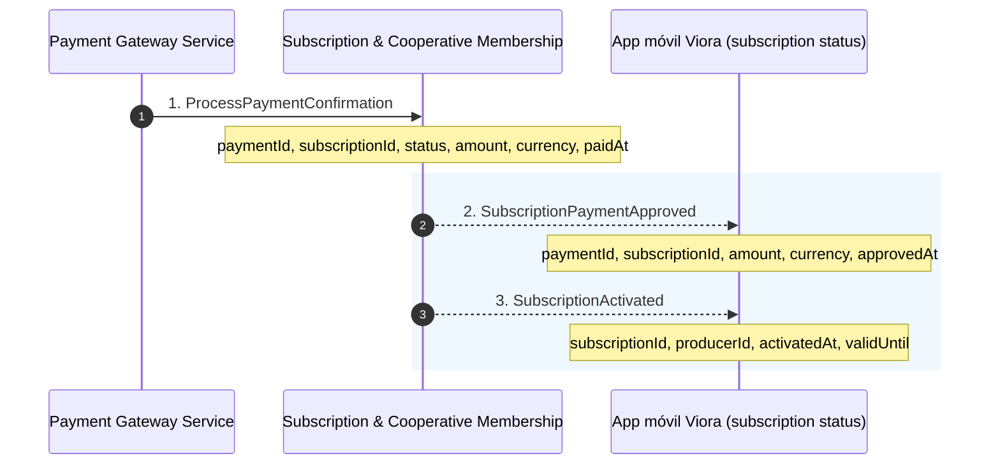
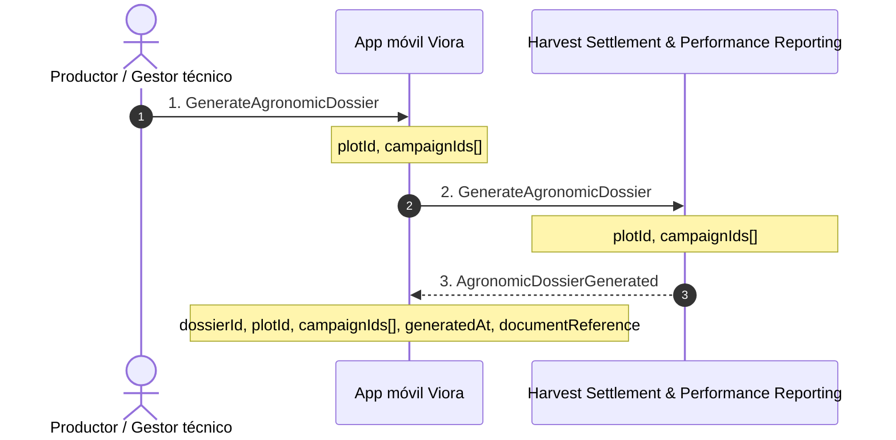
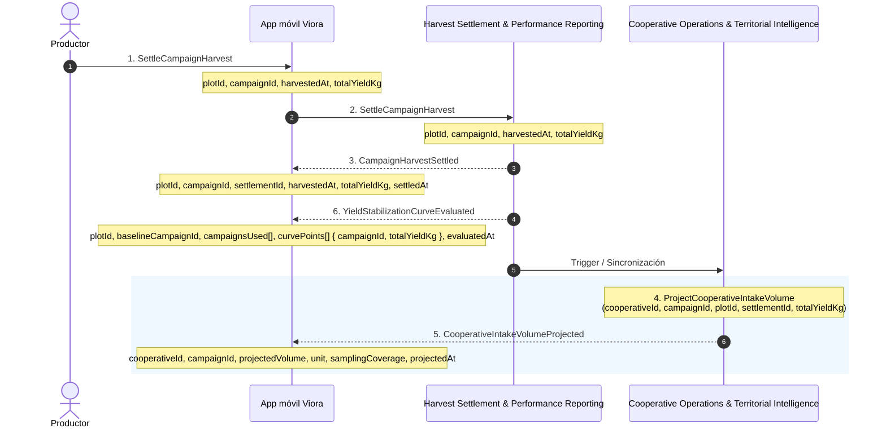
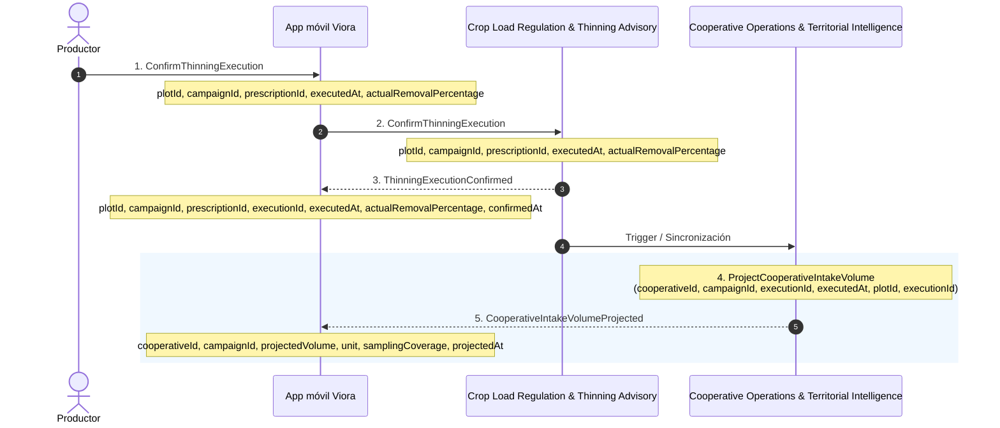
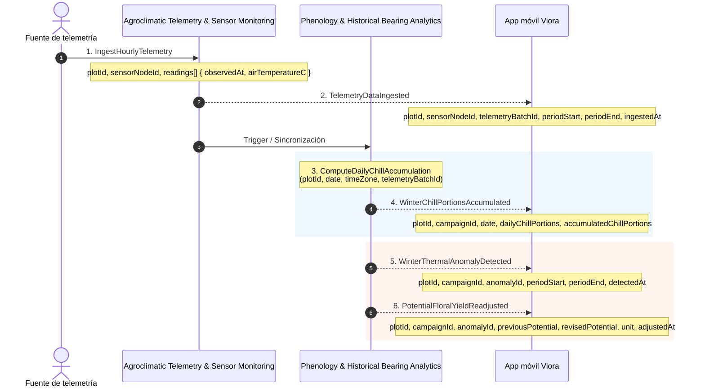
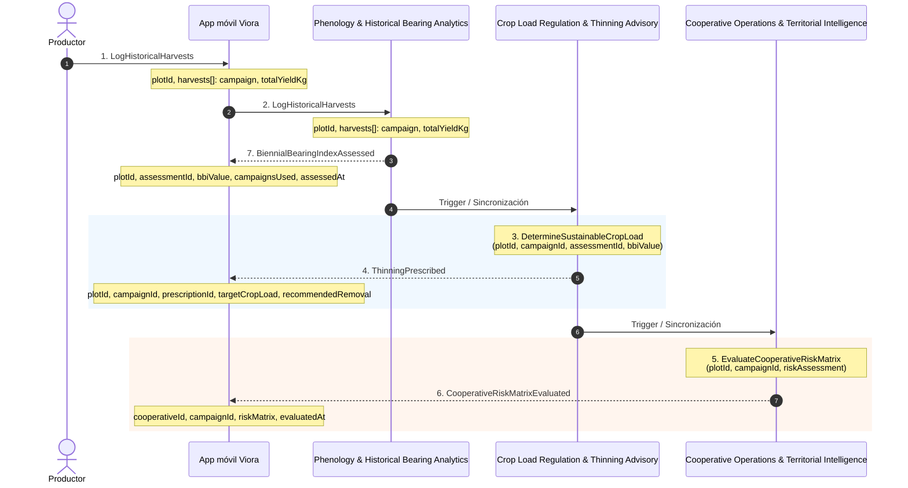
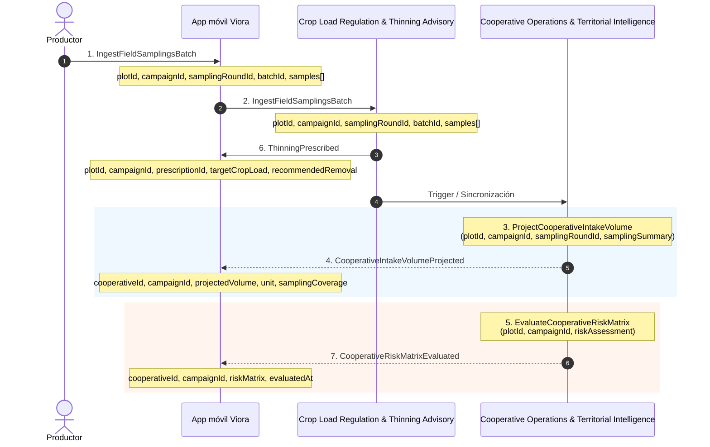
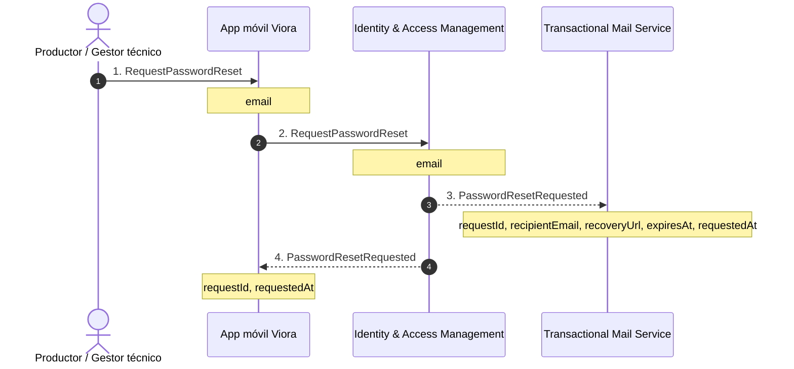

# Domain Message Flows

---

# 1. Domain Message Flow: Confirmación de pago y activación de la suscripción

## Contexto
- **Bounded Context(s) involucrados:** Subscription & Cooperative Membership
- **Actor(s):** Payment Gateway Service, App móvil Viora (subscription status)
- **Trigger:** Confirmación externa de un pago procesado y aprobado desde la pasarela de pagos.
- **Resumen:** El servicio externo de pagos notifica la aprobación de la transacción, lo que desencadena la activación formal de la suscripción del productor en el sistema y la actualización del estado en la aplicación móvil.

## Secuencia de mensajes

| # | Tipo | ID / Nombre | Bounded Context / Elemento | Detalle / Payload |
|---|------|-------------|----------------------------|-------------------|
| 1 | Command | `ProcessPaymentConfirmation` | Payment Gateway Service -> Subscription & Cooperative Membership | `paymentId`, `subscriptionId`, `status`, `amount`, `currency`, `paidAt` |
| 2 | Event | `SubscriptionPaymentApproved` | Subscription & Cooperative Membership | `paymentId`, `subscriptionId`, `amount`, `currency`, `approvedAt` |
| 3 | Event | `SubscriptionActivated` | Subscription & Cooperative Membership | `subscriptionId`, `producerId`, `activatedAt`, `validUntil` |

## Diagrama

---

# 2. Domain Message Flow: Solicitud y generación del dosier agronómico

## Contexto
- **Bounded Context(s) involucrados:** Harvest Settlement & Performance Reporting
- **Actor(s):** Producer / TechnicalManager (Productor / Gestor técnico)
- **Trigger:** Solicitud explícita de un dossier agronómico consolidado para una parcela y campañas específicas.
- **Resumen:** El usuario requiere un documento oficial que resuma el rendimiento y comportamiento agronómico de sus parcelas. El sistema genera el dossier y retorna la referencia de descarga/consulta a la aplicación móvil.

## Secuencia de mensajes

| # | Tipo | ID / Nombre | Bounded Context / Elemento | Detalle / Payload |
|---|------|-------------|----------------------------|-------------------|
| 1 | Actor Command | `GenerateAgronomicDossier` | Productor / Gestor técnico -> App móvil Viora | `plotId`, `campaignIds[]` |
| 2 | Command | `GenerateAgronomicDossier` | App móvil Viora -> Harvest Settlement & Performance Reporting | `plotId`, `campaignIds[]` |
| 3 | Event | `AgronomicDossierGenerated` | Harvest Settlement & Performance Reporting | `dossierId`, `plotId`, `campaignIds[]`, `generatedAt`, `documentReference` |

## Diagrama

---

# 3. Domain Message Flow: Cierre de cosecha, evaluación de estabilización y actualización del acopio

## Contexto
- **Bounded Context(s) involucrados:** Harvest Settlement & Performance Reporting, Cooperative Operations & Territorial Intelligence
- **Actor(s):** Producer (Productor)
- **Trigger:** Cierre formal de la cosecha de una campaña por parte del productor.
- **Resumen:** Al liquidar la cosecha de una campaña, se evalúa la curva de estabilización de rendimiento histórica y simultáneamente se recalcula el volumen de acopio proyectado a nivel territorial/cooperativo.

## Secuencia de mensajes

| # | Tipo | ID / Nombre | Bounded Context / Elemento | Detalle / Payload |
|---|------|-------------|----------------------------|-------------------|
| 1 | Actor Command | `SettleCampaignHarvest` | Productor -> App móvil Viora | `plotId`, `campaignId`, `harvestedAt`, `totalYieldKg` |
| 2 | Command | `SettleCampaignHarvest` | App móvil Viora -> Harvest Settlement & Performance Reporting | `plotId`, `campaignId`, `harvestedAt`, `totalYieldKg` |
| 3 | Event | `CampaignHarvestSettled` | Harvest Settlement & Performance Reporting | `plotId`, `campaignId`, `settlementId`, `harvestedAt`, `totalYieldKg`, `settledAt` |
| 4 | Policy / Command | `ProjectCooperativeIntakeVolume` | Cooperative Operations & Territorial Intelligence | `cooperativeId`, `campaignId`, `plotId`, `settlementId`, `totalYieldKg` |
| 5 | Event | `CooperativeIntakeVolumeProjected` | Cooperative Operations & Territorial Intelligence | `cooperativeId`, `campaignId`, `projectedVolume`, `unit`, `samplingCoverage`, `projectedAt` |
| 6 | Event | `YieldStabilizationCurveEvaluated` | Harvest Settlement & Performance Reporting | `plotId`, `baselineCampaignId`, `campaignsUsed[]`, `curvePoints[] { campaignId, totalYieldKg }`, `evaluatedAt` |

## Diagrama

---

# 4. Domain Message Flow: Confirmación del raleo y reajuste del acopio cooperativo

## Contexto
- **Bounded Context(s) involucrados:** Crop Load Regulation & Thinning Advisory, Cooperative Operations & Territorial Intelligence
- **Actor(s):** Producer (Productor)
- **Trigger:** Confirmación de la ejecución efectiva del raleo prescrito en la parcela.
- **Resumen:** El productor registra el porcentaje real de raleo ejecutado en campo, lo que confirma la ejecución y reajusta la proyección global de volumen de acopio para la cooperativa.

## Secuencia de mensajes

| # | Tipo | ID / Nombre | Bounded Context / Elemento | Detalle / Payload |
|---|------|-------------|----------------------------|-------------------|
| 1 | Actor Command | `ConfirmThinningExecution` | Productor -> App móvil Viora | `plotId`, `campaignId`, `prescriptionId`, `executedAt`, `actualRemovalPercentage` |
| 2 | Command | `ConfirmThinningExecution` | App móvil Viora -> Crop Load Regulation & Thinning Advisory | `plotId`, `campaignId`, `prescriptionId`, `executedAt`, `actualRemovalPercentage` |
| 3 | Event | `ThinningExecutionConfirmed` | Crop Load Regulation & Thinning Advisory | `plotId`, `campaignId`, `prescriptionId`, `executionId`, `executedAt`, `actualRemovalPercentage`, `confirmedAt` |
| 4 | Policy / Command | `ProjectCooperativeIntakeVolume` | Cooperative Operations & Territorial Intelligence | `cooperativeId`, `campaignId`, `executionId`, `executedAt`, `plotId`, `executionId` |
| 5 | Event | `CooperativeIntakeVolumeProjected` | Cooperative Operations & Territorial Intelligence | `cooperativeId`, `campaignId`, `projectedVolume`, `unit`, `samplingCoverage`, `projectedAt` |

## Diagrama

---

# 5. Domain Message Flow: Ingesta de telemetría y reajuste del potencial floral

## Contexto
- **Bounded Context(s) involucrados:** Agroclimatic Telemetry & Sensor Monitoring, Phenology & Historical Bearing Analytics
- **Actor(s):** Fuente de telemetría (Estación meteorológica / Sensores IoT)
- **Trigger:** Ingesta por horas de lecturas de temperatura del aire desde estaciones/sensores de campo.
- **Resumen:** La recepción de datos telemétricos calcula la acumulación diaria de porciones de frío invernal. Si se detecta una anomalía térmica, el sistema recalcula y reajusta automáticamente el potencial de rendimiento floral proyectado.

## Secuencia de mensajes

| # | Tipo | ID / Nombre | Bounded Context / Elemento | Detalle / Payload |
|---|------|-------------|----------------------------|-------------------|
| 1 | Command | `IngestHourlyTelemetry` | Fuente de telemetría -> Agroclimatic Telemetry & Sensor Monitoring | `plotId`, `sensorNodeId`, `readings[] { observedAt, airTemperatureC }` |
| 2 | Event | `TelemetryDataIngested` | Agroclimatic Telemetry & Sensor Monitoring | `plotId`, `sensorNodeId`, `telemetryBatchId`, `periodStart`, `periodEnd`, `ingestedAt` |
| 3 | Policy / Command | `ComputeDailyChillAccumulation` | Phenology & Historical Bearing Analytics | `plotId`, `date`, `timeZone`, `telemetryBatchId` |
| 4 | Event | `WinterChillPortionsAccumulated` | Phenology & Historical Bearing Analytics | `plotId`, `campaignId`, `date`, `dailyChillPortions`, `accumulatedChillPortions` |
| 5 | Event | `WinterThermalAnomalyDetected` | Phenology & Historical Bearing Analytics | `plotId`, `campaignId`, `anomalyId`, `periodStart`, `periodEnd`, `detectedAt` |
| 6 | Event | `PotentialFloralYieldReadjusted` | Phenology & Historical Bearing Analytics | `plotId`, `campaignId`, `anomalyId`, `previousPotential`, `revisedPotential`, `unit`, `adjustedAt` |

## Diagrama

---

# 6. Domain Message Flow: Registro histórico, evaluación de alternancia y ajuste del raleo

## Contexto
- **Bounded Context(s) involucrados:** Phenology & Historical Bearing Analytics, Crop Load Regulation & Thinning Advisory, Cooperative Operations & Territorial Intelligence
- **Actor(s):** Producer (Productor)
- **Trigger:** Registro manual del historial de cosechas de campañas previas por parte del productor.
- **Resumen:** Al ingresar rendimientos históricos, el sistema calcula el Índice de Alternancia Floral (BBI), determina la carga frutal sostenible, emite la prescripción de raleo y actualiza la matriz de riesgo cooperativa.

## Secuencia de mensajes

| # | Tipo | ID / Nombre | Bounded Context / Elemento | Detalle / Payload |
|---|------|-------------|----------------------------|-------------------|
| 1 | Actor Command | `LogHistoricalHarvests` | Productor -> App móvil Viora | `plotId`, `harvests[]: campaign`, `totalYieldKg` |
| 2 | Command | `LogHistoricalHarvests` | App móvil Viora -> Phenology & Historical Bearing Analytics | `plotId`, `harvests[]: campaign`, `totalYieldKg` |
| 3 | Policy / Command | `DetermineSustainableCropLoad` | Crop Load Regulation & Thinning Advisory | `plotId`, `campaignId`, `assessmentId`, `bbiValue` |
| 4 | Event | `ThinningPrescribed` | Crop Load Regulation & Thinning Advisory | `plotId`, `campaignId`, `prescriptionId`, `targetCropLoad`, `recommendedRemoval` |
| 5 | Policy / Command | `EvaluateCooperativeRiskMatrix` | Cooperative Operations & Territorial Intelligence | `plotId`, `campaignId`, `riskAssessment` |
| 6 | Event | `CooperativeRiskMatrixEvaluated` | Cooperative Operations & Territorial Intelligence | `cooperativeId`, `campaignId`, `riskMatrix`, `evaluatedAt` |
| 7 | Event | `BiennialBearingIndexAssessed` | Phenology & Historical Bearing Analytics | `plotId`, `assessmentId`, `bbiValue`, `campaignsUsed`, `assessedAt` |

## Diagrama

---

# 7. Domain Message Flow: Sincronización de muestreo, prescripción de raleo y actualización cooperativa

## Contexto
- **Bounded Context(s) involucrados:** Crop Load Regulation & Thinning Advisory, Cooperative Operations & Territorial Intelligence
- **Actor(s):** Producer (Productor)
- **Trigger:** Sincronización de un lote de muestreos de campo suficientes desde la aplicación móvil.
- **Resumen:** Con la ingesta del lote de muestreos, el sistema emite automáticamente una prescripción de raleo adaptada y desencadena la actualización de proyecciones de acopio y matriz de riesgo territorial.

## Secuencia de mensajes

| # | Tipo | ID / Nombre | Bounded Context / Elemento | Detalle / Payload |
|---|------|-------------|----------------------------|-------------------|
| 1 | Actor Command | `IngestFieldSamplingsBatch` | Productor -> App móvil Viora | `plotId`, `campaignId`, `samplingRoundId`, `batchId`, `samples[]` |
| 2 | Command | `IngestFieldSamplingsBatch` | App móvil Viora -> Crop Load Regulation & Thinning Advisory | `plotId`, `campaignId`, `samplingRoundId`, `batchId`, `samples[]` |
| 3 | Policy / Command | `ProjectCooperativeIntakeVolume` | Cooperative Operations & Territorial Intelligence | `plotId`, `campaignId`, `samplingRoundId`, `samplingSummary` |
| 4 | Event | `CooperativeIntakeVolumeProjected` | Cooperative Operations & Territorial Intelligence | `cooperativeId`, `campaignId`, `projectedVolume`, `unit`, `samplingCoverage` |
| 5 | Policy / Command | `EvaluateCooperativeRiskMatrix` | Cooperative Operations & Territorial Intelligence | `plotId`, `campaignId`, `riskAssessment` |
| 6 | Event | `ThinningPrescribed` | Crop Load Regulation & Thinning Advisory | `plotId`, `campaignId`, `prescriptionId`, `targetCropLoad`, `recommendedRemoval` |
| 7 | Event | `CooperativeRiskMatrixEvaluated` | Cooperative Operations & Territorial Intelligence | `cooperativeId`, `campaignId`, `riskMatrix`, `evaluatedAt` |

## Diagrama

---

# 8. Domain Message Flow: Solicitud de recuperación de contraseña y comunicación al servicio de correo

## Contexto
- **Bounded Context(s) involucrados:** Identity & Access Management
- **Actor(s):** Producer / TechnicalManager (Productor / Gestor técnico)
- **Trigger:** Solicitud de restablecimiento de contraseña olvidada por parte del usuario.
- **Resumen:** El usuario solicita la recuperación de su cuenta indicando su correo electrónico. El contexto de IAM procesa la solicitud, emite el evento correspondiente para enviar el correo transaccional con las instrucciones/enlace de recuperación y confirma la recepción a la app móvil.

## Secuencia de mensajes

| # | Tipo | ID / Nombre | Bounded Context / Elemento | Detalle / Payload |
|---|------|-------------|----------------------------|-------------------|
| 1 | Actor Command | `RequestPasswordReset` | Productor / Gestor técnico -> App móvil Viora | `email` |
| 2 | Command | `RequestPasswordReset` | App móvil Viora -> Identity & Access Management | `email` |
| 3 | Event | `PasswordResetRequested` | Identity & Access Management -> Transactional Mail Service | `requestId`, `recipientEmail`, `recoveryUrl`, `expiresAt`, `requestedAt` |
| 4 | Event | `PasswordResetRequested` | Identity & Access Management -> App móvil Viora | `requestId`, `requestedAt` |

## Diagrama

