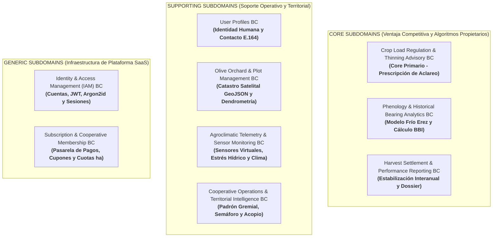

# Descubrimiento de Bounded Contexts Candidatos (Candidate Context Discovery)

**Proyecto:** Viora — Ecosistema Digital para la Mitigación de la Vecería en la Olivicultura  
**Fase Metodológica:** Strategic Domain-Driven Design (Strategic DDD)  
**Elemento del Modelo:** Delimitación de Contextos Delimitados Candidatos (*Candidate Bounded Contexts*)  

---

## 1. Metodología y Criterios de Descubrimiento Estratégico

El proceso de **Candidate Context Discovery** formaliza la partición del modelo de dominio de Viora en unidades arquitectónicas autónomas y desacopladas (*Bounded Contexts*), tomando como base los artefactos generados a lo largo de las 9 etapas de EventStorming (52 eventos de dominio, 8 líneas de tiempo, 24 puntos de dolor, 11 eventos pivote, 33 comandos, 17 políticas reactivas, 15 modelos de lectura, 4 sistemas externos y 12 agregados transaccionales).

Para fundamentar la demarcación de fronteras semánticas con rigor arquitectónico, se aplicaron tres técnicas estratégicas de descubrimiento de DDD:

```
                                  MURAL INTEGRAL DE EVENTSTORMING
                                (52 Eventos, 33 Comandos, 12 Agregados)
                                                 |
         +---------------------------------------+---------------------------------------+
         |                                       |                                       |
         v                                       v                                       v
+-------------------------+             +-------------------------+             +-------------------------+
|  LOOK-FOR-PIVOTAL-EVENTS |             |    START-WITH-VALUE     |             |    START-WITH-SIMPLE    |
| (Transición cualitativa |             | (Aislamiento del Core   |             | (Descomposición de los  |
|  de fases del negocio)  |             |  Domain diferenciador)  |             |  timelines en fases)    |
+-------------------------+             +-------------------------+             +-------------------------+
         |                                       |                                       |
         +---------------------------------------+---------------------------------------+
                                                 |
                                                 v
                              +-------------------------------------+
                              | 09 BOUNDED CONTEXTS CANDIDATOS (BC) |
                              | Fronteras Semánticas y Consistencia |
                              +-------------------------------------+
```

### 1.1 Técnica 1: Look-for-Pivotal-Events (Puntos de Inflexión del Negocio)
Esta técnica analiza los **Pivotal Events** identificados en el Paso 4 (`PV01` a `PV10`). Cada evento pivote representa un cambio cualitativo irreversible de fase en el ciclo de vida del olivar o de la plataforma, sirviendo como **línea de falla geológica natural** para separar contextos:
* `ProfileCreated` (`PV01` / `EV08`): Divide el onboarding e identidad humana validada del resto de la plataforma $\rightarrow$ **`User Profiles`**.
* `SubscriptionActivated` (`PV02` / `EV11`): Separa el acceso comercial del catastro territorial $\rightarrow$ **`Subscription & Cooperative Membership`**.
* `PlotDelimited` (`PV03` / `EV15`): Transición de entidad abstracta a unidad geográfica $\rightarrow$ **`Olive Orchard & Plot Management`**.
* `VirtualSensorNodeLinked` (`PV04` / `EV18`): Inicio del flujo continuo de microclima radicular $\rightarrow$ **`Agroclimatic Telemetry & Sensor Monitoring`**.
* `ColdRequirementFulfilled` (`PV05` / `EV32`): Superación del reposo invernal (cumplimiento de porciones de frío) $\rightarrow$ **`Phenology & Historical Bearing Analytics`**.
* `FieldSamplingsIngested` (`PV06`), `ThinningPrescribed` (`PV07`) y `ThinningExecutionConfirmed` (`PV08`): El núcleo de decisión agronómica $\rightarrow$ **`Crop Load Regulation & Thinning Advisory (Core)`**.
* `CampaignHarvestSettled` (`PV09` / `EV46`): Cierre definitivo de recolección y balance interanual $\rightarrow$ **`Harvest Settlement & Performance Reporting`**.
* `CooperativeIntakeVolumeProjected` (`PV10` / `EV50`): Transición de la escala de parcela al ámbito gremial $\rightarrow$ **`Cooperative Operations & Territorial Intelligence`**.

### 1.2 Técnica 2: Start-with-Value (Aislamiento del Core Domain Diferenciador)
Viora no es una plataforma genérica de gestión de fincas ni un software de facturación agrícola. La **propuesta de valor única y ventaja competitiva** de Viora radica en:
1. La modelación matemática de la vecería en Tacna mediante el BBI de Hoblyn et al.
2. El cómputo dinámico de porciones de frío de Erez para prever brotación heterogénea por efecto ENOS.
3. El motor de prescripción de aclareo frutal oportuno antes de la lignificación del carozo.

Aplicando *Start-with-Value*, estos componentes se aislaron de inmediato como **Core Subdomains** prioritarios (`BC06`, `BC07`, `BC08`), impidiendo que su lógica agronómica avanzada se diluya o acople con la gestión de usuarios, catastro o pasarelas de pago.

### 1.3 Técnica 3: Start-with-Simple (Descomposición Secuencial de Timelines)
Se analizaron los Timelines cronológicos del Paso 2, descomponiendo el flujo end-to-end en pasos secuenciales cohesivos donde el **Lenguaje Ubicuo (*Ubiquitous Language*)** mantiene un significado semántico único y no ambiguo:
* En IAM, un *"Usuario"* es una credencial de autenticación y tokens JWT.
* En User Profiles, el *"Usuario"* es un perfil humano con nombres y teléfono E.164.
* En Catastro, un *"Productor"* es un propietario catastral.
* En Aclareo, el *"Árbol"* es una unidad de carga frutal y brotes mixtos.
* En Cooperativa, el agricultor es un *"Socio Agremiado"* que aporta volumen de acopio.

---

## 2. Clasificación Estratégica por Tipo de Subdominio

La categorización de los 09 Bounded Contexts Candidatos según la tipología clásica de DDD (Eric Evans) se estructura de la siguiente manera:



---

## 3. Catálogo Detallado de Bounded Contexts Candidatos (BC01 a BC09)

---

### **BC01: Identity & Access Management (IAM) Bounded Context**
* **Tipo de Subdominio:** Genérico (*Generic Subdomain*).
* **Misión y Responsabilidad:** Centralizar el ciclo de vida de identidades digitales de la plataforma, autenticación persistente con tokens JWT/Refresh Token, control de acceso basado en roles (`ROLE_PRODUCTOR`, `ROLE_GESTOR`), almacenamiento seguro de credenciales cifradas con Argon2id y recuperación de credenciales mediante tokens efímeros.
* **Agregados Encapsulados:** `UserAccount` (`AGG01`).
* **Eventos Pivote de Delimitación:** `UserAuthenticated` (`EV02`), `PasswordResetCompleted` (`EV07`).
* **Eventos Clave Emitidos:** `EV01`, `EV02`, `EV03`, `EV04`, `EV05`, `EV06`, `EV07`.
* **Comandos Gestionados:** `CMD01` a `CMD06`.
* **Lenguaje Ubicuo Local:**
  * *UserAccount:* Sujeto de seguridad con credenciales activas.
  * *Role:* Privilegio de acceso en la API (`ROLE_PRODUCTOR` o `ROLE_GESTOR`).
  * *AccessToken / RefreshToken:* Credenciales criptográficas temporales de sesión.
  * *PasswordResetToken:* Token efímero criptoseguro con vigencia de 15 minutos.
* **Sistemas Externos Vinculados:** `EXT04` (`TransactionalMailService` para envío del enlace de reseteo).
* **Justificación de Frontera (*Boundary Justification*):** Es un componente estándar reutilizable de seguridad que no debe mezclarse con datos humanos ni reglas agrícolas. Su modelo de datos no conoce parcelas, clima ni números telefónicos; únicamente administra identidades y credenciales de acceso.

---

### **BC02: User Profiles Bounded Context** *(NUEVO CONTEXTO)*
* **Tipo de Subdominio:** De Soporte (*Supporting Subdomain*).
* **Misión y Responsabilidad:** Gestionar la identidad civil y canales de contacto de los productores olivareros y directivos técnicos, asegurando la integridad, formato y normalización de números telefónicos internacionales bajo la norma **E.164** mediante `libphonenumber`, y sirviendo como fuente de datos de contacto para la cooperativa.
* **Agregados Encapsulados:** `Profile` (`AGG02`).
* **Eventos Pivote de Delimitación:** **`ProfileCreated` (`EV08` / `PV01`)**.
* **Eventos Clave Emitidos:** `EV08`, `EV09`.
* **Comandos Gestionados:** `CMD07` (*CreateProfile*), `CMD08` (*UpdateContactProfile*).
* **Lenguaje Ubicuo Local:**
  * *Profile:* Representación de la persona física en la plataforma.
  * *FullName:* Nombre completo y formal del usuario para acreditaciones y asistencia técnica.
  * *CountryCode:* Código de país bajo norma ISO 3166-1.
  * *E.164 PhoneNumber:* Número telefónico móvil internacionalmente normalizado (+51...).
* **Sistemas Externos Vinculados:** Ninguno (la validación E.164 se realiza mediante biblioteca local en el servidor).
* **Justificación de Frontera (*Boundary Justification*):** Desacopla la identidad humana de las credenciales de acceso. Si el usuario actualiza su número celular o nombres, no interfiere con su sesión ni con sus tokens de seguridad; además, si la validación telefónica falla durante el onboarding, la cuenta de acceso en IAM permanece protegida.

---

### **BC03: Subscription & Cooperative Membership Bounded Context**
* **Tipo de Subdominio:** Genérico (*Generic Subdomain*).
* **Misión y Responsabilidad:** Gestionar la monetización SaaS de Viora, procesando la adquisición del Plan Productor individual mediante pasarela de pagos con tarjeta, la emisión y el ciclo de vida de los lotes de códigos corporativos patrocinados por cooperativas, su canje y la fiscalización del cupo de hectáreas catastradas autorizadas.
* **Agregados Encapsulados:** `Subscription` (`AGG03`), `CooperativeLicense` (`AGG11`), `InvitationCodeBatch` (`AGG12`).
* **Eventos Pivote de Delimitación:** `SubscriptionActivated` (`EV11` / `PV02`), `CooperativeCodeRedeemed` (`EV13`).
* **Eventos Clave Emitidos:** `EV10`, `EV11`, `EV12`, `EV13`, `EV14`, `EV52`.
* **Comandos Gestionados:** `CMD09` (*ProcessPaymentConfirmation*), `CMD10` (*RedeemCooperativeCode*), `CMD11` (*GenerateInvitationCodesBatch*), `CMD33` (*ShortenInvitationCodeExpiry*).
* **Lenguaje Ubicuo Local:**
  * *SubscriptionPlan:* Modalidad comercial (`INDIVIDUAL_PAID` o `COOPERATIVE_SPONSORED`).
  * *HectaresQuota:* Techo máximo de hectáreas que el productor puede catastrar.
  * *PaymentWebhook:* Notificación asíncrona firmada enviada por la pasarela de pagos.
  * *CooperativeLicense:* Contrato corporativo que fija el cupo de plazas y la superficie total patrocinable.
  * *InvitationCodeBatch:* Lote de códigos emitido contra una licencia corporativa vigente.
  * *InvitationCode:* Cupón alfanumérico corporativo de un solo uso, con cuota de superficie y fecha de caducidad.
* **Sistemas Externos Vinculados:** `EXT01` (`PaymentGatewayService` - Mercado Pago Checkout Pro).
* **Justificación de Frontera (*Boundary Justification*):** Separa la lógica transaccional financiera y de licenciamiento del núcleo agronómico. Si en el futuro Viora cambia de pasarela de pagos o introduce modelos freemium, el cambio queda encapsulado aquí sin impactar los modelos de cultivo.

---

### **BC04: Olive Orchard & Plot Management Bounded Context**
* **Tipo de Subdominio:** De Soporte (*Supporting Subdomain*).
* **Misión y Responsabilidad:** Servir de base geográfica y catastral para todo el sistema, modelando los linderos espaciales de los predios mediante polígonos cerrados GeoJSON, la superficie neta en hectáreas, la variedad del olivar (Criolla / Sevillana), el marco de plantación y la densidad poblacional de árboles por hectárea.
* **Agregados Encapsulados:** `Plot` (`AGG04`).
* **Eventos Pivote de Delimitación:** `PlotDelimited` (`EV15` / `PV03`), `PlotBoundariesUpdated` (`EV16`).
* **Eventos Clave Emitidos:** `EV15`, `EV16`, `EV17`.
* **Comandos Gestionados:** `CMD12` (*DelimitPlot*), `CMD13` (*UpdatePlotBoundaries*), `CMD14` (*RemovePlot*).
* **Lenguaje Ubicuo Local:**
  * *Plot:* Unidad básica de gestión territorial y productiva.
  * *CadastralPolygon:* Geometría vectorial cerrada en coordenadas WGS84 (GeoJSON RFC 7946).
  * *NetArea:* Cabida superficial efectiva del cuartel en hectáreas ($\ge 0.10$ ha).
  * *OliveVariety:* Variedad genética del olivo (`CRIOLLA_DE_TACNA`, `SEVILLANA`).
  * *PlantingDensity:* Densidad arbórea calculada (árboles/hectárea).
* **Sistemas Externos Vinculados:** `EXT02` (`SatelliteBasemapAndGisProvider` - Mapbox/OpenStreetMap).
* **Justificación de Frontera (*Boundary Justification*):** Es el soporte territorial de la solución. No calcula vecería ni almacena telemetría horaria; su única responsabilidad es responder fielmente *dónde está la parcela, qué variedad tiene y cuántos árboles alberga*.

---

### **BC05: Agroclimatic Telemetry & Sensor Monitoring Bounded Context**
* **Tipo de Subdominio:** De Soporte (*Supporting Subdomain*).
* **Misión y Responsabilidad:** Administrar el inventario y calibración de nodos sensores edáficos virtuales, ingestar continuamente lecturas horarias de humedad volumétrica radicular ($\theta$ a 30 y 60 cm) y microclima, consumir pronósticos a 7 días y evaluar umbrales críticos para disparar alertas de estrés hídrico y choques térmicos en floración.
* **Agregados Encapsulados:** `VirtualSensorNode` (`AGG05`), `TelemetrySeries` (`AGG06`).
* **Eventos Pivote de Delimitación:** `VirtualSensorNodeLinked` (`EV18` / `PV04`), `HydricStressAlertTriggered` (`EV22`).
* **Eventos Clave Emitidos:** `EV18`, `EV19`, `EV20`, `EV21`, `EV22`, `EV23`, `EV24`, `EV25`.
* **Comandos Gestionados:** `CMD15`, `CMD16`, `CMD17`, `CMD18`, `CMD19`.
* **Lenguaje Ubicuo Local:**
  * *VirtualSensorNode:* Dispositivo de medición virtual emplazado en la parcela.
  * *SoilMoisture ($\theta$):* Contenido volumétrico de agua radicular expresado en porcentaje.
  * *RechargePoint:* Umbral crítico de humedad ($<18\%$) que dispara alarma de estrés.
  * *FieldCapacity:* Punto de reposición hídrica ($\ge 22\%$) que resuelve la alarma.
  * *ThermalThreshold:* Límite crítico de choque térmico en floración ($>32^\circ\text{C}$ con $HR < 20\%$).
* **Sistemas Externos Vinculados:** `EXT03` (`AgroclimaticWeatherApi` - SENAMHI).
* **Justificación de Frontera (*Boundary Justification*):** Gestiona series temporales de alta frecuencia (IoT/telemetría horaria). Su persistencia y ciclo de vida son radicalmente distintos a los datos anuales de cosecha o a las geometrías catastrales.

---

### **BC06: Phenology & Historical Bearing Analytics Bounded Context**
* **Tipo de Subdominio:** Core Domain (*Core Subdomain* - Fisiología y Memoria Productiva).
* **Misión y Responsabilidad:** Modelar la memoria productiva plurianual de cosechas para cuantificar el Índice de Vecería de Hoblyn et al. ($BBI$) y computar las Porciones de Frío invernales mediante el algoritmo Dinámico de Erez et al. (Mayo-Agosto), detectando la destrucción de intermediarios térmicos ante olas de calor por efecto ENOS para reajustar la inducción floral.
* **Agregados Encapsulados:** `ChillAccumulationTracker` (`AGG07`).
* **Eventos Pivote de Delimitación:** `ColdRequirementFulfilled` (`EV32` / `PV05`), `WinterThermalAnomalyDetected` (`EV33`).
* **Eventos Clave Emitidos:** `EV26`, `EV27`, `EV28`, `EV29`, `EV30`, `EV31`, `EV32`, `EV33`, `EV34`.
* **Comandos Gestionados:** `CMD20`, `CMD21`, `CMD22`, `CMD23`.
* **Lenguaje Ubicuo Local:**
  * *BiennialBearingIndex (BBI):* Coeficiente de alternancia de Hoblyn et al. ($0.00$ a $1.00$).
  * *On-Year / Off-Year:* Campaña de alta sobreproducción vs. campaña de colapso productivo.
  * *ChillPortions (UF):* Porciones de frío dinámicas calculadas bajo el modelo de Erez.
  * *WinterThermalAnomaly:* Ola de calor invernal ($>24^\circ\text{C}$ por $>3$ días) que desacumula frío.
  * *PotentialFloralYield:* Proyección de flores fértiles aptas para cuajado.
* **Justificación de Frontera (*Boundary Justification*):** Encapsula el conocimiento agronómico bioclimático y matemático. Formula las bases fisiológicas que condicionan el potencial productivo del año antes de que ocurra la floración.

---

### **BC07: Crop Load Regulation & Thinning Advisory Bounded Context** *(CORE PRIMARIO)*
* **Tipo de Subdominio:** Core Domain Primario (*Primary Core Subdomain* — Máximo Valor Diferencial).
* **Misión y Responsabilidad:** Es el corazón de la propuesta de valor de Viora. Orquesta la captura de muestreos de cuajado a pie de árbol, evalúa la representatividad estadística ($\ge 5$ árboles), ejecuta el algoritmo de determinación de carga frutal sostenible, prescribe el porcentaje óptimo de aclareo manual ($0\%$ a $40\%$), controla la ventana biológica antes del endurecimiento del carozo y audita la ejecución de labores en campo.
* **Agregados Encapsulados:** `FruitThinningPrescription` (`AGG08`).
* **Eventos Pivote de Delimitación:** `FieldSamplingsIngested` (`EV36` / `PV06`), `ThinningPrescribed` (`EV41` / `PV07`), `ThinningExecutionConfirmed` (`EV44` / `PV08`), `ThinningWindowClosedByPitHardening` (`EV43`).
* **Eventos Clave Emitidos:** `EV35`, `EV36`, `EV37`, `EV38`, `EV39`, `EV40`, `EV41`, `EV42`, `EV43`, `EV44`, `EV45`.
* **Comandos Gestionados:** `CMD24`, `CMD25`, `CMD26`, `CMD27`, `CMD28`.
* **Lenguaje Ubicuo Local:**
  * *TreeFruitSetSampling:* Conteo de frutos por brote mixto en árboles testigo.
  * *SamplingRoundRepresentativeness:* Criterio de representatividad estadística ($\ge 5$ árboles).
  * *SustainableCropLoad:* Carga admisible máxima que permite retorno floral al año siguiente.
  * *ThinningPrescription:* Orden agronómica con porcentaje exacto de fruta a remover ($0-40\%$).
  * *PitHardening (Endurecimiento de Carozo):* Lignificación irreversible del endocarpio que marca el cierre biológico de la ventana de intervención útil.
  * *LateThinningPenalty:* Castigo en la efectividad mitigadora tras aclareo extemporáneo.
* **Justificación de Frontera (*Boundary Justification*):** Es la razón de ser de la empresa. Todo el diseño de Viora converge hacia este contexto; aquí se resuelve directamente la vecería olivarera antes de que se consolide la inhibición hormonal de giberelinas.

---

### **BC08: Harvest Settlement & Performance Reporting Bounded Context**
* **Tipo de Subdominio:** Core Domain / De Soporte Estratégico (*Supporting & Value Audit Subdomain*).
* **Misión y Responsabilidad:** Asentar la recolección definitiva anual discriminando aceituna verde y negra, evaluar la curva de estabilización interanual frente al BBI base preprescriptivo y generar el expediente técnico agronómico oficial certificado del predio.
* **Agregados Encapsulados:** `AgronomicReport` (`AGG09`).
* **Eventos Pivote de Delimitación:** `CampaignHarvestSettled` (`EV46` / `PV09`), `YieldStabilizationCurveEvaluated` (`EV47`), `AgronomicDossierGenerated` (`EV48`).
* **Eventos Clave Emitidos:** `EV46`, `EV47`, `EV48`.
* **Comandos Gestionados:** `CMD29` (*SettleCampaignHarvest*), `CMD30` (*GenerateAgronomicDossier*).
* **Lenguaje Ubicuo Local:**
  * *HarvestSettlement:* Acta inmutable de pesajes finales de recolección (kg/ha verde y negro).
  * *YieldStabilizationCurve:* Gráfica plurianual de amortiguación de oscilaciones productivas.
  * *AgronomicDossier:* Expediente técnico oficial compilado del predio con validez agronómica.
* **Justificación de Frontera (*Boundary Justification*):** Proporciona la auditoría de resultados y el cierre económico de campaña. Permite a los olivicultores validar objetivamente el retorno de inversión del programa de aclareo y tramitar financiamiento agrícola.

---

### **BC09: Cooperative Operations & Territorial Intelligence Bounded Context**
* **Tipo de Subdominio:** De Soporte Estratégico (*Supporting Subdomain* - Inteligencia Gremial).
* **Misión y Responsabilidad:** Brindar visión territorial y agregada a los gestores técnicos de organizaciones olivareras de Tacna, gestionando el padrón de socios agremiados, el semáforo georreferenciado de riesgo fenológico sectorial y la proyección temprana de acopio de aceituna.
* **Agregados Encapsulados:** `Cooperative` (`AGG10`).
* **Eventos Pivote de Delimitación:** `CooperativeIntakeVolumeProjected` (`EV50` / `PV10`), `CooperativeRiskMatrixEvaluated` (`EV49`).
* **Eventos Clave Emitidos:** `EV49`, `EV50`, `EV51`.
* **Comandos Gestionados:** `CMD31` (*EvaluateCooperativeRiskMatrix*), `CMD32` (*ProjectCooperativeIntakeVolume*).
* **Lenguaje Ubicuo Local:**
  * *CooperativeMember:* Productor agremiado formalmente adscrito al convenio de la organización.
  * *TerritorialRiskMatrix:* Semáforo sectorial (verde, amarillo, rojo) que consolida frío, agua y sobrecarga.
  * *EarlyIntakeProjection:* Estimación temprana de toneladas de acopio (mesa vs. aceite).
  * *SamplingCoverageQuotas:* Umbral mínimo de padrón evaluado ($\ge 60\%$) para validez predictiva.
* **Justificación de Frontera (*Boundary Justification*):** Modela la escala colectiva y gremial. Las cooperativas no operan las válvulas de riego ni ejecutan el aclareo; necesitan un contexto analítico desacoplado que sintetice la información de cientos de socios sin violar la privacidad de cada fundo.

---

## 4. Matriz de Trazabilidad y Comparativa de Bounded Contexts

| ID | Bounded Context Candidato | Tipo de Subdominio | Agregado(s) Raíz | Evento(s) Pivote | N° Eventos / Comandos | Misión Central |
| :---: | :--- | :---: | :--- | :--- | :---: | :--- |
| **BC01** | `Identity & Access Management` | Genérico | `UserAccount` | `EV02`, `EV07` | 07 EV / 06 CMD | Cuentas, JWT, sesiones y contraseñas seguras. |
| **BC02** | `User Profiles` *(NUEVO)* | Soporte | `Profile` | `EV08` (`PV01`) | 02 EV / 02 CMD | Identidad humana, nombres y teléfono E.164. |
| **BC03** | `Subscription & Cooperative Membership`| Genérico | `Subscription`<br>`CooperativeLicense`<br>`InvitationCodeBatch` | `EV11`, `EV13` | 06 EV / 04 CMD | Monetización SaaS, pasarela pagos, códigos corporativos y canjes. |
| **BC04** | `Olive Orchard & Plot Management` | Soporte | `Plot` | `EV15`, `EV16` | 03 EV / 03 CMD | Base territorial, cartografía GeoJSON y árboles. |
| **BC05** | `Agroclimatic Telemetry & Sensor Monitoring`| Soporte | `VirtualSensorNode`<br>`TelemetrySeries` | `EV18`, `EV22` | 08 EV / 05 CMD | Telemetría horaria edáfica y estrés hídrico. |
| **BC06** | `Phenology & Historical Bearing Analytics`| Core | `ChillAccumulationTracker` | `EV32`, `EV33` | 09 EV / 04 CMD | Frío de Erez, anomalías ENOS e índice BBI. |
| **BC07** | `Crop Load Regulation & Thinning Advisory`| Core Primario | `FruitThinningPrescription`| `EV36`, `EV41`, `EV44` | 11 EV / 05 CMD | Muestreo a pie de árbol y aclareo regulatorio. |
| **BC08** | `Harvest Settlement & Performance Reporting`| Core / Soporte | `AgronomicReport` | `EV46`, `EV47`, `EV48` | 03 EV / 02 CMD | Cierre de cosecha y balance de estabilización. |
| **BC09** | `Cooperative Operations & Territorial Intel`| Soporte | `Cooperative` | `EV50`, `EV49` | 03 EV / 02 CMD | Padrón de socios, semáforo y acopio gremial. |

---

## 5. Conclusiones y Transición hacia el Context Mapping

La identificación de los 9 Bounded Contexts candidatos define formalmente el mapa estratégico de subsistemas de Viora. Esta delimitación garantiza que el subdominio central (*Crop Load Regulation & Thinning Advisory*) permanezca aislado de las complejidades de infraestructura y servicios genéricos, sentando las bases para el modelado de flujos de mensajes (Domain Storytelling), los lienzos de contexto (*Bounded Context Canvases*) y el diseño del mapa de relaciones entre contextos (*Context Map*).
