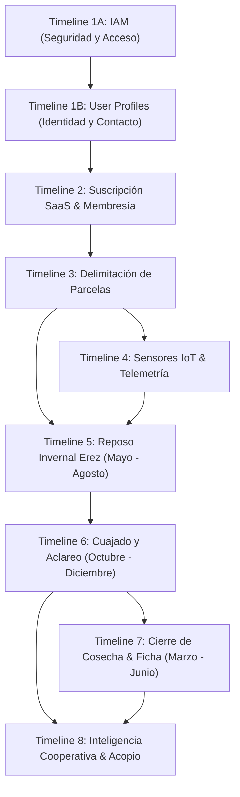
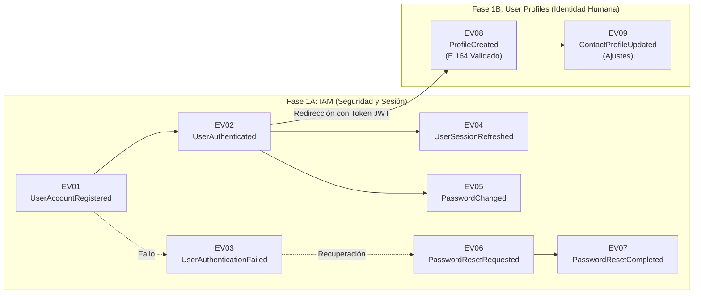
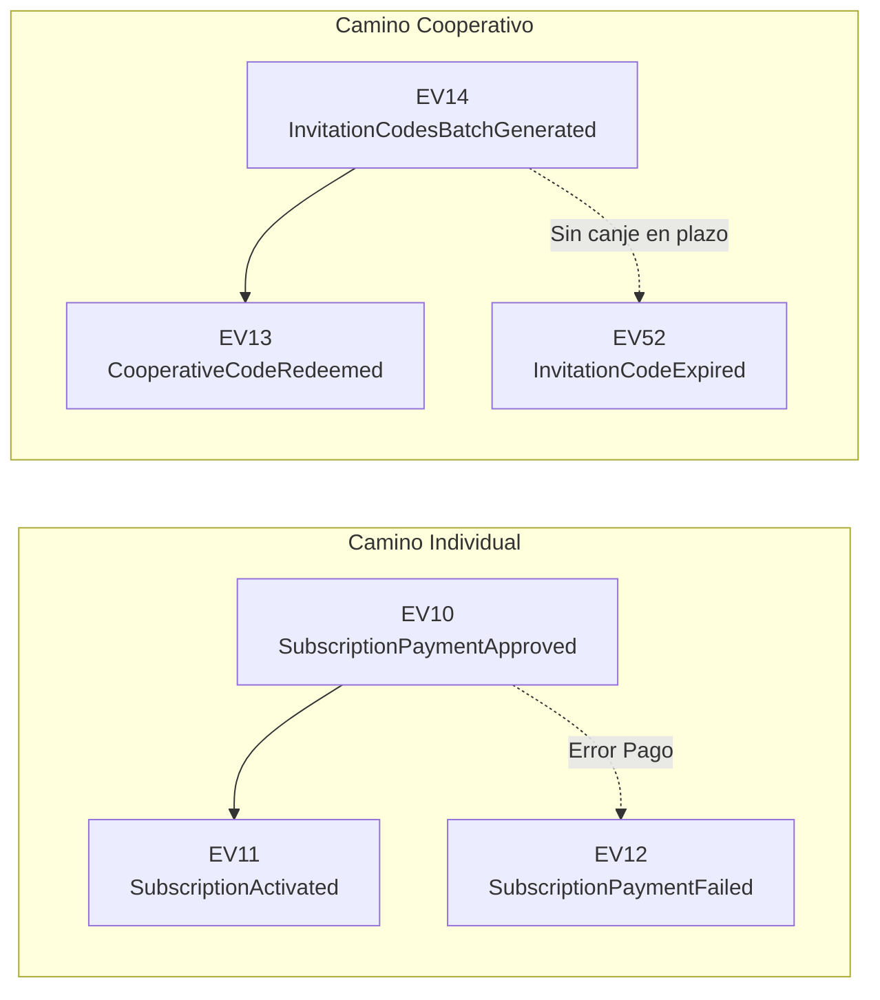
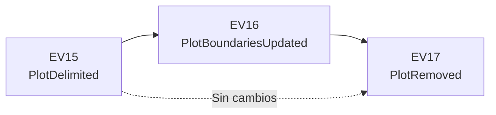
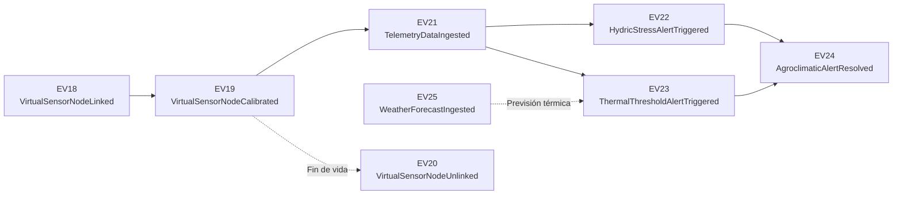
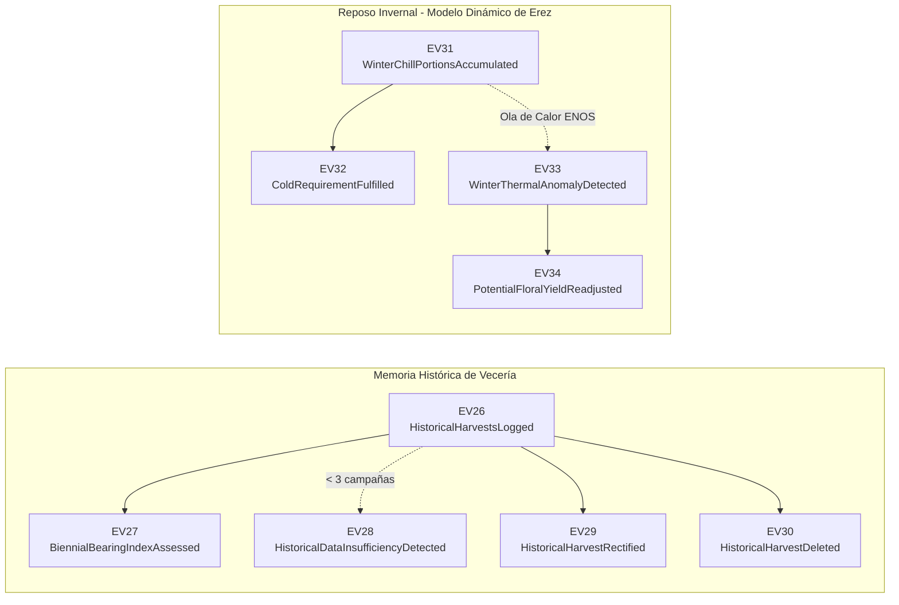
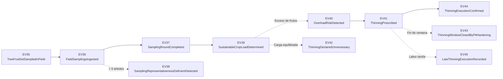
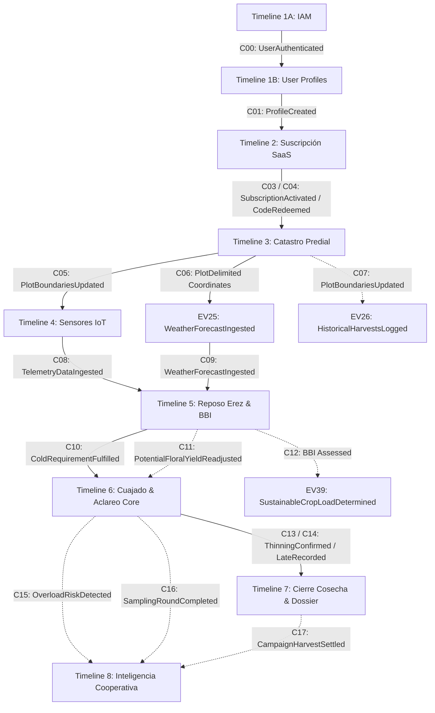

# EventStorming — Paso 2: Secuenciación y Definición de Timelines

**Proyecto:** Viora — Ecosistema Digital para la Mitigación de la Vecería en la Olivicultura  
**Fase Metodológica:** Strategic Domain-Driven Design (Strategic DDD)  
**Elemento del Modelo:** Líneas de Tiempo Concurrentes (*Timelines*) y Dependencias Causales Inter-Línea  

---

## 1. Introducción y Organización Temporal del Dominio

Tras la identificación divergente de los eventos de dominio en el Paso 1, la segunda etapa metodológica de EventStorming consiste en establecer una ordenación cronológica continua de izquierda a derecha. Esta secuenciación permite estructurar la trayectoria de valor de los usuarios y articularla con el ciclo biológico anual del olivo en la región de Tacna.

Dado que las operaciones agronómicas, de monitoreo y de gestión cooperativa ocurren de forma paralela y con distintos ritmos temporales, el modelo organiza los 52 eventos de dominio en **8 Líneas de Tiempo (Timelines)** concurrentes, con la primera subdividida en dos fases complementarias (Seguridad e Identidad), agrupadas en tres dimensiones fundamentales:

1. **Dimensión de Plataforma y Gestión Operativa (Timelines 1 al 4):** Abarca el onboarding en dos fases (credenciales IAM e identidad humana en Profiles), activación de membresías o suscripciones, delimitación territorial de parcelas y vinculación de telemetría IoT.
2. **Dimensión Agronómica y Fisiológica Estacional (Timelines 5 al 7):** Sigue rigurosamente el calendario fenológico del cultivo en Tacna (*Reposo invernal mayo-agosto $\rightarrow$ Floración, cuajado y aclareo octubre-diciembre $\rightarrow$ Cosecha y liquidación marzo-junio*).
3. **Dimensión Gremial y Territorial (Timeline 8):** Proporciona la agregación sectorial, matrices de riesgo y estimaciones tempranas de volumen para organizaciones olivareras y cooperativas.

---

## 2. Detalle de las 8 Líneas de Tiempo Cronológicas

---

### Timeline 1: Onboarding, Identidad y Gestión de Cuenta (IAM & User Profiles)
Modela la llegada del usuario (productor o gestor técnico) a la plataforma en dos etapas desacopladas: seguridad inicial en IAM y formalización de perfil humano en User Profiles.

#### Secuencia Cronológica:

| Orden | Código | Evento de Dominio | Disparador / Causa Cronológica | Consecuencia en el Negocio |
| :---: | :---: | :--- | :--- | :--- |
| **1.1** | **EV01** | `UserAccountRegistered` | Usuario envía credenciales (`email`, `password`, `role`). | Cuenta de seguridad creada en estado activo. |
| **1.2** | **EV02** | `UserAuthenticated` | Identidad validada satisfactoriamente. | Sesión iniciada con token JWT y refresh token. |
| **1.3** | **EV03** | `UserAuthenticationFailed` | Intento con clave errónea o correo no registrado. | Registro de intento fallido para auditoría y seguridad. |
| **1.4** | **EV04** | `UserSessionRefreshed` | Vencimiento del token de acceso de corta duración. | Extensión transparente de sesión sin interrumpir al usuario. |
| **1.5** | **EV05** | `PasswordChanged` | Usuario actualiza voluntariamente su contraseña. | Credenciales seguras renovadas tras validar clave previa. |
| **1.6** | **EV06** | `PasswordResetRequested` | Solicitud de recuperación por olvido de contraseña. | Token temporal de 15 min generado y enviado por correo. |
| **1.7** | **EV07** | `PasswordResetCompleted` | Usuario define nueva clave mediante el enlace. | Contraseña restablecida con éxito y token consumido. |
| **1.8** | **EV08** | `ProfileCreated` | Usuario completa pantalla inicial con teléfono validado E.164. | Identidad formalizada en plataforma; desbloquea módulos operativos. |
| **1.9** | **EV09** | `ContactProfileUpdated` | Usuario edita teléfono o nombres desde ajustes. | Información de contacto actualizada para asistencia técnica. |

---

### Timeline 2: Adquisición de Suscripción SaaS y Membresía Cooperativa
El usuario con perfil creado formaliza su acceso a los módulos operativos de Viora mediante pago digital o canje de código corporativo.

#### Secuencia Cronológica:

| Orden | Código | Evento de Dominio | Disparador / Causa Cronológica | Consecuencia en el Negocio |
| :---: | :---: | :--- | :--- | :--- |
| **2.1** | **EV14** | `InvitationCodesBatchGenerated` | Gestor técnico emite lote según cupo contratado. | Códigos de invitación disponibles para socios; plazas y superficie quedan comprometidas en la licencia. |
| **2.2** | **EV10** | `SubscriptionPaymentApproved` | Pasarela confirma pago anual del Plan Productor. | Transacción financiera exitosa en Soles (PEN). |
| **2.3** | **EV11** | `SubscriptionActivated` | Pago aprobado por pasarela digital. | Habilitación de funciones avanzadas por un año. |
| **2.4** | **EV12** | `SubscriptionPaymentFailed` | Tarjeta rechazada o fondos insuficientes en pasarela. | Suscripción pendiente de regularización. |
| **2.5** | **EV13** | `CooperativeCodeRedeemed` | Socio ingresa código de invitación corporativo. | Cuenta vinculada a la licencia cooperativa sin cobro individual. |
| **2.6** | **EV52** | `InvitationCodeExpired` | Código no canjeado que alcanza su fecha de caducidad, sea la original o una adelantada por el gestor con `CMD33`. | Plaza y superficie comprometidas se devuelven al cupo disponible de la licencia. |

---

### Timeline 3: Delimitación Territorial y Catastro Predial
Registro físico y georreferenciado del olivar, estableciendo la base dendrométrica para los cálculos agronómicos.

#### Secuencia Cronológica:

| Orden | Código | Evento de Dominio | Disparador / Causa Cronológica | Consecuencia en el Negocio |
| :---: | :---: | :--- | :--- | :--- |
| **3.1** | **EV15** | `PlotDelimited` | Productor traza polígono GPS, declara variedad y densidad. | Parcela registrada con área y base dendrométrica. |
| **3.2** | **EV16** | `PlotBoundariesUpdated` | Productor reajusta vértices o marco en el mapa. | Superficie y densidad de árboles recalculadas. |
| **3.3** | **EV17** | `PlotRemoved` | Productor da de baja una parcela del predio. | Baja lógica archivando histórico del lote. |

---

### Timeline 4: Sensorización Virtual y Monitoreo Agroclimático
Vinculación de dispositivos de monitoreo, ingesta continua de mediciones ambientales y respuesta a alertas críticas.

#### Secuencia Cronológica:

| Orden | Código | Evento de Dominio | Disparador / Causa Cronológica | Consecuencia en el Negocio |
| :---: | :---: | :--- | :--- | :--- |
| **4.1** | **EV18** | `VirtualSensorNodeLinked` | Productor asocia un nodo sensor virtual al lote. | Dispositivo activo para ingesta de datos. |
| **4.2** | **EV19** | `VirtualSensorNodeCalibrated` | Configuración de profundidad de sonda (30/60 cm). | Parámetros de lectura ajustados al suelo. |
| **4.3** | **EV21** | `TelemetryDataIngested` | Ingesta horaria de lecturas de suelo y temperatura. | Base de datos de monitoreo actualizada. |
| **4.4** | **EV25** | `WeatherForecastIngested` | Consulta al servicio meteorológico geolocalizado. | Previsión climática a 7 días disponible. |
| **4.5** | **EV22** | `HydricStressAlertTriggered` | Humedad de suelo cae por debajo del punto de recarga. | Alerta prioritaria de riego emitida. |
| **4.6** | **EV23** | `ThermalThresholdAlertTriggered` | Golpe de calor (>32°C con baja humedad) en floración. | Advertencia de riesgo de desecación estigmática. |
| **4.7** | **EV24** | `AgroclimaticAlertResolved` | Riego ejecutado y humedad restablecida en rango. | Incidente de estrés normalizado y cerrado. |
| **4.8** | **EV20** | `VirtualSensorNodeUnlinked` | Desvinculación de nodo para mantenimiento o baja. | Sensor desasociado preservando lecturas históricas. |

---

### Timeline 5: Diagnóstico Histórico de Vecería y Reposo Invernal (Modelo Erez)
**Ventana Agronómica:** Meses de **Mayo a Agosto** (Hemisferio Sur / Tacna).  
Modela la memoria plurianual de cosechas y el seguimiento del estímulo térmico necesario para la inducción floral.

#### Secuencia Cronológica:

| Orden | Código | Evento de Dominio | Disparador / Causa Cronológica | Consecuencia en el Negocio |
| :---: | :---: | :--- | :--- | :--- |
| **5.1** | **EV26** | `HistoricalHarvestsLogged` | Productor registra cosechas de campañas previas. | Memoria productiva del lote asentada. |
| **5.2** | **EV27** | `BiennialBearingIndexAssessed` | Con >= 3 campañas, el sistema calcula fórmula Hoblyn. | Ubicación formal del lote en el semáforo de vecería. |
| **5.3** | **EV28** | `HistoricalDataInsufficiencyDetected` | Registro con menos de 3 campañas. | Advertencia de historial insuficiente. |
| **5.4** | **EV29** | `HistoricalHarvestRectified` | Corrección de pesaje de una campaña pasada. | Serie histórica y BBI recalculados. |
| **5.5** | **EV30** | `HistoricalHarvestDeleted` | Eliminación de registro erróneo o duplicado. | Depuración de la serie plurianual. |
| **5.6** | **EV31** | `WinterChillPortionsAccumulated` | Ingesta horaria de temperatura durante el invierno. | Acumulación periódica de porciones de frío. |
| **5.7** | **EV32** | `ColdRequirementFulfilled` | Acumulación alcanza el umbral varietal (25-30 porciones). | Hito de salida fisiológica del reposo invernal. |
| **5.8** | **EV33** | `WinterThermalAnomalyDetected` | Temperatura diurna >24°C por >3 días en invierno. | Destrucción de intermediarios de frío de Erez. |
| **5.9** | **EV34** | `PotentialFloralYieldReadjusted` | Tras sufrir anomalía térmica invernal. | Reducción de la proyección de floración del lote. |

---

### Timeline 6: Muestreo de Cuajado en Campo y Regulación de Carga Frutal (Aclareo)
**Ventana Agronómica:** Meses de **Octubre a Diciembre** (Post-cuajado y antes del endurecimiento del carozo).  
El núcleo tecnológico (*Core Domain*) de Viora para mitigar la sobrecarga y evitar el colapso del siguiente año.

#### Secuencia Cronológica:

| Orden | Código | Evento de Dominio | Disparador / Causa Cronológica | Consecuencia en el Negocio |
| :---: | :---: | :--- | :--- | :--- |
| **6.1** | **EV35** | `TreeFruitSetSampledInField` | Agrónomo cuenta flores y frutos cuajados en campo. | Muestra de árbol registrada en el dispositivo. |
| **6.2** | **EV36** | `FieldSamplingsIngested` | Conexión restablecida; envío del lote al servidor. | Muestras de campo centralizadas en la plataforma. |
| **6.3** | **EV37** | `SamplingRoundCompleted` | Muestreo alcanza representatividad mínima (>= 5 árboles). | Base estadística válida para prescripción técnica. |
| **6.4** | **EV38** | `SamplingRepresentativenessDeficientDetected` | Conteo con menos de 5 árboles evaluados en el lote. | Alerta requiriendo evaluar más árboles. |
| **6.5** | **EV39** | `SustainableCropLoadDetermined` | Algoritmo computa balance nutricional del árbol. | Carga admisible determinada oficialmente. |
| **6.6** | **EV40** | `OverloadRiskDetected` | Densidad de frutos supera la capacidad de carbohidratos. | Alerta de riesgo inminente de vecería severa. |
| **6.7** | **EV41** | `ThinningPrescribed` | Parcela con sobrecarga frutal confirmada. | Prescripción de % de remoción y fechas límite. |
| **6.8** | **EV42** | `ThinningDeclaredUnnecessary` | Carga frutal dentro de los rangos sostenibles. | Prescripción de 0% de aclareo. |
| **6.9** | **EV43** | `ThinningWindowClosedByPitHardening` | Carozo lignificado (endurecimiento del endocarpio). | Cierre biológico definitivo de la labor de aclareo. |
| **6.10** | **EV44** | `ThinningExecutionConfirmed` | Productor registra cuadrilla, fecha y % retirado. | Carga remanente del olivar recalculada. |
| **6.11** | **EV45** | `LateThinningExecutionRecorded` | Aclareo ejecutado fuera de la ventana óptima. | Alerta por efectividad mitigadora reducida. |

---

### Timeline 7: Cierre de Cosecha, Balance Multianual y Expediente Agronómico
**Ventana Agronómica:** Meses de **Marzo a Junio** (Recolección de aceituna verde para salmuera y negra para aceite).  
Asentamiento real de campaña, actualización de la curva de estabilización y emisión de expedientes técnicos.

#### Secuencia Cronológica:

| Orden | Código | Evento de Dominio | Disparador / Causa Cronológica | Consecuencia en el Negocio |
| :---: | :---: | :--- | :--- | :--- |
| **7.1** | **EV46** | `CampaignHarvestSettled` | Productor asienta kilogramos cosechados al final del ciclo. | Registro real de cosecha de campaña cerrado. |
| **7.2** | **EV47** | `YieldStabilizationCurveEvaluated` | Cosecha real asentada; comparación frente al año base. | Curva interanual actualizada evaluando atenuación de vecería. |
| **7.3** | **EV48** | `AgronomicDossierGenerated` | Productor solicita exportación oficial de la ficha predial. | Expediente agronómico estructurado generado en PDF. |

---

### Timeline 8: Supervisión Territorial e Inteligencia Cooperativa
Operaciones continuas y agregadas para el gestor técnico de la organización olivarera a lo largo de la campaña.

#### Secuencia Cronológica:

| Orden | Código | Evento de Dominio | Disparador / Causa Cronológica | Consecuencia en el Negocio |
| :---: | :---: | :--- | :--- | :--- |
| **8.1** | **EV49** | `CooperativeRiskMatrixEvaluated` | Agregación del estado fenológico de los predios socios. | Matriz colectiva clasificada en semáforo de riesgo. |
| **8.2** | **EV50** | `CooperativeIntakeVolumeProjected` | Proyección consolidada de acopio (verde y negro). | Estimación global de acopio para la cooperativa. |
| **8.3** | **EV51** | `LowSamplingCoverageWarnedForIntake` | Proyección con menos del 50% de parcelas muestreadas. | Advertencia por estimación con sesgo muestral. |

---

## 3. Matriz Cronológica Maestra (Del Evento 1 al 52)

A continuación se resume la secuencia maestra completa de los **52 Domain Events** del ecosistema Viora:

| Paso Secuencial | ID Evento | Domain Event (PascalCase) | Timeline Perteneciente | Ventana Estacional / Momento |
| :---: | :---: | :--- | :--- | :--- |
| 1 | **EV01** | `UserAccountRegistered` | Timeline 1A: IAM | Día 0: Registro de credenciales |
| 2 | **EV02** | `UserAuthenticated` | Timeline 1A: IAM | Inicio de sesión / Auto-login |
| 3 | **EV03** | `UserAuthenticationFailed` | Timeline 1A: IAM | Error de credenciales |
| 4 | **EV04** | `UserSessionRefreshed` | Timeline 1A: IAM | Operación continua |
| 5 | **EV05** | `PasswordChanged` | Timeline 1A: IAM | Mantenimiento de seguridad |
| 6 | **EV06** | `PasswordResetRequested` | Timeline 1A: IAM | Recuperación de acceso |
| 7 | **EV07** | `PasswordResetCompleted` | Timeline 1A: IAM | Recuperación de acceso |
| 8 | **EV08** | `ProfileCreated` | Timeline 1B: User Profiles | Onboarding inicial de identidad (E.164) |
| 9 | **EV09** | `ContactProfileUpdated` | Timeline 1B: User Profiles | Mantenimiento de perfil en ajustes |
| 10 | **EV14** | `InvitationCodesBatchGenerated` | Timeline 2: Suscripción | Gestión cooperativa previa |
| 11 | **EV10** | `SubscriptionPaymentApproved` | Timeline 2: Suscripción | Checkout SaaS individual |
| 12 | **EV11** | `SubscriptionActivated` | Timeline 2: Suscripción | Habilitación de membresía anual |
| 13 | **EV12** | `SubscriptionPaymentFailed` | Timeline 2: Suscripción | Fallo de pasarela digital |
| 14 | **EV13** | `CooperativeCodeRedeemed` | Timeline 2: Suscripción | Activación por cooperativa |
| 15 | **EV52** | `InvitationCodeExpired` | Timeline 2: Suscripción | Caducidad de código sin canje |
| 16 | **EV15** | `PlotDelimited` | Timeline 3: Parcelas | Configuración inicial de lote |
| 17 | **EV16** | `PlotBoundariesUpdated` | Timeline 3: Parcelas | Ajuste de linderos |
| 18 | **EV17** | `PlotRemoved` | Timeline 3: Parcelas | Baja lógica de lote |
| 19 | **EV18** | `VirtualSensorNodeLinked` | Timeline 4: Sensores IoT | Asignación de dispositivo |
| 20 | **EV19** | `VirtualSensorNodeCalibrated` | Timeline 4: Sensores IoT | Calibración de sonda |
| 21 | **EV20** | `VirtualSensorNodeUnlinked` | Timeline 4: Sensores IoT | Desvinculación de sensor |
| 22 | **EV21** | `TelemetryDataIngested` | Timeline 4: Sensores IoT | Monitoreo continuo 24/7 |
| 23 | **EV25** | `WeatherForecastIngested` | Timeline 4: Sensores IoT | Sincronización meteorológica |
| 24 | **EV22** | `HydricStressAlertTriggered` | Timeline 4: Sensores IoT | Incidente hídrico |
| 25 | **EV23** | `ThermalThresholdAlertTriggered` | Timeline 4: Sensores IoT | Incidente térmico |
| 26 | **EV24** | `AgroclimaticAlertResolved` | Timeline 4: Sensores IoT | Normalización tras riego |
| 27 | **EV26** | `HistoricalHarvestsLogged` | Timeline 5: Vecería & Erez | Configuración de histórico |
| 28 | **EV27** | `BiennialBearingIndexAssessed` | Timeline 5: Vecería & Erez | Evaluación de vecería |
| 29 | **EV28** | `HistoricalDataInsufficiencyDetected` | Timeline 5: Vecería & Erez | Histórico insuficiente |
| 30 | **EV29** | `HistoricalHarvestRectified` | Timeline 5: Vecería & Erez | Corrección de datos |
| 31 | **EV30** | `HistoricalHarvestDeleted` | Timeline 5: Vecería & Erez | Depuración de histórico |
| 32 | **EV31** | `WinterChillPortionsAccumulated` | Timeline 5: Vecería & Erez | **Mayo a Agosto (Invierno)** |
| 33 | **EV32** | `ColdRequirementFulfilled` | Timeline 5: Vecería & Erez | Término del invierno |
| 34 | **EV33** | `WinterThermalAnomalyDetected` | Timeline 5: Vecería & Erez | Anomalía térmica ENOS |
| 35 | **EV34** | `PotentialFloralYieldReadjusted` | Timeline 5: Vecería & Erez | Reajuste de floración |
| 36 | **EV35** | `TreeFruitSetSampledInField` | Timeline 6: Cuajado & Aclareo | **Octubre a Noviembre** |
| 37 | **EV36** | `FieldSamplingsIngested` | Timeline 6: Cuajado & Aclareo | Transmisión de muestras |
| 38 | **EV37** | `SamplingRoundCompleted` | Timeline 6: Cuajado & Aclareo | Representatividad lograda |
| 39 | **EV38** | `SamplingRepresentativenessDeficientDetected` | Timeline 6: Cuajado & Aclareo | Representatividad baja |
| 40 | **EV39** | `SustainableCropLoadDetermined` | Timeline 6: Cuajado & Aclareo | **Noviembre (Carga objetivo)** |
| 41 | **EV40** | `OverloadRiskDetected` | Timeline 6: Cuajado & Aclareo | Detección de sobrecarga |
| 42 | **EV41** | `ThinningPrescribed` | Timeline 6: Cuajado & Aclareo | Prescripción de aclareo |
| 43 | **EV42** | `ThinningDeclaredUnnecessary` | Timeline 6: Cuajado & Aclareo | Carga equilibrada |
| 44 | **EV43** | `ThinningWindowClosedByPitHardening` | Timeline 6: Cuajado & Aclareo | **Diciembre (Endocarpio duro)** |
| 45 | **EV44** | `ThinningExecutionConfirmed` | Timeline 6: Cuajado & Aclareo | Confirmación de labor |
| 46 | **EV45** | `LateThinningExecutionRecorded` | Timeline 6: Cuajado & Aclareo | Labor fuera de ventana |
| 47 | **EV46** | `CampaignHarvestSettled` | Timeline 7: Cierre Cosecha | **Marzo a Junio (Cosecha)** |
| 48 | **EV47** | `YieldStabilizationCurveEvaluated` | Timeline 7: Cierre Cosecha | Balance interanual |
| 49 | **EV48** | `AgronomicDossierGenerated` | Timeline 7: Cierre Cosecha | Certificación en PDF |
| 50 | **EV49** | `CooperativeRiskMatrixEvaluated` | Timeline 8: Cooperativa | Supervisión de cartera |
| 51 | **EV50** | `CooperativeIntakeVolumeProjected` | Timeline 8: Cooperativa | Proyección de acopio |
| 52 | **EV51** | `LowSamplingCoverageWarnedForIntake` | Timeline 8: Cooperativa | Advertencia gremial |

---

## 4. Matriz de Articulación Transversal e Inter-Timeline (Macro-Flujo Continuo)

Para que el modelo de EventStorming no quede fragmentado en silos aislados, el **Paso 2 (Macro-Flujo Horizontal)** en Miro articula las líneas de tiempo mediante **conexiones causales y lógicas inter-timeline**. Estas conexiones representan dependencias agronómicas, transiciones de seguridad y flujos de datos esenciales en la fenología del olivar de Tacna.

A continuación se detalla la justificación técnica, agronómica y de negocio de cada enlace inter-timeline plasmado en el tablero:

| N° | Evento Origen (Timeline) | Evento Destino (Timeline) | Naturaleza del Enlace | Estilo Visual | Justificación Técnica, Agronómica y de Negocio |
| :---: | :--- | :--- | :--- | :---: | :--- |
| **C00** | `UserAuthenticated` (T1A) | `ProfileCreated` (T1B) | **Transición de Onboarding** | Sólida `#3498db` | Tras autenticarse, la aplicación avanza a la pantalla de completar perfil, validando el teléfono E.164. |
| **C01** | `ProfileCreated` (T1B) | `SubscriptionPaymentApproved` (T2) | **Secuencia Principal (Happy Path)** | Sólida `#3498db` | Con su perfil e identidad validados, el productor avanza para contratar su membresía SaaS o canjear código. |
| **C02** | `PasswordResetCompleted` (T1A) | `UserAuthenticated` (T1A) | **Bucle de Retorno** | Punteada `#27ae60` | Una vez completado el reseteo de clave, el usuario reingresa al sistema autenticándose para continuar su flujo operativo. |
| **C03** | `SubscriptionActivated` (T2) | `PlotDelimited` (T3) | **Habilitación de Permisos** | Sólida `#3498db` | La activación de la suscripción SaaS habilita al agricultor para dar de alta y dibujar sus parcelas en el catastro digital. |
| **C04** | `CooperativeCodeRedeemed` (T2) | `PlotDelimited` (T3) | **Convenio Gremial** | Sólida `#9b59b6` | El canje de un código de lote corporativo asignado por la cooperativa desbloquea el catastro predial del socio sin cobro individual. |
| **C05** | `PlotBoundariesUpdated` (T3) | `VirtualSensorNodeLinked` (T4) | **Vínculo Físico-Digital** | Sólida `#3498db` | Con los linderos del lote consolidados y su geometría GeoJSON definida, se asocian los nodos sensores virtuales al predio. |
| **C06** | `PlotDelimited` (T3) | `WeatherForecastIngested` (T4) | **Geolocalización Meteorológica** | Sólida `#3498db` | Al delimitar la parcela, se obtienen sus coordenadas geográficas exactas, lo que habilita la consulta periódica a la API meteorológica (SENAMHI) para esa zona de Tacna. |
| **C07** | `PlotBoundariesUpdated` (T3) | `HistoricalHarvestsLogged` (T5) | **Inicialización de Histórico** | Punteada `#8e44ad` | Definida el área y número de olivos del cuartel, el productor asienta las cosechas de las campañas previas para alimentar el histórico. |
| **C08** | `TelemetryDataIngested` (T4) | `WinterChillPortionsAccumulated` (T5) | **Alimentación Biofísica In-Situ** | Sólida `#3498db` | Las series horarias de temperatura medidas en campo por los sensores alimentan el Modelo Dinámico de Erez durante el invierno (mayo a agosto) para computar las porciones de frío acumuladas. |
| **C09** | `WeatherForecastIngested` (T4) | `WinterChillPortionsAccumulated` (T5) | **Proyección Térmica** | Sólida `#3498db` | La previsión climática a 7 días complementa la serie in-situ, permitiendo proyectar si se alcanzará la salida del reposo (25-30 porciones) o si habrá riesgos de retraso fenológico. |
| **C10** | `ColdRequirementFulfilled` (T5) | `TreeFruitSetSampledInField` (T6) | **Transición Fenológica Estacional** | Sólida `#3498db` | La salida fisiológica exitosa del reposo invernal a finales de agosto da inicio a la brotación, floración primaveral y subsiguiente cuajado de frutos en octubre-noviembre, habilitando la ronda de muestreos. |
| **C11** | `PotentialFloralYieldReadjusted` (T5) | `TreeFruitSetSampledInField` (T6) | **Reajuste por Estrés Invernal** | Punteada `#e67e22` | Si una ola de calor invernal (anomalía térmica ENOS) destruyó intermediarios de frío reajustando la floración a la baja, este antecedente condiciona la magnitud esperada del conteo de frutos cuajados. |
| **C12** | `BiennialBearingIndexAssessed` (T5) | `SustainableCropLoadDetermined` (T6) | **Dependencia Algorítmica Multianual** | Punteada `#8e44ad` | El algoritmo de determinación de carga sostenible admisible en noviembre consulta el Índice de Vecería ($BBI$) calculado en invierno para saber si el árbol proviene de un año de sobrecarga (*ON*) o descanso (*OFF*). |
| **C13** | `ThinningExecutionConfirmed` (T6) | `CampaignHarvestSettled` (T7) | **Cierre Productivo Equilibrado** | Sólida `#3498db` | La ejecución exitosa de la labor de aclareo antes del endurecimiento del endocarpio conduce directamente al asentamiento de una cosecha estabilizada al final de la campaña (marzo a junio). |
| **C14** | `LateThinningExecutionRecorded` (T6) | `CampaignHarvestSettled` (T7) | **Cierre Productivo Subóptimo** | Sólida `#3498db` | Un aclareo ejecutado fuera de la ventana fisiológica óptima conduce a una cosecha real con impacto mitigador disminuido, que queda registrado al liquidar la campaña. |
| **C15** | `OverloadRiskDetected` (T6) | `CooperativeRiskMatrixEvaluated` (T8) | **Sindicación de Riesgo Territorial** | Punteada `#9b59b6` | Cuando parcelas socias detectan sobrecarga frutal inminente, el semáforo territorial de la cooperativa se actualiza para alertar al cuerpo técnico. |
| **C16** | `SamplingRoundCompleted` (T6) | `CooperativeIntakeVolumeProjected` (T8) | **Alimentación de Capacidad de Acopio** | Punteada `#9b59b6` | Las muestras representativas de frutos cuajados de los predios socios nutren los modelos de proyección de volumen de acopio (verde y negro) de la planta procesadora. |
| **C17** | `CampaignHarvestSettled` (T7) | `CooperativeIntakeVolumeProjected` (T8) | **Calibración Final de Acopio** | Punteada `#27ae60` | La liquidación final de kilogramos por predio alimenta el consolidado real de recepción de la cooperativa, cerrando el balance anual frente a la industria. |

---

### Arquitectura Conceptual del Flujo Continuo:

