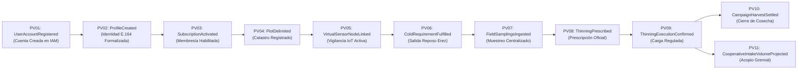

# EventStorming — Paso 4: Identificación de Pivotal Events (Puntos de Inflexión del Negocio)

**Proyecto:** Viora — Ecosistema Digital para la Mitigación de la Vecería en la Olivicultura  
**Fase Metodológica:** Strategic Domain-Driven Design (Strategic DDD)  
**Elemento del Modelo:** Eventos Pivote de Transición de Fase (*Pivotal Events*)  

---

## 1. Fundamentos Metodológicos y Delimitación de Transiciones

Dentro del universo de eventos de dominio identificados, la mayoría modela actividades operativas continuas o transacciones intermedias. En contraste, los **Pivotal Events** representan hitos fundamentales del negocio que marcan un **cambio cualitativo e irreversible de fase, estado o contexto**.

En el marco metodológico de Domain-Driven Design:

1. **Puntos de No Retorno:** Antes de su ocurrencia, el sistema opera bajo un conjunto determinado de pre-condiciones; una vez consumado el evento, el dominio transita hacia un nuevo estado operativo.
2. **Desbloqueo de Invariantes y Capacidades:** La consumación de un evento pivote habilita la ejecución de comandos y procesos de negocio que anteriormente no eran admisibles.
3. **Fronteras Geológicas de Bounded Contexts:** Actúan como demarcadores naturales para identificar la separación entre subdominios y definir los límites de los contextos delimitados candidatos.

---

## 2. Mapa Estratégico de Transiciones de Fase

El ciclo de vida de Viora se articula a través de **11 Pivotal Events** que conducen la transición desde la creación de la credencial y la formalización de la identidad del productor hasta el balance multianual y la proyección gremial de cosecha:

---

## 3. Matriz Maestra de Pivotal Events (PV01 a PV11)

| ID | Pivotal Event (PascalCase) | Timeline / Fase | Pre-Estado (Antes del Evento) | Post-Estado (Después del Evento) | Transición de Fase en el Negocio | Bounded Context Candidato | Relevancia Estratégica en Viora |
| :---: | :--- | :---: | :--- | :--- | :--- | :--- | :--- |
| **PV01** | `UserAccountRegistered` *(EV01)* | Timeline 1A: IAM | Visitante anónimo sin credenciales ni cuenta en la plataforma. | Cuenta de usuario creada con identificador único y contraseña protegida con Argon2id. | **Fase 0A $\rightarrow$ Fase 0B:** Registro de Credencial | `Identity and Access Management (IAM)` | Establece la frontera de autenticación digital y habilita el inicio de sesión y emisión de JWT. |
| **PV02** | `ProfileCreated` *(EV08)* | Timeline 1B: User Profiles | Usuario autenticado en IAM pero sin perfil humano formalizado ni teléfono validado. | Productor o gestor con identidad formalizada, nombre completo y teléfono normalizado E.164. | **Fase 0B $\rightarrow$ Fase 1:** Onboarding & Perfil Validado | `User Profiles (Profiles)` | Garantiza canales de contacto auditables y verificados antes de permitir la delimitación catastral o afiliación a la cooperativa. |
| **PV03** | `SubscriptionActivated` *(EV11 / EV13)* | Timeline 2: Suscripción | Usuario registrado sin plan comercial activo ni derecho de uso SaaS. | Productor con licencia anual habilitada (pago individual o canje cooperativo) y cupo de hectáreas. | **Fase 1 $\rightarrow$ Fase 2:** Monetización & Vigencia | `Subscription and Cooperative Membership (Subscription)` | Habilita el acceso a los algoritmos avanzados de predicción de frío y prescripción de aclareo. |
| **PV04** | `PlotDelimited` *(EV15)* | Timeline 3: Parcelas | Fundo olivarero no identificado espacialmente ni caracterizado agronómicamente. | Unidad catastral georreferenciada con polígono cerrado, área neta, variedad de olivo y densidad arbórea. | **Fase 2 $\rightarrow$ Fase 3:** Base Territorial & Catastro | `Olive Orchard and Plot Management (Orchard)` | Establece el marco dendrométrico indispensable para calcular sobrecargas por árbol y por hectárea. |
| **PV05** | `VirtualSensorNodeLinked` *(EV18)* | Timeline 4: Sensores IoT | Parcela sin monitoreo continuo ni sensometría asignada. | Lote con dispositivo sensor activo recibiendo telemetría continua de humedad y microclima 24/7. | **Fase 3 $\rightarrow$ Fase 4:** Sensometría & Vigilancia | `Agroclimatic Telemetry and Sensor Monitoring (Telemetry)` | Conecta el mundo físico del suelo con las alertas automáticas de estrés hídrico y choques térmicos. |
| **PV06** | `ColdRequirementFulfilled` *(EV32)* | Timeline 5: Vecería & Erez | Olivar acumulando porciones de frío en reposo invernal bajo incertidumbre térmica. | Parcela con requerimiento fisiológico completado (25-30 porciones de Erez); estímulo térmico floral asegurado. | **Fase 4 $\rightarrow$ Fase 5:** Reposo $\rightarrow$ Brotación Floral | `Phenology and Historical Bearing Analytics (Phenology)` | Certifica la salida del reposo invernal y confirma que el olivo cuenta con potencial para floración uniforme. |
| **PV07** | `FieldSamplingsIngested` *(EV36)* | Timeline 6: Cuajado & Aclareo | Conteos de inflorescencias y frutos dispersos y aislados en dispositivos móviles de campo. | Datos cuantitativos de cuajado centralizados en la nube listos para evaluación estadística y balance de carga. | **Fase 5 $\rightarrow$ Fase 6:** Muestreo $\rightarrow$ Evaluación | `Crop Load Regulation and Thinning Advisory (Thinning)` | Consolida la verdad de campo del productor, superando la falta de conectividad rural mediante sincronización. |
| **PV08** | `ThinningPrescribed` *(EV41)* | Timeline 6: Cuajado & Aclareo | Incertidumbre sobre el nivel de sobrecarga frutal y riesgo inminente de año OFF. | Prescripción agronómica formal emitida con porcentaje exacto de remoción y ventana fenológica límite. | **Fase 6 $\rightarrow$ Fase 7:** Diagnóstico $\rightarrow$ Intervención | `Crop Load Regulation and Thinning Advisory (Thinning)` | Provee la pauta agronómica precisa que reemplaza la intuición empírica por cálculo científico. |
| **PV09** | `ThinningExecutionConfirmed` *(EV44)* | Timeline 6: Cuajado & Aclareo | Olivar en riesgo de colapso vegetativo por sobrecarga frutal y agotamiento de reservas. | Carga frutal regulada antes del endurecimiento del carozo, equilibrando carbohidratos para el año siguiente. | **Fase 7 $\rightarrow$ Fase 8:** Sobrecarga $\rightarrow$ Mitigación Real | `Crop Load Regulation and Thinning Advisory (Thinning)` | **El hito agronómico central de Viora:** Interrumpe el ciclo de vecería antes de que la semilla inhiba las yemas florales. |
| **PV10** | `CampaignHarvestSettled` *(EV46)* | Timeline 7: Cierre Cosecha | Campaña agrícola abierta con estimaciones y proyecciones preliminares. | Rendimiento real de cosecha formalmente asentado (kg verde/negro) y curva BBI multianual actualizada. | **Fase 8 $\rightarrow$ Fase 9:** Campaña Activa $\rightarrow$ Cierre Auditado | `Harvest Settlement and Performance Reporting (Harvest)` | Cierra formalmente el ciclo productivo y alimenta la memoria histórica para medir la atenuación de alternancia. |
| **PV11** | `CooperativeIntakeVolumeProjected` *(EV50)* | Timeline 8: Cooperativa | Incertidumbre logística y financiera en la cooperativa sobre el acopio de la temporada. | Estimación agregada temprana de volumen consolidada para aceituna de mesa (verde) y almazara (negra). | **Fase 8 $\rightarrow$ Fase 10:** Parcela Individual $\rightarrow$ Plan Gremial | `Cooperative Operations and Territorial Intelligence (Territory)` | Permite a la organización olivarera planificar logística de transporte, tanques de salmuera y contratos comerciales. |

---

## 4. Conclusiones y Conexión con los Siguientes Pasos

1. **Alineación con la Arquitectura de Software:**  
   Los 11 Pivotal Events identificados coinciden de manera limpia con los límites de los **9 Bounded Contexts** y marcan los momentos en que los **Agregados Raíz (*Aggregate Roots*)** cambian de estado transaccional mayor.
2. **Foco en el Problema de Negocio:**  
   Cuatro de los once eventos (`PV06`, `PV07`, `PV08`, `PV09`) pertenecen directamente al **Core Domain** de Viora (regulación de carga y mitigación de vecería), demostrando que el modelado refleja exactamente la propuesta de valor única de la solución.
