# Impact Mapping: Plataforma Viora

Este documento consolida la especificación metodológica y estructural del Impact Mapping para la plataforma digital Viora. La técnica, concebida por Gojko Adzic, conecta formalmente los objetivos estratégicos del modelo de negocio digital con los incrementos de software desarrollados, garantizando que cada funcionalidad responda a una meta cuantificable de negocio y a una necesidad humana y agronómica real.

El modelo mantiene trazabilidad 1:1 inmutable con los Business Outcome Assumptions y las hipótesis del Lean UX Canvas aprobados en el Capítulo 1 ([12-solution-profile.md](file:///c:/Epic/Estudios/Universidad/Ciclos/06/1acc0238/viora-report/report/chapters/10-presentation/12-solution-profile.md#L238)), sin introducir cifras inventadas ni contradicciones en plazos o porcentajes.

---

## 1. Principios Metodológicos y Directrices de Diseño

1. Beneficio Centrado en el Negocio (Business Goals para Viora):
   Los objetivos de primer nivel (*Goals*) definen exclusivamente las metas de captación, monetización, retención y validación de contratos de Viora como empresa SaaS AgTech. El éxito del negocio se apoya en los resultados agronómicos de los usuarios en campo, pero el objetivo mide la viabilidad de la startup.
2. Trazabilidad Absoluta con el Capítulo 1:
   Cada Business Goal se formula tomando literalmente las métricas, umbrales y horizontes temporales establecidos en los Business Outcome Assumptions (1, 2, 3, 4, 5 y 6) del Capítulo 1:
   * Outcome 1: Firma de al menos 2 convenios en 6 meses.
   * Outcome 2: Al menos el 60% de nuevos suscriptores registra su parcela en los primeros 30 días.
   * Outcome 3: Al menos el 50% de las parcelas en año ON certifica una acción de regulación de carga dentro de ventana recomendada.
   * Outcome 4: Al menos el 60% de suscripciones activas renueva su segundo ciclo de cobro al cierre del sexto mes.
   * Outcome 5: Reducción de 0.10 puntos en el índice de alternancia de la cartera tras dos campañas consecutivas.
   * Outcome 6: Error de proyección del volumen agregado de acopio inferior al 25% al cierre de campaña.
3. Actores Basados Estrictamente en User Personas:
   Los actores del mapa corresponden de manera exclusiva a los dos arquetipos oficiales del proyecto:
   * Teodoro Mamani: Productor Olivarero Tradicional (Segmento B2C individual y agremiado).
   * Rubén Ticona: Gestor Técnico de Organización Olivarera / Cooperativa (Segmento B2B institucional).
4. Criterio Declarado de Asignación Unívoca de Actores:
   Para preservar la claridad visual y evitar bifurcaciones redundantes en el árbol de Impact Mapping, las historias con usuarios compartidos o de rol visitante se asignan de forma unívoca según el arquetipo que protagoniza el mayor impacto de negocio:
   * US41 (i18n Landing Page): Se asigna a Rubén Ticona, quien requiere presentar la propuesta técnica y operativa de la cooperativa a compradores internacionales en inglés.
   * US42 (i18n Móvil): Se asigna a Teodoro Mamani, asegurando la usabilidad y adopción directa en campo en su idioma habitual.
   * US30 (Ficha Técnica PDF): Se asigna a Rubén Ticona, quien centraliza los reportes consolidados para auditorías técnicas y comerciales de la cartera de socios.
   * US29 (Asentamiento de Cosecha Real): Se asigna estrictamente a Teodoro Mamani, conforme al rol del informe (el productor ingresa sus kilogramos cosechados para recalcular su balance de alternancia).
   * US07 y US08 (Membresías Cooperativas): `US08` corresponde a Rubén Ticona (administración de cartera y emisión de invitaciones) y `US07` corresponde a Teodoro Mamani (canje de código y activación de cuenta de socio).
5. Régimen Agronómico Estricto (Vecería Prolongada):
   La solución reconoce que la alternancia fisiológica del olivo no puede erradicarse. Por tanto, la propuesta se enfoca en mitigar la vecería prolongada (o alargada) para evitar que la caída productiva se extienda por dos o más años consecutivos, garantizando un piso de rendimiento viable en los años de menor cosecha.
6. Infraestructura Telemática Simulada:
   En estricto apego a las decisiones de arquitectura adoptadas, los servicios climáticos se describen como "nodos sensores virtuales simulados", sin atribuir dependencias operativas a despliegues de hardware IoT físico.

---

## 2. Definición de Business Goals SMART (100% Beneficio para Viora)

### 🎯 Business Goal 1 (BG-01): Validación del Canal de Distribución y Captación Institucional B2B
> "Validar el canal de captación y distribución institucional de Viora mediante la firma de al menos 2 convenios comerciales con cooperativas, asociaciones o agroindustrias dentro de los primeros 6 meses posteriores al lanzamiento comercial."

* Beneficio para Viora: Asegurar el canal de distribución más eficiente (B2B2C), incorporando carteras consolidadas de productores agremiados con bajo Costo de Adquisición de Clientes (CAC) y respaldo institucional.
* Criterios SMART:
  * S (Specific): Cierre de acuerdos corporativos con organizaciones olivareras para distribución de membresías institucionales.
  * M (Measurable): Al menos 2 convenios formalizados y firmados (Outcome 1 de Cap. 1).
  * A (Achievable): En las principales cuencas olivícolas del país operan más de 6 asociaciones y cooperativas activas.
  * R (Relevant): Es el canal primario de tracción y confianza técnica establecido en la Business Assumption 5.
  * T (Time-bound): Plazo perentorio de 6 meses posteriores al lanzamiento.

---

### 🎯 Business Goal 2 (BG-02): Tracción de Ingresos Recurrentes y Retención de Suscripciones SaaS
> "Asegurar la monetización y sostenibilidad del modelo SaaS logrando que al menos el 60% de los nuevos suscriptores active su cuenta registrando su parcela en los primeros 30 días, y que al menos el 60% de las suscripciones activas renueve su segundo ciclo de cobro al cierre del sexto mes."

* Beneficio para Viora: Garantizar flujo de caja recurrente temprano, validar la disposición a pagar (*willingness to pay*) y controlar la tasa de fuga (*churn rate* $\le 40\%$) para asegurar la viabilidad económica ($LTV > CAC$).
* Criterios SMART:
  * S (Specific): Activación temprana de nuevos usuarios y renovación efectiva del segundo ciclo de cobro.
  * M (Measurable): 60% de activación de parcelas en 30 días (Outcome 2) y 60% de renovación de cobro al sexto mes (Outcome 4).
  * A (Achievable): El valor agronómico percibido en microclima y diagnóstico temprano estimula la continuidad del servicio.
  * R (Relevant): Define la supervivencia y tracción del modelo SaaS de pago recurrente (Business Assumption 4).
  * T (Time-bound): Doble horizonte: primeros 30 días y cierre del sexto mes.

---

### 🎯 Business Goal 3 (BG-03): Renovación de Contratos B2B mediante Acreditación de Eficacia del Producto
> "Asegurar la renovación y continuidad de los contratos corporativos con organizaciones aliadas, acreditando el valor comercial de la plataforma al lograr que al menos el 50% de las parcelas en año ON certifique una acción de regulación de carga dentro de ventana (Outcome 3), reduciendo el índice de alternancia de la cartera en al menos 0.10 puntos tras dos campañas (Outcome 5) y manteniendo el error de proyección de acopio por debajo del 25% al cierre de campaña (Outcome 6)."

* Beneficio para Viora: Blindar los contratos corporativos de alto ticket B2B contra cancelaciones. Supera la mayor amenaza de la empresa (horizonte de validación tardío, Business Assumption 7) demostrando numéricamente que la plataforma estabilizó cosechas y predijo el acopio, asegurando renovaciones anuales a largo plazo.
* Criterios SMART:
  * S (Specific): Renovación de cuentas corporativas sustentada en la prueba de eficacia agronómica y logística.
  * M (Measurable): 50% regulación de carga certificada (Outcome 3), reducción $\ge 0.10$ puntos en índice BBI (Outcome 5) y error de acopio $< 25\%$ (Outcome 6).
  * A (Achievable): Respaldado en la calibración algorítmica de Erez, carga objetivo y aclareo fenológico oportuno.
  * R (Relevant): Garantiza contratos de gran volumen con organizaciones y posiciona a Viora como estándar de la industria.
  * T (Time-bound): Evaluación al cierre de campaña y tras dos campañas consecutivas.

---

## 3. Diagrama Jerárquico Visual (Mermaid)

```mermaid
flowchart TD
    %% Business Goals
    BG1["<b>Goal 1: Captación B2B</b><br>2 convenios en 6 meses (Outcome 1)"]
    BG2["<b>Goal 2: Monetización SaaS</b><br>60% activación (30d) y 60% renovación (6m) (Outcomes 2 y 4)"]
    BG3["<b>Goal 3: Renovación Contratos B2B</b><br>50% regulación ON (Out 3), BBI -0.10 (Out 5), acopio <25% (Out 6)"]

    %% Actors
    RT["<b>Actor: Rubén Ticona</b><br>Gestor Técnico de Cooperativa"]
    TM["<b>Actor: Teodoro Mamani</b><br>Productor Olivarero"]

    %% Enlaces Goal -> Actor
    BG1 --> RT
    BG1 --> TM
    BG2 --> TM
    BG3 --> TM
    BG3 --> RT

    %% Deliverables Goal 1
    D11["<b>Deliverable 1.1.1:</b> Portal B2B y soporte multilingüe"]
    D12["<b>Deliverable 1.2.1:</b> Gestor corporativo de membresías"]
    D13["<b>Deliverable 1.3.1:</b> Módulo de activación de cuenta de socio"]
    RT --> D11 --> S11["US35, US38, US41"]
    RT --> D12 --> S12["US08"]
    TM --> D13 --> S13["US07"]

    %% Deliverables Goal 2
    D21["<b>Deliverable 2.1.1:</b> Portal web de captación y descarga"]
    D22["<b>Deliverable 2.2.1:</b> Módulo de registro (E.164), perfil y cobros"]
    D23["<b>Deliverable 2.3.1:</b> Gestor cartográfico GIS satelital"]
    TM --> D21 --> S21["US33, US34, US36, US37, US39, US40"]
    TM --> D22 --> S22["US01, US02, US03, US04, US05, US06, US42, US43"]
    TM --> D23 --> S23["US09, US10, US11"]

    %% Deliverables Goal 3
    D31["<b>Deliverable 3.1.1:</b> Telemetría de microclima horaria"]
    D32["<b>Deliverable 3.2.1:</b> Motor de frío (Erez) y vecería (BBI)"]
    D33["<b>Deliverable 3.3.1:</b> Asistente móvil offline y aclareo"]
    D34["<b>Deliverable 3.3.2:</b> Asentamiento de cosecha y balance de estabilización"]
    D35["<b>Deliverable 3.4.1:</b> Zonificación territorial por GPS y semáforo de riesgo"]
    D36["<b>Deliverable 3.5.1:</b> Motor predictivo de acopio y Ficha PDF auditable"]
    TM --> D31 --> S31["US13, US14, US15, US16, US17, US18, US19"]
    TM --> D32 --> S32["US20, US21, US22, US23"]
    TM --> D33 --> S33["US24, US25, US26, US27, US28"]
    TM --> D34 --> S34["US29"]
    RT --> D35 --> S35["US12, US31"]
    RT --> D36 --> S36["US30, US32"]
```

---

## 4. Desglose Jerárquico Estructurado (Árbol Completo de Decisiones)

### 🎯 GOAL 1: Validación del Canal de Distribución y Captación Institucional B2B
> *Validar el canal de captación y distribución institucional de Viora mediante la firma de al menos 2 convenios comerciales con cooperativas, asociaciones o agroindustrias dentro de los primeros 6 meses posteriores al lanzamiento comercial.*

* 👤 ACTOR: Rubén Ticona (Gestor Técnico de Cooperativa)
  * 🔄 Impacto 1.1: Valida la solvencia institucional y tecnológica de Viora y decide adoptar el plan cooperativo para modernizar la gestión técnica de su gremio.
    * 📦 Deliverable 1.1.1: Portal corporativo B2B, credenciales de ingeniería y presentación multilingüe (i18n)
      * `US35`: Exploración de beneficios y herramientas de gestión territorial para cooperativas agrarias.
      * `US38`: Reproducción del video institucional sobre el equipo y proceso de ingeniería ("About the Team").
      * `US41`: Selección de idioma y localización de contenidos en la Landing Page.
  * 🔄 Impacto 1.2: Digitaliza e incorpora masivamente a sus socios agremiados en una red comunitaria de asistencia técnica.
    * 📦 Deliverable 1.2.1: Gestor corporativo de membresías y distribución de invitaciones institucionales
      * `US08`: Administración de cartera de socios y generación de códigos de invitación.

* 👤 ACTOR: Teodoro Mamani (Productor Olivarero Agremiado)
  * 🔄 Impacto 1.3: Se afilia al programa técnico de su cooperativa mediante su código de activación para acceder a los servicios corporativos sin asumir costos individuales.
    * 📦 Deliverable 1.3.1: Módulo de canje de invitación y activación de cuenta de socio
      * `US07`: Activación de cuenta de socio mediante canje de código de cooperativa.

---

### 🎯 GOAL 2: Tracción de Ingresos Recurrentes y Retención de Suscripciones SaaS
> *Asegurar la monetización y sostenibilidad del modelo SaaS logrando que al menos el 60% de los nuevos suscriptores active su cuenta registrando su parcela en los primeros 30 días, y que al menos el 60% de las suscripciones activas renueve su segundo ciclo de cobro al cierre del sexto mes.*

* 👤 ACTOR: Teodoro Mamani (Productor Olivarero)
  * 🔄 Impacto 2.1: Supera el escepticismo inicial, descubre el valor de la plataforma en su smartphone y descarga la aplicación oficial.
    * 📦 Deliverable 2.1.1: Portal web de captación, propuesta contra vecería prolongada y descarga oficial
      * `US33`: Presentación de la propuesta de valor central para la mitigación de la vecería prolongada en el olivar.
      * `US34`: Exploración de beneficios y capacidades operativas para el productor olivarero.
      * `US36`: Visualización de planes de suscripción y tarifas transparentes en moneda nacional (PEN).
      * `US37`: Reproducción del video promocional y demostrativo del producto ("About the Product").
      * `US39`: Consulta de términos de servicio y política de privacidad y protección de datos (Ley N° 29733).
      * `US40`: Redirección y acceso a la descarga oficial de la aplicación móvil.
  * 🔄 Impacto 2.2: Se da de alta en la plataforma, personaliza sus credenciales y paga su suscripción en moneda local de forma segura.
    * 📦 Deliverable 2.2.1: Módulo de registro (E.164), autenticación, perfil, seguridad y pasarela Checkout Pro en Soles
      * `US01`: Registro de cuenta de acceso y credenciales seguras con asignación de rol.
      * `US43`: Completado de perfil de usuario y contacto validado bajo estándar E.164.
      * `US02`: Inicio de sesión seguro con emisión de tokens de acceso.
      * `US03`: Consulta y edición de perfil con datos de contacto.
      * `US04`: Modificación segura de credenciales de acceso.
      * `US05`: Solicitud de restablecimiento de contraseña vía correo electrónico.
      * `US06`: Procesamiento de suscripción con pasarela Checkout Pro en moneda nacional.
      * `US42`: Configuración y cambio de idioma de la interfaz en la aplicación móvil.
  * 🔄 Impacto 2.3: Digitaliza la cartografía de sus predios en sus primeros 30 días para activar el monitoreo y fundamentar su inversión.
    * 📦 Deliverable 2.3.1: Gestor cartográfico GIS satelital de parcelas y caracterización dendrométrica (WGS84)
      * `US09`: Delimitación georreferenciada de polígonos parcelarios.
      * `US10`: Edición de geometría y actualización de área cultivada.
      * `US11`: Baja lógica y archivado de parcelas inactivas.

---

### 🎯 GOAL 3: Renovación de Contratos B2B mediante Acreditación de Eficacia del Producto
> *Asegurar la renovación y continuidad de los contratos corporativos con organizaciones aliadas, acreditando el valor comercial de la plataforma al lograr que al menos el 50% de las parcelas en año ON certifique una acción de regulación de carga dentro de ventana (Outcome 3), reduciendo el índice de alternancia de la cartera en al menos 0.10 puntos tras dos campañas (Outcome 5) y manteniendo el error de proyección de acopio por debajo del 25% al cierre de campaña (Outcome 6).*

* 👤 ACTOR: Teodoro Mamani (Productor Olivarero)
  * 🔄 Impacto 3.1: Toma decisiones preventivas de manejo agronómico y riego apoyado en telemetría continua de microclima horaria y alertas tempranas.
    * 📦 Deliverable 3.1.1: Sistema de telemetría agroclimática y monitor agrometeorológico (nodos sensores virtuales simulados)
      * `US13`: Vinculación y alta de nodo sensor virtual a una parcela.
      * `US14`: Consulta de inventario y estado de transmisión simulada de nodos sensores virtuales.
      * `US15`: Personalización de denominación y configuración de nodo sensor virtual.
      * `US16`: Desvinculación y baja de nodo sensor virtual de una parcela.
      * `US17`: Monitoreo agroclimático y consulta de series temporales de suelo y microclima.
      * `US18`: Alertas automáticas de estrés hídrico y umbral térmico crítico en parcela.
      * `US19`: Consulta de pronóstico meteorológico geolocalizado a 7 días.
  * 🔄 Impacto 3.2: Conoce el índice de alternancia de su predio y evalúa la acumulación de frío para anticipar anomalías fisiológicas.
    * 📦 Deliverable 3.2.1: Motor fisiológico de diagnóstico de vecería (BBI Hoblyn) y modelo dinámico de frío invernal (Erez / ENOS)
      * `US20`: Registro retrospectivo de campañas históricas de cosecha y cálculo del Índice de Vecería (BBI).
      * `US21`: Modificación y rectificación de registros históricos de cosecha.
      * `US22`: Monitoreo dinámico de porciones de frío invernal acumuladas mediante el modelo de Erez.
      * `US23`: Detección de anomalías térmicas invernales y advertencia de riesgo floral por efecto ENOS.
  * 🔄 Impacto 3.3: Realiza muestreos a pie de árbol sin conexión, regula la carga frutal en ventana fenológica oportuna y asienta la cosecha real para comprobar la estabilización interanual.
    * 📦 Deliverable 3.3.1: Asistente móvil offline de muestreo de cuajado y motor de prescripción de aclareo frutal
      * `US24`: Muestreo guiado de cuajado en campo a pie de árbol con persistencia local offline.
      * `US25`: Consulta de representatividad estadística e historial de árboles muestreados en campo.
      * `US26`: Cálculo de carga frutal objetivo sostenible y rendimiento potencial de campaña.
      * `US27`: Prescripción técnica in-app de porcentaje y ventana fenológica de aclareo.
      * `US28`: Registro y confirmación de ejecución de aclareo en campo.
    * 📦 Deliverable 3.3.2: Módulo de cierre de campaña y balance interanual de estabilización productiva
      * `US29`: Asentamiento formal de cosecha de fin de campaña y balance de estabilización productiva.

* 👤 ACTOR: Rubén Ticona (Gestor Técnico de Cooperativa)
  * 🔄 Impacto 3.4: Monitorea la distribución sectorial de los predios socios con geolocalización GPS y prioriza visitas técnicas en sectores con sobrecarga o riesgo térmico.
    * 📦 Deliverable 3.4.1: Zonificación territorial geolocalizada por GPS y tablero semafórico de vulnerabilidad
      * `US12`: Consulta de la matriz de riesgo territorial y semáforo sectorial con geolocalización GPS.
      * `US31`: Semáforo fenológico reactivo y priorización técnica ante sobrecarga crítica.
  * 🔄 Impacto 3.5: Proyecta tempranamente los volúmenes de acopio para comprometer ventas de exportación y dispone de documentación técnica auditable.
    * 📦 Deliverable 3.5.1: Motor predictivo de acopio discriminado y generador de Ficha Técnica PDF auditable
      * `US30`: Emisión, certificación criptográfica y exportación del expediente agronómico en PDF.
      * `US32`: Proyección agregada temprana de volumen de acopio de aceituna verde y negra para la cooperativa.

---

## 5. Matriz Exhaustiva de Trazabilidad (43 Historias de Usuario con Formato Ágil Completo)

La siguiente matriz documenta la trazabilidad completa, detallando para cada funcionalidad su formulación ágil formal (ID - Como / Quiero / Para), Actor, Impacto, Entregable y Business Goal SMART asignado.

| User Story (ID, Título y Formulación Ágil) | Actor (User Persona) | Impacto de Comportamiento y Beneficio | Entregable Digital (Deliverable) | Business Goal SMART |
| :--- | :--- | :--- | :--- | :---: |
| US35: Exploración de beneficios y herramientas de gestión territorial para cooperativas agrarias Como Visitante Gestor de Cooperativa, quiero consultar las capacidades de supervisión cartográfica y proyección agregada de cosecha, para determinar si la plataforma facilita la asistencia técnica a los socios agremiados y mejora la planificación logística del acopio en almazara. | Rubén Ticona | Valida la solvencia institucional y tecnológica de Viora y decide adoptar el plan cooperativo para modernizar su gremio | Portal corporativo B2B y presentación multilingüe (i18n) | BG-01 |
| US38: Reproducción del video institucional sobre el equipo y proceso de ingeniería ("About the Team") Como Visitante Cauteloso, quiero reproducir un video sobre el equipo y el proceso de trabajo detrás del desarrollo de Viora, para corroborar el respaldo profesional, rigor agronómico e institucional del software antes de incorporarlo en mi actividad agrícola. | Rubén Ticona | Valida la solvencia institucional y tecnológica de Viora y decide adoptar el plan cooperativo para modernizar su gremio | Portal corporativo B2B y presentación multilingüe (i18n) | BG-01 |
| US41: Selección de idioma y localización de contenidos en la Landing Page Como Visitante, quiero alternar el idioma de los contenidos entre Español e Inglés mediante un selector visible en la cabecera, para consultar la propuesta de valor, los beneficios agronómicos y las tarifas en mi idioma preferido. | Rubén Ticona | Valida la solvencia institucional y tecnológica de Viora y decide adoptar el plan cooperativo para modernizar su gremio | Portal corporativo B2B y presentación multilingüe (i18n) | BG-01 |
| US08: Administración de la cartera de socios productores y consulta de cuota corporativa Como Gestor Técnico de Cooperativa, quiero consultar la nómina de socios productores agremiados con su superficie declarada y verificar el cupo contratado de la membresía colectiva, para supervisar la base territorial de la cooperativa y coordinar la entrega de códigos de activación a los agricultores elegibles. | Rubén Ticona | Supervisa el padrón gremial y la cuota corporativa de hectáreas para coordinar códigos de activación | Gestor corporativo de membresías y distribución de invitaciones | BG-01 |
| US07: Activación de cuenta de socio mediante canje de código de cooperativa Como Productor Olivarero socio de una cooperativa agraria, quiero canjear un código de activación proporcionado por mi organización, para habilitar el acceso completo a los servicios de Viora bajo la membresía corporativa de la cooperativa sin asumir costos individuales de suscripción. | Teodoro Mamani | Se afilia al programa técnico de su cooperativa mediante su código de socio para acceder a servicios corporativos | Módulo de canje de invitación y activación de cuenta de socio | BG-01 |
| US33: Presentación de la propuesta de valor central para la mitigación de la vecería prolongada en el olivar Como Visitante, quiero que el sistema exponga con claridad cómo la integración de datos de microclima, frío invernal y regulación de carga frutal atenúa la severidad de la alternancia productiva y mitiga la vecería prolongada, para comprender de inmediato la solución tecnológica que ofrece Viora frente a la incertidumbre agronómica del cultivo. | Teodoro Mamani | Supera el escepticismo inicial, descubre el valor de la plataforma en su smartphone y descarga la app oficial | Portal web de captación y propuesta contra vecería prolongada | BG-02 |
| US34: Exploración de beneficios y capacidades operativas para el productor olivarero Como Visitante Productor, quiero consultar las herramientas tecnológicas orientadas al monitoreo y manejo agronómico de parcelas, para evaluar cómo la plataforma me ayuda a registrar conteos sin conexión a internet, anticipar estrés hídrico y recibir prescripciones precisas de aclareo. | Teodoro Mamani | Supera el escepticismo inicial, descubre el valor de la plataforma en su smartphone y descarga la app oficial | Portal web de captación y propuesta contra vecería prolongada | BG-02 |
| US36: Visualización de planes de suscripción y tarifas transparentes en moneda nacional (PEN) Como Visitante, quiero consultar las tarifas de suscripción en Soles (PEN) por superficie o membresía institucional junto con el detalle de servicios incluidos, para evaluar la opción comercial más conveniente y transparente para mi escala productiva antes de contratar. | Teodoro Mamani | Supera el escepticismo inicial, descubre el valor de la plataforma en su smartphone y descarga la app oficial | Portal web de captación y propuesta contra vecería prolongada | BG-02 |
| US37: Reproducción del video promocional y demostrativo del producto ("About the Product") Como Visitante Interesado, quiero reproducir un video demostrativo breve sobre el funcionamiento de Viora, para apreciar la aplicación práctica de los modelos agronómicos en campo y validar su eficacia en la mitigación de la vecería prolongada antes de adoptar la plataforma. | Teodoro Mamani | Supera el escepticismo inicial, descubre el valor de la plataforma en su smartphone y descarga la app oficial | Portal web de captación y propuesta contra vecería prolongada | BG-02 |
| US39: Consulta de términos de servicio y política de privacidad y protección de datos (Ley N° 29733) Como Visitante, quiero consultar los Términos y Condiciones y la Política de Privacidad formulada conforme a la Ley N° 29733 (Ley de Protección de Datos Personales del Perú), para tener plena certidumbre legal sobre la confidencialidad de mis registros de cultivo y los derechos sobre mis datos agronómicos. | Teodoro Mamani | Supera el escepticismo inicial, descubre el valor de la plataforma en su smartphone y descarga la app oficial | Portal web de captación y propuesta contra vecería prolongada | BG-02 |
| US40: Redirección y acceso a la descarga oficial de la aplicación móvil Como Visitante, quiero disponer de accesos directos hacia los repositorios oficiales de distribución móvil, para descargar e instalar la aplicación en mi dispositivo e iniciar mi experiencia en la plataforma. | Teodoro Mamani | Supera el escepticismo inicial, descubre el valor de la plataforma en su smartphone y descarga la app oficial | Portal web de captación y propuesta contra vecería prolongada | BG-02 |
| US01: Registro de cuenta de acceso y credenciales seguras con asignación de rol Como usuario nuevo de Viora (Productor Olivarero o Gestor Técnico), quiero registrar una cuenta en la plataforma ingresando mi correo electrónico, una contraseña segura y seleccionando mi rol de trabajo, para darme de alta en el sistema y disponer de una identidad de acceso que me permita autenticarme. | Teodoro Mamani | Se da de alta en la plataforma, personaliza sus credenciales y paga su suscripción en Soles de forma segura | Módulo de registro, credenciales seguras y asignación de rol | BG-02 |
| US43: Completado de perfil de usuario y contacto validado bajo estándar E.164 Como usuario nuevo autenticado en Viora (Productor Olivarero o Gestor Técnico), quiero completar mi perfil de usuario ingresando mi nombre completo, país de residencia y número celular de contacto, para personalizar mi cuenta y habilitar los canales de notificación agronómica y operativa del sistema. | Teodoro Mamani | Se da de alta en la plataforma, personaliza sus credenciales y paga su suscripción en Soles de forma segura | Módulo de perfil de usuario y validación telefónica E.164 | BG-02 |
| US02: Inicio de sesión y autenticación persistente mediante tokens Como usuario registrado de Viora (Productor Olivarero o Gestor Técnico), quiero autenticarme con mi correo electrónico y contraseña para mantener mi sesión activa en el dispositivo móvil mediante tokens seguros, para operar de forma continua y protegida en la gestión de mis predios o cartera cooperativa sin tener que reingresar credenciales continuamente durante mis labores agrícolas en campo. | Teodoro Mamani | Se da de alta en la plataforma, personaliza sus credenciales y paga su suscripción en Soles de forma segura | Módulo de identidad y seguridad móvil (tokens JWT) | BG-02 |
| US03: Consulta y actualización de datos de perfil y contacto Como usuario autenticado de Viora (Productor Olivarero o Gestor Técnico), quiero consultar y modificar mis datos personales, país y número telefónico en mi perfil, para mantener actualizada mi información de contacto y facilitar las coordinaciones operativas y de asistencia técnica entre productores y la administración cooperativa. | Teodoro Mamani | Se da de alta en la plataforma, personaliza sus credenciales y paga su suscripción en Soles de forma segura | Módulo de perfil y configuración de datos de contacto | BG-02 |
| US04: Cambio seguro de contraseña de acceso Como usuario autenticado de Viora (Productor Olivarero o Gestor Técnico), quiero actualizar mi contraseña de acceso verificando mi clave actual e ingresando una nueva clave robusta, para proteger el acceso a mis registros agrícolas, históricos de cosecha y datos comerciales ante sospechas de vulneración y salvaguardar la privacidad de mis parcelas o cartera gremial. | Teodoro Mamani | Se da de alta en la plataforma, personaliza sus credenciales y paga su suscripción en Soles de forma segura | Módulo de seguridad y modificación de credenciales | BG-02 |
| US05: Recuperación de contraseña olvidada mediante enlace por correo Como usuario registrado de Viora (Productor Olivarero o Gestor Técnico), quiero solicitar el restablecimiento de mi clave ingresando mi correo electrónico para recibir un enlace de un solo uso, para recuperar el acceso a mis registros agrícolas o cartera gremial de forma autónoma sin depender de soporte técnico ni perder la trazabilidad histórica de mis parcelas. | Teodoro Mamani | Se da de alta en la plataforma, personaliza sus credenciales y paga su suscripción en Soles de forma segura | Módulo de seguridad y restablecimiento de contraseña vía email | BG-02 |
| US06: Suscripción individual al Plan Productor mediante pasarela de pago digital Como Productor Olivarero independiente, quiero suscribirme al Plan Productor seleccionando la tarifa correspondiente a la extensión de mis parcelas y realizando el pago en línea mediante una pasarela digital segura, para habilitar de inmediato las herramientas de diagnóstico histórico, monitoreo climático y prescripción agronómica de Viora sin depender de intermediarios ni membresías corporativas. | Teodoro Mamani | Se da de alta en la plataforma, personaliza sus credenciales y paga su suscripción en Soles de forma segura | Pasarela de suscripciones Checkout Pro en moneda nacional (PEN) | BG-02 |
| US42: Configuración y cambio de idioma de la interfaz en la aplicación móvil Como usuario autenticado de la aplicación móvil de Viora (Productor Olivarero o Gestor Técnico), quiero seleccionar mi idioma de preferencia (Español o Inglés) desde el panel de ajustes de la aplicación, para visualizar todos los menús, diagnósticos y alertas en el idioma con el que tenga mayor familiaridad. | Teodoro Mamani | Se da de alta en la plataforma, personaliza sus credenciales y paga su suscripción en Soles de forma segura | Módulo de localización e internacionalización móvil (i18n) | BG-02 |
| US09: Delimitación georreferenciada de parcela con GPS y caracterización agronómica inicial Como Productor Olivarero, quiero delimitar el contorno de mi parcela capturando los vértices mediante el sensor GPS del dispositivo móvil o fijándolos sobre la cartografía satelital, registrando la variedad de olivo cultivada y el marco de plantación, para establecer la base territorial y dendrométrica de mi lote necesaria para dimensionar el potencial productivo y regular la carga frutal. | Teodoro Mamani | Digitaliza la cartografía de sus predios en sus primeros 30 días para activar el monitoreo | Gestor cartográfico GIS satelital de parcelas (WGS84) | BG-02 |
| US10: Consulta y modificación de linderos y datos dendrométricos de parcela Como Productor Olivarero, quiero consultar y actualizar los linderos perimétricos, el nombre o el marco de plantación de una parcela existente, para corregir mediciones topográficas tras labores de replante y mantener al día la caracterización dendrométrica del olivar. | Teodoro Mamani | Digitaliza la cartografía de sus predios en sus primeros 30 días para activar el monitoreo | Gestor cartográfico GIS satelital de parcelas (WGS84) | BG-02 |
| US11: Baja y remoción de parcela del inventario productivo Como Productor Olivarero, quiero dar de baja o eliminar una parcela registrada por error o que ya no forma parte de mi explotación agrícola, para mantener ordenado mi inventario de unidades productivas y evitar asignación innecesaria de recursos o cobros. | Teodoro Mamani | Digitaliza la cartografía de sus predios en sus primeros 30 días para activar el monitoreo | Gestor cartográfico GIS satelital de parcelas (WGS84) | BG-02 |
| US13: Vinculación y alta de nodo sensor virtual a una parcela Como Productor Olivarero, quiero dar de alta un nodo sensor virtual (estación microclimática o sonda de humedad de suelo) en una de mis parcelas asignándole una denominación y tipo, para habilitar la ingesta y recepción de series telemétricas en el lote sin requerir el despliegue de hardware físico en campo. | Teodoro Mamani | Toma decisiones preventivas de manejo agronómico y riego apoyado en telemetría de microclima horaria | Monitor agrometeorológico virtual (nodos virtuales) | BG-03 |
| US14: Consulta de inventario y estado operativo de nodos sensores virtuales en parcela Como Productor Olivarero, quiero consultar el inventario de nodos sensores virtuales vinculados a mi parcela y su estado de transmisión simulada, para comprobar qué puntos de monitoreo se encuentran activos alimentando los modelos agroclimáticos del olivar. | Teodoro Mamani | Toma decisiones preventivas de manejo agronómico y riego apoyado en telemetría de microclima horaria | Sistema de telemetría agroclimática y sensores simulados | BG-03 |
| US15: Configuración y calibración de nodo sensor virtual en parcela Como Productor Olivarero, quiero personalizar la denominación del nodo sensor virtual y definir la profundidad de monitoreo de la sonda de suelo (30 cm o 60 cm), para asegurar que las lecturas telemétricas se computen en el estrato radicular correspondiente a las raíces absorbentes del olivo. | Teodoro Mamani | Toma decisiones preventivas de manejo agronómico y riego apoyado en telemetría de microclima horaria | Sistema de telemetría agroclimática y sensores simulados | BG-03 |
| US16: Desvinculación y baja de nodo sensor virtual de una parcela Como Productor Olivarero, quiero dar de baja o desvincular un nodo sensor virtual de mi parcela cuando ya no requiera monitorear ese punto, para mantener limpio el inventario del lote preservando intacto el historial previo de telemetría registrada. | Teodoro Mamani | Toma decisiones preventivas de manejo agronómico y riego apoyado en telemetría de microclima horaria | Sistema de telemetría agroclimática y sensores simulados | BG-03 |
| US17: Monitoreo agroclimático y consulta de series temporales de suelo y microclima Como Productor Olivarero, quiero consultar las lecturas periódicas de temperatura ambiental, humedad relativa y humedad del suelo registradas en mi parcela, para supervisar el confort hídrico del olivar y detectar oportunamente riesgos de estrés térmico en floración o déficit de humedad en cuajado. | Teodoro Mamani | Toma decisiones preventivas de manejo agronómico y riego apoyado en telemetría de microclima horaria | Panel de telemetría horaria de suelo y microclima | BG-03 |
| US18: Alertas automáticas de estrés hídrico y umbral térmico crítico en parcela Como Productor Olivarero, quiero recibir alertas automáticas en el sistema cuando la humedad del suelo caiga a niveles de estrés o la temperatura ambiental supere umbrales fisiológicos críticos, para adelantar turnos de riego y proteger la viabilidad del polen durante la etapa crítica de floración. | Teodoro Mamani | Toma decisiones preventivas de manejo agronómico y riego apoyado en telemetría de microclima horaria | Motor de alertas agroclimáticas tempranas (estrés térmico/hídrico) | BG-03 |
| US19: Consulta de pronóstico meteorológico geolocalizado a 7 días Como Productor Olivarero, quiero consultar el pronóstico del tiempo a 7 días geolocalizado para las coordenadas de mi predio, para anticipar condiciones climáticas desfavorables (vientos desecantes o bajadas térmicas) y programar con antelación los riegos y labores de aclareo. | Teodoro Mamani | Toma decisiones preventivas de manejo agronómico y riego apoyado en telemetría de microclima horaria | Servicio predictivo agrometeorológico geolocalizado a 7 días | BG-03 |
| US20: Registro histórico plurianual de cosechas y cálculo del Índice de Vecería (BBI) Como Productor Olivarero, quiero ingresar los volúmenes de cosecha en kilogramos de al menos tres campañas agrícolas anteriores para cada una de mis parcelas, para que el sistema calcule de forma automática el Índice Bienal de Vecería (BBI de Hoblyn) y determine el grado histórico de alternancia productiva de mi olivar. | Teodoro Mamani | Conoce el índice de alternancia de su predio y evalúa la acumulación de frío invernal | Motor de diagnóstico fisiológico de vecería (BBI Hoblyn) | BG-03 |
| US21: Modificación y rectificación de registros históricos de cosecha Como Productor Olivarero, quiero corregir o actualizar las cifras de kilogramos cosechados en una campaña anterior, para subsanar errores de digitación de boletas de pesaje en almazara y recalcular con precisión el índice BBI histórico de la parcela. | Teodoro Mamani | Conoce el índice de alternancia de su predio y evalúa la acumulación de frío invernal | Motor de análisis histórico de cosechas plurianuales | BG-03 |
| US22: Monitoreo dinámico de porciones de frío invernal acumuladas mediante el modelo de Erez Como Productor Olivarero, quiero consultar el avance de acumulación de porciones de frío calculadas mediante el modelo dinámico de Erez durante el reposo invernal en mi parcela, para conocer si el olivo alcanzará el estímulo fisiológico indispensable para inducir una floración uniforme en el olivar. | Teodoro Mamani | Conoce el índice de alternancia de su predio y evalúa la acumulación de frío invernal | Modelo dinámico de porciones de frío invernal (Erez) | BG-03 |
| US23: Detección de anomalías térmicas invernales y advertencia de riesgo floral por efecto ENOS Como Productor Olivarero, quiero recibir advertencias tempranas en el sistema cuando se registren picos de calor anómalos durante el invierno asociados al fenómeno de El Niño, para anticipar una baja inducción floral y reajustar oportunamente las proyecciones de rendimiento y las metas de aclareo de la campaña. | Teodoro Mamani | Conoce el índice de alternancia de su predio y evalúa la acumulación de frío invernal | Monitor de anomalías climáticas invernales y estrés ENOS | BG-03 |
| US24: Muestreo guiado de cuajado en campo a pie de árbol con persistencia local offline Como Productor Olivarero, quiero registrar los conteos de brotes y frutos de muestra a pie de árbol sin requerir conexión a internet, para asentar la densidad real de cuajado directamente en el olivar y sincronizar automáticamente las observaciones al restablecer la conectividad celular o de red. | Teodoro Mamani | Realiza muestreos a pie de árbol sin conexión y regula la carga frutal en ventana fenológica oportuna | Asistente móvil offline de muestreo de cuajado y brotes | BG-03 |
| US25: Consulta de representatividad estadística e historial de árboles muestreados en campo Como Productor Olivarero, quiero consultar el avance de la ronda de muestreo y revisar la lista de árboles evaluados en mi predio, para saber si alcancé la representatividad mínima requerida ($\ge 5$ árboles) e identificar qué árboles ya fueron evaluados a pie de campo. | Teodoro Mamani | Realiza muestreos a pie de árbol sin conexión y regula la carga frutal en ventana fenológica oportuna | Asistente móvil offline de muestreo de cuajado y brotes | BG-03 |
| US26: Cálculo de carga frutal objetivo sostenible y rendimiento potencial de campaña Como Productor Olivarero, quiero que el sistema procese los muestreos de cuajado, la densidad de plantación y el área de mi predio para calcular la carga frutal máxima sostenible en frutos por árbol y kilogramos por hectárea, para conocer el límite productivo que el olivo puede soportar sin agotar sus reservas y evitar el colapso vegetativo de la siguiente campaña. | Teodoro Mamani | Realiza muestreos a pie de árbol sin conexión y regula la carga frutal en ventana fenológica oportuna | Algoritmo de cálculo de carga frutal sostenible de campaña | BG-03 |
| US27: Prescripción técnica in-app de porcentaje y ventana fenológica de aclareo Como Productor Olivarero, quiero recibir una prescripción agronómica con el porcentaje exacto de frutos a remover y la ventana de fechas límite de ejecución, para remover el exceso de fruta a tiempo antes del endurecimiento del carozo y asegurar un buen calibre comercial sin inducir vecería en el siguiente año. | Teodoro Mamani | Realiza muestreos a pie de árbol sin conexión y regula la carga frutal en ventana fenológica oportuna | Algoritmo de prescripción in-app de porcentaje y ventana de aclareo | BG-03 |
| US28: Registro y confirmación de ejecución de aclareo en campo Como Productor Olivarero, quiero registrar la fecha y el porcentaje real de frutos removidos durante las labores de aclareo en mi parcela, para asentar la ejecución de la práctica de manejo en la bitácora del lote y permitir al sistema actualizar la estimación de calibre y cosecha final. | Teodoro Mamani | Realiza muestreos a pie de árbol sin conexión y regula la carga frutal en ventana fenológica oportuna | Sistema de trazabilidad y verificación de ejecución de aclareo | BG-03 |
| US29: Asentamiento formal de cosecha de fin de campaña y balance de estabilización productiva Como Productor Olivarero, quiero asentar formalmente el pesaje real de cosecha al término de la temporada discriminando kilos de aceituna verde y negra, para formalizar la liquidación de entrega y auditar la curva interanual de atenuación de vecería. | Teodoro Mamani | Asienta la cosecha real al cierre de campaña para formalizar la liquidación y auditar la curva de estabilización | Módulo de cierre de campaña y balance interanual de rendimiento | BG-03 |
| US12: Consulta de la matriz de riesgo territorial y semáforo sectorial con geolocalización GPS Como Gestor Técnico de Cooperativa, quiero consultar un tablero con la matriz de riesgo territorial del valle olivarero detectando mi posición GPS en tiempo real, para identificar en qué sector me encuentro y priorizar visitas de asistencia agronómica en las parcelas que presentan sobrecarga crítica o alerta de helada en dicha zona. | Rubén Ticona | Monitorea la distribución sectorial de predios socios con GPS y prioriza visitas en sectores vulnerables | Zonificación territorial geolocalizada por GPS y semáforo sectorial | BG-03 |
| US31: Semáforo fenológico reactivo y priorización técnica ante sobrecarga crítica Como Gestor Técnico de Cooperativa, quiero que el semáforo territorial se actualice reactivamente cuando se detecte sobrecarga frutal (> 30\%) o riesgo de helada en las parcelas socias, para focalizar de inmediato la emisión de alertas agronómicas en los sectores más vulnerables. | Rubén Ticona | Recibe alertas reactivas ante sobrecarga crítica o heladas y prioriza visitas en sectores vulnerables | Tablero semafórico de riesgo fenológico cooperativo | BG-03 |
| US30: Emisión, certificación criptográfica y exportación del expediente agronómico en PDF Como Productor Olivarero, quiero generar el expediente agronómico oficial de mi parcela con certificación criptográfica, para descargar un documento PDF auditable con el historial técnico, telemetría y labores de aclareo para trámites bancarios o cooperativos. | Rubén Ticona | Dispone de documentación técnica auditable y certificada con sello criptográfico SHA-256 ante entidades financieras | Generador de expedientes técnicos y reportes PDF auditables | BG-03 |
| US32: Proyección agregada temprana de volumen de acopio de aceituna verde y negra para la cooperativa Como Gestor Técnico de Cooperativa, quiero consultar la estimación agregada del tonelaje total de aceituna verde y negra que entregarán los socios en la campaña, para planificar con meses de anticipación la logística de salmueras en almazara, gestionar turnos de recepción y asegurar contratos comerciales de exportación sin riesgo de penalidades. | Rubén Ticona | Proyecta anticipadamente volúmenes de acopio para comprometer ventas de exportación y salmueras | Motor predictivo de acopio discriminado verde y negra | BG-03 |

---

## 6. Resumen de Distribución y Cobertura Total

* Goal 1 (Validación de Canal B2B y 2 Convenios en 6 meses): 5 Historias de Usuario
  * `US07`, `US08`, `US35`, `US38`, `US41`.
* Goal 2 (Monetización SaaS, 60% Activación 30d y 60% Renovación 6m): 17 Historias de Usuario
  * `US01`, `US02`, `US03`, `US04`, `US05`, `US06`, `US09`, `US10`, `US11`, `US33`, `US34`, `US36`, `US37`, `US39`, `US40`, `US42`, `US43`.
* Goal 3 (Renovación Contratos B2B, 50% ON en ventana, BBI -0.10 en 2 camp. y Error Acopio < 25%): 21 Historias de Usuario
  * `US12`, `US13`, `US14`, `US15`, `US16`, `US17`, `US18`, `US19`, `US20`, `US21`, `US22`, `US23`, `US24`, `US25`, `US26`, `US27`, `US28`, `US29`, `US30`, `US31`, `US32`.
* Total Global: 43 Historias de Usuario (100% del inventario cubierto sin duplicidades ni vacíos).
