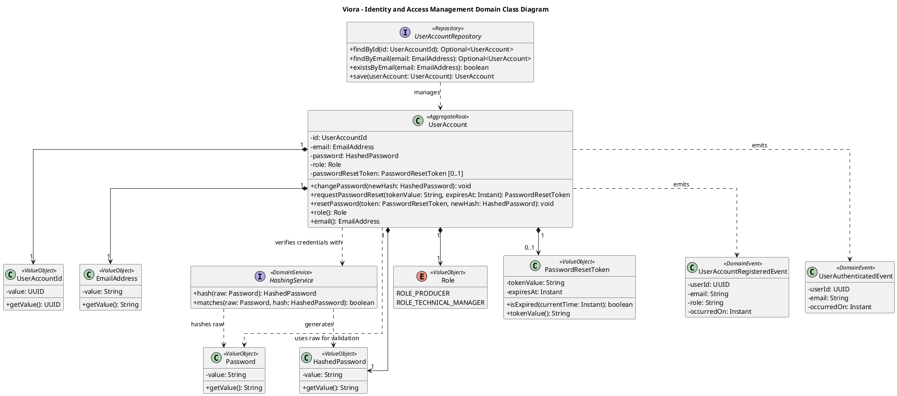
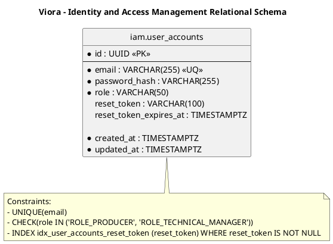

# Tactical-Level Domain-Driven Design: Identity and Access Management (IAM)

### Bounded Context: Identity and Access Management (IAM)

**Propósito:** Gestiona la autenticación, autorización y administración del ciclo de vida de las credenciales de acceso de la plataforma Viora. Es responsable de emitir y validar tokens de sesión JWT, salvaguardar las contraseñas bajo funciones criptográficas de derivación de claves con sal (salt + hash seguro), gestionar tokens efímeros para el restablecimiento de contraseñas y publicar eventos de seguridad hacia el contexto de perfiles de usuario y las aplicaciones clientes. Establece el perímetro de seguridad del sistema y provee los mecanismos de control de acceso basados en roles sin acoplarse a la lógica del dominio agronómico.

---

#### Domain Layer

En esta capa se modela la lógica pura de seguridad y gestión de cuentas, independiente de frameworks web o mecanismos de persistencia relacional. Comprende el agregado de cuenta de usuario, objetos de valor inmutables para correo y credenciales, servicios de validación de contraseñas, eventos de dominio e interfaces de persistencia.

##### Aggregates y Entities

###### UserAccount (Aggregate Root)
* **Propósito:** Representa la cuenta de acceso de un usuario en la plataforma y constituye la frontera de consistencia para autenticación, autorización y cambio de credenciales.
* **Atributos:**
  * `id: UserAccountId` (Identificador único de la cuenta / UUID)
  * `email: EmailAddress` (Dirección de correo electrónico única y validada)
  * `password: HashedPassword` (Contraseña almacenada bajo hash criptográfico)
  * `role: Role` (Rol de acceso asignado: `ROLE_PRODUCER`, `ROLE_TECHNICAL_MANAGER`)
  * `passwordResetToken: Optional<PasswordResetToken>` (Token efímero de recuperación de un solo uso)
* **Métodos:**
  * `changePassword(newPasswordHash: HashedPassword): void` - Actualiza de forma atómica el hash criptográfico de la credencial en el estado del agregado emitiendo `PasswordChangedEvent`.
  * `requestPasswordReset(tokenGenerator: TokenGenerator, expirationMinutes: int): PasswordResetToken` - Genera un token efímero con vigencia acotada de 15 minutos y dispara el evento para notificación por correo.
  * `resetPassword(tokenValue: String, newPasswordHash: HashedPassword): void` - Valida la vigencia y correspondencia del token de recuperación, aplica el nuevo hash de credencial e invalida el token consumido emitiendo `PasswordResetCompletedEvent`.
* **Invariantes y Reglas de Negocio:**
  1. El correo electrónico no puede ser nulo, debe cumplir con un formato RFC 5322 válido y debe ser único a nivel de todo el sistema.
  2. Las contraseñas en texto plano nunca se almacenan ni forman parte del estado persistente del agregado; solo se persiste su representación procesada mediante hash criptográfico con sal.
  3. Toda contraseña definida (en registro, cambio o restablecimiento) debe satisfacer obligatoriamente las políticas de complejidad del dominio: longitud entre 8 y 255 caracteres, combinación alfanumérica requerida y ausencia de espacios en blanco, siendo rechazada cualquier clave que incumpla este estándar mediante la validación intrínseca del Value Object `Password`.
  4. En operaciones de cambio de contraseña para sesiones autenticadas, la nueva credencial debe diferir obligatoriamente de la contraseña previa activa de la cuenta.
  5. Toda cuenta creada debe tener asignado obligatoriamente uno y solo un rol canónico de plataforma (`ROLE_PRODUCER`, `ROLE_TECHNICAL_MANAGER`).
  6. El token de restablecimiento de contraseña es estrictamente de un solo uso y su vigencia expira automáticamente tras 15 minutos desde su emisión.

##### Value Objects (Conceptuales e Inmutables)
* **`UserAccountId`**: Identificador único global fuertemente tipado encapsulando un valor `UUID` (o identificador numérico de cuenta).
* **`EmailAddress`**: Cadena inmutable validada bajo expresión regular de correo electrónico estándar; garantiza normalización a minúsculas y eliminación de espacios en blanco.
* **`Password`**: Encapsula la contraseña en texto plano en el límite de entrada y valida en su constructor las políticas intrínsecas de dominio (longitud entre 8 y 255 caracteres, combinación alfanumérica, no nula ni en blanco). Lanza excepción de dominio ante cualquier incumplimiento.
* **`HashedPassword`**: Encapsula el resultado inmutable de la función criptográfica devuelto por el servicio de hashing, impidiendo la asignación accidental de contraseñas en texto claro dentro del agregado o repositorio.
* **`Role`**: Enumeración inmutable que define los privilegios de acceso del sistema: `ROLE_PRODUCER`, `ROLE_TECHNICAL_MANAGER`.
* **`PasswordResetToken`**: Objeto inmutable compuesto por el valor pseudoaleatorio seguro del token (`tokenValue: String`) y su marca temporal de caducidad (`expiresAt: Instant`). Contiene el método `isExpired(currentTime: Instant): boolean`.

##### Repositories (Interfaces en Domain)
Contratos agnósticos de persistencia definidos en la capa de dominio:
* **`UserAccountRepository`**:
  * `findById(id: UserAccountId): Optional<UserAccount>`
  * `findByEmail(email: EmailAddress): Optional<UserAccount>`
  * `existsByEmail(email: EmailAddress): boolean`
  * `save(userAccount: UserAccount): UserAccount`

##### Domain Events
Eventos inmutables en tiempo pasado que señalan hitos de seguridad:
* **`UserAccountRegisteredEvent`**: `{ userAccountId: UUID, email: String, role: String, occurredOn: Instant }`
  * *Disparado cuando:* Se crea exitosamente una nueva cuenta de credenciales en la plataforma (habilita el posterior flujo de onboarding para la formalización del perfil civil tras su primer inicio de sesión).
* **`UserAuthenticatedEvent`**: `{ userAccountId: UUID, email: String, occurredOn: Instant }`
  * *Disparado cuando:* Un usuario completa una autenticación exitosa mediante credenciales válidas.
* **`UserSessionRefreshedEvent`**: `{ userAccountId: UUID, occurredOn: Instant }`
  * *Disparado cuando:* Se renueva de forma transparente la sesión de acceso mediante un token de actualización válido sin interrumpir al usuario en campo.
* **`UserAuthenticationFailedEvent`**: `{ email: String, reason: String, occurredOn: Instant }`
  * *Disparado cuando:* Falla un intento de autenticación por credencial incorrecta o inexistente.
* **`PasswordChangedEvent`**: `{ userAccountId: UUID, occurredOn: Instant }`
  * *Disparado cuando:* El usuario actualiza voluntariamente su contraseña de acceso tras validar su credencial previa.
* **`PasswordResetRequestedEvent`**: `{ userAccountId: UUID, email: String, tokenValue: String, expiresAt: Instant, occurredOn: Instant }`
  * *Disparado cuando:* Se genera una solicitud de recuperación (consumido por la infraestructura de mensajería para el despacho del correo).
* **`PasswordResetCompletedEvent`**: `{ userAccountId: UUID, email: String, occurredOn: Instant }`
  * *Disparado cuando:* Se concluye con éxito el restablecimiento de la contraseña con un token válido.

---

#### Interface Layer

Expone los puntos de entrada HTTP mediante controladores REST orientados a recursos y acciones canónicas sobre credenciales y sesiones, desacoplados de detalles internos del dominio.

##### Controllers (REST)
Alineados con los contratos oficiales del reporte (TS01, TS02, TS03) y con las User Stories funcionales de seguridad (US01 a US05), cuyas especificaciones técnicas complementarias:

* **`AuthController`** (Ruta base: `/api/v1/auth`):
  * `POST /api/v1/auth/sign-up` - Registro de nueva cuenta (`TS01`, `US01`). Retorna `201 Created` con `UserAccountResource`.
  * `POST /api/v1/auth/sign-in` - Autenticación con credenciales (`TS02`, `US02`). Retorna `200 OK` con `AuthenticatedUserResource` (Access Token, Refresh Token, perfil resumido).
  * `POST /api/v1/auth/refresh-tokens` - Renovación de tokens de sesión (`TS03`, `US02`). Retorna `200 OK` con par de tokens renovados.
  * `PATCH /api/v1/auth/passwords` - Cambio de contraseña del usuario autenticado (`TS36`, `US04`). Retorna `204 No Content`.
  * `POST /api/v1/auth/password-reset-tokens` - Solicitud de token temporal de restablecimiento por correo (`TS37`, `US05`). Retorna `202 Accepted`.
  * `PUT /api/v1/auth/password-reset-tokens/{token}` - Consumo del token temporal y definición de nueva contraseña (`TS38`, `US05`). Retorna `204 No Content`.

##### Resources (DTOs / Request & Response Models)
* **`SignUpRequest`**: `{ email: String, password: String, role: String }`
* **`SignInRequest`**: `{ email: String, password: String }`
* **`RefreshTokenRequest`**: `{ refreshToken: String }`
* **`ChangePasswordRequest`**: `{ currentPassword: String, newPassword: String }`
* **`CreatePasswordResetTokenRequest`**: `{ email: String }`
* **`ConfirmPasswordResetRequest`**: `{ newPassword: String }`
* **`UserAccountResource`**: `{ id: UUID, email: String, role: String }`
* **`AuthenticatedUserResource`**: `{ id: UUID, email: String, role: String, token: String, refreshToken: String }`

##### Assemblers / Mappers
* **`UserAccountResourceFromEntityAssembler`**: Mapea el Aggregate `UserAccount` hacia el DTO `UserAccountResource`.
* **`SignUpCommandFromResourceAssembler`**: Transforma el payload `SignUpRequest` en `RegisterUserAccountCommand`.
* **`SignInCommandFromResourceAssembler`**: Transforma el payload `SignInRequest` en `AuthenticateUserCommand`.
* **`RefreshTokenCommandFromResourceAssembler`**: Transforma el payload `RefreshTokenRequest` en `RefreshUserSessionCommand`.
* **`ChangePasswordCommandFromResourceAssembler`**: Transforma `ChangePasswordRequest` en `ChangeUserPasswordCommand`.
* **`CreatePasswordResetTokenCommandFromResourceAssembler`**: Transforma `CreatePasswordResetTokenRequest` en `RequestPasswordResetCommand`.
* **`ConfirmPasswordResetCommandFromResourceAssembler`**: Transforma `ConfirmPasswordResetRequest` junto al parámetro de ruta `token` en `ResetUserPasswordCommand`.

---

#### Application Layer

Orquesta los casos de uso de seguridad, gestiona los límites transaccionales de cada comando, delega en servicios de dominio y despacha eventos a componentes locales o asíncronos.

##### Outbound Ports (Servicios de Aplicación)
* **`HashingService`**: Puerto de salida que define los contratos de hashing criptográfico seguro:
  * `encode(rawPassword: Password): HashedPassword`
  * `matches(rawPassword: String, encodedPassword: HashedPassword): boolean`
* **`TokenProvider`**: Puerto para la emisión, validación y extracción de claims de tokens JWT de sesión.
* **`EmailDeliveryAdapter`**: Puerto para el despacho asíncrono de correos transaccionales con plantillas dinámicas (Brevo).

##### Command Handlers
* **`RegisterUserAccountCommandHandler`**:
  * *Entrada:* `RegisterUserAccountCommand` (corresponde a `CMD01`)
  * *Flujo:* Valida el formato del correo y comprueba su inexistencia en `UserAccountRepository` -> construye el Value Object `Password` (validando las reglas intrínsecas de longitud y complejidad) -> genera el hash criptográfico mediante `hashingService.encode(password)` -> instancia el Aggregate `UserAccount` con el `HashedPassword` resultante -> persiste la cuenta -> publica `UserAccountRegisteredEvent`.
* **`AuthenticateUserCommandHandler`**:
  * *Entrada:* `AuthenticateUserCommand` (corresponde a `CMD02`)
  * *Flujo:* Busca la cuenta por correo en `UserAccountRepository` -> valida la coincidencia criptográfica mediante `hashingService.matches(command.rawPassword, userAccount.getPassword())` -> emite el par de tokens JWT mediante `TokenProvider` -> publica `UserAuthenticatedEvent` (o `UserAuthenticationFailedEvent` si las credenciales no coinciden).
* **`RefreshUserSessionCommandHandler`**:
  * *Entrada:* `RefreshUserSessionCommand` (corresponde a `CMD03`)
  * *Flujo:* Valida la integridad y caducidad del refresh token -> extrae el identificador de cuenta -> comprueba la vigencia de la cuenta -> emite un nuevo access token -> publica `UserSessionRefreshedEvent`.
* **`ChangeUserPasswordCommandHandler`**:
  * *Entrada:* `ChangeUserPasswordCommand` (corresponde a `CMD04`)
  * *Flujo:* Carga la cuenta del usuario autenticado -> comprueba la contraseña actual mediante `hashingService.matches(command.currentPassword, userAccount.getPassword())` -> construye el Value Object `Password` validando la nueva clave -> genera `newHash = hashingService.encode(newPassword)` -> ejecuta `userAccount.changePassword(newHash)` -> persiste cambios -> publica `PasswordChangedEvent`.
* **`RequestPasswordResetCommandHandler`**:
  * *Entrada:* `RequestPasswordResetCommand` (corresponde a `CMD05`)
  * *Flujo:* Busca la cuenta por correo -> genera el token efímero de 15 minutos en el agregado `UserAccount` (`PasswordResetToken`) -> persiste el token efímero -> publica `PasswordResetRequestedEvent`.
* **`ResetUserPasswordCommandHandler`**:
  * *Entrada:* `ResetUserPasswordCommand` (corresponde a `CMD06`)
  * *Flujo:* Carga la cuenta asociada al token -> construye el Value Object `Password` con la nueva clave -> genera `newHash = hashingService.encode(newPassword)` -> ejecuta `userAccount.resetPassword(token, newHash)` (invalida el token) -> persiste cambios -> publica `PasswordResetCompletedEvent`.

##### Query Handlers
* **`GetUserAccountByIdQueryHandler`**: Resuelve `GetUserAccountByIdQuery` obteniendo el agregado y transformándolo en `UserAccountResource`.
* **`GetUserAccountByEmailQueryHandler`**: Resuelve consultas internas de existencia o verificación por correo electrónico.

##### Event Handlers
* **`OnPasswordResetRequestedEventHandler`**:
  * *Disparador:* Escucha `PasswordResetRequestedEvent` (`EV06`).
  * *Acción:* Invoca el adaptador de correo transaccional (`EmailDeliveryAdapter`) enviando el enlace formateado con el token de recuperación mediante la API de Brevo.

---

#### Infrastructure Layer

Implementa la persistencia física en PostgreSQL mediante Spring Data JPA, la generación criptográfica de tokens JWT, los filtros de seguridad de Spring Security y el adaptador para envíos de correo mediante Brevo.

##### 1. Paquetes y componentes principales
* **Persistence:**
  * `UserAccountJpaRepository`: Interfaz Spring Data JPA que extiende `JpaRepository<UserAccountJpaEntity, UUID>` para operaciones relacionales básicas y consultas derivadas.
  * `JpaUserAccountRepositoryAdapter`: Adaptador de repositorio con `@Repository` que implementa la interfaz de puerto de dominio `UserAccountRepository`, delegando en `UserAccountJpaRepository` y mapeando mediante `UserAccountEntityMapper`.
  * `UserAccountJpaEntity`: Entidad mapeada mediante anotaciones JPA (`@Entity`, `@Table(name = "user_accounts")`).
  * `UserAccountEntityMapper`: Ensamblador bidireccional entre el Aggregate `UserAccount` y `UserAccountJpaEntity`.
* **Security / Crypto:**
  * `BCryptPasswordService`: Implementa las interfaces de hash y verificación de contraseñas usando `BCryptPasswordEncoder` con factor de costo 12.
* **Auth:**
  * `JwtTokenProvider`: Genera, firma con algoritmo HMAC-SHA256 y parsea access tokens (vigencia de 15 minutos conforme a `TS02`) y refresh tokens de sesión duradera con rotación (vigencia de 30 días conforme a `TS03`).
  * `JwtAuthenticationFilter`: Filtro HTTP que intercepta cabeceras `Authorization: Bearer <token>`, valida el token y establece el contexto de seguridad en `SecurityContextHolder`.
* **Adapters / External Services:**
  * `BrevoEmailDeliveryAdapter`: Implementa el puerto de envío de correos transaccionales hacia la API REST de Brevo para entrega de plantillas de recuperación de contraseña.
* **Events:**
  * `SpringEventPublisher`: Publica eventos de dominio en el bus interno de la aplicación mediante `ApplicationEventPublisher`.
* **Configuration:**
  * `IamJpaConfig`: Configura la persistencia transaccional y auditoría JPA para la tabla de cuentas.
  * `SecurityConfig`: Declara la cadena de filtros de seguridad (`SecurityFilterChain`), desactiva CSRF para endpoints sin estado, configura CORS y restringe acceso anónimo únicamente a las rutas bajo `/api/v1/auth/**`.

##### 2. Modelo de datos y mapeos
Estructura relacional en PostgreSQL para la tabla de cuentas de usuario:

* **Tabla: `user_accounts`**
  ```sql
  CREATE TABLE user_accounts (
      id                       UUID PRIMARY KEY,
      email                    VARCHAR(255) NOT NULL,
      password_hash            VARCHAR(255) NOT NULL,
      role                     VARCHAR(50)  NOT NULL,
      reset_token              VARCHAR(100),
      reset_token_expires_at   TIMESTAMPTZ,
      created_at               TIMESTAMPTZ  NOT NULL,
      updated_at               TIMESTAMPTZ  NOT NULL
  );
  ```
* **Índices y Restricciones:**
  * Índice único en correo: `CREATE UNIQUE INDEX uq_user_accounts_email ON user_accounts(LOWER(email));`
  * Restricción de verificación en rol: `CHECK (role IN ('ROLE_PRODUCER', 'ROLE_TECHNICAL_MANAGER'))`

* **Mapeo Entity <-> Persistencia:**
  * Dominio -> DB: `userAccount.getId().getValue() -> jpaEntity.setId()`, `userAccount.getEmail().getValue() -> jpaEntity.setEmail()`, aplanando el objeto de valor de token efímero en columnas directas `reset_token` y `reset_token_expires_at`.
  * DB -> Dominio: Reconstrucción del agregado invocando su método factoría privado sin disparar eventos de registro.

##### 3. Repositories – Implementación
* **`JpaUserAccountRepositoryAdapter`**:
  * Implementa `UserAccountRepository` del Domain Layer inyectando `UserAccountJpaRepository`.
  * Ejecuta consultas derivadas sobre Spring Data JPA como `findByEmailIgnoreCase(String email)`.
  * Gestiona transacciones acotadas con `@Transactional(readOnly = true)` en consultas y `@Transactional` en modificaciones.
  * Emplea control de concurrencia optimista para evitar sobrescrituras de tokens simultáneas.

##### 4. Seguridad & Resiliencia
* **Cifrado y Hashing:** Las contraseñas se almacenan procesadas mediante BCrypt con sal generada de forma aleatoria por credencial. La clave secreta de firma para tokens JWT se inyecta desde variables de entorno seguras (`JWT_SECRET_KEY`).
* **Ciclo de Vida de Tokens:** Access tokens de vida corta (15 min conforme a `TS02`) para mitigar ventanas de compromiso; refresh tokens almacenados con rotación y revocación (30 días conforme a `TS03`) ante cambio de credencial o cierre de sesión explícito.
* **Auditoría Inmutable:** Registro riguroso de marcas temporales de creación y modificación en UTC (`created_at`, `updated_at`).

---

#### Bounded Context Software Architecture Component Level Diagrams

##### 1. Descomposición de Componentes por Capa
* **Interface / API Layer:** `AuthController` recibe y valida las solicitudes HTTP de registro (`sign-up`), inicio de sesión (`sign-in`), renovación de tokens (`refresh-tokens`), actualización de contraseñas (`passwords`), creación de tokens de restablecimiento (`password-reset-tokens`) y consumo de token para actualización de credencial (`password-reset-tokens/{token}`).
* **Application Layer:** `RegisterUserAccountCommandHandler`, `AuthenticateUserCommandHandler`, `RefreshUserSessionCommandHandler`, `ChangeUserPasswordCommandHandler`, `RequestPasswordResetCommandHandler` y `ResetUserPasswordCommandHandler` orquestan los flujos de seguridad y coordinan las transacciones y eventos.
* **Domain Layer:** El Aggregate Root `UserAccount` salvaguarda las invariantes de las credenciales; los Value Objects `Password` y `HashedPassword` garantizan la solidez intrínseca y el encapsulamiento criptográfico, y `UserAccountRepository` define los contratos de persistencia.
* **Infrastructure Layer:** `JpaUserAccountRepositoryAdapter` interactúa con la base de datos mediante Spring Data JPA (`UserAccountJpaRepository`); `JwtTokenProvider` gestiona el cifrado y validación de tokens JWT; `BCryptPasswordService` implementa `HashingService` para la derivación con sal; `BrevoEmailDeliveryAdapter` conecta con la API externa de Brevo para la entrega de correos.

##### 2. Flujo de Comunicación y Conectividad
1. **Entrada:** El cliente móvil envía una solicitud HTTP `POST /api/v1/auth/sign-in` con correo y contraseña en el cuerpo JSON (`SignInRequest`).
2. **Transformación:** `AuthController` valida la estructura del payload, construye un `AuthenticateUserCommand` mediante su Assembler y lo delega a `AuthenticateUserCommandHandler`.
3. **Orquestación de Dominio:** El handler invoca a `UserAccountRepository` para recuperar la cuenta asociada al correo normalizado.
4. **Verificación de Reglas:** Si la cuenta existe, el handler valida la coincidencia criptográfica invocando `hashingService.matches(rawPassword, userAccount.getPassword())`.
5. **Generación de Tokens:** Al comprobarse la coincidencia, el handler solicita a `JwtTokenProvider` la creación de un access token y un refresh token incorporando los claims de rol y el identificador de cuenta.
6. **Publicación de Eventos:** Se dispara el evento `UserAuthenticatedEvent` en el bus de eventos de la aplicación para fines de auditoría.
7. **Respuesta:** El controlador empaqueta los tokens en un `AuthenticatedUserResource` y devuelve la respuesta HTTP `200 OK` al cliente móvil.

---

#### Bounded Context Software Architecture Code Level Diagrams

##### Bounded Context Domain Layer Class Diagrams

##### 1. Estructura de Clases y Estereotipos
* **`UserAccount` (Aggregate Root):**
  * *Atributos Privados (`-`):* `- id: UserAccountId`, `- email: EmailAddress`, `- password: HashedPassword`, `- role: Role`, `- passwordResetToken: PasswordResetToken` (opcional).
  * *Métodos Públicos (`+`):*
    * `+ changePassword(newHash: HashedPassword): void`: Valida la no repetición y actualiza el hash de la contraseña emitiendo `PasswordChangedEvent`.
    * `+ requestPasswordReset(tokenValue: String, expiresAt: Instant): PasswordResetToken`: Genera el token efímero de recuperación con vigencia de 15 minutos emitiendo `PasswordResetRequestedEvent`.
    * `+ resetPassword(token: PasswordResetToken, newHash: HashedPassword): void`: Verifica la validez del token proporcionado, actualiza la credencial e invalida el token consumido emitiendo `PasswordResetCompletedEvent`.
* **`UserAccountId` (Value Object):** Encapsula el valor inmutable `UUID` identificador de la cuenta (`- value: UUID`, `+ getValue(): UUID`).
* **`EmailAddress` (Value Object):** Encapsula y valida la dirección de correo normalizada (`- value: String`, `+ getValue(): String`).
* **`Password` (Value Object):** Encapsula la clave en texto claro validando en su constructor las reglas intrínsecas de complejidad (longitud entre 8 y 255 caracteres, alfanumérico).
* **`HashedPassword` (Value Object):** Encapsula el hash criptográfico inmutable generado por el servicio de hashing (`- value: String`, `+ getValue(): String`).
* **`Role` (Value Object / Enum):** Define las constantes de privilegios del sistema: `ROLE_PRODUCER`, `ROLE_TECHNICAL_MANAGER`.
* **`PasswordResetToken` (Value Object):** Encapsula el token temporal de restablecimiento (`- tokenValue: String`, `- expiresAt: Instant`, `+ isExpired(currentTime: Instant): boolean`).
* **`UserAccountRepository` (Interface):** Contrato de persistencia en dominio:
  * `+ findById(id: UserAccountId): Optional<UserAccount>`
  * `+ findByEmail(email: EmailAddress): Optional<UserAccount>`
  * `+ existsByEmail(email: EmailAddress): boolean`
  * `+ save(userAccount: UserAccount): UserAccount`

##### 2. Relaciones y Conectividad entre Clases
* **Composición y Cardinalidad (`1 *-->`):**
  * `UserAccount "1" *--> "1" UserAccountId`: Todo agregado posee obligatoriamente una identidad única universal.
  * `UserAccount "1" *--> "1" EmailAddress`: Todo usuario tiene exactamente una dirección de correo válida.
  * `UserAccount "1" *--> "1" HashedPassword`: Toda cuenta almacena un hash seguro de clave.
  * `UserAccount "1" *--> "1" Role`: Toda cuenta cuenta con un rol de autorización canónico asignado.
  * `UserAccount "1" *--> "0..1" PasswordResetToken`: La cuenta contiene cero o a lo sumo un token de recuperación activo en un momento dado.
* **Dependencia de Repositorio (`..>`):** La interfaz `UserAccountRepository ..> UserAccount` gestiona exclusivamente instancias del agregado raíz.
* **Independencia y Conexión hacia otros Bounded Contexts:** IAM no posee dependencias entrantes de ningún otro contexto del sistema; actúa como proveedor de seguridad aguas arriba (*Upstream*) frente a **User Profiles** y los demás módulos. Se comunica hacia el exterior exclusivamente mediante la emisión de eventos de dominio inmutables (`UserAccountRegisteredEvent`, `UserAuthenticatedEvent`), permitiendo que el contexto de perfiles vincule e inicialice la información civil mediante referencia lógica por ID (`UserId`), sin acoplamiento físico ni binario entre contextos.

##### Bounded Context Database Design Diagram

##### 1. Tablas y Estructura de Claves
* **Tabla Principal: `user_accounts`**
  * `id` (UUID, Primary Key): Identificador único de la cuenta.
  * `email` (VARCHAR(255), NOT NULL, UNIQUE): Dirección de correo normalizada.
  * `password_hash` (VARCHAR(255), NOT NULL): Hash BCrypt de la contraseña.
  * `role` (VARCHAR(50), NOT NULL): Rol de autorización en el sistema (`ROLE_PRODUCER`, `ROLE_TECHNICAL_MANAGER`).
  * `reset_token` (VARCHAR(100), NULL): Token efímero de recuperación de contraseña.
  * `reset_token_expires_at` (TIMESTAMPTZ, NULL): Fecha y hora límite para uso del token de recuperación.
  * `created_at` (TIMESTAMPTZ, NOT NULL): Marca temporal de registro de la cuenta.
  * `updated_at` (TIMESTAMPTZ, NOT NULL): Marca temporal de última modificación.

##### 2. Relaciones y Cardinalidad Relacional
* **Entidad Autónoma y Origen de Identidad:** La tabla `user_accounts` no posee claves foráneas que apunten a tablas de otros contextos, preservando la independencia absoluta del módulo de identidad y actuando como raíz de autenticación para la plataforma.
* **Relación Lógica 1 a 1 con User Profiles:** La tabla `profiles` del Bounded Context downstream almacena `user_id UUID` como referencia externa lógica hacia `user_accounts.id`. Se mantiene una relación biunívoca (1 a 1) sin restricción física `FOREIGN KEY` a nivel de base de datos para preservar la modularidad de esquemas y la independencia de despliegue.
* **Aplanamiento de Value Objects:** Los objetos de valor `EmailAddress`, `HashedPassword`, `Role` y el opcional `PasswordResetToken` se aplanan directamente como columnas en la tabla `user_accounts`, sin requerir tablas de unión adicionales.

##### 3. Índices y Reglas de Integridad
* **Índice Único:** `uq_user_accounts_email` sobre `LOWER(email)` para garantizar unicidad insensible a mayúsculas.
* **Restricciones CHECK:** Verificación de pertenencia para la columna `role` (`ROLE_PRODUCER`, `ROLE_TECHNICAL_MANAGER`).

---

### Anexo de Diagramas como Código (3 Herramientas)

#### 1. Structurizr DSL (C4 Model - Component Level)

```structurizr
workspace "Viora - IAM Component Architecture" "Identity and Access Management Component View" {
    model {
        producer = person "Olive Producer" "Manages credentials and signs in."
        manager = person "Technical Manager" "Manages credentials and signs in."
        brevo = softwareSystem "Brevo Email API" "External transactional email delivery."

        viora = softwareSystem "Viora Platform" {
            backend = container "Modular Backend API" "Spring Boot core service" "Java / Spring Boot" {
                authController = component "AuthController" "Exposes authentication and password reset REST endpoints" "Spring MVC Controller"
                
                userCommandService = component "UserAccountCommandService" "Coordinates write commands (sign-up, sign-in, tokens, resets)" "Spring Service / Command Service"
                userQueryService = component "UserAccountQueryService" "Handles credential verification and session lookup queries" "Spring Service / Query Service"
                
                bcryptHasher = component "BCryptPasswordHasher" "Hashes and verifies passwords with salt" "Domain Service / Spring Security Crypto"
                jwtTokenProvider = component "JwtTokenProvider" "Generates and validates JWT tokens with role claims" "Security Component / Nimbus"
                userRepo = component "UserAccountRepository" "Domain repository interface for user accounts persistence" "Domain Port / Interface"
                userRepoAdapter = component "JpaUserAccountRepositoryAdapter" "PostgreSQL Spring Data JPA implementation for user accounts" "Spring Data JPA Adapter"
                emailAdapter = component "BrevoEmailDeliveryAdapter" "Dispatches transactional emails via Brevo REST API" "HTTP Client Adapter"
            }
            db = container "Viora Database" "PostgreSQL Relational Store" "PostgreSQL" {
                tags "Database"
            }
        }

        producer -> authController "Authenticates / resets password [HTTPS/REST]"
        manager -> authController "Authenticates / resets password [HTTPS/REST]"
        
        authController -> userCommandService "Delegates write operations (commands)"
        authController -> userQueryService "Delegates read operations (queries)"
        
        userCommandService -> bcryptHasher "Hashes / matches passwords with salt"
        userCommandService -> jwtTokenProvider "Emits / validates JWT tokens"
        userCommandService -> userRepo "Loads / persists user accounts via domain port"
        userCommandService -> emailAdapter "Envia emails de verificación y reseteo"
        
        userQueryService -> userRepo "Fetches user accounts via domain port"
        
        emailAdapter -> brevo "Sends reset token email [HTTPS/REST]"
        userRepoAdapter -> userRepo "Implements persistence contract"
        userRepoAdapter -> db "CRUD operations on iam.user_accounts [JDBC/JPA]"
    }
    views {
        component backend "IamComponentView" "IAM Component Architecture" {
            include *
            autoLayout lr
        }

        styles {
            element "Database" {
                shape Cylinder
                background #1168bd
                color #ffffff
            }
        }

        theme default
    }
}
```

#### 2. PlantUML (Domain Layer Class Diagram)



#### 3. PlantUML (Database Relational Diagram - ERD)



