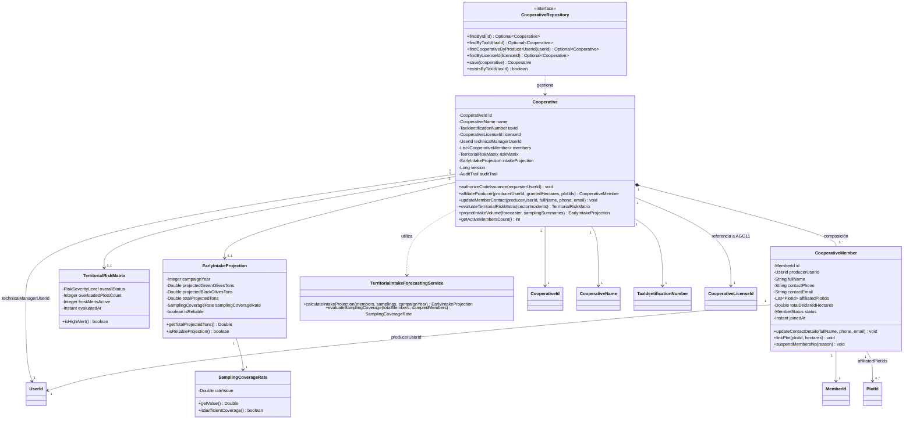
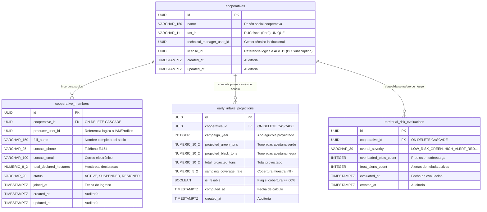
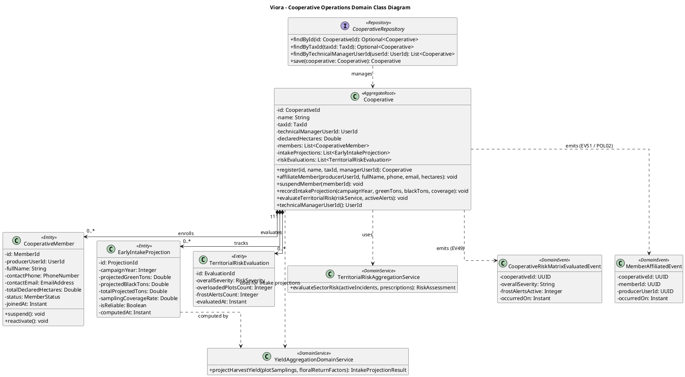
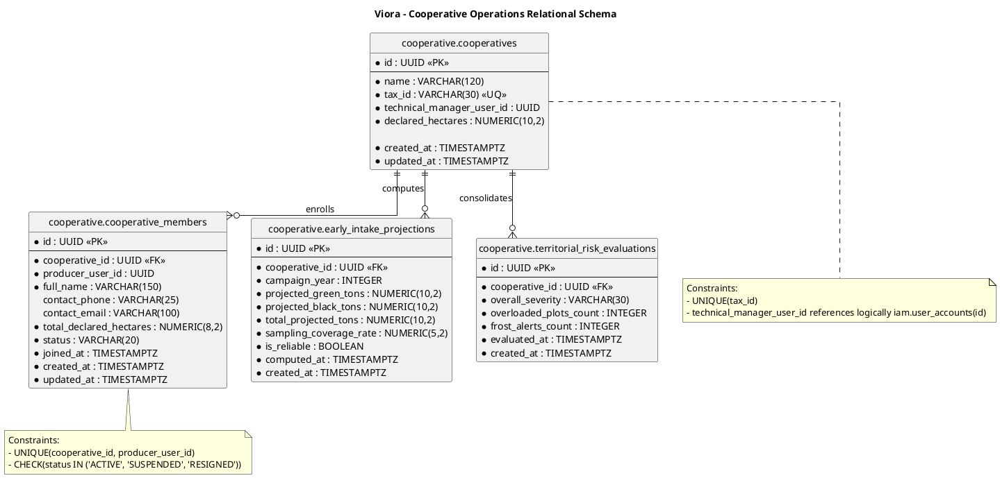

# Tactical-Level Domain-Driven Design: Cooperative Operations and Territorial Intelligence

---

### Bounded Context: Cooperative Operations and Territorial Intelligence (Cooperative Operations)

**Propósito:** El Bounded Context de **Cooperative Operations and Territorial Intelligence** (denominado comúnmente *Cooperative Operations* o *Territory*) es un subdominio de soporte (*Supporting Subdomain*) del negocio de Viora, responsable de la gestión gremial corporativa, la administración del padrón de socios olivareros, la autorización de qué gestores técnicos pueden solicitar la emisión de lotes de códigos corporativos de invitación a *Subscription & Cooperative Membership*, la consolidación del semáforo territorial de riesgos fisiológicos y agroclimáticos por sectores agroecológicos de la cuenca territorial, y el cómputo dinámico de la proyección temprana de volumen de acopio asociativo de aceituna verde (conserva) y aceituna negra (mesa/almazara).

> **Delimitación respecto del licenciamiento corporativo.** La custodia del contrato corporativo y el ciclo de vida de los códigos de invitación **no residen en este contexto**: viven en *Subscription & Cooperative Membership* bajo los agregados `CooperativeLicense` (`AGG11`) e `InvitationCodeBatch` (`AGG12`). La razón es que, en el instante de emitir un lote, los productores destinatarios todavía no son socios ni están suscritos, de modo que el cupo no puede validarse contra el padrón de esta cooperativa. Este contexto conserva la potestad de **autorizar quién** solicita una emisión, y consume el resultado del canje para dar de alta al socio en su padrón.

Técnica y agronómicamente, resuelve la incertidumbre logística, financiera y comercial de las asociaciones y cooperativas olivareras, permitiéndoles anticipar con meses de antelación la capacidad requerida en tanques de salmuera, cuadrillas de transporte y contratos de exportación. Mantiene una delimitación semántica estricta aislando los modelos gremiales de los detalles prediales individuales: referencia de forma débil por identificador inmutable (`UserId`) a los socios en *User Profiles* e *IAM*, y por identidad lógica (`PlotId`) a los cuarteles de *Olive Orchard & Plot Management*. Actúa como consumidor de eventos de telemetría, sobrecarga frutal y muestreos de campo provenientes de *Crop Load Regulation & Thinning Advisory* y *Agroclimatic Telemetry & Sensor Monitoring*, traduciendo múltiples vocabularios foráneos a su propio modelo unificado territorial mediante una capa de anticorrupción (ACL).

---

#### Domain Layer

En esta capa se modela la lógica de negocio pura, independiente de frameworks, infraestructura o mecanismos de persistencia. Comprende Aggregates, Entities, Value Objects, Domain Services, Domain Events e interfaces de Repositorios.

##### Aggregates y Entities

###### Cooperative (Aggregate Root)
* **Propósito:** Agregado raíz que delimita la frontera de consistencia transaccional para la cooperativa u organización agraria, gobierna el padrón unificado de socios olivareros, autoriza qué gestores técnicos pueden solicitar la emisión de códigos corporativos, consolida el semáforo de riesgo sectorial y computa las proyecciones agregadas de cosecha.
* **Atributos:**
  * `id: CooperativeId` (Identificador único universal / UUID v4)
  * `name: CooperativeName` (Value Object: razón social y denominación comercial de la cooperativa)
  * `taxId: TaxIdentificationNumber` (Value Object: registro tributario oficial, RUC en Perú)
  * `licenseId: CooperativeLicenseId` (Referencia débil por identidad al agregado `CooperativeLicense` (`AGG11`) que custodia el contrato corporativo en *Subscription & Cooperative Membership*; este contexto no lee ni muta su cupo)
  * `technicalManagerUserId: UserId` (Identificador del Gestor Técnico institucional único responsable de la cooperativa, resuelto mediante los claims de su token JWT con rol `ROLE_GESTOR_COOPERATIVA`)
  * `members: List<CooperativeMember>` (Colección interna subordinada de socios productores agremiados)
  * `riskMatrix: TerritorialRiskMatrix` (Value Object: estado consolidado del semáforo de riesgo por sectores agroecológicos)
  * `intakeProjection: EarlyIntakeProjection` (Value Object: proyección vigente de acopio en toneladas para aceituna verde y negra)
  * `auditTrail: AuditTrail` (Value Object: marcas temporales inmutables `createdAt`, `updatedAt`)
* **Métodos:**
  * `authorizeCodeIssuance(requesterUserId: UserId): void` - Verifica que el gestor técnico solicitante coincida con `technicalManagerUserId` y que la cooperativa esté operativa, habilitando así que *Subscription & Cooperative Membership* procese la emisión del lote (`US08` / `CMD11`). **No valida cupo ni genera códigos**: la disponibilidad de plazas y superficie se evalúa contra los acumuladores de `CooperativeLicense` (`AGG11`) dentro de aquel contexto.
  * `affiliateProducer(producerUserId: UserId, grantedHectares: Double, plotIds: List<PlotId>): CooperativeMember` - Procesa la afiliación formal de un socio por reacción al canje de un código corporativo (`POL02` / `EV13`), crea e incorpora la entidad `CooperativeMember` al padrón e incrementa el contador de socios activos. **No inspecciona ni transiciona el código**: la validez y el cambio a `REDEEMED` ocurrieron dentro del límite transaccional de `InvitationCodeBatch` (`AGG12`), y el evento `EV13` es la prueba de que el canje prosperó. La operación es idempotente frente a reentregas del evento.
  * `updateMemberContact(producerUserId: UserId, newFullName: String, newPhone: String, newEmail: String): void` - Sincroniza los datos personales y de contacto del socio en el padrón técnico ante mutaciones de perfil en el upstream (`POL03` / `EV09`).
  * `evaluateTerritorialRiskMatrix(sectorIncidents: List<SectorIncidentSnapshot>): TerritorialRiskMatrix` - Procesa y sintetiza los incidentes agroclimáticos de helada (`POL14` / `EV25`), anomalías de frío de El Niño y alertas de sobrecarga frutal (`POL13` / `EV40`), actualizando los cuadrantes del semáforo sectorial (verde, amarillo, rojo) y encolando `CooperativeRiskMatrixEvaluatedEvent` (EV49) (`CMD31` / `US31`).
  * `projectIntakeVolume(forecaster: TerritorialIntakeForecastingService, samplingSummaries: List<PlotSamplingSummary>): EarlyIntakeProjection` - Invoca el servicio de dominio entregando las coberturas muestrales de los socios (`POL15` / `EV37` / `CMD32` / `US32`). Si la representatividad muestral del padrón es menor al $60\%$, encola obligatoriamente `LowSamplingCoverageWarnedForIntakeEvent` (EV51) con un factor de castigo en el margen de confianza; computa las toneladas agregadas de aceituna verde y negra y encola `CooperativeIntakeVolumeProjectedEvent` (EV50).
  * `getActiveMembersCount(): int` - Retorna la cantidad de socios en estado activo en el padrón.
* **Invariantes y Reglas de Negocio:**
  1. **Autorización Institucional de Emisión:** Solo el gestor técnico institucional registrado (`technicalManagerUserId`) con rol `ROLE_GESTOR_COOPERATIVA` puede solicitar la emisión de un lote de códigos en nombre de la cooperativa. Esta invariante gobierna **quién** solicita, nunca **cuántos** códigos se emiten: el límite cuantitativo es invariante de `CooperativeLicense` (`AGG11`) y se verifica en *Subscription & Cooperative Membership*.
  2. **Unicidad del Socio en el Padrón:** Un mismo `producerUserId` no puede figurar más de una vez como socio activo del padrón, con independencia de cuántos eventos de canje se reciban para él.
  3. **Umbral Crítico de Representatividad Muestral (60%):** La proyección de acopio territorial exige que al menos el $60.0\%$ de los socios activos del padrón cuenten con muestreos de campo concluidos. Si la cobertura es inferior ($<60\%$), el sistema restringe la confiabilidad de la proyección y emite forzosamente una advertencia de riesgo de muestreo (`EV51`).
  4. **Anonimización y Agregación Territorial:** Los datos de rendimiento y superficie de parcelas individuales se procesan de forma anónima y agregada por subcuencas/sectores, impidiendo la exposición de datos productivos privados entre socios competidores.
  5. **Consistencia en la Segregación Comercial de Aceituna:** En toda proyección o conciliación de acopio, la masa total estimada debe corresponder exactamente a la sumatoria de aceituna verde para conserva y aceituna negra para almazara o mesa ($\hat{Y}_{\text{total}} = \hat{Y}_{\text{verde}} + \hat{Y}_{\text{negra}}$).

###### CooperativeMember (Entity Interna de Cooperative)
* **Propósito:** Modela el registro formal de un productor olivarero socio dentro del padrón técnico de la cooperativa.
* **Atributos:**
  * `id: MemberId` (Identificador único local del socio / UUID)
  * `producerUserId: UserId` (Referencia lógica foránea inmutable por ID al usuario en *IAM* y *User Profiles*)
  * `fullName: String` (Nombre y apellidos del productor agremiado)
  * `contactPhone: String` (Número telefónico validado internacionalmente bajo E.164)
  * `contactEmail: String` (Correo electrónico de notificación técnica)
  * `affiliatedPlotIds: List<PlotId>` (Colección de identificadores lógicos de parcelas aportadas a la cooperativa)
  * `totalDeclaredHectares: Double` (Superficie total olivarera declarada en hectáreas)
  * `joinedAt: Instant` (Marca temporal UTC de ingreso a la organización)
  * `status: MemberStatus` (Value Object / Enum: `ACTIVE`, `SUSPENDED`, `RESIGNED`)
* **Métodos:**
  * `updateContactDetails(fullName: String, phone: String, email: String): void` - Actualiza los datos de contacto sincronizados desde *User Profiles*.
  * `linkPlot(plotId: PlotId, hectares: Double): void` - Registra una nueva parcela aportada al acopio de la cooperativa.
  * `suspendMembership(reason: String): void` - Transiciona el estado a `SUSPENDED` inhabilitando el acceso a beneficios cooperativos.

##### Value Objects (Conceptuales e Inmutables)
* **`CooperativeId` / `MemberId` / `CooperativeLicenseId` / `UserId` / `PlotId`**: Identificadores inmutables basados en UUID v4 con validación de no nulidad.
* **`CooperativeName`**: Cadena inmutable no vacía que representa la denominación gremial oficial (mínimo 3 caracteres, máximo 150).
* **`TaxIdentificationNumber` (RUC)**: Registro fiscal inmutable de 11 dígitos numéricos validado con dígito verificador para personas jurídicas en Perú.
* **`TerritorialRiskMatrix`**: Encapsula el estado del semáforo sectorial consolidado por zonas agroecológicas y permite la geolocalización por coordenadas (`US12`):
  * `overallStatus: RiskSeverityLevel` (`LOW_RISK_GREEN`, `MODERATE_WARNING_YELLOW`, `HIGH_ALERT_RED`).
  * `sectorRisks: Map<SectorZone, SectorRiskDetail>` (Mapeo de riesgos por sector: *Sector Valle Bajo*, *Sector Valle Medio*, *Sector Costa*, *Sector Litoral*).
  * `overloadedPlotsCount: Integer` (Cantidad de predios socios con alerta roja de sobrecarga frutal).
  * `evaluatedAt: Instant` (Marca temporal de la evaluación).
  * `locateSectorByCoordinates(latitude: Double, longitude: Double): Optional<SectorZone>` (Resuelve el sector geográfico donde se encuentra el asesor técnico con el GPS del móvil, resaltando visualmente el semáforo y las alertas activas de esa zona).
* **`EarlyIntakeProjection`**: Encapsula los volúmenes agregados estimados para la campaña agrícola:
  * `campaignYear: Integer` (Año de cosecha proyectado).
  * `projectedGreenOlivesTons: Double` (Toneladas proyectadas de aceituna verde para conserva).
  * `projectedBlackOlivesTons: Double` (Toneladas proyectadas de aceituna negra para almazara o mesa).
  * `totalProjectedTons: Double` (Suma consolidada de aceituna proyectada).
  * `samplingCoverageRate: SamplingCoverageRate` (Porcentaje de cobertura muestral del padrón).
  * `isReliable: boolean` (Indicador de robustez estadística: verdadero si $Coverage \ge 60\%$).
* **`SamplingCoverageRate`**: Decimal inmutable en rango $[0.00, 100.00]\%$ que cuantifica el porcentaje de socios activos que han reportado muestreos en campo válidos.
* **`SectorZone`**: Enum inmutable que delimita los sectores agroecológicos del territorio olivarero: `SECTOR_VALLE_BAJO`, `SECTOR_VALLE_MEDIO`, `SECTOR_COSTA`, `SECTOR_LITORAL`.
* **`MemberStatus`**: Enum inmutable (`ACTIVE`, `SUSPENDED`, `RESIGNED`).
* **`AuditTrail`**: Marcas inmutables de trazabilidad temporal (`createdAt`, `updatedAt`).

##### Domain Services
* **`TerritorialIntakeForecastingService`**:
  * **Propósito:** Servicio de dominio sin estado que encapsula el modelo biométrico y estadístico de proyección de cosecha asociativa. Pondera las hectáreas declaradas por variedad (*Criolla* versus *Sevillana*), la carga frutal media muestreada por árbol en los predios cooperantes y aplica factores de expansión estadística en función de la representatividad muestral del padrón.
  * **Fórmulas:**
    * *Tasa de Cobertura Muestral del Padrón ($CR$):*
      $$CR = \left( \frac{N_{\text{socios\_con\_muestreo}}}{N_{\text{total\_socios\_activos}}} \right) \times 100\%$$
    * *Proyección de Rendimiento Sectorial Ponderado ($\hat{Y}_{\text{sector}}$):*
      $$\hat{Y}_{\text{sector}} = \sum_{i=1}^{k} \left( A_{i} \cdot \bar{y}_{i} \right) \cdot \lambda_{\text{confianza}}$$
      *Donde $A_i$ representa las hectáreas declaradas del socio $i$, $\bar{y}_i$ es el rendimiento estimado en kg/ha obtenido del aclareo o muestreo biométrico, y $\lambda_{\text{confianza}}$ es un factor de calibración ($1.00$ si $CR \ge 60\%$; $0.85$ si $CR < 60\%$).*
    * *Balance Consolidado Total de Acopio:*
      $$\hat{Y}_{\text{total}} = \hat{Y}_{\text{verde}} + \hat{Y}_{\text{negra}}$$
  * **Métodos:**
    * `calculateIntakeProjection(members: List<CooperativeMember>, samplings: List<PlotSamplingSummary>, campaignYear: Integer): EarlyIntakeProjection` - Computa las proyecciones desagregadas por variedad y aptitud de acopio.
    * `evaluateSamplingCoverage(totalMembers: int, sampledMembers: int): SamplingCoverageRate` - Evalúa el porcentaje y valida si se satisface el umbral crítico del 60%.

##### Repositories (Interfaces en Domain)
Contratos agnósticos de base de datos definidos en el dominio:
* **`CooperativeRepository`**:
  * `findById(id: CooperativeId): Optional<Cooperative>`
  * `findByTaxId(taxId: TaxIdentificationNumber): Optional<Cooperative>`
  * `findCooperativeByProducerUserId(userId: UserId): Optional<Cooperative>`
  * `findByLicenseId(licenseId: CooperativeLicenseId): Optional<Cooperative>`
  * `save(cooperative: Cooperative): Cooperative`
  * `existsByTaxId(taxId: TaxIdentificationNumber): boolean`

##### Domain Events
Eventos inmutables en tiempo pasado que comunican hechos transaccionales significativos de la operativa gremial y territorial:
* **`CooperativeRiskMatrixEvaluatedEvent`**: `{ cooperativeId: UUID, overallSeverity: String, overloadedSectorsCount: Integer, frostAlertsActive: Integer, evaluatedAt: Instant }` (EV49 / US31)
  * *Disparado cuando:* Se evalúa y consolida el semáforo de riesgo territorial por sectores agroecológicos.
  * *Consumido por:* La aplicación móvil del gestor y los paneles web cooperativos para desplegar el mapa de calor sectorial.
* **`CooperativeIntakeVolumeProjectedEvent`**: `{ cooperativeId: UUID, campaignYear: Integer, projectedGreenTons: Double, projectedBlackTons: Double, totalProjectedTons: Double, samplingCoverageRate: Double, isReliable: boolean, occurredOn: Instant }` (EV50 / US32)
  * *Disparado cuando:* Se calcula o reajusta el volumen agregado de acopio de aceituna verde y negra de la cooperativa.
  * *Consumido por:* El módulo de logística de acopio y los directivos técnicos para planificación industrial.
* **`LowSamplingCoverageWarnedForIntakeEvent`**: `{ cooperativeId: UUID, campaignYear: Integer, currentCoverageRate: Double, requiredCoverageThreshold: Double, occurredOn: Instant }` (EV51 / US32)
  * *Disparado cuando:* La proyección de acopio se ejecuta con una representatividad muestral inferior al umbral crítico del 60%.
  * *Consumido por:* Los gestores técnicos para priorizar visitas y ordenar campañas de muestreo en campo sobre los predios faltantes.

---

#### Interface Layer

En esta capa se definen los puntos de entrada y salida del sistema. Transforma solicitudes HTTP entrantes en Commands o Queries para la Application Layer y serializa los resultados del dominio en Resources (DTOs) conforme a OpenAPI 3.0 y respuestas estructuradas RFC 7807.

##### Controllers (REST)
Diseño basado estrictamente en recursos, sustantivos en plural y verbos HTTP estándar, implementando los contratos de las Historias de Usuario US08, US31 y US32:

* **`CooperativeMembershipController`** (Ruta base: `/api/v1/cooperatives/{cooperativeId}/members`):
  * `GET /api/v1/cooperatives/{cooperativeId}/members` - Retorna el padrón completo de socios productores agremiados (`RM13`, `US08`). Responde `200 OK` con un arreglo de `CooperativeMemberResource`. La identidad del gestor técnico solicitante se valida de forma autoritativa mediante los claims de su token JWT (`role: ROLE_GESTOR_COOPERATIVA`).
  * `GET /api/v1/cooperatives/{cooperativeId}/members/{memberId}` - Obtiene el detalle gremial de un socio puntual. Responde `200 OK` o `404 Not Found`.

> **Endpoints trasladados.** La emisión de lotes (`POST .../invitation-code-batches`) y la consulta de códigos
> emitidos (`GET .../invitation-code-batches`) **no se exponen desde este contexto**. Pasan a
> *Subscription & Cooperative Membership*, que es donde residen `CooperativeLicense` (`AGG11`) e
> `InvitationCodeBatch` (`AGG12`) y donde puede evaluarse el cupo de plazas y superficie. La vista
> administrativa `RM13` sigue presentándolos de forma unificada al gestor técnico: la composición ocurre
> en el modelo de lectura, no devolviendo la autoría del recurso a este contexto.

* **`TerritorialRiskMatrixController`** (Ruta base: `/api/v1/cooperatives/{cooperativeId}/territorial-risk`):
  * `GET /api/v1/cooperatives/{cooperativeId}/territorial-risk` - Consulta el semáforo consolidado de riesgo fenológico, climático y de sobrecarga por sectores (`US12`, `US31`, `TS29` / `RM14`). Admite parámetros opcionales de geolocalización GPS `?latitude={lat}&longitude={lon}` (`US12`) para que la aplicación móvil detecte automáticamente en qué sector territorial se encuentra el asesor (*Sector Valle Bajo*, *Sector Valle Medio*, *Sector Costa*, *Sector Litoral*) y resalte el semáforo y las alertas activas de esa zona. Responde `200 OK` con `TerritorialRiskMatrixResource`. Actúa como mecanismo de consulta pull que complementa la notificación reactiva push de `CooperativeRiskMatrixEvaluatedEvent` (EV49). La reevaluación de la matriz es reactiva y guiada por eventos (`EV40`, `EV25`); no se exponen endpoints procedurales de recálculo manual.

* **`CooperativeIntakeForecastController`** (Ruta base: `/api/v1/cooperatives/{cooperativeId}/intake-forecasts`):
  * `GET /api/v1/cooperatives/{cooperativeId}/intake-forecasts` - Consulta la proyección agregada de volumen de acopio de aceituna verde y negra (`US32`, `TS30` / `RM15`), admitiendo filtro opcional por año agrícola `?campaignYear={year}`. Responde `200 OK` con `EarlyIntakeProjectionResource`. Actúa como mecanismo de consulta pull que complementa el evento push de `CooperativeIntakeVolumeProjectedEvent` (EV50). La proyección se actualiza de forma automática ante la finalización de muestreos en campo (`EV37`); no requiere endpoints procedurales de recálculo forzado.

##### Resources (DTOs / Request & Response Models)
* **`CooperativeMemberResource`**: `{ id: UUID, producerUserId: UUID, fullName: String, phone: String, email: String, declaredHectares: Double, plotsCount: Integer, status: String, joinedAt: Instant }` (DTO del padrón).
* **`TerritorialRiskMatrixResource`**: `{ cooperativeId: UUID, overallStatus: String, overloadedPlotsCount: Integer, frostAlertsCount: Integer, detectedSectorZone: String?, sectorRisks: List<SectorRiskResource>, evaluatedAt: Instant }` (DTO de matriz de riesgo sectorial con sector geolocalizado por GPS).
* **`SectorRiskResource`**: `{ sectorZone: String, severityLevel: String, thermalAnomalyActive: boolean, overloadCriticalCount: Integer, activePlots: Integer }` (DTO por sector).
* **`EarlyIntakeProjectionResource`**: `{ cooperativeId: UUID, campaignYear: Integer, greenOlivesTons: Double, blackOlivesTons: Double, totalTons: Double, samplingCoverageRate: Double, isReliable: boolean, lastComputedAt: Instant }` (DTO de proyección de acopio).

##### Assemblers / Mappers
* **`CooperativeMemberResourceAssembler`**: Transforma la entidad interna `CooperativeMember` en el DTO `CooperativeMemberResource`.
* **`TerritorialRiskMatrixResourceAssembler`**: Mapea el Value Object `TerritorialRiskMatrix` a `TerritorialRiskMatrixResource`, incorporando la detección del sector si se suministraron coordenadas GPS.
* **`EarlyIntakeProjectionResourceAssembler`**: Mapea el Value Object `EarlyIntakeProjection` a `EarlyIntakeProjectionResource`.

---

#### Application Layer

Coordina y orquesta los casos de uso del sistema. No implementa reglas de negocio agronómicas, sino que gestiona transacciones, delega a repositorios y servicios de dominio, y publica eventos.

##### Command Handlers
* **`EvaluateCooperativeRiskMatrixCommandHandler`** (CMD31 / US31 / TS29):
  * *Entrada:* `EvaluateCooperativeRiskMatrixCommand` (`cooperativeId`, `evaluationDate`)
  * *Flujo:* Invocado reactivamente ante eventos de riesgo o por tareas de orquestación interna -> carga el agregado `Cooperative` -> recopila las alertas activas de telemetría y sobrecarga de las parcelas socias -> invoca `cooperative.evaluateTerritorialRiskMatrix(...)` -> persiste la matriz actualizada en el repositorio -> publica `CooperativeRiskMatrixEvaluatedEvent` (EV49).
* **`ProjectCooperativeIntakeVolumeCommandHandler`** (CMD32 / US32 / TS30):
  * *Entrada:* `ProjectCooperativeIntakeVolumeCommand` (`cooperativeId`, `campaignYear`)
  * *Flujo:* Invocado reactivamente ante `SamplingRoundCompletedEvent` (`EV37`) -> inicia transacción (`@Transactional`) -> carga el agregado `Cooperative` -> consulta los resúmenes biométricos de aclareo de las parcelas socias -> invoca `cooperative.projectIntakeVolume(forecastingService, samplings)` -> verifica si la cobertura supera el $60\%$ -> persiste la proyección consolidada en el repositorio -> publica `CooperativeIntakeVolumeProjectedEvent` (EV50) y, de corresponder, `LowSamplingCoverageWarnedForIntakeEvent` (EV51).

##### Query Handlers
* **`GetCooperativeDirectoryQueryHandler`** (RM13 / US08):
  * Resuelve `GetCooperativeDirectoryQuery` recuperando el padrón de socios ordenado alfabéticamente por apellido y estado de afiliación. Aporta **únicamente la porción gremial** de `RM13`; el bloque de licenciamiento y códigos de esa misma vista lo sirve *Subscription & Cooperative Membership*.
* **`GetTerritorialRiskMatrixQueryHandler`** (RM14 / US12 / US31 / TS29):
  * Resuelve `GetTerritorialRiskMatrixQuery` entregando el estado del semáforo sectorial consolidado y resolviendo mediante `matrix.locateSectorByCoordinates(lat, lon)` el sector específico donde se encuentra el asesor técnico con el GPS de su dispositivo móvil (`US12`).
* **`GetEarlyIntakeProjectionQueryHandler`** (RM15 / US32 / TS30):
  * Resuelve `GetEarlyIntakeProjectionQuery` entregando las toneladas proyectadas de aceituna verde y negra para la planificación de salmueras y logística, filtradas por campaña agrícola.

##### Event Handlers
* **`OnCooperativeCodeRedeemedEventHandler`** (POL02 / EV13 / Flujo 2 en DMF):
  * *Disparador:* Escucha `CooperativeCodeRedeemedEvent` emitido por *Subscription & Cooperative Membership*.
  * *Acción:* Invoca `cooperative.affiliateProducer(...)` para dar de alta al socio en el padrón con la superficie concedida por el código. **No descuenta cupo**: las plazas y la superficie se comprometieron al emitirse el código, dentro de `CooperativeLicense` (`AGG11`). La operación es idempotente frente a reentregas del evento, conforme a la guarda de `POL02`.
* **`OnContactProfileUpdatedEventHandler`** (POL03 / EV09):
  * *Disparador:* Escucha `ContactProfileUpdatedEvent` emitido por *User Profiles*.
  * *Acción:* Invoca `cooperative.updateMemberContact(...)` para mantener al día el directorio gremial sin intervención manual.
* **`OnOverloadRiskDetectedEventHandler`** (POL13 / EV40 / Flujo 6 en DMF):
  * *Disparador:* Escucha `OverloadRiskDetectedEvent` emitido por *Crop Load Regulation & Thinning Advisory*.
  * *Acción:* Si la parcela pertenece a un socio agremiado, actualiza la matriz de riesgo del sector correspondiente marcando alerta roja de sobrecarga.
* **`OnWeatherForecastIngestedEventHandler`** (POL14 / EV25):
  * *Disparador:* Escucha `WeatherForecastIngestedEvent` emitido por *Agroclimatic Telemetry & Sensor Monitoring*.
  * *Acción:* Si se proyecta temperatura $T \le 1.5^\circ\text{C}$ a 48 horas en un sector, actualiza el semáforo a alerta de helada y despacha un aviso regional masivo.
* **`OnSamplingRoundCompletedEventHandler`** (POL15 / EV37 / Flujo 7 en DMF):
  * *Disparador:* Escucha `SamplingRoundCompletedEvent` emitido por *Crop Load Regulation & Thinning Advisory*.
  * *Acción:* Despacha automáticamente el comando `ProjectCooperativeIntakeVolumeCommand` para actualizar la proyección de cosecha gremial con los nuevos datos biométricos.
> **Capacidad identificada y no incorporada.** La conexión C17 de `Paso2_timelines.md` describe una calibración del acopio proyectado contra los kilogramos realmente liquidados en `Harvest Settlement & Performance Reporting`. Este contexto no la implementa: `EarlyIntakeProjection` retiene una única proyección vigente sin serie histórica, `isReliable` se deriva de la cobertura muestral y no de la precisión alcanzada, y ningún atributo, método ni evento del agregado representa un margen de error del modelo. Incorporarla supone alcance nuevo con diseño propio, no un manejador de eventos añadido sobre el modelo actual. Queda registrada en `docs/auditoria-integracion-cross-bc.md`.

---

#### Infrastructure Layer

Clases que acceden a la base de datos relacional PostgreSQL e implementaciones concretas de los Repositorios, mapeos ORM y adaptadores de infraestructura.

##### 1. Paquetes y componentes principales
* **Persistence:**
  * `PostgresCooperativeRepository`: Implementa la interfaz `CooperativeRepository` de Dominio delegando en Spring Data JPA.
  * Entidades JPA: `CooperativeJpaEntity`, `CooperativeMemberJpaEntity`, `EarlyIntakeProjectionJpaEntity`, `TerritorialRiskEvaluationJpaEntity`.
  * `CooperativeEntityMapper`: Convertidor bidireccional entre las entidades de Dominio puro y las entidades relacionales JPA.
* **Events:**
  * `SpringDomainEventPublisher`: Publicador interno de eventos en memoria vía `ApplicationEventPublisher`.
* **Configuration:**
  * `CooperativeJpaConfig`: Configuración JPA habilitando auditoría `@EnableJpaAuditing` y gestión de transacciones `@EnableTransactionManagement`.
  * `CooperativeSecurityConfig`: Validación de tokens JWT y verificación de permisos del rol `ROLE_GESTOR_COOPERATIVA`.

##### 2. Modelo de datos y mapeos
Estructura relacional en PostgreSQL para las tablas de este Bounded Context:

* **Tabla Principal: `cooperatives`**
  ```sql
  CREATE TABLE cooperatives (
      id                        UUID PRIMARY KEY,
      name                      VARCHAR(150) NOT NULL,
      tax_id                    VARCHAR(11) NOT NULL UNIQUE,          -- RUC de la cooperativa en Perú
      technical_manager_user_id UUID NOT NULL,                        -- Gestor técnico institucional único (IAM / Profiles)
      license_id                UUID NOT NULL,                        -- Referencia lógica a cooperative_licenses (AGG11, BC Subscription)
      version                   BIGINT NOT NULL DEFAULT 0,            -- Control de concurrencia optimista del padrón
      created_at                TIMESTAMPTZ NOT NULL,
      updated_at                TIMESTAMPTZ NOT NULL
  );
  ```
  Las columnas `plan_tier`, `max_members_capacity` y `contract_valid_until` se retiran de esta tabla: el contrato corporativo pasa a `cooperative_licenses`, bajo la custodia de `CooperativeLicense` (`AGG11`) en *Subscription & Cooperative Membership*. La referencia `license_id` es lógica y deliberadamente **sin `FOREIGN KEY`**, porque cruza el límite de un Bounded Context. Asimismo, el gestor técnico se almacena como titular institucional único (`technical_manager_user_id`), suprimiendo la necesidad de una tabla auxiliar de gestores múltiples.

* **Tabla Subordinada: `cooperative_members`**
  ```sql
  CREATE TABLE cooperative_members (
      id                      UUID PRIMARY KEY,
      cooperative_id          UUID NOT NULL REFERENCES cooperatives(id) ON DELETE CASCADE,
      producer_user_id        UUID NOT NULL,                    -- Referencia lógica foránea a IAM / Profiles
      full_name               VARCHAR(150) NOT NULL,
      contact_phone           VARCHAR(25) NOT NULL,             -- Formato E.164
      contact_email           VARCHAR(100) NOT NULL,
      total_declared_hectares NUMERIC(8, 2) NOT NULL DEFAULT 0.00,
      status                  VARCHAR(20) NOT NULL,             -- 'ACTIVE', 'SUSPENDED', 'RESIGNED'
      joined_at               TIMESTAMPTZ NOT NULL,
      created_at              TIMESTAMPTZ NOT NULL,
      updated_at              TIMESTAMPTZ NOT NULL,
      CONSTRAINT uq_coop_producer UNIQUE (cooperative_id, producer_user_id),
      CONSTRAINT chk_member_status CHECK (status IN ('ACTIVE', 'SUSPENDED', 'RESIGNED')),
      CONSTRAINT chk_declared_hectares CHECK (total_declared_hectares >= 0.00)
  );
  ```
  La tabla `invitation_codes` se retira de este esquema. Los códigos y su ciclo de vida pasan a
  *Subscription & Cooperative Membership*, junto con los acumuladores de cupo y superficie de la
  licencia corporativa.

* **Tabla Subordinada: `early_intake_projections`**
  ```sql
  CREATE TABLE early_intake_projections (
      id                     UUID PRIMARY KEY,
      cooperative_id         UUID NOT NULL REFERENCES cooperatives(id) ON DELETE CASCADE,
      campaign_year          INTEGER NOT NULL,
      projected_green_tons   NUMERIC(10, 2) NOT NULL,
      projected_black_tons   NUMERIC(10, 2) NOT NULL,
      total_projected_tons   NUMERIC(10, 2) NOT NULL,
      sampling_coverage_rate NUMERIC(5, 2) NOT NULL,           -- Porcentaje [0.00 - 100.00]
      is_reliable            BOOLEAN NOT NULL,                 -- True si sampling_coverage_rate >= 60%
      computed_at            TIMESTAMPTZ NOT NULL,
      created_at             TIMESTAMPTZ NOT NULL,
      CONSTRAINT chk_projection_tons CHECK (projected_green_tons >= 0 AND projected_black_tons >= 0),
      CONSTRAINT chk_projection_sum CHECK (total_projected_tons = projected_green_tons + projected_black_tons),
      CONSTRAINT chk_coverage_rate CHECK (sampling_coverage_rate BETWEEN 0.00 AND 100.00)
  );
  ```

* **Tabla Subordinada: `territorial_risk_evaluations`**
  ```sql
  CREATE TABLE territorial_risk_evaluations (
      id                     UUID PRIMARY KEY,
      cooperative_id         UUID NOT NULL REFERENCES cooperatives(id) ON DELETE CASCADE,
      overall_severity       VARCHAR(30) NOT NULL,             -- 'LOW_RISK_GREEN', 'MODERATE_WARNING_YELLOW', 'HIGH_ALERT_RED'
      overloaded_plots_count INTEGER NOT NULL DEFAULT 0,
      frost_alerts_count     INTEGER NOT NULL DEFAULT 0,
      evaluated_at           TIMESTAMPTZ NOT NULL,
      created_at             TIMESTAMPTZ NOT NULL,
      CONSTRAINT chk_overall_severity CHECK (overall_severity IN ('LOW_RISK_GREEN', 'MODERATE_WARNING_YELLOW', 'HIGH_ALERT_RED'))
  );
  ```

* **Índices y Restricciones Físicas:**
  * Índice para resolver la cooperativa a partir de su licencia corporativa al reaccionar a eventos del contexto de suscripciones:
    ```sql
    CREATE INDEX idx_coop_license ON cooperatives (license_id);
    ```
  * Índice para consultas del padrón de socios por cooperativa y estado:
    ```sql
    CREATE INDEX idx_members_coop_status ON cooperative_members (cooperative_id, status);
    ```
  * Índice cronológico sobre proyecciones de acopio por campaña:
    ```sql
    CREATE INDEX idx_projections_coop_year ON early_intake_projections (cooperative_id, campaign_year DESC);
    ```

* **Mapeo Entity <-> Persistencia:**
  * Dominio -> DB: El mapper descompone los Value Objects `EarlyIntakeProjection` y `TerritorialRiskMatrix` en sus columnas escalares y tablas históricas correspondientes.
  * DB -> Dominio: Reconstrucción limpia de la entidad raíz `Cooperative` hidratando sus colecciones subordinadas mediante `@OneToMany(cascade = CascadeType.ALL, orphanRemoval = true)`.

##### 3. Repositories – Implementación
* **`PostgresCooperativeRepository`**:
  * Implementa persistencia sobre `cooperatives` utilizando `SpringDataJpaCooperativeRepository`.
  * Gestiona el padrón de socios `cooperative_members` bajo la autoridad del gestor técnico institucional (`technicalManagerUserId`) dentro de una única frontera de consistencia.
  * Aplica anotaciones `@Transactional` para garantizar atomicidad en el alta de socios y el recálculo analítico territorial.

##### 4. Seguridad & Resiliencia
* **Autorización Basada en Roles:** Restricción estricta en endpoints de padrón y visualización sectorial requiriendo el rol `ROLE_GESTOR_COOPERATIVA`.
* **Idempotencia en el Alta de Socios:** Restricción `UNIQUE (cooperative_id, producer_user_id)` que impide la duplicación de membresía ante reentregas de `EV13` o fallas de red.
* **Control de Concurrencia Optimista:** Columna `@Version private Long version` en `CooperativeJpaEntity` que previene carreras en las altas simultáneas sobre el padrón de socios. **La protección de las emisiones concurrentes de códigos ya no reside aquí**: se traslada a `CooperativeLicense` (`AGG11`) en *Subscription & Cooperative Membership*, que es el agregado que custodia los acumuladores `issuedSeats` e `issuedArea`. Sin control de versión sobre esa licencia, dos emisiones simultáneas leerían el mismo remanente y ambas se aprobarían.
* **Manejo Centralizado de Excepciones (RFC 7807):** Retorno de objetos `ProblemDetail` ante solicitante no autorizado para emitir (`403 Forbidden`), socio ya afiliado (`409 Conflict`) o cooperativa no encontrada (`404 Not Found`).

---

#### Bounded Context Software Architecture Component Level Diagrams

En esta sección se describe la descomposición y el flujo de comunicación entre los componentes de software dentro del contenedor Backend (Spring Boot), detallando cómo interactúan las cuatro capas del Bounded Context:

##### 1. Descomposición de Componentes por Capa
* **Interface / API Layer:**
  * `CooperativeMembershipController`: Expone endpoints REST para el padrón gremial de socios.
  * `TerritorialRiskMatrixController`: Expone endpoints para el semáforo sectorial de riesgo y geolocalización GPS.
  * `CooperativeIntakeForecastController`: Expone endpoints para la proyección temprana de acopio.
* **Application Layer:**
  * Command Handlers (`EvaluateCooperativeRiskMatrixCommandHandler`, `ProjectCooperativeIntakeVolumeCommandHandler`): Orquestan transacciones reactivas y coordinan servicios.
  * Query Handlers (`GetCooperativeDirectoryQueryHandler`, `GetTerritorialRiskMatrixQueryHandler`, `GetEarlyIntakeProjectionQueryHandler`): Resuelven consultas optimizadas para dashboards y detección GPS.
  * Event Handlers (`OnCooperativeCodeRedeemedEventHandler`, `OnContactProfileUpdatedEventHandler`, `OnOverloadRiskDetectedEventHandler`, `OnWeatherForecastIngestedEventHandler`, `OnSamplingRoundCompletedEventHandler`): Procesan la mensajería asíncrona inter-contexto.
* **Domain Layer:**
  * Agregado Raíz `Cooperative`, Entidad Interna `CooperativeMember`, Value Objects y el servicio de dominio `TerritorialIntakeForecastingService`.
  * Interfaz de Repositorio `CooperativeRepository`.
* **Infrastructure Layer:**
  * `PostgresCooperativeRepository` sobre PostgreSQL.
  * `SpringDomainEventPublisher` para la emisión interna de eventos.

```mermaid
graph TD
    subgraph ClientLayer ["Clientes & Contextos Externos"]
        MobileApp["Aplicación Móvil Viora (Gestor Técnico)"]
        WebDashboard["Portal Web Cooperativo (Directorio & Logística)"]
        SubBC["Subscription BC (Emisor EV13)"]
        ProfileBC["User Profiles BC (Emisor EV09)"]
        TelemetryBC["Telemetry BC (Emisor EV25)"]
        ThinningBC["Crop Load Regulation BC (Emisor EV37, EV40)"]
    end

    subgraph InterfaceLayer ["Interface Layer"]
        MembershipCtrl["CooperativeMembershipController"]
        RiskCtrl["TerritorialRiskMatrixController"]
        ForecastCtrl["CooperativeIntakeForecastController"]
    end

    subgraph ApplicationLayer ["Application Layer"]
        EvaluateRiskCmdHandler["EvaluateCooperativeRiskMatrixHandler"]
        ProjectIntakeCmdHandler["ProjectCooperativeIntakeVolumeHandler"]
        QueryHandlers["Query Handlers: (GetDirectory, GetRiskMatrix, GetForecast)"]
        EventHandlers["Event Handlers / Policies: (POL02, POL03, POL13, POL14, POL15)"]
    end

    subgraph DomainLayer ["Domain Layer"]
        CooperativeAR["Cooperative (Aggregate Root)"]
        MemberEntity["CooperativeMember (Entity)"]
        ForecastingService["TerritorialIntakeForecastingService (Domain Service)"]
        RepoInterfaces["Interfaces de Dominio: (CooperativeRepository)"]
        DomainEvents["Domain Events: (EV49, EV50, EV51)"]
    end

    subgraph InfrastructureLayer ["Infrastructure Layer"]
        PostgresRepo["PostgresCooperativeRepository"]
        EventPublisher["SpringDomainEventPublisher"]
        PostgreSQL[("Base de Datos PostgreSQL")]
    end

    MobileApp -->|HTTPS / REST| MembershipCtrl
    MobileApp -->|HTTPS / REST| RiskCtrl
    WebDashboard -->|HTTPS / REST| RiskCtrl
    WebDashboard -->|HTTPS / REST| ForecastCtrl

    SubBC -.->|EV13 CooperativeCodeRedeemed| EventHandlers
    ProfileBC -.->|EV09 ContactProfileUpdated| EventHandlers
    TelemetryBC -.->|EV25 WeatherForecastIngested| EventHandlers
    ThinningBC -.->|EV40 OverloadRiskDetected| EventHandlers
    ThinningBC -.->|EV37 SamplingRoundCompleted| EventHandlers

    MembershipCtrl --> QueryHandlers
    RiskCtrl --> EvaluateRiskCmdHandler
    RiskCtrl --> QueryHandlers
    ForecastCtrl --> ProjectIntakeCmdHandler
    ForecastCtrl --> QueryHandlers

    EvaluateRiskCmdHandler --> CooperativeAR
    EvaluateRiskCmdHandler --> RepoInterfaces

    ProjectIntakeCmdHandler --> CooperativeAR
    ProjectIntakeCmdHandler --> ForecastingService
    ProjectIntakeCmdHandler --> RepoInterfaces

    QueryHandlers --> RepoInterfaces

    CooperativeAR --> DomainEvents
    EvaluateRiskCmdHandler --> EventPublisher
    ProjectIntakeCmdHandler --> EventPublisher
    EventPublisher --> EventHandlers

    RepoInterfaces <|.. PostgresRepo
    PostgresRepo --> PostgreSQL
```

##### 2. Flujo de Comunicación y Conectividad
1. **Entrada:** El gestor técnico consulta el padrón gremial desde el portal web cooperativo (`GET /api/v1/cooperatives/{cooperativeId}/members`). La solicitud de emisión de un lote de códigos **no entra por este contexto**: se dirige a *Subscription & Cooperative Membership*, que valida institucionalmente la coincidencia con `technicalManagerUserId` antes de procesarla.
2. **Transformación:** `CooperativeMembershipController` valida los parámetros de entrada y delega la consulta en la Application Layer a través de su Query Handler.
3. **Orquestación de Dominio:** Ante el canje de un código, `OnCooperativeCodeRedeemedEventHandler` (POL02) recibe `CooperativeCodeRedeemedEvent` (EV13), inicia una transacción (`@Transactional`) y carga el agregado `Cooperative` desde `CooperativeRepository`.
4. **Ejecución y Reglas:** El agregado verifica que el `producerUserId` no figure ya en el padrón e invoca `affiliateProducer(...)`, dando de alta al socio con la superficie concedida por el código. No se evalúa cupo: las plazas y la superficie se comprometieron al emitirse el código, en `CooperativeLicense` (`AGG11`).
5. **Persistencia:** El Handler invoca `save()` sobre el repositorio. `PostgresCooperativeRepository` mapea las entidades JPA e inserta los registros atómicamente en PostgreSQL.
6. **Integración Asíncrona (Flujo Reactivo):** Cuando un socio completa un muestreo en campo, `ThinningBC` emite `SamplingRoundCompletedEvent` (EV37). `OnSamplingRoundCompletedEventHandler` (POL15) recibe el evento y despacha `ProjectCooperativeIntakeVolumeCommand`. El servicio de dominio `TerritorialIntakeForecastingService` recalcula el acopio y despacha `CooperativeIntakeVolumeProjectedEvent` (EV50) y, si la representatividad es $<60\%$, `LowSamplingCoverageWarnedForIntakeEvent` (EV51).
7. **Respuesta:** El controlador convierte el resultado en `CooperativeMemberResource` o `EarlyIntakeProjectionResource` y retorna la respuesta HTTP estándar (`200 OK` o `201 Created`).

---

#### Bounded Context Software Architecture Code Level Diagrams

##### Bounded Context Domain Layer Class Diagrams

En esta sección se describe la estructura formal del modelo de clases del Domain Layer, detallando clases participantes, visibilidad, signaturas de métodos y relaciones:

##### 1. Estructura de Clases y Estereotipos
* **`Cooperative` (Aggregate Root):** Centraliza la administración gremial y las proyecciones territoriales. Sus atributos son privados (`-`) y sus métodos son públicos (`+`).
* **`CooperativeMember` (Entity Interna):** Modela el socio activo en el padrón técnico.
* **Value Objects:** `CooperativeId`, `MemberId`, `CooperativeLicenseId`, `UserId`, `PlotId`, `CooperativeName`, `TaxIdentificationNumber`, `TerritorialRiskMatrix`, `EarlyIntakeProjection`, `SamplingCoverageRate`, `AuditTrail`.
* **Domain Service:** `TerritorialIntakeForecastingService`.
* **Interfaz de Repositorio:** `CooperativeRepository`.



##### 2. Relaciones y Conectividad entre Clases
* **Composición (`1 *-- 0..*`):** `Cooperative` ejerce soberanía transaccional sobre `CooperativeMember`. Si se remueve la cooperativa, sus socios asociados se eliminan en cascada.
* **Asociación / Atributo (`-->`):** La raíz del agregado encapsula los Value Objects inmutables `TerritorialRiskMatrix` y `EarlyIntakeProjection`, referencia por identidad la licencia corporativa `CooperativeLicenseId`, y vincula al gestor técnico único mediante `UserId`.
* **Dependencia (`..>`):** El agregado delega en `TerritorialIntakeForecastingService` para ejecutar cálculos matemáticos de estratificación muestral y balance de cosecha.
* **Referencias desacopladas por ID:** Los socios se asocian mediante el Value Object `UserId` (hacia *IAM* y *Profiles*) y las parcelas mediante `PlotId` (hacia *Orchard*), garantizando cero acoplamiento en memoria hacia otros Bounded Contexts.

---

##### Bounded Context Database Design Diagram

En esta sección se detalla el diseño físico y relacional de la base de datos en PostgreSQL, describiendo tablas, tipos de datos, claves primarias, claves foráneas, restricciones de integridad e índices:

##### 1. Tablas y Estructura de Claves
* **Tabla Principal `cooperatives`:** Almacena la razón social, RUC, gestor técnico institucional y contrato corporativo de licenciamiento.
  * Clave primaria: `id` (UUID).
* **Tabla Subordinada `cooperative_members`:** Padrón de productores socios.
  * Clave primaria: `id` (UUID).
  * Clave foránea física: `cooperative_id` (UUID) con regla `ON DELETE CASCADE` referenciando a `cooperatives(id)`.
* **Tabla Subordinada `early_intake_projections`:** Histórico de proyecciones tempranas de acopio por campaña.
  * Clave primaria: `id` (UUID).
  * Clave foránea física: `cooperative_id` (UUID) con regla `ON DELETE CASCADE`.
* **Tabla Subordinada `territorial_risk_evaluations`:** Historial de evaluaciones del semáforo sectorial.
  * Clave primaria: `id` (UUID).
  * Clave foránea física: `cooperative_id` (UUID) con regla `ON DELETE CASCADE`.

##### 2. Relaciones y Cardinalidad Relacional
* **Relación 1 a N (`cooperatives` a `cooperative_members`):** Una cooperativa asocia múltiples productores olivareros en su padrón.
* **Relación 1 a N (`cooperatives` a `early_intake_projections`):** Una cooperativa almacena múltiples estimaciones de acopio a lo largo de las campañas agrícolas.
* **Relación 1 a N (`cooperatives` a `territorial_risk_evaluations`):** Una cooperativa registra las evaluaciones del semáforo de riesgo territorial.



##### 3. Índices y Reglas de Integridad
* **Restricciones `CHECK` a Nivel de Motor:**
  * Estados del socio: `status IN ('ACTIVE', 'SUSPENDED', 'RESIGNED')`.
  * Severidad de riesgo: `overall_severity IN ('LOW_RISK_GREEN', 'MODERATE_WARNING_YELLOW', 'HIGH_ALERT_RED')`.
  * Cobertura de muestreo: `sampling_coverage_rate BETWEEN 0.00 AND 100.00`.
  * Consistencia de toneladas: `total_projected_tons = projected_green_tons + projected_black_tons`.
* **Índices Únicos:**
  * `CREATE UNIQUE INDEX uq_coop_tax_id ON cooperatives (tax_id);` (Unicidad fiscal de la cooperativa).
  * `CREATE UNIQUE INDEX uq_coop_member_producer ON cooperative_members (cooperative_id, producer_user_id);` (Un productor solo puede tener una membresía por cooperativa).
* **Índices de Optimización de Búsqueda:**
  * B-tree sobre `(cooperative_id, status)` en `cooperative_members` para listar socios activos rápidamente.
  * B-tree sobre `(license_id)` en `cooperatives` para resolver la cooperativa destinataria al reaccionar a eventos del contexto de suscripciones.
  * B-tree sobre `(cooperative_id, campaign_year DESC)` en `early_intake_projections` para graficar el avance de proyecciones en dashboards.

---

### Anexo de Diagramas como Código (3 Herramientas)

#### 1. Structurizr DSL (C4 Model - Component Level)

```structurizr
workspace "Viora - Cooperative Operations Component Architecture" "Cooperative Operations and Territorial Intelligence Component View" {
    model {
        manager = person "Technical Manager" "Supervises cooperative member plots, intake projections, and territorial risks."
        producer = person "Olive Producer" "Member affiliated with the cooperative."

        viora = softwareSystem "Viora Platform" {
            backend = container "Modular Backend API" "Spring Boot core service" "Java / Spring Boot" {
                memberCtrl = component "CooperativeMemberController" "Exposes cooperative registry, member affiliation, and roster endpoints" "Spring MVC Controller"
                intakeCtrl = component "CooperativeIntakeController" "Exposes early intake projections and harvest volume forecasts" "Spring MVC Controller"
                riskCtrl = component "CooperativeRiskController" "Exposes territorial risk matrix and sectorial alert queries" "Spring MVC Controller"
                
                coopCommandService = component "CooperativeCommandService" "Coordinates cooperative registration, member affiliation/suspension, and territorial risk evaluation (CMD31)" "Spring Service / Command Service"
                coopQueryService = component "CooperativeQueryService" "Handles queries for member rosters, early intake projections, and territorial risk alerts" "Spring Service / Query Service"
                
                riskService = component "TerritorialRiskAggregationService" "Consolidates active frost alerts and crop overload by geographic zone" "Domain Service"
                intakeService = component "YieldAggregationDomainService" "Projects total olive intake from member plot samples and floral return" "Domain Service"
                
                coopRepo = component "CooperativeRepository" "Domain repository interface for cooperative and member persistence" "Domain Port / Interface"
                coopRepoAdapter = component "JpaCooperativeRepositoryAdapter" "PostgreSQL Spring Data JPA implementation for cooperatives" "Spring Data JPA Adapter"
                eventPublisher = component "SpringDomainEventPublisher" "Dispatches EV49 and member affiliation domain events" "Spring ApplicationEventPublisher"
            }
            db = container "Viora Database" "PostgreSQL Relational Store" "PostgreSQL" {
                tags "Database"
            }
        }

        manager -> memberCtrl "Manages members [HTTPS/REST]"
        manager -> intakeCtrl "Views intake projections [HTTPS/REST]"
        manager -> riskCtrl "Queries territorial risk [HTTPS/REST]"
        producer -> memberCtrl "Views membership [HTTPS/REST]"

        memberCtrl -> coopCommandService "Delegates affiliation/suspension commands"
        memberCtrl -> coopQueryService "Delegates member roster queries"
        intakeCtrl -> coopQueryService "Delegates intake projection queries"
        riskCtrl -> coopCommandService "Delegates EvaluateTerritorialRiskCommand (CMD31)"
        riskCtrl -> coopQueryService "Delegates territorial risk queries"

        coopCommandService -> riskService "Aggregates sectorial risk matrix"
        coopCommandService -> coopRepo "Loads / persists cooperatives and members via domain port"
        coopCommandService -> eventPublisher "Publishes EV49 (Risk Matrix Evaluated)"

        coopQueryService -> intakeService "Aggregates early harvest intake"
        coopQueryService -> coopRepo "Fetches cooperatives, members, and risk evaluations via domain port"

        coopRepoAdapter -> coopRepo "Implements persistence contract"
        coopRepoAdapter -> db "CRUD operations on cooperative.* tables [JDBC/JPA]"
    }
    views {
        component backend "CooperativeComponentView" "Cooperative Operations Component Architecture" {
            include *
            autoLayout lr
        }
        styles {
            element "Database" {
                shape Cylinder
                background #1168bd
                color #ffffff
            }
        }
        theme default
    }
}
```

#### 2. PlantUML (Domain Layer Class Diagram)



#### 3. PlantUML (Database Relational Diagram - ERD)



