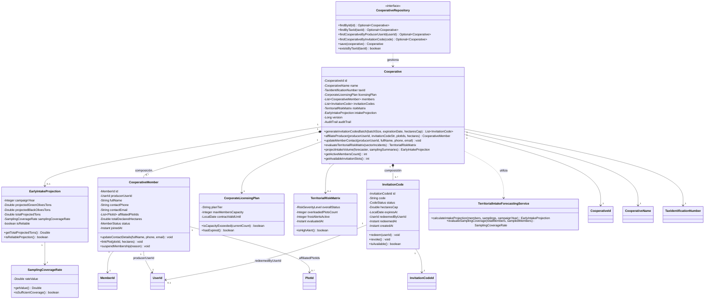
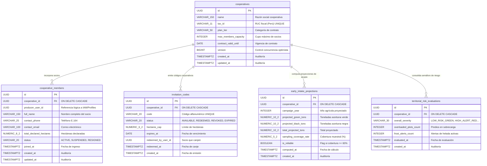

# Tactical-Level Domain-Driven Design: Cooperative Operations and Territorial Intelligence

---

### Bounded Context: Cooperative Operations and Territorial Intelligence (Cooperative Operations)

**Propósito:** El Bounded Context de **Cooperative Operations and Territorial Intelligence** (denominado comúnmente *Cooperative Operations* o *Territory*) es un subdominio de soporte (*Supporting Subdomain*) del negocio de Viora, responsable de la gestión gremial corporativa, la administración del padrón de socios olivareros, la emisión controlada de lotes de códigos corporativos de invitación hacia *Subscription & Cooperative Membership*, la consolidación del semáforo territorial de riesgos fisiológicos y agroclimáticos por sectores agroecológicos (La Yarada-Los Palos y Magollo en el valle de Tacna), y el cómputo dinámico de la proyección temprana de volumen de acopio asociativo de aceituna verde (conserva) y aceituna negra (mesa/almazara).

Técnica y agronómicamente, resuelve la incertidumbre logística, financiera y comercial de las asociaciones y cooperativas olivareras de Tacna, permitiéndoles anticipar con meses de antelación la capacidad requerida en tanques de salmuera, cuadrillas de transporte y contratos de exportación. Mantiene una delimitación semántica estricta aislando los modelos gremiales de los detalles prediales individuales: referencia de forma débil por identificador inmutable (`UserId`) a los socios en *User Profiles* e *IAM*, y por identidad lógica (`PlotId`) a los cuarteles de *Olive Orchard & Plot Management*. Actúa como consumidor de eventos de telemetría, sobrecarga frutal y muestreos de campo provenientes de *Crop Load Regulation & Thinning Advisory*, *Agroclimatic Telemetry & Sensor Monitoring* y *Harvest Settlement & Performance Reporting*, traduciendo múltiples vocabularios foráneos a su propio modelo unificado territorial mediante una capa de anticorrupción (ACL).

---

#### Domain Layer

En esta capa se modela la lógica de negocio pura, independiente de frameworks, infraestructura o mecanismos de persistencia. Comprende Aggregates, Entities, Value Objects, Domain Services, Domain Events e interfaces de Repositorios.

##### Aggregates y Entities

###### Cooperative (Aggregate Root)
* **Propósito:** Agregado raíz que delimita la frontera de consistencia transaccional para la cooperativa u organización agraria, gobierna el padrón unificado de socios olivareros, fiscaliza la emisión y canje de códigos de invitación conforme al cupo corporativo contratado, consolida el semáforo de riesgo sectorial y computa las proyecciones agregadas de cosecha.
* **Atributos:**
  * `id: CooperativeId` (Identificador único universal / UUID v4)
  * `name: CooperativeName` (Value Object: razón social y denominación comercial de la cooperativa)
  * `taxId: TaxIdentificationNumber` (Value Object: registro tributario oficial, RUC en Perú)
  * `licensingPlan: CorporateLicensingPlan` (Value Object: plan corporativo contratado con cupo máximo de socios y fecha de vigencia)
  * `members: List<CooperativeMember>` (Colección interna subordinada de socios productores agremiados)
  * `invitationCodes: List<InvitationCode>` (Colección interna subordinada de códigos alfanuméricos de invitación emitidos)
  * `riskMatrix: TerritorialRiskMatrix` (Value Object: estado consolidado del semáforo de riesgo por sectores agroecológicos)
  * `intakeProjection: EarlyIntakeProjection` (Value Object: proyección vigente de acopio en toneladas para aceituna verde y negra)
  * `version: Long` (Atributo de control de concurrencia optimista)
  * `auditTrail: AuditTrail` (Value Object: marcas temporales inmutables `createdAt`, `updatedAt`)
* **Métodos:**
  * `generateInvitationCodesBatch(batchSize: Integer, expirationDate: LocalDate, hectaresCap: Double): List<InvitationCode>` - Valida que la cantidad solicitada no exceda los cupos contractuales disponibles en `licensingPlan` (`TS29` / `US08` / `CMD11`), genera códigos alfanuméricos criptográficamente seguros, los incorpora a la colección interna y encola `InvitationCodesBatchGeneratedEvent` (EV14).
  * `affiliateProducer(producerUserId: UserId, invitationCodeStr: String, plotIds: List<PlotId>, declaredHectares: Double): CooperativeMember` - Procesa la afiliación formal de un socio tras el canje de un código corporativo (`POL02` / `EV13`), valida que el código pertenezca a la cooperativa y esté en estado `AVAILABLE`, transiciona el código a `REDEEMED`, crea e incorpora la entidad `CooperativeMember` al padrón e incrementa el contador de socios activos.
  * `updateMemberContact(producerUserId: UserId, newFullName: String, newPhone: String, newEmail: String): void` - Sincroniza los datos personales y de contacto del socio en el padrón técnico ante mutaciones de perfil en el upstream (`POL03` / `EV09`).
  * `evaluateTerritorialRiskMatrix(sectorIncidents: List<SectorIncidentSnapshot>): TerritorialRiskMatrix` - Procesa y sintetiza los incidentes agroclimáticos de helada (`POL14` / `EV25`), anomalías de frío de El Niño y alertas de sobrecarga frutal (`POL13` / `EV40`), actualizando los cuadrantes del semáforo sectorial (verde, amarillo, rojo) y encolando `CooperativeRiskMatrixEvaluatedEvent` (EV49) (`CMD31` / `US31`).
  * `projectIntakeVolume(forecaster: TerritorialIntakeForecastingService, samplingSummaries: List<PlotSamplingSummary>): EarlyIntakeProjection` - Invoca el servicio de dominio entregando las coberturas muestrales de los socios (`POL15` / `EV37` / `CMD32` / `US32`). Si la representatividad muestral del padrón es menor al $60\%$, encola obligatoriamente `LowSamplingCoverageWarnedForIntakeEvent` (EV51) con un factor de castigo en el margen de confianza; computa las toneladas agregadas de aceituna verde y negra y encola `CooperativeIntakeVolumeProjectedEvent` (EV50).
  * `getActiveMembersCount(): int` - Retorna la cantidad de socios en estado activo en el padrón.
  * `getAvailableInvitationSlots(): int` - Retorna los cupos remanentes disponibles según el plan corporativo.
* **Invariantes y Reglas de Negocio:**
  1. **Límite Estricto de Cupo Corporativo:** La suma de socios activos más los códigos de invitación disponibles no puede superar en ningún momento el cupo máximo de licencias estipulado en `CorporateLicensingPlan`.
  2. **Unicidad e Intransferibilidad de Códigos:** Cada `InvitationCode` posee un token alfanumérico único en todo el sistema y solo puede transicionar a estado `REDEEMED` una única vez por un socio titular.
  3. **Umbral Crítico de Representatividad Muestral (60%):** La proyección de acopio territorial exige que al menos el $60.0\%$ de los socios activos del padrón cuenten con muestreos de campo concluidos. Si la cobertura es inferior ($<60\%$), el sistema restringe la confiabilidad de la proyección y emite forzosamente una advertencia de riesgo de muestreo (`EV51`).
  4. **Anonimización y Agregación Territorial:** Los datos de rendimiento y superficie de parcelas individuales se procesan de forma anónima y agregada por subcuencas/sectores, impidiendo la exposición de datos productivos privados entre socios competidores.
  5. **Consistencia en la Segregación Comercial de Aceituna:** En toda proyección o conciliación de acopio, la masa total estimada debe corresponder exactamente a la sumatoria de aceituna verde para conserva y aceituna negra para almazara o mesa ($\hat{Y}_{\text{total}} = \hat{Y}_{\text{verde}} + \hat{Y}_{\text{negra}}$).

###### CooperativeMember (Entity Interna de Cooperative)
* **Propósito:** Modela el registro formal de un productor olivarero socio dentro del padrón técnico de la cooperativa.
* **Atributos:**
  * `id: MemberId` (Identificador único local del socio / UUID)
  * `producerUserId: UserId` (Referencia lógica foránea inmutable por ID al usuario en *IAM* y *User Profiles*)
  * `fullName: String` (Nombre y apellidos del productor agremiado)
  * `contactPhone: String` (Número telefónico validado internacionalmente bajo E.164)
  * `contactEmail: String` (Correo electrónico de notificación técnica)
  * `affiliatedPlotIds: List<PlotId>` (Colección de identificadores lógicos de parcelas aportadas a la cooperativa)
  * `totalDeclaredHectares: Double` (Superficie total olivarera declarada en hectáreas)
  * `joinedAt: Instant` (Marca temporal UTC de ingreso a la organización)
  * `status: MemberStatus` (Value Object / Enum: `ACTIVE`, `SUSPENDED`, `RESIGNED`)
* **Métodos:**
  * `updateContactDetails(fullName: String, phone: String, email: String): void` - Actualiza los datos de contacto sincronizados desde *User Profiles*.
  * `linkPlot(plotId: PlotId, hectares: Double): void` - Registra una nueva parcela aportada al acopio de la cooperativa.
  * `suspendMembership(reason: String): void` - Transiciona el estado a `SUSPENDED` inhabilitando el acceso a beneficios cooperativos.

###### InvitationCode (Entity Interna de Cooperative)
* **Propósito:** Representa un cupo corporativo expedido en forma de token alfanumérico para la incorporación controlada de un socio olivarero.
* **Atributos:**
  * `id: InvitationCodeId` (Identificador único local / UUID)
  * `code: String` (Cadena alfanumérica única de 10 caracteres en alta entropía, ej. `VIORA-YAR-8842`)
  * `status: CodeStatus` (Value Object / Enum: `AVAILABLE`, `REDEEMED`, `REVOKED`, `EXPIRED`)
  * `hectaresCap: Double` (Límite máximo de hectáreas que el socio puede vincular con este código)
  * `expiresAt: LocalDate` (Fecha límite de caducidad del cupo de invitación)
  * `redeemedByUserId: UserId` (Referencia lógica al productor que canjeó el código; nulo si está disponible)
  * `redeemedAt: Instant` (Marca temporal en que se formalizó el canje)
  * `createdAt: Instant` (Marca temporal de expedición del lote)
* **Métodos:**
  * `redeem(userId: UserId): void` - Valida que el código esté `AVAILABLE` y no haya expirado cronológicamente, transicionando su estado a `REDEEMED` y estampando marcas temporales.
  * `revoke(): void` - Anula anticipadamente el código de invitación por disposición del gestor técnico.

##### Value Objects (Conceptuales e Inmutables)
* **`CooperativeId` / `MemberId` / `InvitationCodeId` / `UserId` / `PlotId`**: Identificadores inmutables basados en UUID v4 con validación de no nulidad.
* **`CooperativeName`**: Cadena inmutable no vacía que representa la denominación gremial oficial (mínimo 3 caracteres, máximo 150).
* **`TaxIdentificationNumber` (RUC)**: Registro fiscal inmutable de 11 dígitos numéricos validado con dígito verificador para personas jurídicas en Perú.
* **`CorporateLicensingPlan`**: Objeto de valor que encapsula las condiciones comerciales del convenio:
  * `planTier: String` (Categoría corporativa: `TIER_BASIC_25`, `TIER_GROWTH_50`, `TIER_ENTERPRISE_100`).
  * `maxMembersCapacity: Integer` (Capacidad máxima de productores socios habilitados).
  * `contractValidUntil: LocalDate` (Fecha de vencimiento del licenciamiento institucional).
* **`TerritorialRiskMatrix`**: Encapsula el estado del semáforo sectorial consolidado por zonas agroecológicas:
  * `overallStatus: RiskSeverityLevel` (`LOW_RISK_GREEN`, `MODERATE_WARNING_YELLOW`, `HIGH_ALERT_RED`).
  * `sectorRisks: Map<SectorZone, SectorRiskDetail>` (Mapeo de riesgos por sector).
  * `overloadedPlotsCount: Integer` (Cantidad de predios socios con alerta roja de sobrecarga frutal).
  * `evaluatedAt: Instant` (Marca temporal de la evaluación).
* **`EarlyIntakeProjection`**: Encapsula los volúmenes agregados estimados para la campaña agrícola:
  * `campaignYear: Integer` (Año de cosecha proyectado).
  * `projectedGreenOlivesTons: Double` (Toneladas proyectadas de aceituna verde para conserva).
  * `projectedBlackOlivesTons: Double` (Toneladas proyectadas de aceituna negra para almazara o mesa).
  * `totalProjectedTons: Double` (Suma consolidada de aceituna proyectada).
  * `samplingCoverageRate: SamplingCoverageRate` (Porcentaje de cobertura muestral del padrón).
  * `isReliable: boolean` (Indicador de robustez estadística: verdadero si $Coverage \ge 60\%$).
* **`SamplingCoverageRate`**: Decimal inmutable en rango $[0.00, 100.00]\%$ que cuantifica el porcentaje de socios activos que han reportado muestreos en campo válidos.
* **`SectorZone`**: Enum inmutable que delimita los sectores agroecológicos del valle olivarero de Tacna: `LA_YARADA_BAJA`, `LA_YARADA_MEDIA`, `LOS_PALOS`, `MAGOLLO`.
* **`MemberStatus`**: Enum inmutable (`ACTIVE`, `SUSPENDED`, `RESIGNED`).
* **`CodeStatus`**: Enum inmutable (`AVAILABLE`, `REDEEMED`, `REVOKED`, `EXPIRED`).
* **`AuditTrail`**: Marcas inmutables de trazabilidad temporal (`createdAt`, `updatedAt`).

##### Domain Services
* **`TerritorialIntakeForecastingService`**:
  * **Propósito:** Servicio de dominio sin estado que encapsula el modelo biométrico y estadístico de proyección de cosecha asociativa. Pondera las hectáreas declaradas por variedad (*Criolla* versus *Sevillana*), la carga frutal media muestreada por árbol en los predios cooperantes y aplica factores de expansión estadística en función de la representatividad muestral del padrón.
  * **Fórmulas:**
    * *Tasa de Cobertura Muestral del Padrón ($CR$):*
      $$CR = \left( \frac{N_{\text{socios\_con\_muestreo}}}{N_{\text{total\_socios\_activos}}} \right) \times 100\%$$
    * *Proyección de Rendimiento Sectorial Ponderado ($\hat{Y}_{\text{sector}}$):*
      $$\hat{Y}_{\text{sector}} = \sum_{i=1}^{k} \left( A_{i} \cdot \bar{y}_{i} \right) \cdot \lambda_{\text{confianza}}$$
      *Donde $A_i$ representa las hectáreas declaradas del socio $i$, $\bar{y}_i$ es el rendimiento estimado en kg/ha obtenido del aclareo o muestreo biométrico, y $\lambda_{\text{confianza}}$ es un factor de calibración ($1.00$ si $CR \ge 60\%$; $0.85$ si $CR < 60\%$).*
    * *Balance Consolidado Total de Acopio:*
      $$\hat{Y}_{\text{total}} = \hat{Y}_{\text{verde}} + \hat{Y}_{\text{negra}}$$
  * **Métodos:**
    * `calculateIntakeProjection(members: List<CooperativeMember>, samplings: List<PlotSamplingSummary>, campaignYear: Integer): EarlyIntakeProjection` - Computa las proyecciones desagregadas por variedad y aptitud de acopio.
    * `evaluateSamplingCoverage(totalMembers: int, sampledMembers: int): SamplingCoverageRate` - Evalúa el porcentaje y valida si se satisface el umbral crítico del 60%.

##### Repositories (Interfaces en Domain)
Contratos agnósticos de base de datos definidos en el dominio:
* **`CooperativeRepository`**:
  * `findById(id: CooperativeId): Optional<Cooperative>`
  * `findByTaxId(taxId: TaxIdentificationNumber): Optional<Cooperative>`
  * `findCooperativeByProducerUserId(userId: UserId): Optional<Cooperative>`
  * `findCooperativeByInvitationCode(code: String): Optional<Cooperative>`
  * `save(cooperative: Cooperative): Cooperative`
  * `existsByTaxId(taxId: TaxIdentificationNumber): boolean`

##### Domain Events
Eventos inmutables en tiempo pasado que comunican hechos transaccionales significativos de la operativa gremial y territorial:
* **`InvitationCodesBatchGeneratedEvent`**: `{ cooperativeId: UUID, batchSize: Integer, expiresAt: LocalDate, hectaresCap: Double, occurredOn: Instant }` (EV14 / US08)
  * *Disparado cuando:* El gestor técnico emite un nuevo lote corporativo de códigos de invitación para socios.
* **`CooperativeRiskMatrixEvaluatedEvent`**: `{ cooperativeId: UUID, overallSeverity: String, overloadedSectorsCount: Integer, frostAlertsActive: Integer, evaluatedAt: Instant }` (EV49 / US31)
  * *Disparado cuando:* Se evalúa y consolida el semáforo de riesgo territorial por sectores agroecológicos.
  * *Consumido por:* La aplicación móvil del gestor y los paneles web cooperativos para desplegar el mapa de calor sectorial.
* **`CooperativeIntakeVolumeProjectedEvent`**: `{ cooperativeId: UUID, campaignYear: Integer, projectedGreenTons: Double, projectedBlackTons: Double, totalProjectedTons: Double, samplingCoverageRate: Double, isReliable: boolean, occurredOn: Instant }` (EV50 / US32)
  * *Disparado cuando:* Se calcula o reajusta el volumen agregado de acopio de aceituna verde y negra de la cooperativa.
  * *Consumido por:* El módulo de logística de acopio y los directivos técnicos para planificación industrial.
* **`LowSamplingCoverageWarnedForIntakeEvent`**: `{ cooperativeId: UUID, campaignYear: Integer, currentCoverageRate: Double, requiredCoverageThreshold: Double, occurredOn: Instant }` (EV51 / US32)
  * *Disparado cuando:* La proyección de acopio se ejecuta con una representatividad muestral inferior al umbral crítico del 60%.
  * *Consumido por:* Los gestores técnicos para priorizar visitas y ordenar campañas de muestreo en campo sobre los predios faltantes.

---

#### Interface Layer

En esta capa se definen los puntos de entrada y salida del sistema. Transforma solicitudes HTTP entrantes en Commands o Queries para la Application Layer y serializa los resultados del dominio en Resources (DTOs) conforme a OpenAPI 3.0 y respuestas estructuradas RFC 7807.

##### Controllers (REST)
Diseño basado estrictamente en recursos, sustantivos en plural y verbos HTTP estándar, implementando los contratos de las Historias de Usuario US08, US31 y US32:

* **`CooperativeMembershipController`** (Ruta base: `/api/v1/cooperatives/{cooperativeId}/membership`):
  * `POST /api/v1/cooperatives/{cooperativeId}/membership/invitation-codes` - Genera un lote de códigos de invitación corporativos (`US08` / `CMD11`). Responde `201 Created` con `InvitationCodeBatchResource`, o `409 Conflict` si se supera el cupo de licencias del plan.
  * `GET /api/v1/cooperatives/{cooperativeId}/membership/invitation-codes` - Lista los códigos de invitación emitidos con sus estados (`AVAILABLE`, `REDEEMED`, `EXPIRED`). Responde `200 OK` con un arreglo de `InvitationCodeResource`.
  * `GET /api/v1/cooperatives/{cooperativeId}/membership/members` - Retorna el padrón completo de socios productores agremiados (`RM13`). Responde `200 OK` con un arreglo de `CooperativeMemberResource`.
  * `GET /api/v1/cooperatives/{cooperativeId}/membership/members/{memberId}` - Obtiene el detalle gremial de un socio puntual. Responde `200 OK` o `404 Not Found`.

* **`TerritorialRiskMatrixController`** (Ruta base: `/api/v1/cooperatives/{cooperativeId}/territorial-risk`):
  * `GET /api/v1/cooperatives/{cooperativeId}/territorial-risk/matrix` - Consulta el semáforo consolidado de riesgo fenológico, climático y de sobrecarga por sectores (`US31` / `RM14`). Responde `200 OK` con `TerritorialRiskMatrixResource`. Actúa como mecanismo de consulta pull que complementa la notificación reactiva push de `CooperativeRiskMatrixEvaluatedEvent` (EV49).
  * `POST /api/v1/cooperatives/{cooperativeId}/territorial-risk/evaluations` - Dispara la reevaluación bajo demanda del semáforo sectorial (`CMD31`). Responde `200 OK` con la matriz actualizada.

* **`CooperativeIntakeForecastController`** (Ruta base: `/api/v1/cooperatives/{cooperativeId}/intake-forecasts`):
  * `GET /api/v1/cooperatives/{cooperativeId}/intake-forecasts/current` - Consulta la proyección vigente de volumen de acopio de aceituna verde y negra (`US32` / `RM15`). Responde `200 OK` con `EarlyIntakeProjectionResource`. Actúa como mecanismo de consulta pull que complementa el evento push de `CooperativeIntakeVolumeProjectedEvent` (EV50).
  * `POST /api/v1/cooperatives/{cooperativeId}/intake-forecasts/recompute` - Fuerza el recálculo analítico de la proyección agregada (`CMD32`). Responde `200 OK` con `EarlyIntakeProjectionResource` e incluye advertencia en cabecera si la cobertura es menor al 60%.

##### Resources (DTOs / Request & Response Models)
* **`GenerateInvitationCodesRequest`**: `{ batchSize: Integer, expirationDate: LocalDate, hectaresCapPerCode: Double }` (Payload recibido en POST).
* **`InvitationCodeBatchResource`**: `{ cooperativeId: UUID, batchSize: Integer, generatedCodes: List<String>, expiresAt: LocalDate, generatedAt: Instant }` (DTO de respuesta).
* **`InvitationCodeResource`**: `{ id: UUID, code: String, status: String, hectaresCap: Double, expiresAt: LocalDate, redeemedByUserId: UUID, redeemedAt: Instant }` (DTO de respuesta).
* **`CooperativeMemberResource`**: `{ id: UUID, producerUserId: UUID, fullName: String, phone: String, email: String, declaredHectares: Double, plotsCount: Integer, status: String, joinedAt: Instant }` (DTO del padrón).
* **`TerritorialRiskMatrixResource`**: `{ cooperativeId: UUID, overallStatus: String, overloadedPlotsCount: Integer, frostAlertsCount: Integer, sectorRisks: List<SectorRiskResource>, evaluatedAt: Instant }` (DTO de matriz de riesgo).
* **`SectorRiskResource`**: `{ sectorZone: String, severityLevel: String, thermalAnomalyActive: boolean, overloadCriticalCount: Integer, activePlots: Integer }` (DTO por sector).
* **`EarlyIntakeProjectionResource`**: `{ cooperativeId: UUID, campaignYear: Integer, greenOlivesTons: Double, blackOlivesTons: Double, totalTons: Double, samplingCoverageRate: Double, isReliable: boolean, lastComputedAt: Instant }` (DTO de proyección de acopio).

##### Assemblers / Mappers
* **`CooperativeMemberResourceAssembler`**: Transforma la entidad interna `CooperativeMember` en el DTO `CooperativeMemberResource`.
* **`InvitationCodeResourceAssembler`**: Transforma la entidad interna `InvitationCode` en el DTO `InvitationCodeResource`.
* **`TerritorialRiskMatrixResourceAssembler`**: Mapea el Value Object `TerritorialRiskMatrix` a `TerritorialRiskMatrixResource`.
* **`EarlyIntakeProjectionResourceAssembler`**: Mapea el Value Object `EarlyIntakeProjection` a `EarlyIntakeProjectionResource`.
* **`GenerateCodesCommandAssembler`**: Convierte `GenerateInvitationCodesRequest` en el comando `GenerateInvitationCodesBatchCommand`.

---

#### Application Layer

Coordina y orquesta los casos de uso del sistema. No implementa reglas de negocio agronómicas, sino que gestiona transacciones, delega a repositorios y servicios de dominio, y publica eventos.

##### Command Handlers
* **`GenerateInvitationCodesBatchCommandHandler`** (CMD11 / US08 / TS29):
  * *Entrada:* `GenerateInvitationCodesBatchCommand` (`cooperativeId`, `batchSize`, `expirationDate`, `hectaresCap`)
  * *Flujo:* Inicia transacción demarcada (`@Transactional`) -> recupera el agregado `Cooperative` mediante `CooperativeRepository` -> invoca `cooperative.generateInvitationCodesBatch(...)` validando que no se exceda el cupo contractual -> persiste cambios en el repositorio -> despacha `InvitationCodesBatchGeneratedEvent` (EV14).
* **`EvaluateCooperativeRiskMatrixCommandHandler`** (CMD31 / US31 / TS29):
  * *Entrada:* `EvaluateCooperativeRiskMatrixCommand` (`cooperativeId`, `evaluationDate`)
  * *Flujo:* Carga el agregado `Cooperative` -> recopila las alertas activas de telemetría y sobrecarga de las parcelas socias -> invoca `cooperative.evaluateTerritorialRiskMatrix(...)` -> persiste la matriz actualizada en el repositorio -> publica `CooperativeRiskMatrixEvaluatedEvent` (EV49).
* **`ProjectCooperativeIntakeVolumeCommandHandler`** (CMD32 / US32 / TS30):
  * *Entrada:* `ProjectCooperativeIntakeVolumeCommand` (`cooperativeId`, `campaignYear`)
  * *Flujo:* Inicia transacción (`@Transactional`) -> carga el agregado `Cooperative` -> consulta los resúmenes biométricos de aclareo de las parcelas socias -> invoca `cooperative.projectIntakeVolume(forecastingService, samplings)` -> verifica si la cobertura supera el $60\%$ -> persiste la proyección consolidada en el repositorio -> publica `CooperativeIntakeVolumeProjectedEvent` (EV50) y, de corresponder, `LowSamplingCoverageWarnedForIntakeEvent` (EV51).

##### Query Handlers
* **`GetCooperativeDirectoryQueryHandler`** (RM13 / US08):
  * Resuelve `GetCooperativeDirectoryQuery` recuperando el padrón de socios ordenado alfabéticamente por apellido y estado de afiliación.
* **`GetTerritorialRiskMatrixQueryHandler`** (RM14 / US31):
  * Resuelve `GetTerritorialRiskMatrixQuery` entregando el estado del semáforo sectorial consolidado para visualización en dashboards web y móviles.
* **`GetEarlyIntakeProjectionQueryHandler`** (RM15 / US32):
  * Resuelve `GetEarlyIntakeProjectionQuery` entregando las toneladas proyectadas de aceituna verde y negra para la planificación de salmueras y logística.

##### Event Handlers
* **`OnCooperativeCodeRedeemedEventHandler`** (POL02 / EV13 / Flujo 2 en DMF):
  * *Disparador:* Escucha `CooperativeCodeRedeemedEvent` emitido por *Subscription & Cooperative Membership*.
  * *Acción:* Despacha la afiliación formal del socio dentro del agregado `Cooperative`, vinculando su `producerUserId` al padrón y reduciendo un cupo disponible.
* **`OnContactProfileUpdatedEventHandler`** (POL03 / EV09):
  * *Disparador:* Escucha `ContactProfileUpdatedEvent` emitido por *User Profiles*.
  * *Acción:* Invoca `cooperative.updateMemberContact(...)` para mantener al día el directorio gremial sin intervención manual.
* **`OnOverloadRiskDetectedEventHandler`** (POL13 / EV40 / Flujo 6 en DMF):
  * *Disparador:* Escucha `OverloadRiskDetectedEvent` emitido por *Crop Load Regulation & Thinning Advisory*.
  * *Acción:* Si la parcela pertenece a un socio agremiado, actualiza la matriz de riesgo del sector correspondiente marcando alerta roja de sobrecarga.
* **`OnWeatherForecastIngestedEventHandler`** (POL14 / EV25):
  * *Disparador:* Escucha `WeatherForecastIngestedEvent` emitido por *Agroclimatic Telemetry & Sensor Monitoring*.
  * *Acción:* Si se proyecta temperatura $T \le 1.5^\circ\text{C}$ a 48 horas en un sector, actualiza el semáforo a alerta de helada y despacha un aviso regional masivo.
* **`OnSamplingRoundCompletedEventHandler`** (POL15 / EV37 / Flujo 7 en DMF):
  * *Disparador:* Escucha `SamplingRoundCompletedEvent` emitido por *Crop Load Regulation & Thinning Advisory*.
  * *Acción:* Despacha automáticamente el comando `ProjectCooperativeIntakeVolumeCommand` para actualizar la proyección de cosecha gremial con los nuevos datos biométricos.
* **`OnCampaignHarvestSettledEventHandler`** (Flujo 3 en DMF):
  * *Disparador:* Escucha `CampaignHarvestSettledEvent` (EV46) emitido por *Harvest Settlement & Performance Reporting*.
  * *Acción:* Compara los kilogramos reales liquidados frente a la proyección temprana calculada para calibrar el margen de error del modelo predictivo asociativo.

---

#### Infrastructure Layer

Clases que acceden a la base de datos relacional PostgreSQL e implementaciones concretas de los Repositorios, mapeos ORM y adaptadores de infraestructura.

##### 1. Paquetes y componentes principales
* **Persistence:**
  * `PostgresCooperativeRepository`: Implementa la interfaz `CooperativeRepository` de Dominio delegando en Spring Data JPA.
  * Entidades JPA: `CooperativeJpaEntity`, `CooperativeMemberJpaEntity`, `InvitationCodeJpaEntity`, `EarlyIntakeProjectionJpaEntity`, `TerritorialRiskEvaluationJpaEntity`.
  * `CooperativeEntityMapper`: Convertidor bidireccional entre las entidades de Dominio puro y las entidades relacionales JPA.
* **Events:**
  * `SpringDomainEventPublisher`: Publicador interno de eventos en memoria vía `ApplicationEventPublisher`.
* **Configuration:**
  * `CooperativeJpaConfig`: Configuración JPA habilitando auditoría `@EnableJpaAuditing` y gestión de transacciones `@EnableTransactionManagement`.
  * `CooperativeSecurityConfig`: Validación de tokens JWT y verificación de permisos del rol `ROLE_GESTOR_COOPERATIVA`.

##### 2. Modelo de datos y mapeos
Estructura relacional en PostgreSQL para las tablas de este Bounded Context:

* **Tabla Principal: `cooperatives`**
  ```sql
  CREATE TABLE cooperatives (
      id                   UUID PRIMARY KEY,
      name                 VARCHAR(150) NOT NULL,
      tax_id               VARCHAR(11) NOT NULL UNIQUE,          -- RUC de la cooperativa en Perú
      plan_tier            VARCHAR(50) NOT NULL,                 -- 'TIER_BASIC_25', 'TIER_GROWTH_50', etc.
      max_members_capacity INTEGER NOT NULL CHECK (max_members_capacity > 0),
      contract_valid_until DATE NOT NULL,
      version              BIGINT NOT NULL DEFAULT 0,            -- Control de concurrencia optimista
      created_at           TIMESTAMPTZ NOT NULL,
      updated_at           TIMESTAMPTZ NOT NULL
  );
  ```

* **Tabla Subordinada: `cooperative_members`**
  ```sql
  CREATE TABLE cooperative_members (
      id                      UUID PRIMARY KEY,
      cooperative_id          UUID NOT NULL REFERENCES cooperatives(id) ON DELETE CASCADE,
      producer_user_id        UUID NOT NULL,                    -- Referencia lógica foránea a IAM / Profiles
      full_name               VARCHAR(150) NOT NULL,
      contact_phone           VARCHAR(25) NOT NULL,             -- Formato E.164
      contact_email           VARCHAR(100) NOT NULL,
      total_declared_hectares NUMERIC(8, 2) NOT NULL DEFAULT 0.00,
      status                  VARCHAR(20) NOT NULL,             -- 'ACTIVE', 'SUSPENDED', 'RESIGNED'
      joined_at               TIMESTAMPTZ NOT NULL,
      created_at              TIMESTAMPTZ NOT NULL,
      updated_at              TIMESTAMPTZ NOT NULL,
      CONSTRAINT uq_coop_producer UNIQUE (cooperative_id, producer_user_id),
      CONSTRAINT chk_member_status CHECK (status IN ('ACTIVE', 'SUSPENDED', 'RESIGNED')),
      CONSTRAINT chk_declared_hectares CHECK (total_declared_hectares >= 0.00)
  );
  ```

* **Tabla Subordinada: `invitation_codes`**
  ```sql
  CREATE TABLE invitation_codes (
      id                  UUID PRIMARY KEY,
      cooperative_id      UUID NOT NULL REFERENCES cooperatives(id) ON DELETE CASCADE,
      code                VARCHAR(20) NOT NULL UNIQUE,
      status              VARCHAR(20) NOT NULL,                 -- 'AVAILABLE', 'REDEEMED', 'REVOKED', 'EXPIRED'
      hectares_cap        NUMERIC(6, 2) NOT NULL DEFAULT 10.00,
      expires_at          DATE NOT NULL,
      redeemed_by_user_id UUID,                                 -- Referencia lógica al socio que canjeó
      redeemed_at         TIMESTAMPTZ,
      created_at          TIMESTAMPTZ NOT NULL,
      CONSTRAINT chk_code_status CHECK (status IN ('AVAILABLE', 'REDEEMED', 'REVOKED', 'EXPIRED')),
      CONSTRAINT chk_hectares_cap CHECK (hectares_cap > 0.00)
  );
  ```

* **Tabla Subordinada: `early_intake_projections`**
  ```sql
  CREATE TABLE early_intake_projections (
      id                     UUID PRIMARY KEY,
      cooperative_id         UUID NOT NULL REFERENCES cooperatives(id) ON DELETE CASCADE,
      campaign_year          INTEGER NOT NULL,
      projected_green_tons   NUMERIC(10, 2) NOT NULL,
      projected_black_tons   NUMERIC(10, 2) NOT NULL,
      total_projected_tons   NUMERIC(10, 2) NOT NULL,
      sampling_coverage_rate NUMERIC(5, 2) NOT NULL,           -- Porcentaje [0.00 - 100.00]
      is_reliable            BOOLEAN NOT NULL,                 -- True si sampling_coverage_rate >= 60%
      computed_at            TIMESTAMPTZ NOT NULL,
      created_at             TIMESTAMPTZ NOT NULL,
      CONSTRAINT chk_projection_tons CHECK (projected_green_tons >= 0 AND projected_black_tons >= 0),
      CONSTRAINT chk_projection_sum CHECK (total_projected_tons = projected_green_tons + projected_black_tons),
      CONSTRAINT chk_coverage_rate CHECK (sampling_coverage_rate BETWEEN 0.00 AND 100.00)
  );
  ```

* **Tabla Subordinada: `territorial_risk_evaluations`**
  ```sql
  CREATE TABLE territorial_risk_evaluations (
      id                     UUID PRIMARY KEY,
      cooperative_id         UUID NOT NULL REFERENCES cooperatives(id) ON DELETE CASCADE,
      overall_severity       VARCHAR(30) NOT NULL,             -- 'LOW_RISK_GREEN', 'MODERATE_WARNING_YELLOW', 'HIGH_ALERT_RED'
      overloaded_plots_count INTEGER NOT NULL DEFAULT 0,
      frost_alerts_count     INTEGER NOT NULL DEFAULT 0,
      evaluated_at           TIMESTAMPTZ NOT NULL,
      created_at             TIMESTAMPTZ NOT NULL,
      CONSTRAINT chk_overall_severity CHECK (overall_severity IN ('LOW_RISK_GREEN', 'MODERATE_WARNING_YELLOW', 'HIGH_ALERT_RED'))
  );
  ```

* **Índices y Restricciones Físicas:**
  * Índice de búsqueda rápida para validación de códigos de invitación:
    ```sql
    CREATE INDEX idx_inv_codes_status ON invitation_codes (code, status);
    ```
  * Índice para consultas del padrón de socios por cooperativa y estado:
    ```sql
    CREATE INDEX idx_members_coop_status ON cooperative_members (cooperative_id, status);
    ```
  * Índice cronológico sobre proyecciones de acopio por campaña:
    ```sql
    CREATE INDEX idx_projections_coop_year ON early_intake_projections (cooperative_id, campaign_year DESC);
    ```

* **Mapeo Entity <-> Persistencia:**
  * Dominio -> DB: El mapper descompone los Value Objects `CorporateLicensingPlan`, `EarlyIntakeProjection` y `TerritorialRiskMatrix` en sus columnas escalares y tablas históricas correspondientes.
  * DB -> Dominio: Reconstrucción limpia de la entidad raíz `Cooperative` hidratando sus colecciones subordinadas mediante `@OneToMany(cascade = CascadeType.ALL, orphanRemoval = true)`.

##### 3. Repositories – Implementación
* **`PostgresCooperativeRepository`**:
  * Implementa persistencia sobre `cooperatives` utilizando `SpringDataJpaCooperativeRepository`.
  * Gestiona las colecciones `cooperative_members` e `invitation_codes` como componentes agregados bajo una única frontera de consistencia.
  * Aplica anotaciones `@Transactional` para garantizar atomicidad en la emisión de lotes y el recálculo analítico territorial.

##### 4. Seguridad & Resiliencia
* **Autorización Basada en Roles:** Restricción estricta en endpoints de emisión de códigos y visualización sectorial requiriendo el rol `ROLE_GESTOR_COOPERATIVA`.
* **Idempotencia en Canje de Códigos:** Clave única `UNIQUE (code)` y restricción `UNIQUE (cooperative_id, producer_user_id)` que impiden doble canje o duplicación de membresía ante fallas de red.
* **Control de Concurrencia Optimista:** Columna `@Version private Long version` en `CooperativeJpaEntity` que previene carreras en la asignación simultánea de cupos de invitación.
* **Manejo Centralizado de Excepciones (RFC 7807):** Retorno de objetos `ProblemDetail` ante sobregiro de cupo (`409 Conflict`), código expirado o inválido (`400 Bad Request`) o cooperativa no encontrada (`404 Not Found`).

---

#### Bounded Context Software Architecture Component Level Diagrams

En esta sección se describe la descomposición y el flujo de comunicación entre los componentes de software dentro del contenedor Backend (Spring Boot), detallando cómo interactúan las cuatro capas del Bounded Context:

##### 1. Descomposición de Componentes por Capa
* **Interface / API Layer:**
  * `CooperativeMembershipController`: Expone endpoints REST para padrón de socios y códigos de invitación.
  * `TerritorialRiskMatrixController`: Expone endpoints para el semáforo sectorial de riesgo.
  * `CooperativeIntakeForecastController`: Expone endpoints para la proyección temprana de acopio.
* **Application Layer:**
  * Command Handlers (`GenerateInvitationCodesBatchCommandHandler`, `EvaluateCooperativeRiskMatrixCommandHandler`, `ProjectCooperativeIntakeVolumeCommandHandler`): Orquestan transacciones y coordinan servicios.
  * Query Handlers (`GetCooperativeDirectoryQueryHandler`, `GetTerritorialRiskMatrixQueryHandler`, `GetEarlyIntakeProjectionQueryHandler`): Resuelven consultas optimizadas para dashboards.
  * Event Handlers (`OnCooperativeCodeRedeemedEventHandler`, `OnContactProfileUpdatedEventHandler`, `OnOverloadRiskDetectedEventHandler`, `OnWeatherForecastIngestedEventHandler`, `OnSamplingRoundCompletedEventHandler`): Procesan la mensajería asíncrona inter-contexto.
* **Domain Layer:**
  * Agregado Raíz `Cooperative`, Entidades Internas `CooperativeMember` e `InvitationCode`, Value Objects y el servicio de dominio `TerritorialIntakeForecastingService`.
  * Interfaz de Repositorio `CooperativeRepository`.
* **Infrastructure Layer:**
  * `PostgresCooperativeRepository` sobre PostgreSQL.
  * `SpringDomainEventPublisher` para la emisión interna de eventos.

```mermaid
graph TD
    subgraph ClientLayer ["Clientes & Contextos Externos"]
        MobileApp["Aplicación Móvil Viora (Gestor Técnico)"]
        WebDashboard["Portal Web Cooperativo (Directorio & Logística)"]
        SubBC["Subscription BC (Emisor EV13)"]
        ProfileBC["User Profiles BC (Emisor EV09)"]
        TelemetryBC["Telemetry BC (Emisor EV25)"]
        ThinningBC["Crop Load Regulation BC (Emisor EV37, EV40)"]
        HarvestBC["Harvest Settlement BC (Emisor EV46)"]
    end

    subgraph InterfaceLayer ["Interface Layer"]
        MembershipCtrl["CooperativeMembershipController"]
        RiskCtrl["TerritorialRiskMatrixController"]
        ForecastCtrl["CooperativeIntakeForecastController"]
    end

    subgraph ApplicationLayer ["Application Layer"]
        GenerateCodesCmdHandler["GenerateInvitationCodesBatchHandler"]
        EvaluateRiskCmdHandler["EvaluateCooperativeRiskMatrixHandler"]
        ProjectIntakeCmdHandler["ProjectCooperativeIntakeVolumeHandler"]
        QueryHandlers["Query Handlers<br/>(GetDirectory, GetRiskMatrix, GetForecast)"]
        EventHandlers["Event Handlers / Policies<br/>(POL02, POL03, POL13, POL14, POL15)"]
    end

    subgraph DomainLayer ["Domain Layer"]
        CooperativeAR["Cooperative (Aggregate Root)"]
        MemberEntity["CooperativeMember (Entity)"]
        CodeEntity["InvitationCode (Entity)"]
        ForecastingService["TerritorialIntakeForecastingService (Domain Service)"]
        RepoInterfaces["Interfaces de Dominio<br/>(CooperativeRepository)"]
        DomainEvents["Domain Events<br/>(EV14, EV49, EV50, EV51)"]
    end

    subgraph InfrastructureLayer ["Infrastructure Layer"]
        PostgresRepo["PostgresCooperativeRepository"]
        EventPublisher["SpringDomainEventPublisher"]
        PostgreSQL[("Base de Datos PostgreSQL")]
    end

    MobileApp -->|HTTPS / REST| MembershipCtrl
    MobileApp -->|HTTPS / REST| RiskCtrl
    WebDashboard -->|HTTPS / REST| RiskCtrl
    WebDashboard -->|HTTPS / REST| ForecastCtrl

    SubBC -.->|EV13 CooperativeCodeRedeemed| EventHandlers
    ProfileBC -.->|EV09 ContactProfileUpdated| EventHandlers
    TelemetryBC -.->|EV25 WeatherForecastIngested| EventHandlers
    ThinningBC -.->|EV40 OverloadRiskDetected| EventHandlers
    ThinningBC -.->|EV37 SamplingRoundCompleted| EventHandlers
    HarvestBC -.->|EV46 CampaignHarvestSettled| EventHandlers

    MembershipCtrl --> GenerateCodesCmdHandler
    MembershipCtrl --> QueryHandlers
    RiskCtrl --> EvaluateRiskCmdHandler
    RiskCtrl --> QueryHandlers
    ForecastCtrl --> ProjectIntakeCmdHandler
    ForecastCtrl --> QueryHandlers

    GenerateCodesCmdHandler --> CooperativeAR
    GenerateCodesCmdHandler --> RepoInterfaces

    EvaluateRiskCmdHandler --> CooperativeAR
    EvaluateRiskCmdHandler --> RepoInterfaces

    ProjectIntakeCmdHandler --> CooperativeAR
    ProjectIntakeCmdHandler --> ForecastingService
    ProjectIntakeCmdHandler --> RepoInterfaces

    QueryHandlers --> RepoInterfaces

    CooperativeAR --> DomainEvents
    GenerateCodesCmdHandler --> EventPublisher
    EvaluateRiskCmdHandler --> EventPublisher
    ProjectIntakeCmdHandler --> EventPublisher
    EventPublisher --> EventHandlers

    RepoInterfaces <|.. PostgresRepo
    PostgresRepo --> PostgreSQL
```

##### 2. Flujo de Comunicación y Conectividad
1. **Entrada:** El gestor técnico solicita la generación de un lote de códigos de invitación desde el portal web cooperativo (`POST /api/v1/cooperatives/{cooperativeId}/membership/invitation-codes`).
2. **Transformación:** `CooperativeMembershipController` valida los parámetros de entrada (`@Positive`, fecha futura), convierte el payload a `GenerateInvitationCodesBatchCommand` mediante su Assembler y delega en la Application Layer.
3. **Orquestación de Dominio:** `GenerateInvitationCodesBatchCommandHandler` inicia una transacción (`@Transactional`), carga el agregado `Cooperative` desde `CooperativeRepository`.
4. **Ejecución y Reglas:** El agregado verifica que la suma de socios más códigos activos no sobrepase `licensingPlan.maxMembersCapacity`. Si es válido, genera los códigos y encola `InvitationCodesBatchGeneratedEvent` (EV14).
5. **Persistencia:** El Handler invoca `save()` sobre el repositorio. `PostgresCooperativeRepository` mapea las entidades JPA e inserta los registros atómicamente en PostgreSQL.
6. **Integración Asíncrona (Flujo Reactivo):** Cuando un socio completa un muestreo en campo, `ThinningBC` emite `SamplingRoundCompletedEvent` (EV37). `OnSamplingRoundCompletedEventHandler` (POL15) recibe el evento y despacha `ProjectCooperativeIntakeVolumeCommand`. El servicio de dominio `TerritorialIntakeForecastingService` recalcula el acopio y despacha `CooperativeIntakeVolumeProjectedEvent` (EV50) y, si la representatividad es $<60\%$, `LowSamplingCoverageWarnedForIntakeEvent` (EV51).
7. **Respuesta:** El controlador convierte el resultado en `InvitationCodeBatchResource` o `EarlyIntakeProjectionResource` y retorna la respuesta HTTP estándar (`200 OK` o `201 Created`).

---

#### Bounded Context Software Architecture Code Level Diagrams

##### Bounded Context Domain Layer Class Diagrams

En esta sección se describe la estructura formal del modelo de clases del Domain Layer, detallando clases participantes, visibilidad, signaturas de métodos y relaciones:

##### 1. Estructura de Clases y Estereotipos
* **`Cooperative` (Aggregate Root):** Centraliza la administración gremial y las proyecciones territoriales. Sus atributos son privados (`-`) y sus métodos son públicos (`+`).
* **`CooperativeMember` (Entity Interna):** Modela el socio activo en el padrón técnico.
* **`InvitationCode` (Entity Interna):** Modela el código de invitación corporativo.
* **Value Objects:** `CooperativeId`, `MemberId`, `InvitationCodeId`, `UserId`, `PlotId`, `CooperativeName`, `TaxIdentificationNumber`, `CorporateLicensingPlan`, `TerritorialRiskMatrix`, `EarlyIntakeProjection`, `SamplingCoverageRate`, `AuditTrail`.
* **Domain Service:** `TerritorialIntakeForecastingService`.
* **Interfaz de Repositorio:** `CooperativeRepository`.



##### 2. Relaciones y Conectividad entre Clases
* **Composición (`1 *-- 0..*`):** `Cooperative` ejerce soberanía transaccional sobre `CooperativeMember` e `InvitationCode`. Si se remueve la cooperativa, sus miembros asociados y códigos emitidos se eliminan en cascada.
* **Asociación / Atributo (`-->`):** La raíz del agregado encapsula los Value Objects inmutables `CorporateLicensingPlan`, `TerritorialRiskMatrix` y `EarlyIntakeProjection`.
* **Dependencia (`..>`):** El agregado delega en `TerritorialIntakeForecastingService` para ejecutar cálculos matemáticos de estratificación muestral y balance de cosecha.
* **Referencias desacopladas por ID:** Los socios se asocian mediante el Value Object `UserId` (hacia *IAM* y *Profiles*) y las parcelas mediante `PlotId` (hacia *Orchard*), garantizando cero acoplamiento en memoria hacia otros Bounded Contexts.

---

##### Bounded Context Database Design Diagram

En esta sección se detalla el diseño físico y relacional de la base de datos en PostgreSQL, describiendo tablas, tipos de datos, claves primarias, claves foráneas, restricciones de integridad e índices:

##### 1. Tablas y Estructura de Claves
* **Tabla Principal `cooperatives`:** Almacena la razón social, RUC y contrato corporativo de licenciamiento.
  * Clave primaria: `id` (UUID).
* **Tabla Subordinada `cooperative_members`:** Padrón de productores socios.
  * Clave primaria: `id` (UUID).
  * Clave foránea física: `cooperative_id` (UUID) con regla `ON DELETE CASCADE` referenciando a `cooperatives(id)`.
* **Tabla Subordinada `invitation_codes`:** Códigos alfanuméricos de invitación expedidos.
  * Clave primaria: `id` (UUID).
  * Clave foránea física: `cooperative_id` (UUID) con regla `ON DELETE CASCADE`.
* **Tabla Subordinada `early_intake_projections`:** Histórico de proyecciones tempranas de acopio por campaña.
  * Clave primaria: `id` (UUID).
  * Clave foránea física: `cooperative_id` (UUID) con regla `ON DELETE CASCADE`.
* **Tabla Subordinada `territorial_risk_evaluations`:** Historial de evaluaciones del semáforo sectorial.
  * Clave primaria: `id` (UUID).
  * Clave foránea física: `cooperative_id` (UUID) con regla `ON DELETE CASCADE`.

##### 2. Relaciones y Cardinalidad Relacional
* **Relación 1 a N (`cooperatives` a `cooperative_members`):** Una cooperativa asocia múltiples productores olivareros en su padrón.
* **Relación 1 a N (`cooperatives` a `invitation_codes`):** Una cooperativa emite lotes de códigos de invitación hasta alcanzar su cupo máximo.
* **Relación 1 a N (`cooperatives` a `early_intake_projections`):** Una cooperativa almacena múltiples estimaciones de acopio a lo largo de las campañas agrícolas.



##### 3. Índices y Reglas de Integridad
* **Restricciones `CHECK` a Nivel de Motor:**
  * Estados del código: `status IN ('AVAILABLE', 'REDEEMED', 'REVOKED', 'EXPIRED')`.
  * Estados del socio: `status IN ('ACTIVE', 'SUSPENDED', 'RESIGNED')`.
  * Severidad de riesgo: `overall_severity IN ('LOW_RISK_GREEN', 'MODERATE_WARNING_YELLOW', 'HIGH_ALERT_RED')`.
  * Cobertura de muestreo: `sampling_coverage_rate BETWEEN 0.00 AND 100.00`.
  * Consistencia de toneladas: `total_projected_tons = projected_green_tons + projected_black_tons`.
* **Índices Únicos:**
  * `CREATE UNIQUE INDEX uq_coop_tax_id ON cooperatives (tax_id);` (Unicidad fiscal de la cooperativa).
  * `CREATE UNIQUE INDEX uq_coop_member_producer ON cooperative_members (cooperative_id, producer_user_id);` (Un productor solo puede tener una membresía por cooperativa).
  * `CREATE UNIQUE INDEX uq_invitation_code ON invitation_codes (code);` (Unicidad de cada token de invitación en toda la plataforma).
* **Índices de Optimización de Búsqueda:**
  * B-tree sobre `(cooperative_id, status)` en `cooperative_members` para listar socios activos rápidamente.
  * B-tree sobre `(code, status)` en `invitation_codes` para acelerar la validación y canje desde la aplicación móvil.
  * B-tree sobre `(cooperative_id, campaign_year DESC)` en `early_intake_projections` para graficar el avance de proyecciones en dashboards.
