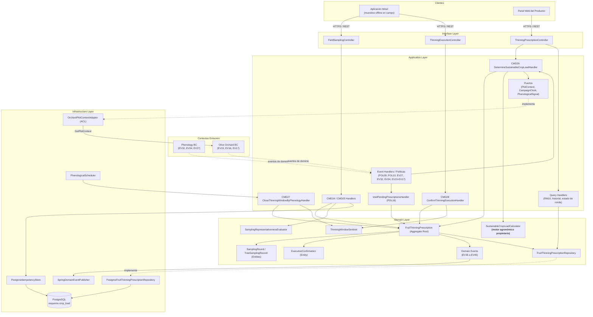
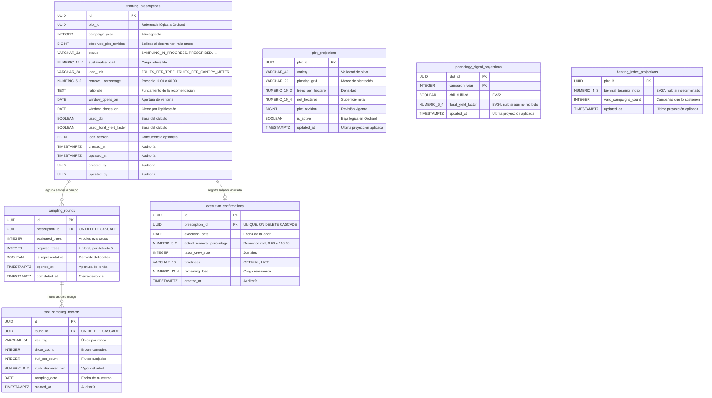

# Tactical-Level Domain-Driven Design: Crop Load Regulation and Thinning Advisory

### Bounded Context: Crop Load Regulation and Thinning Advisory (Crop Load Regulation)

**Propósito:** convierte el conteo de frutos cuajados a pie de árbol en una prescripción agronómica accionable. Certifica la representatividad estadística del muestreo, determina la carga frutal que el árbol puede sostener sin comprometer sus reservas, emite el porcentaje de remoción y su ventana biológica, y fiscaliza la ejecución en campo hasta el cierre por endurecimiento del carozo.

Es el único contexto del sistema que emite un acto prescriptivo. No posee la parcela, que pertenece a `Olive Orchard and Plot Management`; no computa el Índice de Vecería Bienal ni las porciones de frío, que pertenecen a `Phenology and Historical Bearing Analytics`; no liquida la cosecha ni evalúa la curva de estabilización, que pertenecen a `Harvest Settlement and Performance Reporting`. Referencia la parcela de forma lógica por `PlotId` y conserva la revisión predial observada al prescribir, sin replicar geometría ni titularidad.

#### Domain Layer

##### Aggregates y Entities

###### FruitThinningPrescription (Aggregate Root)

**Propósito:** protege la coherencia entre la evidencia muestral recogida en campo, la carga admisible derivada de ella, la recomendación emitida y la constancia de ejecución. Corresponde a `AGG08` del catálogo de agregados.

**Atributos:**

- `id: PrescriptionId`, `plotId: PlotId`, `campaignYear: CampaignYear`.
- `observedPlotRevision: long?`: revisión de la parcela vigente en el momento de prescribir, obtenida del contexto predial. Es **nula mientras la prescripción está en `SAMPLING_IN_PROGRESS`**, porque se sella recién al determinar la carga.
- `samplingRounds: List<SamplingRound>`.
- `sustainableLoad: SustainableCropLoad?`, `recommendation: ThinningRecommendation?`, `window: PhenologicalWindow?`.
- `execution: ExecutionConfirmation?`.
- `usedBbi: boolean`, `usedFloralYieldFactor: boolean`: base con la que se construyó la recomendación. Se sellan junto con el cálculo y no se recalculan después.
- `status: PrescriptionStatus`, `auditTrail: AuditTrail`.

**Métodos:**

- `recordTreeSampling(record: TreeSamplingRecord): void`: incorpora un árbol evaluado a la ronda activa; rechaza conteos no positivos y relaciones fruto/brote fuera de rango agronómico admisible.
- `ingestSamplingsBatch(records: List<TreeSamplingRecord>, evaluator: SamplingRepresentativenessEvaluator): void`: integra un lote sincronizado desde campo y delega en el servicio de dominio la certificación de representatividad de la ronda.
- `determineSustainableCropLoad(inputs: CropLoadInputs, calculator: SustainableCropLoadCalculator, sentinel: ThinningWindowSentinel): void`: exige ronda representativa y estado `SAMPLING_IN_PROGRESS`; sella en `observedPlotRevision` la revisión predial recibida y en `usedBbi`/`usedFloralYieldFactor` la base del cálculo; calcula carga admisible, deriva la recomendación de remoción y fija la ventana fenológica delegando en el sentinel. Recibe ambos servicios como argumento porque el agregado no retiene referencias a servicios de dominio.
- `closeWindowByPitHardening(at: LocalDate): void`: transición irrevocable a `CLOSED_BY_PIT_HARDENING`; no admite reapertura ni ejecución posterior con efecto mitigador.
- `confirmExecution(confirmation: ExecutionConfirmation, sentinel: ThinningWindowSentinel): void`: registra la labor efectivamente realizada. **La oportunidad la deriva el propio agregado** invocando `sentinel.classifyExecution(window, executionDate)`: nunca la recibe ya calculada, porque de lo contrario la invariante 4 se evaluaría fuera de su límite transaccional. Calcula además la carga remanente y la sella en la constancia.
- `voidByPlotRemoval(at: Instant): void`: anula una prescripción cuya parcela dejó de estar activa. Aplica únicamente sobre `SAMPLING_IN_PROGRESS` y `PRESCRIBED`; sobre cualquier otro estado es una operación nula. No publica evento propio, por la razón expuesta al final de la tabla de eventos.
- `isPending(): boolean`, `snapshot(): PrescriptionSnapshot`: consulta inmutable.

**Invariantes y reglas de negocio:**

1. No se calcula carga sostenible ni se emite prescripción formal si la ronda de muestreo reúne menos de cinco árboles evaluados en el sector homogéneo. La representatividad estadística es condición previa, no una advertencia posterior.
2. El porcentaje prescrito de remoción nunca supera el cuarenta por ciento de la fruta cuajada. Es un límite de seguridad agronómica, no un parámetro configurable.
3. Detectado el endurecimiento definitivo del endocarpio, la prescripción transiciona de forma irrevocable a `CLOSED_BY_PIT_HARDENING`. A partir de ese punto el aclareo ya no induce retorno floral y el sistema deja de recomendarlo.
4. Una labor confirmada después de la fecha de cierre fenológico se marca `EXECUTED_LATE` y conlleva penalización de la eficiencia mitigadora atribuida a la campaña.
5. *(Derivada, no proviene de `Paso9_aggregates.md`.)* Una parcela sostiene como máximo una prescripción en curso por año agrícola. Una segunda ronda de muestreo sobre la misma campaña amplía la evidencia de la prescripción existente; no origina una paralela.
6. *(Derivada, no proviene de `Paso9_aggregates.md`.)* La prescripción conserva la revisión predial con la que fue calculada. Una revisión posterior de la parcela no altera retroactivamente una recomendación ya emitida, pero sí invalida su vigencia para nuevos cálculos.
> **Lo que no es invariante de este agregado.** La regla «la baja de la parcela anula toda prescripción pendiente sobre ella» **no figura aquí**, pese a gobernar el estado de este agregado. Abarca dos agregados alojados en bounded contexts distintos, y las invariantes se sostienen dentro de un único límite transaccional, de modo que se resuelve por consistencia eventual y compensación. Está formalizada como `POL16` en `Paso6_policies.md` y desarrollada en la decisión de contrato 2. Su alcance: los estados `SAMPLING_IN_PROGRESS` y `PRESCRIBED`; no alcanza a una prescripción ya ejecutada ni a una cerrada por fenología, porque ambas son hechos consumados que la liquidación de campaña necesita conservar. La anulación no destruye la evidencia muestral recogida.

###### TreeSamplingRecord (Entity Interna de FruitThinningPrescription)

**Propósito:** constancia individual de un árbol testigo evaluado a pie de campo.

**Atributos:** `id: SamplingRecordId`, `treeTag: TreeTag`, `shootCount: ShootCount`, `fruitSetCount: FruitSetCount`, `trunkDiameter: TrunkDiameter`, `samplingDate: LocalDate`.

**Reglas:** la etiqueta del árbol es única dentro de la ronda. Los conteos son estrictamente positivos. El diámetro de tronco se expresa en milímetros y sustenta la normalización de la carga por vigor del árbol.

###### SamplingRound (Entity Interna de FruitThinningPrescription)

**Propósito:** lote muestral que agrupa los árboles evaluados en una salida a campo y certifica si alcanza validez estadística.

**Atributos:** `id: SamplingRoundId`, `records: List<TreeSamplingRecord>`, `representativeness: SamplingRepresentativeness`, `openedAt: Instant`, `completedAt: Instant?`.

**Métodos:** `isComplete(): boolean` — consulta inmutable que indica si la ronda alcanzó el umbral de representatividad.

**Reglas:** una ronda se declara completa al reunir cinco o más árboles evaluados. Por debajo de ese umbral se cierra como deficiente y habilita una segunda salida a campo sobre la misma prescripción, sin descartar la evidencia ya recogida.

###### ExecutionConfirmation (Entity Interna de FruitThinningPrescription)

**Propósito:** bitácora de la labor de aclareo efectivamente aplicada en campo.

**Atributos:** `id: ExecutionConfirmationId`, `executionDate: LocalDate`, `actualRemovalPercentage: RemovalPercentage`, `laborCrewSize: LaborCrewSize`, `timeliness: ExecutionTimeliness`, `remainingLoad: SustainableCropLoad`.

`timeliness` y `remainingLoad` **no se reciben construidos**: los sella `confirmExecution(...)` al incorporar la constancia al agregado.

**Reglas:** el porcentaje realmente removido puede diferir del prescrito y se registra tal como se declara, sin normalizarlo contra la recomendación; por eso se tipa como `RemovalPercentage` y no como `ThinningPercentage`. La oportunidad se deriva comparando la fecha de ejecución con el cierre de la ventana; no se informa por el productor.

##### Value Objects (Conceptuales e Inmutables)

| Clase | Atributos | Métodos y validación |
|---|---|---|
| `PrescriptionId`, `SamplingRecordId`, `SamplingRoundId`, `ExecutionConfirmationId` | `value: UUID` | `of(value): Id`; UUID no nulo. |
| `PlotId` | `value: UUID` | Referencia lógica inmutable a la parcela de `Olive Orchard and Plot Management`. No se replica geometría ni titularidad. |
| `CampaignYear` | `value: Integer` | `of(value)`; año agrícola de cuatro dígitos dentro del rango operativo del sistema. |
| `TreeTag` | `value: String` | `of(value)`; etiqueta normalizada no vacía; única dentro de la ronda. |
| `ShootCount`, `FruitSetCount` | `value: Integer` | `of(value)`; entero estrictamente positivo. |
| `TrunkDiameter` | `millimeters: Decimal` | `of(mm)`; valor finito positivo; sustenta la normalización por vigor. |
| `SamplingRepresentativeness` | `evaluatedTrees: Integer`, `requiredTrees: Integer` | `isSufficient(): boolean`; el mínimo requerido es cinco árboles por sector homogéneo. |
| `SustainableCropLoad` | `value: Decimal`, `unit: CropLoadUnit` | `of(value, unit)`; carga admisible expresada en frutos por árbol o frutos por metro de copa. No negativa. |
| `ThinningRecommendation` | `removalPercentage: ThinningPercentage`, `rationale: String` | `requiresIntervention(): boolean`; una recomendación de cero por ciento es una prescripción válida, no la ausencia de prescripción. |
| `ThinningPercentage` | `value: Decimal` | `of(value)`; rango cerrado de cero a cuarenta por ciento. Tipa **el porcentaje prescrito**, donde el cuarenta es límite de seguridad agronómica. |
| `RemovalPercentage` | `value: Decimal` | `of(value)`; rango cerrado de cero a cien por ciento. Tipa **el porcentaje realmente removido**, que se registra tal como el productor lo declara aunque exceda la recomendación. Son tipos distintos a propósito: la invariante 2 acota lo que el sistema recomienda, no lo que el productor hizo. |
| `PhenologicalWindow` | `opensOn: LocalDate`, `closesOn: LocalDate` | `contains(date): boolean`; el cierre corresponde a la lignificación estimada del endocarpio y es anterior a ella. |
| `LaborCrewSize` | `value: Integer` | `of(value)`; entero no negativo; cero admisible en ejecución mecanizada. |
| `ExecutionTimeliness` | enum | `OPTIMAL`, `LATE`. Derivado, nunca declarado por el actor. |
| `CropLoadUnit` | enum | `FRUITS_PER_TREE`, `FRUITS_PER_CANOPY_METER`. |
| `OverloadSeverity` | enum | `MODERATE`, `HIGH`, `CRITICAL`. Viaja en `EV40` y `Cooperative Operations` la traduce a su propio semáforo sectorial; los dos vocabularios se mantienen separados a propósito. |
| `PrescriptionStatus` | enum | `SAMPLING_IN_PROGRESS`, `PRESCRIBED`, `CLOSED_BY_PIT_HARDENING`, `EXECUTED_OPTIMAL`, `EXECUTED_LATE`, `VOIDED_BY_PLOT_REMOVAL`. Los seis figuran en el enum de `AGG08` en `Paso9_aggregates.md`; el sexto se incorporó allí al formalizarse `POL16`. |
| `AuditTrail` | `createdAt: Instant`, `updatedAt: Instant`, `createdBy: UUID`, `updatedBy: UUID` | Trazabilidad de autoría coherente con el resto de contextos. Dos actores distintos, porque quien abre una prescripción muestreando no es necesariamente quien confirma su ejecución. |

`CropLoadInputs` agrupa las entradas externas que alimentan el cálculo y no constituye estado del agregado:

| Entrada | Origen | Obligatoriedad |
|---|---|---|
| `sampledDensity` | Ronda muestral propia del agregado | Obligatoria |
| `plotContext` | `Olive Orchard and Plot Management` | Obligatoria |
| `chillFulfillment` | Phenology, vía `EV32` | Obligatoria |
| `floralYieldFactor` | Phenology, vía `EV34` | Opcional; ausente si la campaña no sufrió anomalía térmica |
| `historicalBbi: Optional<BiennialBearingIndex>` | Phenology, vía `EV27` | **Opcional por diseño** |

`BiennialBearingIndex` es un value object definido por Phenology, no por este contexto; se transporta en el payload de `EV27` y aquí se conserva en la proyección sin redefinirlo ni reinterpretarlo.

El Índice de Vecería Bienal es opcional por una restricción del contexto emisor, no por conveniencia de este. `phenology-and-analytics-tactical-ddd.md:41` establece que el cálculo de Hoblyn exige un mínimo de tres campañas agrícolas consecutivas registradas; por debajo de ese umbral el índice permanece indeterminado y Phenology emite `HistoricalDataInsufficiencyDetected` (`EV28`) en lugar de `EV27`.

Esto convierte la ausencia de BBI en el caso de adopción, no en un caso borde: un productor que digitaliza sus predios por primera vez carece de memoria plurianual y, por tanto, de índice. El motor de cálculo debe emitir una prescripción válida sin esa entrada. Una prescripción calculada sin BBI es legítima y no se marca como degradada frente al productor; internamente se registra qué entradas participaron, para que la evaluación posterior de eficacia mitigadora en `Harvest Settlement and Performance Reporting` no compare prescripciones construidas sobre bases distintas.

##### Domain Services

- **`SamplingRepresentativenessEvaluator`**: servicio sin estado que evalúa si una ronda alcanza validez estadística. `evaluate(round: SamplingRound): SamplingRepresentativeness`. Aísla el umbral de cinco árboles y su eventual ajuste por heterogeneidad del sector, de modo que el agregado no codifique el criterio muestral.

- **`SustainableCropLoadCalculator`**: servicio sin estado que encapsula el motor agronómico propietario. `calculate(inputs: CropLoadInputs): SustainableCropLoad`. Combina la densidad frutal muestreada, el vigor derivado del diámetro de tronco, la acumulación de frío cumplida, el factor de fertilidad floral vigente y, cuando está disponible, el Índice de Vecería Bienal histórico. Es el núcleo de valor del contexto y la razón de su clasificación como núcleo primario.

  El servicio opera de forma degradada ante cualquiera de sus entradas opcionales ausentes y nunca rechaza el cálculo por esa causa. Sin Índice de Vecería Bienal pierde la señal de en qué fase de la alternancia se encuentra la parcela y sostiene la recomendación sobre densidad muestreada y vigor. Sin factor de fertilidad floral asume que la campaña no sufrió estrés térmico invernal y no aplica corrección a la baja sobre la meta de carga, que es el comportamiento correcto: la ausencia de ese factor significa que la anomalía no ocurrió, no que se desconozca su efecto. En ambos casos la prescripción resultante es válida y ejecutable. Rechazar el cálculo por falta de historial dejaría sin servicio precisamente al productor que recién incorpora sus predios.

- **`ThinningWindowSentinel`**: servicio sin estado que determina la ventana de intervención y evalúa su vigencia. `resolveWindow(inputs: CropLoadInputs): PhenologicalWindow` y `classifyExecution(window, executionDate): ExecutionTimeliness`. Concentra el criterio fenológico para que ni el agregado ni la capa de aplicación lo repliquen.

##### Repositories (Interfaces en Domain)

**`FruitThinningPrescriptionRepository`**:

- `findById(id: PrescriptionId): Optional<FruitThinningPrescription>`.
- `findByPlotAndCampaign(plotId: PlotId, campaignYear: CampaignYear): Optional<FruitThinningPrescription>`: recupera la prescripción de esa parcela y campaña **cualquiera sea su estado**, incluidos los terminales. Sostiene la invariante 5. Buscar solo entre los estados pendientes dejaría la ranura libre tras un cierre por lignificación y permitiría abrir una prescripción paralela en la misma campaña, eludiendo la irrevocabilidad de la invariante 3.
- `findPendingByPlot(plotId: PlotId): List<FruitThinningPrescription>`: prescripciones en estado `SAMPLING_IN_PROGRESS` o `PRESCRIBED`, con independencia de si su ventana sigue abierta. Es la búsqueda que consumen tanto el cierre por lignificación (`POL10`, que actúa justamente cuando la ventana acaba de cerrarse) como la anulación por baja predial (`POL16`, que alcanza también el muestreo en curso). Se apoya en el índice parcial `idx_prescription_pending`.
- `save(prescription: FruitThinningPrescription): FruitThinningPrescription`: persiste el agregado completo con sus rondas y su constancia de ejecución.

##### Domain Events

Los once eventos del contexto usan el sobre inmutable `eventId`, `aggregateId`, `occurredOn`, `schemaVersion`, e incorporan `plotId` y `campaignYear` para que los consumidores ubiquen la parcela y la campaña sin consultar de vuelta. **Ambos campos son parte del sobre común y no se repiten en la columna de payload específico de la tabla siguiente**, que solo enumera lo propio de cada evento.

| Evento | Payload específico | Disparador y consumidores |
|---|---|---|
| `TreeFruitSetSampledInField` — EV35 | `prescriptionId`, `plotId`, `treeTag`, `shootCount`, `fruitSetCount`, `diameterMm`, `samplingDate` | Registro individual a pie de árbol (CMD24). Aplicación móvil. |
| `FieldSamplingsIngested` — EV36 | `prescriptionId`, `plotId`, `samplingRoundId`, `ingestedCount` | Lote sincronizado desde campo (CMD25). Aplicación móvil. |
| `SamplingRoundCompleted` — EV37 | `prescriptionId`, `plotId`, `samplingRoundId`, `evaluatedTrees`, `completedAt` | Ronda que alcanza representatividad (CMD25). Consumo interno para la prescripción automática y `Cooperative Operations and Territorial Intelligence` para recalibrar la proyección de acopio. |
| `SamplingRepresentativenessDeficientDetected` — EV38 | `prescriptionId`, `plotId`, `samplingRoundId`, `evaluatedTrees`, `requiredTrees` | Ronda por debajo del umbral (CMD25). Aplicación móvil. |
| `SustainableCropLoadDetermined` — EV39 | `prescriptionId`, `plotId`, `sustainableLoad`, `unit`, `observedPlotRevision` | Carga admisible determinada (CMD26). Aplicación móvil. |
| `OverloadRiskDetected` — EV40 | `prescriptionId`, `plotId`, `observedDensity`, `sustainableLoad`, `severity: OverloadSeverity` | Densidad frutal por encima de la capacidad de sustento (CMD26). `Cooperative Operations and Territorial Intelligence` para el semáforo territorial. |
| `ThinningPrescribed` — EV41 | `prescriptionId`, `plotId`, `removalPercentage`, `windowOpensOn`, `windowClosesOn` | Prescripción con remoción mayor que cero (CMD26). Aplicación móvil. |
| `ThinningDeclaredUnnecessary` — EV42 | `prescriptionId`, `plotId`, `rationale` | Carga en equilibrio biológico, remoción de cero por ciento (CMD26). Aplicación móvil. |
| `ThinningWindowClosedByPitHardening` — EV43 | `prescriptionId`, `plotId`, `pitHardeningDate` | Lignificación del endocarpio detectada (CMD27). Consumo interno para expirar prescripciones pendientes y aplicación móvil. |
| `ThinningExecutionConfirmed` — EV44 | `prescriptionId`, `plotId`, `executionDate`, `actualRemovalPercentage`, `laborCrewSize`, `remainingLoad` | Labor dentro de ventana óptima (CMD28). `Harvest Settlement and Performance Reporting` para vincular remoción ejecutada con el balance final cosechado. |
| `LateThinningExecutionRecorded` — EV45 | `prescriptionId`, `plotId`, `executionDate`, `windowClosesOn`, `actualRemovalPercentage` | Labor fuera de ventana (CMD28). `Phenology and Historical Bearing Analytics` para aplicar la penalización sobre la eficiencia de mitigación. |

El catálogo del agregado está cerrado en estos once eventos, numerados `EV35` a `EV45`. Los identificadores inmediatamente posteriores pertenecen a otros agregados, de modo que ningún evento adicional puede incorporarse sin renumerar el catálogo global.

**Ausencia deliberada de evento para la anulación.** La transición a `VOIDED_BY_PLOT_REMOVAL` no publica evento de dominio. La restricción de numeración lo impediría, pero la razón de fondo es de diseño: el hecho que interesa a los demás contextos es la baja de la parcela, no la consecuencia que este contexto deriva de ella. Ese hecho ya viaja en `PlotRemoved` (`EV17`), emitido por su propietario. Reemitirlo bajo otro nombre duplicaría una verdad ajena y obligaría a los consumidores a decidir cuál de las dos señales es autoritativa. Quien necesite reaccionar a la baja se suscribe a `EV17`; el estado de la prescripción anulada queda disponible por consulta.

##### Eventos consumidos de otros bounded contexts

| Evento | Contexto emisor | Uso |
|---|---|---|
| `ColdRequirementFulfilled` — EV32 | Phenology and Historical Bearing Analytics | Confirma la salida del reposo invernal y habilita la ronda de muestreo de la campaña. |
| `PotentialFloralYieldReadjusted` — EV34 | Phenology and Historical Bearing Analytics | Ajusta a la baja la meta de carga esperada tras una anomalía térmica invernal. Entrada del motor de cálculo. |
| `BiennialBearingIndexAssessed` — EV27 | Phenology and Historical Bearing Analytics | Aporta el Índice de Vecería Bienal de la parcela, que sitúa la campaña en la fase de alternancia y calibra la severidad de la remoción. Entrada opcional del motor. |
| `PlotDelimited` — EV15, `PlotBoundariesUpdated` — EV16 | Olive Orchard and Plot Management | Mantienen la proyección predial propia del contexto: variedad, marco de plantación, densidad y revisión vigente. |
| `PlotRemoved` — EV17 | Olive Orchard and Plot Management | Invalida la proyección predial y dispara la anulación de toda prescripción pendiente sobre la parcela. Es la compensación que sustituye a la consulta síncrona de elegibilidad de baja. |

El contexto predial detallado se obtiene además por consulta al contrato `GetPlotContext` expuesto por `Olive Orchard and Plot Management`, que devuelve geometría, variedad, marco, densidades, estado y revisión. La prescripción sella la revisión leída en `observedPlotRevision`.

##### Decisiones de contrato

Las tres definiciones que condicionaban las capas de aplicación e infraestructura quedaron resueltas el 2026-09-12 y propagadas a los documentos afectados. El detalle del proceso figura en `docs/auditoria-integracion-cross-bc.md`.

1. **Disponibilidad del Índice de Vecería Bienal. Resuelta.** Este contexto se suscribe a `BiennialBearingIndexAssessed` (`EV27`) y mantiene una proyección del último índice conocido por parcela. La suscripción no abre una relación nueva: viaja por la misma relación de Partnership que ya transporta `EV32` y `EV34`. Se descartó la consulta síncrona al recurso `GET /api/v1/plots/{plotId}/metrics?name=BBI` que Phenology expone, porque acoplaría la emisión de una prescripción a la disponibilidad de otro contexto. El índice ingresa al motor como entrada opcional, según lo establecido en `CropLoadInputs`.

   `phenology-and-analytics-tactical-ddd.md` refleja la suscripción y advierte que, por debajo de tres campañas registradas, el índice permanece indeterminado y se emite `EV28` en su lugar.

2. **Tratamiento de la baja de parcela con prescripción activa. Resuelta.** Se invierte la dependencia. `Olive Orchard and Plot Management` da de baja la parcela sin consultar a este contexto y publica `PlotRemoved` (`EV17`); este contexto reacciona anulando toda prescripción pendiente. No se expone contrato de elegibilidad de baja y no se abre la relación bc1 hacia bc4.

   La ficha de `CMD14` en `Paso5_commands.md` declaraba la restricción como invariante clave. Una restricción que abarca dos agregados alojados en contextos distintos no puede ser invariante de agregado: las invariantes se sostienen dentro de un único límite transaccional, y la consistencia entre agregados separados se resuelve por consistencia eventual y compensación. La fuente quedó anotada con esa reclasificación, que no la contradice sino que la corrige.

   Propagación aplicada: `PrescriptionStatus` incorpora `VOIDED_BY_PLOT_REMOVAL`; `Paso6_policies.md` formaliza `POL16`, que enlaza `EV17` con la anulación de prescripciones pendientes; `Paso5_commands.md` registra la nota de reclasificación en la ficha de `CMD14`; y `olive-orchard-plot.md` quedó desprendido de `PlotRemovalGuardPort`, del value object `PlotRemovalEligibility`, de su adaptador y de la cláusula que obligaba a este contexto a adquirir su bloqueo por parcela. El mecanismo `PlotTransactionGate` subsiste como recurso interno de Orchard, dado que también lo emplea su manejador de actualización de límites.

3. **Corrección del canvas de origen. Resuelta.** El canvas `01-crop-load-regulation-and-thinning-advisory.md` declaraba recibir `ReadjustPotentialFloralYield`, que es el comando interno con que Phenology ejecuta `POL08` y no un mensaje de frontera; el mensaje que cruza es el evento resultante, `PotentialFloralYieldReadjusted`. Declaraba además una salida de `EV45` hacia `Harvest Settlement` que ninguna política respalda, y no registraba la entrada predial ni la salida de `EV37` hacia `Cooperative Operations`. El canvas quedó corregido, junto con la afirmación equivalente del canvas de Phenology sobre `EV31`.

   Con independencia de esa corrección, este documento se redacta contra las fuentes del event storming. Los canvases son documentos de resumen y no constituyen capa de contrato.

---

#### Interface Layer

Transforma solicitudes HTTP en comandos y consultas, y serializa los resultados del dominio en recursos conforme a OpenAPI 3.0, con errores estructurados según RFC 7807. Ningún controlador calcula carga, evalúa representatividad ni decide oportunidad: esas decisiones pertenecen al dominio.

##### Controllers (REST)

Diseño orientado a recursos. La prescripción es el recurso raíz; las rondas de muestreo y la constancia de ejecución son subrecursos suyos, nunca recursos de primer nivel, porque fuera del agregado no tienen identidad de negocio.

| Clase y colaboradores | Métodos / rutas | Responsabilidad |
|---|---|---|
| `FieldSamplingController`; `commands: CropLoadCommandFacade`, `queries: CropLoadQueryFacade`, `assembler: SamplingCommandAssembler` | `record()` → `POST /api/v1/plots/{plotId}/thinning-prescriptions/current/sampling-records`; `ingestBatch()` → `POST /api/v1/plots/{plotId}/thinning-prescriptions/current/sampling-batches`; `roundStatus()` → `GET /api/v1/plots/{plotId}/thinning-prescriptions/current/sampling-rounds/active` | Registro individual a pie de árbol (`CMD24`), sincronización de lote offline (`CMD25`) y consulta del avance muestral (`RM09`). El segmento `current` resuelve la prescripción vigente de la campaña en curso; el cliente de campo no necesita conocer su identificador. |
| `ThinningPrescriptionController`; `commands`, `queries: CropLoadQueryFacade`, `assembler: PrescriptionResourceAssembler` | `determine()` → `POST /api/v1/plots/{plotId}/thinning-prescriptions/current/load-determinations`; `get()` → `GET /api/v1/thinning-prescriptions/{id}`; `getCurrent()` → `GET /api/v1/plots/{plotId}/thinning-prescriptions?scope=current`; `history()` → `GET /api/v1/plots/{plotId}/thinning-prescriptions?page=0&size=20` | Determinación bajo demanda (`CMD26`) y consulta de la ficha de prescripción (`RM10`, servida por `get()` y `getCurrent()`). `history()` **no sirve `RM10`**: devuelve `PrescriptionSummary`, una proyección de forma distinta que el catálogo no numera. La determinación se expone como recurso porque el productor puede solicitarla sin esperar a `POL09`. |
| `ThinningExecutionController`; `commands`, `assembler: ExecutionCommandAssembler` | `confirm()` → `POST /api/v1/thinning-prescriptions/{id}/execution-confirmations` | Confirmación de la labor aplicada en campo (`CMD28`). La oportunidad se deriva en el dominio; el payload no la transporta. |

`CMD27` (`CloseThinningWindowByPhenology`) **no se expone como endpoint**. Su iniciador es el planificador del sistema a partir de la señal de grados-día fenológicos, no un actor humano. Exponerlo permitiría cerrar una ventana biológica por vía administrativa, que es precisamente lo que la invariante 3 impide. Se despacha desde la capa de aplicación.

No existe `PUT` ni `PATCH` sobre la prescripción. Las transiciones de estado son comportamiento del dominio y se solicitan mediante recursos de acción. Las operaciones mutantes aceptan `Idempotency-Key`; el lote de campo lo exige, por la razón que se desarrolla en la capa de aplicación.

| Código | Significado en este contexto |
|---|---|
| `201 Created` | Registro muestral incorporado, determinación producida o ejecución confirmada. |
| `200 OK` | Consulta, o reintento de una operación ya procesada bajo la misma clave de idempotencia. |
| `409 Conflict` | Ronda sin representatividad al solicitar determinación; ventana ya cerrada por lignificación; prescripción anulada por baja predial. |
| `422 Unprocessable Entity` | Conteos no positivos, relación fruto/brote fuera de rango agronómico, etiqueta de árbol duplicada en la ronda. |
| `424 Failed Dependency` | El contexto predial no pudo resolverse y la determinación requiere `plotContext`, que es entrada obligatoria. |

##### Resources (DTOs / Request & Response Models)

| Clase | Campos y propósito |
|---|---|
| `RecordTreeSamplingRequest` | `treeTag: String`, `shootCount: int`, `fruitSetCount: int`, `trunkDiameterMm: Decimal`, `samplingDate: LocalDate`. Un árbol evaluado. |
| `IngestSamplingsBatchRequest` | `records: List<RecordTreeSamplingRequest>`, `clientBatchId: UUID`. Lo genera el cliente de campo. La clave de deduplicación **no es ese valor suelto** sino la terna `(actorId, plotId, clientBatchId)`, para que dos dispositivos que generen el mismo identificador no se descarten mutuamente el lote. |
| `SamplingRoundResource` | `roundId`, `evaluatedTrees`, `requiredTrees`, `isRepresentative`, `meanFruitsPerShoot`, `fruitsPerCanopyMeter`, `preliminaryOverloadFlag`, `openedAt`, `completedAt?`. Es la proyección de `RM09`. Devuelve el avance muestral sin exponer los registros individuales, e incluye los dos indicadores que el catálogo le asigna: la densidad media de frutos por brote y por metro de copa, y la marca preliminar de sobrecarga cuando la media supera los 4.5 frutos por brote. Esa marca es orientativa para el productor en campo y **no sustituye** a `EV40`, que solo se emite tras el cálculo formal de carga admisible. |
| `ThinningPrescriptionResource` | `id`, `plotId`, `campaignYear`, `status`, `sustainableLoad?`, `loadUnit?`, `removalPercentage?`, `rationale?`, `windowOpensOn?`, `windowClosesOn?`, `observedPlotRevision`, `basis: CalculationBasisResource`, `execution?: ExecutionResource`, `audit: AuditResource`. Es la proyección de `RM10`. |
| `ExecutionResource` | `executionDate`, `actualRemovalPercentage`, `laborCrewSize`, `timeliness`, `remainingLoad`. |
| `ConfirmExecutionRequest` | `executionDate: LocalDate`, `actualRemovalPercentage: Decimal`, `laborCrewSize: int`. **No transporta `timeliness` ni `remainingLoad`**: ambos los sella el agregado. |
| `PrescriptionSummary` | `id`, `campaignYear`, `status`, `removalPercentage?`, `windowClosesOn?`, `executedOn?`, `timeliness?`. Fila compacta del historial plurianual; es lo que devuelve `history()` paginado. |
| `CalculationBasisResource` | `usedBbi: boolean`, `usedFloralYieldFactor: boolean`, `chillFulfilled: boolean`. Declara con qué entradas se construyó la recomendación. |
| `AuditResource` | `createdAt`, `updatedAt`, `createdBy`, `updatedBy`. |

`CalculationBasisResource` existe por una razón de fondo. Una prescripción calculada sin Índice de Vecería Bienal es legítima y no se marca como degradada ante el productor, pero la evaluación posterior de eficacia mitigadora en `Harvest Settlement and Performance Reporting` no puede comparar prescripciones construidas sobre bases distintas sin saber cuáles eran. El recurso hace explícita esa base sin convertirla en una advertencia dirigida al usuario.

##### Assemblers / Mappers

- **`PrescriptionResourceAssembler`**: `toResource(snapshot: PrescriptionSnapshot, audit): ThinningPrescriptionResource`. Proyecta el agregado sin exponer las entidades internas.
- **`SamplingCommandAssembler`**: `toCommand(request, plotId, actorId, operationId): RecordInFieldTreeSampling` y su equivalente de lote.
- **`ExecutionCommandAssembler`**: `toCommand(request, prescriptionId, actorId): ConfirmThinningExecution`.
- **`SamplingRoundResourceAssembler`**: `toResource(snapshot: SamplingRoundSnapshot): SamplingRoundResource`. Consume el mismo tipo que produce `GetSamplingRoundStatusQueryHandler`; no recibe la entidad de dominio.

Los ensambladores convierten datos. No calculan representatividad, no derivan oportunidad y no deciden si una prescripción requiere intervención.

---

#### Application Layer

Orquesta los casos de uso, demarca transacciones, coordina el servicio de dominio y despacha eventos. No contiene reglas agronómicas.

##### Command Handlers

Cada manejador implementa `handle(command): Result`. Las fachadas `CropLoadCommandFacade` y `CropLoadQueryFacade` presentan el contrato público del módulo.

| Clase / entrada | Dependencias privadas | Flujo y resultado |
|---|---|---|
| `RecordInFieldTreeSamplingCommandHandler` / `RecordInFieldTreeSampling` — CMD24 | `prescriptions`, `plotProjection`, `campaignClock`, `idempotency` | Resuelve o abre la prescripción vigente de la parcela y campaña; verifica que la parcela siga activa en la proyección predial; invoca `recordTreeSampling(...)`; guarda y emite `EV35`. |
| `IngestFieldSamplingsBatchCommandHandler` / `IngestFieldSamplingsBatch` — CMD25 | `prescriptions`, `plotProjection`, `representativenessEvaluator`, `campaignClock`, `idempotency`, `eventDispatcher` | Reserva la clave de idempotencia `(actorId, plotId, clientBatchId)` dentro de la transacción de negocio; descarta los registros ya incorporados por etiqueta de árbol y ronda; invoca `ingestSamplingsBatch(...)` delegando la certificación en el evaluador; emite `EV36` y, según el resultado, `EV37` o `EV38`. |
| `DetermineSustainableCropLoadCommandHandler` / `DetermineSustainableCropLoad` — CMD26 | `prescriptions`, `plotContextPort`, `phenologyProjection`, `loadCalculator`, `windowSentinel`, `eventDispatcher`, `idempotency` | Resuelve el contexto predial **antes de abrir la transacción**; compone `CropLoadInputs` con la acumulación de frío, el factor floral y el índice de vecería disponibles en la proyección; **rechaza si la prescripción no está en `SAMPLING_IN_PROGRESS`**, de modo que una determinación repetida no reescribe una recomendación ya ejecutada ni reemite `EV40`/`EV41`; bajo bloqueo invoca `determineSustainableCropLoad(...)`, que sella `observedPlotRevision` y la base de cálculo; emite `EV39` y, según la carga resultante, `EV40`, `EV41` o `EV42`. |
| `CloseThinningWindowByPhenologyCommandHandler` / `CloseThinningWindowByPhenology` — CMD27 | `prescriptions`, `eventDispatcher` | Manejador interno sin ruta HTTP. Cierra la ventana de forma irrevocable y emite `EV43`. No depende del sentinel: la fecha de lignificación llega en el comando y `closeWindowByPitHardening(at)` no necesita clasificar nada. |
| `ConfirmThinningExecutionCommandHandler` / `ConfirmThinningExecution` — CMD28 | `prescriptions`, `windowSentinel`, `eventDispatcher`, `idempotency` | Bajo bloqueo del agregado invoca `confirmExecution(confirmation, windowSentinel)`. **El handler no deriva la oportunidad**: pasa el sentinel y es el agregado quien clasifica, para que la invariante 4 se resuelva dentro de su límite transaccional. Emite `EV44` si fue oportuna y `EV45` si fue tardía, nunca ambos. |
| `VoidPendingPrescriptionsCommandHandler` / `VoidPendingPrescriptions` | `prescriptions` (vía `findPendingByPlot`), `plotProjection` | Manejador interno de `POL16`. Invoca `voidByPlotRemoval(...)` sobre las prescripciones pendientes de la parcela. **No publica evento**, conforme a la ausencia deliberada razonada en la capa de dominio. Es idempotente: sobre un estado no pendiente la operación es nula. |

**La idempotencia del lote de campo no es un detalle técnico.** El muestreo se realiza en predios del valle de Tacna con conectividad intermitente; el cliente móvil acumula registros sin red y sincroniza cuando la recupera. Un reintento tras un corte de conexión no debe duplicar árboles evaluados, porque el conteo de árboles es exactamente lo que determina si la ronda alcanza representatividad. Duplicar tres árboles convertiría una ronda deficiente en aparentemente válida y habilitaría una prescripción sobre evidencia inexistente. Por eso la deduplicación opera en dos niveles: la terna `(actorId, plotId, clientBatchId)` descarta el lote repetido completo, y la unicidad de `TreeTag` dentro de la ronda descarta el árbol repetido entre lotes distintos.

##### Query Handlers

- **`GetPrescriptionByIdQueryHandler`**: `prescriptions`, `authorization`; `handle(GetPrescriptionById): PrescriptionSnapshot`. Autoriza contra la titularidad de la parcela.
- **`GetCurrentPrescriptionQueryHandler`**: `prescriptions`, `campaignClock`, `authorization`; `handle(GetCurrentPrescription): Optional<PrescriptionSnapshot>`. Sostiene el segmento `current` de las rutas de campo. Autoriza contra la titularidad de la parcela igual que su hermano: la ruta `current` expone el mismo dato y no está exenta del control.
- **`ListPrescriptionHistoryQueryHandler`**: `prescriptions`, `authorization`; `handle(ListPrescriptionHistory): Page<PrescriptionSummary>`. Historial plurianual por parcela, servido desde el propio repositorio del agregado. No existe un almacén de lectura separado: `RM10` y `RM09` se proyectan desde el snapshot del agregado, que es su fuente. El historial devuelve `PrescriptionSummary`, que no corresponde a ningún read model del catálogo.
- **`GetSamplingRoundStatusQueryHandler`**: `prescriptions`; `handle(GetSamplingRoundStatus): SamplingRoundSnapshot`. Sirve `RM09` y permite al cliente de campo saber cuántos árboles faltan para alcanzar el umbral sin descargar los registros. Lo expone `roundStatus()` en `FieldSamplingController`.

##### Event Handlers

- **`OnSamplingRoundCompletedEventHandler`** (POL09), atributos `commandBus`, `phenologyProjection`: `handle(SamplingRoundCompleted): void`. Aplica la prescripción automática cuando la ronda alcanza representatividad y la parcela no está en lignificación. Es el manejador que convierte el muestreo en prescripción sin intervención del productor.

  **Despacha `CMD26` en una transacción nueva, no en la que emitió `EV37`.** Encadenarlo dentro de aquella dejaría la llamada a `PlotContextPort` —que sale hacia otro bounded context— ejecutándose con el bloqueo pesimista de la prescripción ya adquirido, y una demora de Orchard haría rollback de la ingesta de campo recién sincronizada. La evidencia muestral ya está confirmada cuando `POL09` corre; la determinación es un paso posterior y separable. Si falla, la prescripción queda en `SAMPLING_IN_PROGRESS` con su ronda representativa y la determinación se reintenta, sin haber perdido un solo árbol evaluado.
- **`OnPitHardeningStageReachedEventHandler`** (EV53 / POL10), atributo `commandBus`: `handle(PitHardeningStageReached): void`. Escucha `PitHardeningStageReachedEvent` (`EV53`) emitido por *Phenology and Historical Bearing Analytics* tras acumular los 680 GDD post-antesis ($T_{base}=10^\circ\text{C}$). Despacha `CloseThinningWindowByPhenology` (`CMD27`) con la fecha de lignificación consolidada para ejecutar el cierre biológico formal de la ventana de aclareo en el cuartel.
- **`OnThinningWindowClosedEventHandler`** (POL10 interno), atributo `prescriptions`: `handle(ThinningWindowClosedByPitHardening): void`. Expira las prescripciones pendientes de la parcela tras la ejecución de `CMD27`. Consumo interno del propio contexto.
- **`OnColdRequirementFulfilledEventHandler`** (EV32), atributo `phenologyProjection`: `handle(ColdRequirementFulfilled): void`. Registra la salida del reposo invernal y habilita la ronda de muestreo de la campaña.
- **`OnPotentialFloralYieldReadjustedEventHandler`** (EV34), atributo `phenologyProjection`: `handle(PotentialFloralYieldReadjusted): void`. Actualiza el factor de fertilidad floral vigente.
- **`OnBiennialBearingIndexAssessedEventHandler`** (EV27), atributo `bearingIndexProjection`: `handle(BiennialBearingIndexAssessed): void`. Mantiene el último índice conocido **por parcela**, en una proyección distinta de la de señales fenológicas porque su clave no incluye la campaña. No redefine `BiennialBearingIndex`, que pertenece a Phenology.
- **`OnPlotDelimitedEventHandler`** y **`OnPlotBoundariesUpdatedEventHandler`** (EV15, EV16), atributo `plotProjection`: mantienen variedad, marco de plantación, densidad y revisión vigente. Una revisión nueva no altera una prescripción ya emitida, pero invalida la vigencia de la parcela para cálculos posteriores.
- **`OnPlotRemovedEventHandler`** (POL16 / EV17), atributos `plotProjection`, `voidHandler`: invalida la proyección predial y despacha la anulación de las prescripciones pendientes. Es la compensación que sustituye a la consulta síncrona de elegibilidad de baja.

`POL11`, `POL13` y `POL15` **no se implementan aquí**: este contexto es su emisor. Publica `EV45`, `EV40` y `EV37` respectivamente, y son `Phenology and Historical Bearing Analytics` y `Cooperative Operations and Territorial Intelligence` quienes reaccionan en su propio límite transaccional.

##### Puertos de aplicación

- **`PlotContextPort.resolve(plotId): PlotContext`** — obtiene geometría, variedad, marco, densidades, estado y revisión desde `Olive Orchard and Plot Management` a través del contrato `GetPlotContext`. Se invoca **fuera de la transacción**, porque una llamada entre módulos reteniendo un bloqueo de base de datos acopla la disponibilidad de un contexto a la latencia de otro.
- **`CampaignClockPort.currentCampaignYear(at: Instant): CampaignYear`** — resuelve el año agrícola vigente, que no coincide con el calendario y depende del ciclo fenológico del valle.
- **`PhenologicalSignalPort.pitHardeningStatus(plotId): PitHardeningStatus`** — expone al planificador la señal de grados-día que dispara `CMD27`.

`SustainableCropLoadCalculator`, `SamplingRepresentativenessEvaluator` y `ThinningWindowSentinel` **no son puertos**: son servicios de dominio y viven en el dominio. El motor agronómico es el núcleo de valor del contexto y no se externaliza tras una interfaz de infraestructura.

---

#### Infrastructure Layer

Implementaciones concretas de los repositorios, mapeos ORM sobre PostgreSQL y adaptadores hacia los contratos de otros contextos.

##### 1. Paquetes y componentes principales

| Clase / paquete | Atributos, métodos y responsabilidad |
|---|---|
| `PostgresFruitThinningPrescriptionRepository` | `jpa: PrescriptionJpaRepository`, `mapper: PrescriptionEntityMapper`; implementa las cuatro operaciones del repositorio de dominio y reconstruye el agregado completo con sus rondas, registros y constancia de ejecución. |
| `PrescriptionJpaEntity`, `SamplingRoundJpaEntity`, `TreeSamplingRecordJpaEntity`, `ExecutionConfirmationJpaEntity` | Modelo físico descrito abajo. `@Version` en la raíz. Las hijas se modifican únicamente a través de ella, con `@OneToMany(cascade = ALL, orphanRemoval = true)`. |
| `PlotProjectionJpaEntity`, `PhenologySignalProjectionJpaEntity`, `BearingIndexProjectionJpaEntity` | Proyecciones locales alimentadas por eventos de `Olive Orchard and Plot Management` y `Phenology and Historical Bearing Analytics`. Son tres y no dos porque el índice de vecería se clavea por parcela y las señales fenológicas por parcela y campaña. Son copias de lectura, nunca fuente de verdad. |
| `PrescriptionEntityMapper` | `toDomain(entity)` y `toJpa(aggregate)`; reconstrucción sin reemitir eventos históricos. |
| `OrchardPlotContextAdapter` | `httpClient` o contrato Java en proceso; implementa `PlotContextPort` traduciendo la respuesta de Orchard al value object propio. Capa anticorrupción: este contexto no adopta el modelo predial ajeno. |
| `SpringDomainEventPublisher` | `dispatch(events)` síncrono dentro de la transacción, propagando fallos para rollback. |
| `PostgresIdempotencyStore` | Huella de solicitud y resultado; reserva y confirmación dentro de la transacción de negocio. Sostiene la deduplicación de lotes de campo. |
| `AgriculturalCampaignClockAdapter` | Implementa `CampaignClockPort` resolviendo el año agrícola vigente a partir del calendario fenológico del valle de Tacna, que no coincide con el año civil. |
| `PhenologicalScheduler` | Tarea programada que actúa como mecanismo periódico de verificación de respaldo o sincronización, delegando en `OnPitHardeningStageReachedEventHandler` (`POL10` / `EV53`) el disparo reactivo de `CMD27`. |
| `CropLoadSecurityConfig` | Validación de JWT y rol `ROLE_PRODUCTOR`; la autorización efectiva se resuelve contra la titularidad de la parcela, no contra el rol solamente. |

##### 2. Modelo de datos y mapeos

Esquema lógico `crop_load`. Las claves foráneas son internas al contexto; `plot_id` y los actores de auditoría son referencias lógicas externas y deliberadamente no llevan `FOREIGN KEY`.

* **Tabla raíz: `crop_load.thinning_prescriptions`**
  ```sql
  CREATE TABLE crop_load.thinning_prescriptions (
      id UUID PRIMARY KEY,
      plot_id UUID NOT NULL,                     -- logical reference to Orchard
      campaign_year INTEGER NOT NULL,
      observed_plot_revision BIGINT,            -- se sella al determinar carga, no al abrir la prescripcion
      status VARCHAR(32) NOT NULL CHECK (status IN (
          'SAMPLING_IN_PROGRESS','PRESCRIBED','CLOSED_BY_PIT_HARDENING',
          'EXECUTED_OPTIMAL','EXECUTED_LATE','VOIDED_BY_PLOT_REMOVAL')),
      sustainable_load NUMERIC(12,4),
      load_unit VARCHAR(28) CHECK (load_unit IN ('FRUITS_PER_TREE','FRUITS_PER_CANOPY_METER')),
      removal_percentage NUMERIC(5,2) CHECK (removal_percentage BETWEEN 0.00 AND 40.00),  -- prescrito
      rationale TEXT,
      window_opens_on DATE,
      window_closes_on DATE,
      used_bbi BOOLEAN NOT NULL DEFAULT FALSE,
      used_floral_yield_factor BOOLEAN NOT NULL DEFAULT FALSE,
      lock_version BIGINT NOT NULL DEFAULT 0,
      created_at TIMESTAMPTZ NOT NULL,
      updated_at TIMESTAMPTZ NOT NULL,
      created_by UUID NOT NULL,
      updated_by UUID NOT NULL,
      CHECK (window_opens_on IS NULL OR window_closes_on IS NULL OR window_opens_on < window_closes_on),
      -- Toda prescripcion que superó la determinación conserva carga, remocion y revision sellada.
      CHECK (status IN ('SAMPLING_IN_PROGRESS','VOIDED_BY_PLOT_REMOVAL')
             OR (sustainable_load IS NOT NULL AND removal_percentage IS NOT NULL
                 AND observed_plot_revision IS NOT NULL))
  );
  ```
  El `CHECK` sobre `removal_percentage` lleva la invariante 2 hasta el motor: el límite de seguridad agronómica del cuarenta por ciento no depende de que la capa de aplicación lo respete.

* **Tabla subordinada: `crop_load.sampling_rounds`**
  ```sql
  CREATE TABLE crop_load.sampling_rounds (
      id UUID PRIMARY KEY,
      prescription_id UUID NOT NULL REFERENCES crop_load.thinning_prescriptions(id) ON DELETE CASCADE,
      evaluated_trees INTEGER NOT NULL DEFAULT 0 CHECK (evaluated_trees >= 0),
      required_trees INTEGER NOT NULL DEFAULT 5 CHECK (required_trees > 0),
      is_representative BOOLEAN NOT NULL DEFAULT FALSE,
      opened_at TIMESTAMPTZ NOT NULL,
      completed_at TIMESTAMPTZ,
      CHECK (is_representative = (evaluated_trees >= required_trees))
  );
  ```
  El último `CHECK` impide que la representatividad se declare por fuera del conteo real de árboles. La invariante 1 es condición previa a prescribir, así que el motor no puede sostener una ronda marcada representativa con cuatro árboles.

* **Tabla subordinada: `crop_load.tree_sampling_records`**
  ```sql
  CREATE TABLE crop_load.tree_sampling_records (
      id UUID PRIMARY KEY,
      round_id UUID NOT NULL REFERENCES crop_load.sampling_rounds(id) ON DELETE CASCADE,
      tree_tag VARCHAR(64) NOT NULL,
      shoot_count INTEGER NOT NULL CHECK (shoot_count > 0),
      fruit_set_count INTEGER NOT NULL CHECK (fruit_set_count > 0),
      trunk_diameter_mm NUMERIC(8,2) NOT NULL CHECK (trunk_diameter_mm > 0),
      sampling_date DATE NOT NULL,
      created_at TIMESTAMPTZ NOT NULL,
      CONSTRAINT uq_tree_tag_per_round UNIQUE (round_id, tree_tag)
  );
  ```
  `uq_tree_tag_per_round` es la segunda línea de defensa contra la duplicación de árboles al sincronizar lotes de campo. La primera es la clave de idempotencia del lote.

* **Tabla subordinada: `crop_load.execution_confirmations`**
  ```sql
  CREATE TABLE crop_load.execution_confirmations (
      id UUID PRIMARY KEY,
      prescription_id UUID NOT NULL UNIQUE REFERENCES crop_load.thinning_prescriptions(id) ON DELETE CASCADE,
      execution_date DATE NOT NULL,
      actual_removal_percentage NUMERIC(5,2) NOT NULL CHECK (actual_removal_percentage BETWEEN 0.00 AND 100.00),
      labor_crew_size INTEGER NOT NULL CHECK (labor_crew_size >= 0),
      timeliness VARCHAR(10) NOT NULL CHECK (timeliness IN ('OPTIMAL','LATE')),
      remaining_load NUMERIC(12,4),
      created_at TIMESTAMPTZ NOT NULL
  );
  ```
  `prescription_id` es `UNIQUE`: una prescripción admite una sola constancia de ejecución. El porcentaje realmente removido **no** está acotado a cuarenta, a diferencia del prescrito: se registra lo que el productor declara haber hecho, aunque exceda la recomendación.

* **Proyecciones locales**
  ```sql
  CREATE TABLE crop_load.plot_projections (
      plot_id UUID PRIMARY KEY,                  -- logical reference to Orchard
      variety VARCHAR(40) NOT NULL,
      planting_grid VARCHAR(20) NOT NULL,
      trees_per_hectare NUMERIC(10,2) NOT NULL,
      net_hectares NUMERIC(10,4) NOT NULL,
      plot_revision BIGINT NOT NULL,
      is_active BOOLEAN NOT NULL DEFAULT TRUE,
      updated_at TIMESTAMPTZ NOT NULL
  );

  CREATE TABLE crop_load.phenology_signal_projections (
      plot_id UUID NOT NULL,
      campaign_year INTEGER NOT NULL,
      chill_fulfilled BOOLEAN NOT NULL DEFAULT FALSE,
      floral_yield_factor NUMERIC(6,4),          -- null: sin EV34 recibido para esta campaña
      updated_at TIMESTAMPTZ NOT NULL,
      PRIMARY KEY (plot_id, campaign_year)
  );

  -- El BBI se proyecta POR PARCELA, no por campaña: EV27 no transporta campaignYear.
  CREATE TABLE crop_load.bearing_index_projections (
      plot_id UUID PRIMARY KEY,
      biennial_bearing_index NUMERIC(4,3),       -- null: menos de tres campañas registradas
      valid_campaigns_count INTEGER NOT NULL DEFAULT 0,
      updated_at TIMESTAMPTZ NOT NULL
  );
  ```
  `biennial_bearing_index` nulo significa que **el índice es indeterminado** por falta de historial: Phenology no puede emitirlo con menos de tres campañas registradas, así que la ausencia es estructural y el cálculo prosigue legítimamente sin esa señal. `valid_campaigns_count` deja constancia de cuántas campañas lo sostienen.

  `floral_yield_factor` nulo es **distinto y más delicado**: en una proyección alimentada por eventos, un nulo no puede afirmar que la anomalía térmica no ocurrió, porque es indistinguible de que `EV34` todavía no llegó. El documento no resuelve esa ambigüedad; queda registrada en la nota de pendientes del cierre.

* **Índices y restricciones físicas**
  ```sql
  -- Sostiene la invariante 5: UNA prescripcion por parcela y campaña, cualquiera sea su estado.
  -- Un indice parcial sobre los estados pendientes liberaria la ranura tras el cierre por
  -- lignificacion y permitiria abrir una prescripcion paralela, eludiendo la invariante 3.
  CREATE UNIQUE INDEX uq_prescription_per_plot_campaign
      ON crop_load.thinning_prescriptions (plot_id, campaign_year);

  CREATE INDEX idx_prescription_plot_campaign
      ON crop_load.thinning_prescriptions (plot_id, campaign_year DESC);

  -- Localiza prescripciones pendientes al cerrarse la ventana (POL10) o al darse de baja la parcela (POL16).
  CREATE INDEX idx_prescription_pending
      ON crop_load.thinning_prescriptions (plot_id)
      WHERE status IN ('SAMPLING_IN_PROGRESS','PRESCRIBED');

  CREATE INDEX idx_round_prescription ON crop_load.sampling_rounds (prescription_id, opened_at DESC);

  -- Una sola ronda abierta por prescripcion: dos ingestas concurrentes partirian la evidencia.
  CREATE UNIQUE INDEX uq_active_round_per_prescription
      ON crop_load.sampling_rounds (prescription_id)
      WHERE completed_at IS NULL;
  ```
  Ese índice único es la garantía física de la invariante 5. Sin él, dos solicitudes concurrentes de registro muestral sobre una parcela sin prescripción abierta crearían dos prescripciones paralelas para la misma campaña, y la evidencia muestral quedaría partida entre ambas.

##### 3. Repositories – Implementación

**`PostgresFruitThinningPrescriptionRepository`**:

- Reconstruye el agregado completo en una sola carga, con sus rondas, registros y constancia. Las entidades internas no se consultan por separado, porque fuera de la raíz no tienen sentido de negocio.
- `findByPlotAndCampaign` se apoya en el índice único `uq_prescription_per_plot_campaign` y adquiere bloqueo pesimista cuando la invoca un manejador de escritura.
- Ausencia deliberada de `delete()`: una prescripción anulada transiciona a `VOIDED_BY_PLOT_REMOVAL` y conserva su evidencia muestral. El historial agronómico plurianual es insumo de la evaluación de eficacia mitigadora.

##### 4. Seguridad & Resiliencia

- **Autorización por titularidad, no solo por rol.** El rol `ROLE_PRODUCTOR` habilita el módulo; el acceso a una prescripción concreta se resuelve contra la titularidad de la parcela en Orchard. Un productor no lee ni confirma la ejecución de un predio ajeno.
- **Idempotencia de la sincronización de campo.** Clave `(actorId, plotId, clientBatchId)` más `uq_tree_tag_per_round`. Está desarrollado en la capa de aplicación porque es una regla de negocio, no una precaución técnica: duplicar árboles falsea la representatividad.
- **Concurrencia optimista** mediante `lock_version` en la raíz, y bloqueo pesimista en los manejadores que determinan carga o confirman ejecución, donde dos escrituras simultáneas producirían recomendaciones divergentes sobre la misma campaña.
- **Sin llamadas externas bajo bloqueo.** `PlotContextPort` se resuelve antes de abrir la transacción. Si el contexto predial no responde, la determinación falla con `424 Failed Dependency` y no deja una prescripción a medio construir.
- **Degradación controlada del motor.** La ausencia de entradas opcionales no es un fallo: el cálculo prosigue y se registra en `used_bbi` y `used_floral_yield_factor` con qué base se construyó. Rechazar el cálculo por falta de historial dejaría sin servicio al productor que recién digitaliza sus predios.
- **Manejo centralizado de excepciones (RFC 7807)** con `ProblemDetail`, según la tabla de códigos de la capa de interfaz.

---

#### Bounded Context Software Architecture Component Level Diagrams

##### 1. Descomposición de Componentes por Capa

* **Interface / API Layer:** `FieldSamplingController`, `ThinningPrescriptionController`, `ThinningExecutionController` y sus ensambladores.
* **Application Layer:** los seis manejadores de comando, los cuatro de consulta, los ocho manejadores de evento y los tres puertos de aplicación.
* **Domain Layer:** agregado raíz `FruitThinningPrescription` con sus entidades internas `SamplingRound`, `TreeSamplingRecord` y `ExecutionConfirmation`; los servicios de dominio `SustainableCropLoadCalculator`, `SamplingRepresentativenessEvaluator` y `ThinningWindowSentinel`; la interfaz `FruitThinningPrescriptionRepository`.
* **Infrastructure Layer:** `PostgresFruitThinningPrescriptionRepository`, `OrchardPlotContextAdapter`, `PostgresIdempotencyStore`, `PhenologicalScheduler` y `SpringDomainEventPublisher`.



##### 2. Flujo de Comunicación y Conectividad

1. **Entrada en campo.** El productor evalúa árboles testigo a pie de parcela, con o sin conectividad. La aplicación móvil acumula los registros y los sincroniza como lote (`POST .../sampling-batches`) cuando recupera red, acompañados de un `clientBatchId` que ella misma genera.
2. **Deduplicación.** `IngestFieldSamplingsBatchCommandHandler` reserva la clave de idempotencia dentro de la transacción de negocio y descarta los árboles ya incorporados por etiqueta y ronda. Un reintento tras un corte de conexión no infla el conteo.
3. **Certificación muestral.** Incorporado el lote, el agregado emite `EV36` de forma incondicional como constancia de la ingesta, y delega la certificación en `SamplingRepresentativenessEvaluator`. Si la ronda alcanza cinco árboles emite además `EV37`; si no, `EV38`, y la ronda queda abierta para una segunda salida a campo conservando la evidencia ya recogida.
4. **Prescripción automática.** `POL09` reacciona a `EV37` y despacha `CMD26` **en una transacción nueva**, sin intervención del productor. El manejador resuelve el contexto predial antes de abrir esa transacción, compone `CropLoadInputs` con las señales fenológicas disponibles en la proyección local e invoca el motor. Separar las transacciones es lo que impide que la latencia de Orchard ponga en riesgo la evidencia de campo ya confirmada.
5. **Ejecución del motor.** `SustainableCropLoadCalculator` combina densidad muestreada, vigor por diámetro de tronco, frío cumplido y, cuando existen, factor floral e índice de vecería. Opera de forma degradada ante las entradas opcionales ausentes y nunca rechaza el cálculo por esa causa. El agregado sella `observedPlotRevision` y emite `EV39`, más `EV40`, `EV41` o `EV42` según el resultado.
6. **Propagación hacia otros contextos.** `EV40` alimenta el semáforo territorial de `Cooperative Operations` (`POL13`) y `EV37` recalibra su proyección de acopio (`POL15`). Ambas son reacciones en el límite transaccional del receptor, no llamadas desde aquí.
7. **Cierre biológico.** `PhenologicalScheduler` detecta la lignificación del endocarpio y despacha `CMD27`. La transición es irrevocable y `POL10` expira las prescripciones pendientes de la parcela. A partir de ese punto el aclareo deja de inducir retorno floral y el sistema deja de recomendarlo.
8. **Confirmación de la labor.** El productor declara fecha, porcentaje realmente removido y cuadrilla. `ThinningWindowSentinel` deriva la oportunidad comparando esa fecha con el cierre de ventana: `EV44` si fue oportuna, `EV45` si fue tardía. Nunca ambos. `EV45` viaja a Phenology, que aplica la penalización sobre la eficiencia mitigadora (`POL11`).
9. **Baja de la parcela.** `PlotRemoved` (`EV17`) invalida la proyección predial y dispara la anulación de las prescripciones pendientes (`POL16`). La anulación no publica evento propio y no destruye la evidencia muestral.

---

#### Bounded Context Software Architecture Code Level Diagrams

##### Bounded Context Domain Layer Class Diagrams

##### 1. Estructura de Clases y Estereotipos

* **`FruitThinningPrescription` (Aggregate Root):** única vía de mutación del clúster. Atributos privados, métodos de negocio públicos.
* **Entidades internas:** `SamplingRound`, `TreeSamplingRecord`, `ExecutionConfirmation`. Se modifican exclusivamente a través de la raíz.
* **Value Objects:** los enumerados en la tabla de la capa de dominio.
* **Domain Services:** `SustainableCropLoadCalculator`, `SamplingRepresentativenessEvaluator`, `ThinningWindowSentinel`.
* **Interfaz de Repositorio:** `FruitThinningPrescriptionRepository`.

```mermaid
classDiagram
    class FruitThinningPrescription {
        -PrescriptionId id
        -PlotId plotId
        -CampaignYear campaignYear
        -long observedPlotRevision [0..1]
        -List~SamplingRound~ samplingRounds
        -SustainableCropLoad sustainableLoad
        -ThinningRecommendation recommendation
        -PhenologicalWindow window
        -ExecutionConfirmation execution
        -boolean usedBbi
        -boolean usedFloralYieldFactor
        -PrescriptionStatus status
        -AuditTrail auditTrail
        +recordTreeSampling(record) void
        +ingestSamplingsBatch(records, evaluator) void
        +determineSustainableCropLoad(inputs, calculator, sentinel) void
        +closeWindowByPitHardening(at) void
        +confirmExecution(confirmation, sentinel) void
        +voidByPlotRemoval(at) void
        +isPending() boolean
        +snapshot() PrescriptionSnapshot
    }

    class SamplingRound {
        -SamplingRoundId id
        -List~TreeSamplingRecord~ records
        -SamplingRepresentativeness representativeness
        -Instant openedAt
        -Instant completedAt
        +isComplete() boolean
    }

    class TreeSamplingRecord {
        -SamplingRecordId id
        -TreeTag treeTag
        -ShootCount shootCount
        -FruitSetCount fruitSetCount
        -TrunkDiameter trunkDiameter
        -LocalDate samplingDate
    }

    class ExecutionConfirmation {
        -ExecutionConfirmationId id
        -LocalDate executionDate
        -RemovalPercentage actualRemovalPercentage
        -LaborCrewSize laborCrewSize
        -ExecutionTimeliness timeliness
        -SustainableCropLoad remainingLoad
    }

    class SustainableCropLoad {
        -Decimal value
        -CropLoadUnit unit
        +of(value, unit) SustainableCropLoad
    }

    class ThinningRecommendation {
        -ThinningPercentage removalPercentage
        -String rationale
        +requiresIntervention() boolean
    }

    class PhenologicalWindow {
        -LocalDate opensOn
        -LocalDate closesOn
        +contains(date) boolean
    }

    class SamplingRepresentativeness {
        -Integer evaluatedTrees
        -Integer requiredTrees
        +isSufficient() boolean
    }

    class PlotId {
        -UUID value
        +of(value) PlotId
    }

    class SustainableCropLoadCalculator {
        <<DomainService>>
        +calculate(inputs) SustainableCropLoad
    }

    class SamplingRepresentativenessEvaluator {
        <<DomainService>>
        +evaluate(round) SamplingRepresentativeness
    }

    class ThinningWindowSentinel {
        <<DomainService>>
        +resolveWindow(inputs) PhenologicalWindow
        +classifyExecution(window, executionDate) ExecutionTimeliness
    }

    class FruitThinningPrescriptionRepository {
        <<interface>>
        +findById(id) Optional~FruitThinningPrescription~
        +findByPlotAndCampaign(plotId, campaignYear) Optional~FruitThinningPrescription~
        +findPendingByPlot(plotId) List~FruitThinningPrescription~
        +save(prescription) FruitThinningPrescription
    }

    FruitThinningPrescription "1" *-- "0..*" SamplingRound : composición
    SamplingRound "1" *-- "0..*" TreeSamplingRecord : composición
    FruitThinningPrescription "1" *-- "0..1" ExecutionConfirmation : composición
    FruitThinningPrescription "1" --> "0..1" SustainableCropLoad
    FruitThinningPrescription "1" --> "0..1" ThinningRecommendation
    FruitThinningPrescription "1" --> "0..1" PhenologicalWindow
    FruitThinningPrescription "1" --> "1" PlotId : referencia lógica externa
    SamplingRound "1" --> "1" SamplingRepresentativeness

    FruitThinningPrescription ..> SustainableCropLoadCalculator : utiliza
    FruitThinningPrescription ..> SamplingRepresentativenessEvaluator : utiliza
    FruitThinningPrescription ..> ThinningWindowSentinel : utiliza
    FruitThinningPrescriptionRepository ..> FruitThinningPrescription : gestiona
```



##### 2. Relaciones y Conectividad entre Clases

* **Composición (`*--`):** la raíz ejerce soberanía transaccional sobre rondas, registros y constancia de ejecución. Una ronda sin prescripción no existe como concepto de negocio.
* **Asociación (`-->`):** la raíz encapsula los value objects del resultado. Los tres son opcionales porque una prescripción en `SAMPLING_IN_PROGRESS` todavía no los tiene.
* **Dependencia (`..>`):** los servicios de dominio se reciben como argumento en los métodos que los necesitan, no como atributos de la raíz. El agregado no retiene referencias a servicios.
* **Referencia externa por identidad:** `PlotId` apunta a `Olive Orchard and Plot Management` sin replicar geometría ni titularidad. `BiennialBearingIndex` pertenece a Phenology y se conserva en la proyección sin redefinirlo.

##### Bounded Context Database Design Diagram

##### 1. Tablas y Estructura de Claves

* **Tabla raíz `thinning_prescriptions`:** clave primaria `id`; índice único **total** sobre `(plot_id, campaign_year)`.
* **Tabla subordinada `sampling_rounds`:** clave foránea `prescription_id` con `ON DELETE CASCADE`.
* **Tabla subordinada `tree_sampling_records`:** clave foránea `round_id` con `ON DELETE CASCADE`; restricción única `(round_id, tree_tag)`.
* **Tabla subordinada `execution_confirmations`:** clave foránea `prescription_id`, declarada `UNIQUE`.
* **Proyecciones `plot_projections`, `phenology_signal_projections` y `bearing_index_projections`:** claves propias; no llevan clave foránea porque referencian contextos ajenos. La última se clavea solo por `plot_id`, porque `EV27` no transporta la campaña.

##### 2. Relaciones y Cardinalidad Relacional

* **1 a N (`thinning_prescriptions` a `sampling_rounds`):** una prescripción admite varias salidas a campo sobre la misma campaña. Una ronda deficiente no se descarta, habilita la siguiente.
* **1 a N (`sampling_rounds` a `tree_sampling_records`):** una ronda agrupa los árboles testigo evaluados en esa salida. La cardinalidad mínima es **cero**: la ronda se abre con el primer comando de registro y existe brevemente vacía, porque `recordTreeSampling` incorpora los árboles de a uno.
* **1 a 0..1 (`thinning_prescriptions` a `execution_confirmations`):** una prescripción admite a lo sumo una constancia de ejecución.



##### 3. Índices y Reglas de Integridad

* **Restricciones `CHECK` a nivel de motor:**
  * Remoción prescrita: `removal_percentage BETWEEN 0.00 AND 40.00`, que materializa la invariante 2. El porcentaje **realmente removido** se acota a `0.00 – 100.00` y no a 40, porque registra lo que el productor hizo, no lo que el sistema recomendó.
  * Representatividad derivada: `is_representative = (evaluated_trees >= required_trees)`, que materializa la invariante 1.
  * Conteos muestrales estrictamente positivos y diámetro de tronco positivo.
  * Coherencia de ventana: `window_opens_on < window_closes_on`.
  * Completitud tras la determinación: todo estado distinto de `SAMPLING_IN_PROGRESS` y `VOIDED_BY_PLOT_REMOVAL` exige carga admisible, porcentaje de remoción y revisión predial sellada no nulos.
* **Índices únicos:**
  * `uq_prescription_per_plot_campaign` sobre `(plot_id, campaign_year)`, que materializa la invariante 5 para **todos** los estados.
  * `uq_active_round_per_prescription` sobre `(prescription_id) WHERE completed_at IS NULL`, que impide dos rondas abiertas a la vez y con ello que dos ingestas concurrentes partan la evidencia.
  * `uq_tree_tag_per_round` sobre `(round_id, tree_tag)`, que impide duplicar árboles al sincronizar lotes de campo.
  * `prescription_id` único en `execution_confirmations`.
* **Índices de optimización:**
  * `idx_prescription_plot_campaign` sobre `(plot_id, campaign_year DESC)` para el historial plurianual por parcela.
  * `idx_prescription_pending`, índice parcial sobre `plot_id` restringido a `SAMPLING_IN_PROGRESS` y `PRESCRIBED`, que es el que consume `findPendingByPlot` para resolver `POL10` y `POL16` sin recorrer el histórico.
  * `idx_round_prescription` sobre `(prescription_id, opened_at DESC)` para recuperar la ronda activa de una prescripción.

Las tres invariantes que el motor puede sostener por sí mismo —límite de remoción, representatividad y unicidad de prescripción en curso— están expresadas como restricciones físicas. No sustituyen la validación del dominio, la respaldan: una ruta de escritura que eludiera el agregado seguiría sin poder violarlas.


---

#### Pendientes de decisión del equipo

Doce cuestiones exceden la redacción de este documento: son del modelo compartido y su resolución afecta a más de un bounded context. Se registran aquí para que ninguna quede implícita.

| # | Cuestión | Evidencia | Alcance |
|---|---|---|---|
| ~~P1~~ | **Resuelto el 2026-09-15.** La señal de lignificación del carozo se formaliza como `EV53: PitHardeningStageReached`, emitida por `ChillAccumulationTracker` en *Phenology* tras acumular 680 GDD post-antesis ($T_{base}=10^\circ\text{C}$, estadio BBCH 75). `Crop Load Regulation` la consume mediante `OnPitHardeningStageReachedEventHandler` (`POL10`), despachando `CMD27`. | `phenology-and-analytics-tactical-ddd.md` y este documento | **Cerrado.** El gatillo fenológico biológico está completamente articulado y conecta con la Invariante 3. |
| P2 | **`POL08` tiene doble autoridad.** `Paso6` fija agregado destino `FruitThinningPrescription` (este contexto); `Paso1:139` atribuye el evento resultante `EV34` a `ChillAccumulationTracker` (Phenology). | `Paso6_policies.md` (POL08) contra `Paso1_domain_events.md:139` | Misma clase de defecto que la doble autoridad sobre `CMD11`/`EV14`. Este documento adopta la lectura de `Paso1`; corresponde al equipo reconciliar las fuentes. |
| P3 | **`Paso9_aggregates.md` mantiene, en la invariante 4 de `AGG04: Plot`, que una parcela con prescripciones activas no puede eliminarse.** Esa regla fue reclasificada como `POL16` y la reclasificación llegó a `Paso5` y `Paso6`, no a `Paso9`. | `Paso9_aggregates.md` (`AGG04`, invariante 4) | Fuente sin reconciliar. La regla, tal como está, es una invariante que cruza dos contextos. |
| P4 | **`EV44` es consumido sin política que lo numere.** `harvest-settlement-tactical-ddd.md` **sí** implementa `OnThinningExecutionConfirmedEventHandler` escuchando `EV44` y lo diagrama, de modo que el consumidor existe y funciona. Lo que falta es su formalización: ninguna de las 17 políticas de `Paso6_policies.md` cubre esa reacción, y `AGG09` no lista el evento entre los que consume. | `harvest-settlement-tactical-ddd.md` (handler y diagramas) contra `Paso6_policies.md` | Es una **política sin número**, no un consumidor colgado. Corresponde darla de alta en el catálogo. |
| P5 | **Criterio de ejecución tardía divergente.** Aquí se deriva contra `window_closes_on`; `Paso6` (POL11) lo define contra `pitHardeningDate`, que este documento declara posterior. | `Paso6_policies.md` (POL11) | Se penalizaría al productor por labores que la fuente considera oportunas. |
| P6 | **`EV37` no transporta lo que su consumidor necesita.** Lleva `evaluatedTrees`; `Cooperative Operations` requiere frutos cuajados y densidad para proyectar toneladas, y no existe contrato de consulta alternativo. | `cooperative-operations-tactical-ddd.md` (`projectIntakeVolume`, invariante del 60%) | `POL15` no es implementable con el payload actual. |
| P7 | **La invariante 1 no es invariante del agregado**: el evaluador de representatividad se inyecta como argumento, de modo que el llamador elige el criterio. | `SamplingRepresentativenessEvaluator` y la firma de `ingestSamplingsBatch` | Decidir si el umbral se fija dentro del agregado o si se acepta como validación de aplicación. |
| P8 | **Dos rondas deficientes no suman representatividad.** Tres árboles más tres árboles son seis muestreados y cero rondas representativas; no hay mecanismo de agregación entre rondas. | Reglas de `SamplingRound` | En predios cuyo sector homogéneo no reúne cinco árboles en una salida, es el caso normal. Requiere decidir si la representatividad se evalúa por ronda o por prescripción. |
| P9 | **`floral_yield_factor` nulo no puede afirmar que la anomalía no ocurrió.** En una proyección asíncrona es indistinguible de que `EV34` aún no llegó, y ningún manejador recalcula la prescripción si el evento llega tarde. | Proyección `phenology_signal_projections`; ausencia de recálculo | Condición de carrera con `EV37` que produciría una recomendación que subestima el estrés térmico en el escenario ENOS. |
| ~~P10~~ | **Resuelto el 2026-09-13.** La regla de anulación por baja predial salió de la lista de invariantes y quedó como nota explícita que remite a `POL16`. | — | Cerrado. |
| P11 | **La invariante 6 no es verificable dentro del límite transaccional** ni tiene implementación: exige comparar la revisión sellada contra la revisión vigente de la parcela, que es estado de otro contexto. | Invariante 6; ausencia de estado `STALE` o comparación en los manejadores | Decidir si se retira, o si se modela como estado explícito de la prescripción. |
| P12 | **El agregado es grande para su patrón de escritura.** Registrar un solo árbol serializa contra toda la prescripción. `SamplingRound` tiene identidad, ciclo de vida propio y es lo que el cliente móvil manipula. | Bloqueo pesimista sobre la raíz en `CMD24` | Candidata a raíz de agregado propia con referencia por `PrescriptionId`. Sostenible como está, pero costoso con cuadrillas muestreando en paralelo. |

Mientras P1 no se resuelva, el ciclo de vida de la prescripción **no se cierra por vía fenológica**: las prescripciones emitidas permanecen en `PRESCRIBED` hasta que se confirme su ejecución o se anulen por baja predial.

---

#### Rediseño pendiente: el ciclo de vida de la prescripción

Este documento fue auditado en dos rondas por revisores independientes. La segunda ronda dejó una conclusión que conviene registrar antes que cualquier corrección puntual: **los defectos que quedan no son errores de redacción sino consecuencias de que el ciclo de vida del agregado nunca se decidió como un conjunto.**

##### Por qué no alcanza con corregirlos de a uno

La evidencia es concreta. Dos correcciones aplicadas el 2026-09-13, ambas individualmente correctas, produjeron juntas un bloqueo que ninguna causaba por separado:

* el índice único pasó de parcial a **total** sobre `(plot_id, campaign_year)`, para impedir que se abriera una prescripción paralela tras el cierre irrevocable por lignificación;
* el manejador de `CMD26` ganó una guarda que **rechaza toda determinación que no esté en `SAMPLING_IN_PROGRESS`**, para que un reintento no reescribiera una recomendación ya ejecutada.

Combinadas, eliminaron el único camino que quedaba para **re-prescribir tras una revisión predial**. Si el productor actualiza los linderos después de recibir su prescripción, la invariante 6 la declara no vigente para nuevos cálculos, y el diseño ya no ofrece forma de producir ese nuevo cálculo: no se puede re-determinar sobre la existente ni abrir otra para la campaña. La invariante 6 pasó de «declarada sin implementación» a **estructuralmente inejecutable**.

##### Las seis preguntas que el rediseño debe responder a la vez

| # | Pregunta | Qué depende de ella |
|---|---|---|
| 1 | ¿Qué **estados** existen y qué **transiciones** son admisibles entre ellos? | El `CHECK` de completitud, hoy incompatible con `POL10`: exige carga, remoción y revisión selladas en `CLOSED_BY_PIT_HARDENING`, pero esa política cierra también prescripciones que estaban muestreando y no tienen ninguno de los tres valores. |
| 2 | ¿Cuántas prescripciones admite una parcela por campaña, y bajo qué condiciones? | El índice único, la guarda de `CMD26`, y si existe o no camino de re-prescripción tras una revisión predial. |
| 3 | ¿Qué comandos se admiten **en cada estado**? | `recordTreeSampling` e `ingestSamplingsBatch` no declaran precondición: hoy un lote sincronizado tarde —el caso normal en campo— puede escribir sobre una prescripción cerrada o anulada. Y no está definido qué hace `confirmExecution` sobre una prescripción ya cerrada por lignificación, de lo cual depende que `EV45` y `POL11` sean alcanzables. |
| 4 | ¿La representatividad se evalúa **por ronda o por prescripción**? | El documento dice en un lugar que la ronda deficiente «se cierra» y en otro que «queda abierta». De esa elección depende que dos salidas de tres árboles sumen seis y alcancen el umbral, o que la prescripción quede atrapada sin salida. `uq_active_round_per_prescription` fuerza hoy la primera lectura. |
| 5 | ¿Qué significa la **ausencia** de cada entrada opcional del motor? | Para el índice de vecería la ausencia es estructural y el documento resuelve bien. Para el factor de fertilidad floral el cuerpo afirma que su ausencia significa que la anomalía no ocurrió, mientras la lectura de la proyección afirma lo contrario. Ambas conviven. |
| 6 | ¿Cuál es la **semántica transaccional** del despacho de eventos? | `POL09` se declara en transacción nueva, pero el publicador descrito es síncrono dentro de la transacción y propaga fallos para rollback: tal como está, una demora del contexto predial seguiría arrastrando la ingesta de campo. Y el reintento que el documento menciona no tiene mecanismo. |

##### Método propuesto

Decidir primero la **máquina de estados completa** —estados, transiciones admitidas, guardas, efectos y campos obligatorios en cada estado— y **derivar de ella** el `CHECK` de completitud, los índices únicos, las precondiciones de cada comando, las guardas de `POL10` y `POL16` y las firmas de los métodos del agregado. En ese orden, y no al revés.

Las correcciones mecánicas aplicadas hasta aquí —nombres divergentes, columnas omitidas en el diagrama entidad-relación, entidades de persistencia faltantes, autorización asimétrica— son independientes entre sí y no interactúan con esa decisión, por lo que sí se resolvieron de a una.

