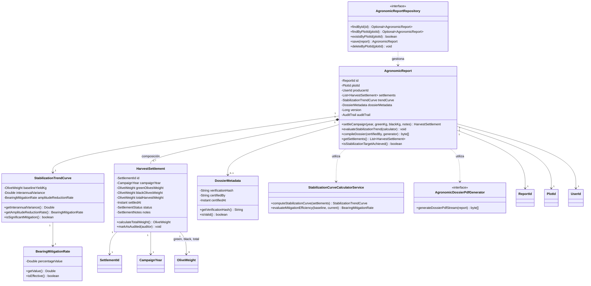
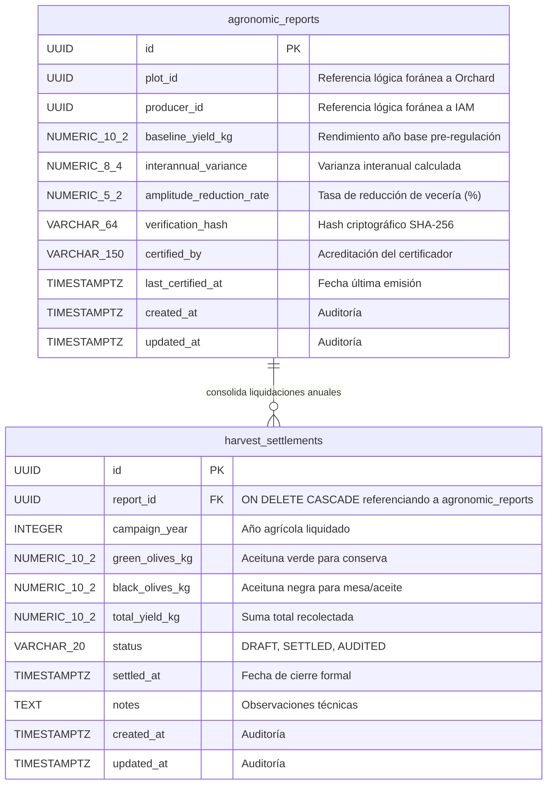
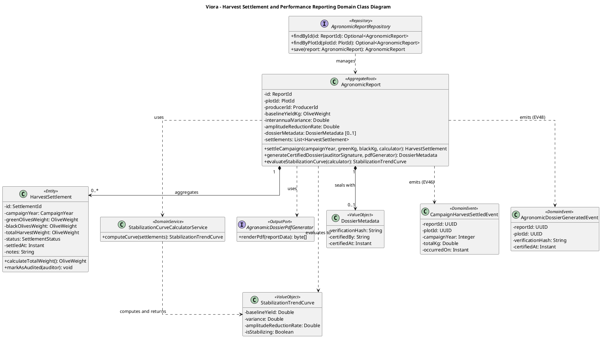
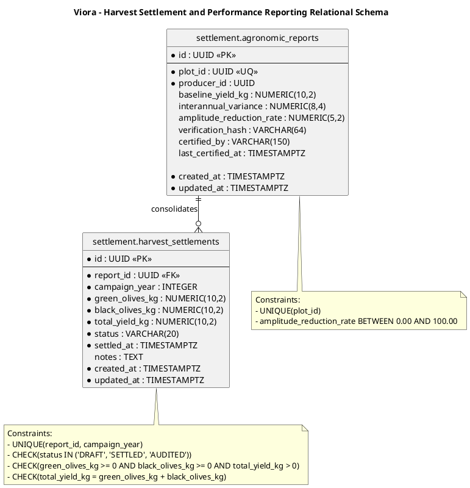

# Tactical-Level Domain-Driven Design: Harvest Settlement and Performance Reporting

---

### Bounded Context: Harvest Settlement and Performance Reporting (Harvest Settlement)

**Propósito:** El Bounded Context de **Harvest Settlement and Performance Reporting** (denominado comúnmente *Harvest Settlement*) es un subdominio central (*Core Subdomain*) del negocio de Viora, responsable de certificar el balance agronómico de fin de campaña, conciliar los pesajes auditados de cosecha diferenciados por aptitud comercial (aceituna verde para conserva y aceituna negra para mesa o extracción aceitera), computar el índice de mitigación de vecería mediante la atenuación de varianza interanual, y compilar el expediente técnico auditable en formato PDF inmutable con firma de verificación criptográfica SHA-256.

Técnica y agronómicamente, resuelve la necesidad de validar de forma objetiva y formal el éxito de las intervenciones de regulación de carga frutal (*Thinning Advisory*) en las cuencas y valles olivícolas para las variedades *Olea europaea L.* cv. Criolla, Sevillana y Manzanilla. Actúa como la única autoridad contable y certificadora del rendimiento final del olivar. Preserva una delimitación semántica estricta referenciando de manera desacoplada por identificador inmutable (`PlotId`) a las parcelas del Bounded Context *Olive Orchard and Plot Management* y por identidad (`UserId`) al productor en *IAM*, publicando de forma asíncrona la confirmación definitiva de cosecha (`CampaignHarvestSettledEvent`) para actualizar el cómputo plurianual del Índice de Vecería ($BBI$) en *Phenology & Historical Bearing Analytics*.

---

#### Domain Layer

En esta capa se modela la lógica de negocio pura, independiente de frameworks, infraestructura o mecanismos de persistencia. Comprende Aggregates, Entities, Value Objects, Domain Services, Domain Events e interfaces de Repositorios y Puertos de generación documental.

##### Aggregates y Entities

###### AgronomicReport (Aggregate Root)
* **Propósito:** Agregado raíz que centraliza la memoria productiva auditada de una parcela olivarera, gobierna la emisión de expedientes técnicos de rendimiento, administra la colección histórica de liquidaciones anuales de cosecha y salvaguarda la consistencia del análisis de estabilización interanual.
* **Atributos:**
  * `id: ReportId` (Identificador único universal / UUID v4)
  * `plotId: PlotId` (Referencia lógica foránea inmutable por ID a la parcela de *Olive Orchard and Plot Management*)
  * `producerId: UserId` (Referencia lógica foránea por ID al titular en *IAM*)
  * `settlements: List<HarvestSettlement>` (Colección interna subordinada de liquidaciones anuales de cosecha)
  * `trendCurve: StabilizationTrendCurve` (Value Object: encapsula la tasa de reducción de amplitud y varianza interanual)
  * `dossierMetadata: DossierMetadata` (Value Object: metadatos de auditoría, certificador y hash SHA-256)
  * `auditTrail: AuditTrail` (Value Object: marcas temporales inmutables `createdAt`, `updatedAt`)
* **Métodos:**
  * `settleCampaign(year: CampaignYear, greenKg: OliveWeight, blackKg: OliveWeight, notes: String): HarvestSettlement` - Valida que no exista una liquidación previa para el año agrícola (`TS39` / `US29` / `CMD29`), verifica que la suma total sea mayor a cero, instancia la entidad interna `HarvestSettlement`, recalcula la curva de estabilización si existen campañas previas y encola `CampaignHarvestSettledEvent` (EV46).
  * `evaluateStabilizationTrend(calculator: StabilizationCurveCalculatorService): void` - Invoca el servicio de dominio entregando el histórico de pesajes auditados para computar la reducción de amplitud oscilatoria y la atenuación de varianza interanual, actualizando el estado de `trendCurve` y encolando `YieldStabilizationCurveEvaluatedEvent` (EV47).
  * `compileDossier(certifiedBy: AuditorSignature, generator: AgronomicDossierPdfGenerator): byte[]` - Congela el estado del expediente, delega en el puerto de infraestructura la compilación del binario PDF, estampa el hash criptográfico SHA-256 en `dossierMetadata` y encola `AgronomicDossierGeneratedEvent` (EV48) (`TS28` / `TS40` / `US30` / `CMD30`).
  * `getSettlements(): List<HarvestSettlement>` - Retorna una vista inmutable de la colección de liquidaciones anuales.
  * `isStabilizationTargetAchieved(): boolean` - Evalúa si la reducción de varianza respecto al año base supera el umbral agronómico del 30%.
* **Invariantes y Reglas de Negocio:**
  1. **Unicidad de Liquidación por Año Agrícola:** No se permite liquidar más de una vez el mismo año agrícola (`campaignYear`) para una misma parcela.
  2. **No Negatividad y Rendimiento Positivo de Campaña:** Los pesajes de aceituna verde y negra deben ser estrictamente no negativos ($Verde \ge 0.0\text{ kg}$, $Negra \ge 0.0\text{ kg}$) y la suma consolidada no puede ser nula al formalizar el cierre ($Total = Verde + Negra > 0.0\text{ kg}$).
  3. **Inmutabilidad Transaccional del Cierre:** Una vez asentada la liquidación en estado `SETTLED` o `AUDITED`, sus volúmenes no pueden alterarse sin un proceso explícito de rectificación auditable.
  4. **Condición Mínima para Evaluación de Tendencia:** El cómputo formal de la curva de atenuación interanual exige al menos dos ($2$) campañas agrícolas registradas (una campaña base pre-intervención y al menos una campaña regulada post-aclareo).
  5. **Integridad Criptográfica del Expediente:** Todo informe en formato PDF descargado o emitido debe portar obligatoriamente un hash criptográfico SHA-256 calculado sobre el contenido binario del documento.

###### HarvestSettlement (Entity Interna de AgronomicReport)
* **Propósito:** Modela el balance cuantitativo y la clasificación comercial de aceituna cosechada en una campaña agrícola específica.
* **Atributos:**
  * `id: SettlementId` (Identificador único local / UUID)
  * `campaignYear: CampaignYear` (Año calendario agrícola cerrado, ej. 2026)
  * `greenOlivesWeight: OliveWeight` (Kilogramos netos de aceituna verde para conserva/mesa)
  * `blackOlivesWeight: OliveWeight` (Kilogramos netos de aceituna negra natural para conserva o molienda)
  * `totalYieldKg: OliveWeight` (Masa total consolidada de fruta cosechada)
  * `settledAt: Instant` (Marca temporal UTC en que se ejecutó el cierre)
  * `status: SettlementStatus` (Value Object / Enum: `DRAFT`, `SETTLED`, `AUDITED`)
  * `notes: SettlementNotes` (Observaciones técnicas de la faena o recepción en almazara)
* **Métodos:**
  * `calculateTotalWeight(): OliveWeight` - Computa la sumatoria estricta validando $Total = Verde + Negra$.
  * `markAsAudited(auditor: AuditorSignature): void` - Transiciona el estado a `AUDITED` previa verificación de boletas de pesaje.

##### Value Objects (Conceptuales e Inmutables)
* **`ReportId` / `SettlementId` / `PlotId` / `UserId`**: Identificadores únicos inmutables basados en UUID v4 con validación de no nulidad y encapsulamiento de identidad.
* **`CampaignYear`**: Entero inmutable que representa el ciclo anual del olivar (ej. 2025). Valida que no sea anterior al año 2000 ni posterior al año civil en curso.
* **`OliveWeight`**: Decimal inmutable de precisión fija ($0.01\text{ kg}$) estrictamente no negativo que representa magnitudes de masa. Provee operaciones aritméticas de suma, resta y comparación.
* **`StabilizationTrendCurve`**: Encapsula los parámetros cuantitativos de mitigación interanual:
  * `baselineYieldKg: OliveWeight` (Rendimiento del año base pre-regulación).
  * `interannualVariance: Double` (Varianza estadística observada entre campañas consecutivas).
  * `amplitudeReductionRate: BearingMitigationRate` (Porcentaje de atenuación de la oscilación de vecería).
* **`BearingMitigationRate`**: Decimal inmutable en rango $[0.00, 100.00]\%$ que cuantifica el porcentaje de reducción en la brecha productiva respecto a las fluctuaciones históricas.
* **`DossierMetadata`**: Encapsula metadatos institucionales: hash SHA-256 (`verificationHash`), marca temporal de emisión (`certifiedAt`) y nombre del auditor colegiado (`certifiedBy`).
* **`SettlementStatus`**: Enum inmutable (`DRAFT`, `SETTLED`, `AUDITED`).
* **`AuditorSignature`**: Cadena inmutable validada que contiene la acreditación del ingeniero agrónomo o certificador cooperativo.
* **`AuditTrail`**: Marcas inmutables de trazabilidad temporal (`createdAt`, `updatedAt`).

##### Domain Services
* **`StabilizationCurveCalculatorService`**:
  * **Propósito:** Servicio de dominio sin estado que encapsula el algoritmo matemático de atenuación de la alternancia productiva bienal post-regulación de carga. Compara la varianza interanual observada frente a la oscilación típica histórica del valle.
  * **Fórmulas:**
    * *Rendimiento Promedio Interanual:*
      $$\bar{Y} = \frac{1}{N} \sum_{t=1}^{N} Y_t$$
    * *Varianza Interanual de Cosecha:*
      $$S^2 = \frac{1}{N-1} \sum_{t=1}^{N} (Y_t - \bar{Y})^2$$
    * *Tasa de Reducción de Amplitud de Vecería ($ARR$):*
      $$ARR = \left( 1 - \frac{|Y_{\text{actual}} - \bar{Y}|}{\frac{1}{2} |Y_{\text{base}} - \bar{Y}| + \epsilon} \right) \times 100\%$$
  * **Métodos:**
    * `computeStabilizationCurve(settlements: List<HarvestSettlement>): StabilizationTrendCurve` - Procesa la serie histórica cronológica de liquidaciones y determina la tasa de atenuación.
    * `evaluateMitigationEfficiency(baseline: OliveWeight, current: OliveWeight): BearingMitigationRate` - Calcula la eficiencia puntual de amortiguamiento frente al año base.

##### Repositories (Interfaces en Domain)
Contratos agnósticos de persistencia y puertos de salida definidos en el dominio:
* **`AgronomicReportRepository`**:
  * `findById(id: ReportId): Optional<AgronomicReport>`
  * `findByPlotId(plotId: PlotId): Optional<AgronomicReport>`
  * `existsByPlotId(plotId: PlotId): boolean`
  * `save(report: AgronomicReport): AgronomicReport`
  * `deleteByPlotId(plotId: PlotId): void`
* **`AgronomicDossierPdfGenerator` (Puerto de Dominio):**
  * `generateDossierPdfStream(report: AgronomicReport): byte[]` - Contrato abstracto para compilar el flujo binario oficial en formato PDF a partir de los datos inmutables del agregado.

##### Domain Events
Eventos inmutables en tiempo pasado que comunican hechos transaccionales significativos del cierre de campaña:
* **`CampaignHarvestSettledEvent`**: `{ reportId: UUID, plotId: UUID, campaignYear: Integer, totalYieldKg: Double, greenKg: Double, blackKg: Double, occurredOn: Instant }` (EV46 / US29 / TS39)
  * *Disparado cuando:* El productor o cooperativa finaliza y formaliza el balance de cosecha de la campaña.
  * *Consumido por:* *Phenology & Historical Bearing Analytics* para registrar la nueva campaña y actualizar la serie histórica de Hoblyn et al.
* **`YieldStabilizationCurveEvaluatedEvent`**: `{ reportId: UUID, plotId: UUID, amplitudeReductionRate: Double, interannualVariance: Double, isEffective: boolean, occurredOn: Instant }` (EV47 / US30 / TS28)
  * *Disparado cuando:* Se evalúa y formaliza la tasa de atenuación de vecería post-aclareo.
  * *Consumido por:* Las aplicaciones móviles para refrescar el cuadro de mando y métricas de desempeño.
* **`AgronomicDossierGeneratedEvent`**: `{ reportId: UUID, plotId: UUID, verificationHash: String, certifiedBy: String, generatedAt: Instant, occurredOn: Instant }` (EV48 / US30 / TS28 / TS40)
  * *Disparado cuando:* Se compila exitosamente o certifica el expediente técnico auditable en PDF para exportación externa.

---

#### Interface Layer

En esta capa se definen los puntos de entrada y salida del sistema. Transforma solicitudes HTTP entrantes en Commands o Queries para la Application Layer y serializa los resultados del dominio en Resources (DTOs) conforme a OpenAPI 3.0 y respuestas de error RFC 7807.

##### Controllers (REST)
Diseño basado estrictamente en recursos, sustantivos en plural y verbos HTTP estándar, implementando los contratos de las Historias de Usuario US29 y US30:

* **`PlotHarvestSettlementController`** (Ruta base: `/api/v1/plots/{plotId}/harvest-settlements`):
  * `POST /api/v1/plots/{plotId}/harvest-settlements` - Asienta formalmente la liquidación de cosecha de una campaña (`TS39` / `US29` / `CMD29`). Responde `201 Created` con cabecera `Location` y cuerpo `HarvestSettlementResource`, `409 Conflict` si el año ya fue liquidado, o `400 Bad Request` ante inconsistencias de peso.
  * `GET /api/v1/plots/{plotId}/harvest-settlements` - Lista el historial cronológico completo de liquidaciones asentadas para la parcela con desglose verde/negra (`TS39` / `US29`). Admite filtrado opcional mediante parámetro de consulta `?campaignYear={year}`. Responde `200 OK` con arreglo de `HarvestSettlementResource`.
  * `GET /api/v1/plots/{plotId}/harvest-settlements/{settlementId}` - Obtiene el balance detallado de una liquidación específica identificada por su UUID (`TS39` / `US29`). Responde `200 OK` con `HarvestSettlementResource` o `404 Not Found`.

* **`PlotAgronomicReportController`** (Ruta base: `/api/v1/plots/{plotId}/agronomic-reports`):
  * `GET /api/v1/plots/{plotId}/agronomic-reports` - Consulta el expediente agronómico oficial y análisis consolidado de estabilización (`TS28` / `US30`). Implementa negociación de contenido HTTP nativa (RFC 7231 / RFC 9110):
    * Con cabecera `Accept: application/json`: entrega el análisis consolidado de atenuación de vecería ($ARR$), varianza interanual y metadatos de certificación (`200 OK` con `AgronomicReportResource`).
    * Con cabecera `Accept: application/pdf`: compila y transmite en streaming el binario inmutable del informe oficial con cabecera `Content-Disposition: attachment; filename="expediente-agronomico-[plotId].pdf"` y cabecera `ETag` portando el hash SHA-256 (`200 OK`).
  * `POST /api/v1/plots/{plotId}/agronomic-reports/certifications` - Emite formalmente la certificación colegiada del expediente agronómico inmutable calculando y estampando el hash criptográfico SHA-256 de auditoría (`TS40` / `US30` / `CMD30`). Responde `201 Created` con cabecera `Location` y cuerpo `DossierCertificationResource`.

##### Resources (DTOs / Request & Response Models)
* **`SettleHarvestRequest`**: `{ campaignYear: Integer, greenOlivesKg: Double, blackOlivesKg: Double, notes: String }` (Payload recibido en POST).
* **`CertifyDossierRequest`**: `{ auditorSignature: String, notes: String }` (Payload recibido en POST para certificación oficial).
* **`HarvestSettlementResource`**: `{ id: UUID, campaignYear: Integer, greenOlivesKg: Double, blackOlivesKg: Double, totalYieldKg: Double, status: String, settledAt: Instant, notes: String }` (DTO de respuesta).
* **`AgronomicReportResource`**: `{ reportId: UUID, plotId: UUID, producerId: UUID, baselineYieldKg: Double, interannualVariance: Double, amplitudeReductionRate: Double, isEffective: boolean, settlements: List<HarvestSettlementResource>, lastCertifiedAt: Instant, verificationHash: String }` (DTO de respuesta para métricas).
* **`DossierCertificationResource`**: `{ reportId: UUID, verificationHash: String, certifiedBy: String, generatedAt: Instant, downloadUrl: String }`

##### Assemblers / Mappers
* **`HarvestSettlementResourceAssembler`**: Convierte la entidad interna `HarvestSettlement` en el DTO `HarvestSettlementResource`.
* **`AgronomicReportResourceAssembler`**: Mapea el Aggregate Root `AgronomicReport` y sus Value Objects en `AgronomicReportResource`.
* **`SettleHarvestCommandAssembler`**: Transforma `SettleHarvestRequest` y la variable de ruta `{plotId}` en el comando `SettleCampaignHarvestCommand`.
* **`GenerateAgronomicDossierCommandAssembler`**: Transforma `CertifyDossierRequest` y la variable `{plotId}` en `GenerateAgronomicDossierCommand`.

---

#### Application Layer

Coordina y orquesta los casos de uso del sistema. No implementa reglas de negocio agronómicas, sino que gestiona transacciones, delega a repositorios y servicios de dominio, y publica eventos.

##### Command Handlers
* **`SettleCampaignHarvestCommandHandler`** (CMD29 / US29 / TS39):
  * *Entrada:* `SettleCampaignHarvestCommand` (`plotId`, `campaignYear`, `greenOlivesKg`, `blackOlivesKg`, `notes`)
  * *Flujo:* Inicia transacción demarcada (`@Transactional`) -> recupera o inicializa `AgronomicReport` para el `plotId` mediante `AgronomicReportRepository` -> invoca `report.settleCampaign(...)` delegando el recálculo en `StabilizationCurveCalculatorService` -> persiste el agregado modificado en el repositorio -> despacha eventos generados (`CampaignHarvestSettledEvent` EV46 y `YieldStabilizationCurveEvaluatedEvent` EV47).
* **`GenerateAgronomicDossierCommandHandler`** (CMD30 / US30 / TS40 / TS28):
  * *Entrada:* `GenerateAgronomicDossierCommand` (`plotId`, `auditorSignature`)
  * *Flujo:* Carga el agregado `AgronomicReport` -> invoca `report.compileDossier(signature, pdfGenerator)` -> obtiene el arreglo de bytes binario -> actualiza metadatos de auditoría persistidos y hash SHA-256 -> publica `AgronomicDossierGeneratedEvent` (EV48) -> retorna `DossierMetadata`.

##### Query Handlers
* **`GetAgronomicReportByPlotQueryHandler`** (US30 / TS28):
  * Resuelve `GetAgronomicReportByPlotQuery` recuperando el agregado del predio y mapeándolo a `AgronomicReportResource` para alimentar los gráficos de estabilización en el cliente móvil y web.
* **`ListPlotHarvestSettlementsQueryHandler`** (US29 / TS39):
  * Resuelve `ListPlotHarvestSettlementsQuery` retornando la colección histórica de campañas ordenadas cronológicamente por `campaignYear`.
* **`GetHarvestSettlementByIdQueryHandler`** (US29 / TS39):
  * Resuelve `GetHarvestSettlementByIdQuery` filtrando la liquidación puntual solicitada por su identificador único universal (`settlementId`).
* **`GetAgronomicDossierQueryHandler`** (US30 / TS28):
  * Resuelve `GetAgronomicDossierQuery` retornando el flujo binario inmutable del PDF o los metadatos auditables según el encabezado `Accept` negociado por el cliente HTTP.

##### Event Handlers
* **`OnThinningExecutionConfirmedEventHandler`** (POL18 / US29 / Flujo 4 en Domain Message Flows):
  * *Disparador:* Escucha `ThinningExecutionConfirmedEvent` (EV44) emitido por *Crop Load Regulation & Thinning Advisory*.
  * *Acción:* Registra la confirmación de la labor de aclareo frutal en la bitácora del ciclo para vincular el volumen de remoción ejecutado con el balance final cosechado en fin de campaña (`POL18`).
* **`OnHistoricalBearingIndexAssessedEventHandler`** (Flujo Inter-Contexto Phenology -> Harvest / US20):
  * *Disparador:* Escucha `BiennialBearingIndexAssessedEvent` (EV27) emitido por *Phenology & Historical Bearing Analytics*.
  * *Acción:* Actualiza los indicadores de severidad de vecería ($BBI$) del lote como referencia de contraste para la curva de atenuación interanual.

---

#### Infrastructure Layer

Clases que acceden a la base de datos relacional PostgreSQL e implementaciones concretas de los Repositorios y adaptadores de infraestructura.

##### 1. Paquetes y componentes principales
* **Persistence:**
  * `PostgresAgronomicReportRepository`: Implementa la interfaz `AgronomicReportRepository` de Dominio delegando en Spring Data JPA.
  * `AgronomicReportJpaEntity` y `HarvestSettlementJpaEntity`: Entidades JPA mapeadas con `@Entity`, `@Table` y relaciones de composición `@OneToMany(cascade = CascadeType.ALL, orphanRemoval = true)`.
  * `AgronomicReportEntityMapper`: Convertidor bidireccional Dominio <-> JPA.
* **Adapters / Binary Documents:**
  * `OpenPdfAgronomicDossierAdapter`: Implementa el puerto `AgronomicDossierPdfGenerator` utilizando la biblioteca **OpenPDF** para maquetar el expediente oficial con encabezados institucionales, resúmenes de pesaje y firma SHA-256.
* **Events:**
  * `SpringDomainEventPublisher`: Emite eventos de dominio hacia el bus interno de la aplicación mediante `ApplicationEventPublisher`.
* **Configuration:**
  * `HarvestSettlementJpaConfig`: Habilita auditoría JPA (`@EnableJpaAuditing`) y gestión transaccional (`@EnableTransactionManagement`).
  * `HarvestSettlementSecurityConfig`: Control de autorización basado en JWT verificando titularidad del predio (`ROLE_PRODUCER`, `ROLE_GESTOR`).

##### 2. Modelo de datos y mapeos
Estructura relacional en PostgreSQL para las tablas de este Bounded Context:

* **Tabla: `agronomic_reports`**
  ```sql
  CREATE TABLE agronomic_reports (
      id                       UUID PRIMARY KEY,
      plot_id                  UUID NOT NULL,                    -- Referencia lógica foránea a Orchard BC
      producer_id              UUID NOT NULL,                    -- Referencia lógica foránea a IAM BC
      baseline_yield_kg        NUMERIC(10, 2),
      interannual_variance     NUMERIC(8, 4),
      amplitude_reduction_rate NUMERIC(5, 2),
      verification_hash        VARCHAR(64),                      -- Hash SHA-256 del último PDF oficial
      certified_by             VARCHAR(150),                     -- Firma del auditor agronómico
      last_certified_at        TIMESTAMPTZ,
      version                  BIGINT NOT NULL DEFAULT 0,        -- Control de concurrencia optimista
      created_at               TIMESTAMPTZ NOT NULL,
      updated_at               TIMESTAMPTZ NOT NULL,
      CONSTRAINT uq_report_plot UNIQUE (plot_id),
      CONSTRAINT chk_reduction_rate CHECK (amplitude_reduction_rate BETWEEN 0.00 AND 100.00)
  );
  ```

* **Tabla: `harvest_settlements`**
  ```sql
  CREATE TABLE harvest_settlements (
      id              UUID PRIMARY KEY,
      report_id       UUID NOT NULL REFERENCES agronomic_reports(id) ON DELETE CASCADE,
      campaign_year   INTEGER NOT NULL,
      green_olives_kg NUMERIC(10, 2) NOT NULL,
      black_olives_kg NUMERIC(10, 2) NOT NULL,
      total_yield_kg  NUMERIC(10, 2) NOT NULL,
      status          VARCHAR(20) NOT NULL,                      -- 'DRAFT', 'SETTLED', 'AUDITED'
      settled_at      TIMESTAMPTZ NOT NULL,
      notes           TEXT,
      created_at      TIMESTAMPTZ NOT NULL,
      updated_at      TIMESTAMPTZ NOT NULL,
      CONSTRAINT uq_settlement_report_year UNIQUE (report_id, campaign_year),
      CONSTRAINT chk_weights_non_neg CHECK (green_olives_kg >= 0 AND black_olives_kg >= 0 AND total_yield_kg > 0),
      CONSTRAINT chk_weight_sum CHECK (total_yield_kg = green_olives_kg + black_olives_kg),
      CONSTRAINT chk_settlement_status CHECK (status IN ('DRAFT', 'SETTLED', 'AUDITED'))
  );
  ```

* **Índices y Restricciones Físicas:**
  * Índice de búsqueda rápida para liquidaciones por campaña y estado:
    ```sql
    CREATE INDEX idx_hs_year_status ON harvest_settlements (campaign_year, status);
    ```
  * Índice para el expediente por parcela:
    ```sql
    CREATE INDEX idx_ar_plot_id ON agronomic_reports (plot_id);
    ```
  * Índice de auditoría cronológica:
    ```sql
    CREATE INDEX idx_hs_settled_at ON harvest_settlements (settled_at DESC);
    ```

* **Mapeo Entity <-> Persistencia:**
  * Dominio -> DB: El mapper descompone `StabilizationTrendCurve` en las columnas escalares `baseline_yield_kg`, `interannual_variance` y `amplitude_reduction_rate`. Los Value Objects `OliveWeight` se persisten como valores numéricos de alta precisión (`NUMERIC(10, 2)`).
  * DB -> Dominio: Reconstrucción controlada del agregado respetando el estado de concurrencia de la columna `@Version`.

##### 3. Repositories – Implementación
* **`PostgresAgronomicReportRepository`**:
  * Implementa `AgronomicReportRepository` utilizando `SpringDataJpaAgronomicReportRepository`.
  * Gestiona las liquidaciones anuales subordinadas `harvest_settlements` mediante cascada total y remoción de huérfanos.
  * Garantiza atomicidad transaccional `@Transactional` en las liquidaciones anuales y recálculos estadísticos.

##### 4. Seguridad & Resiliencia
* **Autorización Estricta por Predio:** Validación obligatoria mediante Spring Security de que el usuario autenticado sea titular del `plotId` o posea el rol administrativo `ROLE_GESTOR`.
* **Idempotencia de Cierre:** Restricción física `UNIQUE (report_id, campaign_year)` que previene duplicación ante fallos o reintentos en conexiones móviles inestables.
* **Integridad Criptográfica del Documento:** El código hash SHA-256 generado durante la compilación binaria se almacena en `verification_hash`, permitiendo verificar la autenticidad física o digital del documento ante la cooperativa.
* **Manejo Centralizado de Excepciones (RFC 7807):** Estructuras `ProblemDetail` ante duplicidad de año (`409 Conflict`), pesos nulos (`400 Bad Request`) o predio no encontrado (`404 Not Found`).

##### 5. Perspectiva Táctica de la Aplicación Móvil (Android / Flutter)
Para habilitar el registro ágil de pesajes al pie de báscula en el campo o centro de acopio y la consulta/descarga segura del expediente técnico con conectividad intermitente, el Bounded Context extiende componentes tácticos hacia el cliente móvil:
* **Caché Local y Consultas Offline (`HarvestSettlementCacheDao` / `SettlementDatabase`):**
  * En **Android nativo**, se implementa una base de datos local SQLite mediante **Room** (`@Database`, `@Dao`, `@Entity`) con la tabla `cached_harvest_settlements` y `cached_agronomic_reports`. En **Flutter**, se utiliza **sqflite** / **drift** para estructurar la persistencia local de liquidaciones históricas.
  * Permite al productor consultar balances de campañas anteriores, el histórico de pesajes verde/negra y las métricas de mitigación de vecería ($ARR$) en parcelas remotas sin cobertura celular.
* **Sincronización Resiliente de Liquidaciones (`SettlementSyncWorker` / WorkManager):**
  * Ante la formalización del pesaje en zonas desconectadas, el comando se encola en una tabla local `pending_settlements` gestionada por **Android Jetpack WorkManager** (`CoroutineWorker`) o un servicio en segundo plano en Flutter.
  * Al restablecerse la conectividad HTTPS, el worker despacha la solicitud `POST /api/v1/plots/{plotId}/harvest-settlements` con cabecera de idempotencia basada en el UUID local para evitar duplicación.
* **Descarga Segura y Visor de Expedientes PDF (`DossierDownloadManager`):**
  * La aplicación móvil gestiona la descarga en streaming del PDF mediante `DownloadManager` de Android o el paquete `flutter_downloader` / `dio`, almacenándolo en el directorio privado de la aplicación (`getExternalFilesDir` / `getApplicationDocumentsDirectory`).
  * **Verificación de Integridad SHA-256:** Al completar la descarga, un componente utilitario computa el hash criptográfico del archivo local empleando la biblioteca `java.security.MessageDigest` o el paquete Dart `crypto`, contrastándolo contra la cabecera `ETag` y el campo `verification_hash` del backend para certificar que el informe no sufrió alteraciones o corrupciones en tránsito.
  * **Visualización:** Integración con visores PDF nativos o embebidos (`PdfRenderer` en Android / `flutter_pdfview` en Flutter) para que el productor pueda exhibir el expediente oficial ante la junta directiva de la cooperativa.

---

#### Bounded Context Software Architecture Component Level Diagrams

En esta sección se describe la descomposición y el flujo de comunicación entre los componentes de software dentro del contenedor Backend (Spring Boot), detallando cómo interactúan las cuatro capas del Bounded Context:

##### 1. Descomposición de Componentes por Capa
* **Interface / API Layer:**
  * `PlotHarvestSettlementController`: Expone endpoints REST para registro, listado y consulta de liquidaciones anuales.
  * `PlotAgronomicReportController`: Expone la entrega del análisis consolidado de estabilización (JSON), la certificación oficial y la consulta/descarga del dossier oficial vía content negotiation.
* **Application Layer:**
  * Command Handlers (`SettleCampaignHarvestCommandHandler`, `GenerateAgronomicDossierCommandHandler`): Orquestan casos de uso transaccionales.
  * Query Handlers (`GetAgronomicReportByPlotQueryHandler`, `ListPlotHarvestSettlementsQueryHandler`, `GetHarvestSettlementByIdQueryHandler`, `GetAgronomicDossierQueryHandler`): Resuelven consultas y transformaciones a DTO o streaming binario.
  * Event Handlers (`OnThinningExecutionConfirmedEventHandler`, `OnHistoricalBearingIndexAssessedEventHandler`): Integración reactiva inter-contexto.
* **Domain Layer:**
  * Agregado Raíz `AgronomicReport`, Entidad Interna `HarvestSettlement`, Value Objects cuantitativos y el servicio puro `StabilizationCurveCalculatorService`.
  * Interfaces de Repositorio `AgronomicReportRepository` y el puerto `AgronomicDossierPdfGenerator`.
* **Infrastructure Layer:**
  * `PostgresAgronomicReportRepository` sobre base de datos PostgreSQL.
  * `OpenPdfAgronomicDossierAdapter` para compilación documental en memoria.
  * `SpringDomainEventPublisher` para la publicación de eventos en el bus del sistema.

```mermaid
graph TD
    subgraph ClientLayer ["Clientes & Contextos Externos"]
        MobileApp["Aplicación Móvil Viora (Android / Flutter)"]
        WebPortal["Portal Web Cooperativo (Angular / React)"]
        ThinningBC["Crop Load Regulation BC (Emisor EV44)"]
        PhenologyBC["Phenology & Analytics BC (Consumidor EV46)"]
    end

    subgraph InterfaceLayer ["Interface Layer"]
        SettlementCtrl["PlotHarvestSettlementController"]
        ReportCtrl["PlotAgronomicReportController"]
    end

    subgraph ApplicationLayer ["Application Layer"]
        SettlementCmdHandler["SettleCampaignHarvestCommandHandler"]
        GenerateDossierCmdHandler["GenerateAgronomicDossierCommandHandler"]
        ReportQueryHandlers["Query Handlers: (GetReport, ListSettlements, GetSettlementById, GetDossier)"]
        EventHandlers["Event Handlers: (OnThinningConfirmed, OnBbiAssessed)"]
    end

    subgraph DomainLayer ["Domain Layer"]
        ReportAR["AgronomicReport (Aggregate Root)"]
        SettlementEntity["HarvestSettlement (Entity)"]
        StabilizationService["StabilizationCurveCalculatorService (Domain Service)"]
        RepoInterfaces["Interfaces de Dominio y Puertos: (AgronomicReportRepo, PdfGeneratorPort)"]
        DomainEvents["Domain Events: (EV46, EV47, EV48)"]
    end

    subgraph InfrastructureLayer ["Infrastructure Layer"]
        PostgresRepo["PostgresAgronomicReportRepository"]
        OpenPdfAdapter["OpenPdfAgronomicDossierAdapter"]
        EventPublisher["SpringDomainEventPublisher"]
        PostgreSQL[("Base de Datos PostgreSQL")]
    end

    MobileApp -->|HTTPS / REST| SettlementCtrl
    MobileApp -->|HTTPS / REST| ReportCtrl
    WebPortal -->|HTTPS / REST| ReportCtrl
    ThinningBC -.->|EV44 ThinningExecutionConfirmed| EventHandlers

    SettlementCtrl --> SettlementCmdHandler
    SettlementCtrl --> ReportQueryHandlers
    ReportCtrl --> GenerateDossierCmdHandler
    ReportCtrl --> ReportQueryHandlers

    SettlementCmdHandler --> ReportAR
    SettlementCmdHandler --> StabilizationService
    SettlementCmdHandler --> RepoInterfaces

    GenerateDossierCmdHandler --> ReportAR
    GenerateDossierCmdHandler --> RepoInterfaces

    ReportQueryHandlers --> RepoInterfaces

    ReportAR --> DomainEvents
    SettlementCmdHandler --> EventPublisher
    GenerateDossierCmdHandler --> EventPublisher
    EventPublisher -.->|EV46 CampaignHarvestSettled| PhenologyBC

    RepoInterfaces <|.. PostgresRepo
    RepoInterfaces <|.. OpenPdfAdapter
    PostgresRepo --> PostgreSQL
```

##### 2. Flujo de Comunicación y Conectividad
1. **Entrada:** La aplicación móvil emite una petición `POST` con los kilogramos de aceituna verde y negra asentados en campo hacia `PlotHarvestSettlementController`.
2. **Transformación:** El controlador valida restricciones sintácticas (`@Valid`, `@PositiveOrZero`), convierte el payload en `SettleCampaignHarvestCommand` mediante su Assembler y delega en la Application Layer.
3. **Orquestación de Dominio:** `SettleCampaignHarvestCommandHandler` inicia una transacción (`@Transactional`), carga el agregado `AgronomicReport` de la parcela o lo inicializa si es el primer cierre auditado.
4. **Ejecución y Reglas:** Se invoca `settleCampaign()`, verificando la unicidad del año agrícola, computando el total y delegando en `StabilizationCurveCalculatorService` el cálculo de varianza interanual y tasa de reducción de vecería ($ARR$).
5. **Persistencia:** El Handler invoca `save()` sobre `AgronomicReportRepository`. La capa de infraestructura mapea el agregado a entidades JPA (`AgronomicReportJpaEntity` y `HarvestSettlementJpaEntity`) ejecutando sentencias SQL atómicas en PostgreSQL.
6. **Integración Externa / Eventos:** `SpringDomainEventPublisher` despacha `CampaignHarvestSettledEvent` (EV46), el cual es recibido de forma asíncrona por *Phenology & Historical Bearing Analytics* para alimentar el cómputo del $BBI$ de Hoblyn.
7. **Generación y Certificación Documental:** Ante una solicitud `POST .../certifications`, `GenerateAgronomicDossierCommandHandler` genera y estampa la firma y hash SHA-256 (`EV48`). Ante `GET .../dossier` con cabecera `Accept: application/pdf`, `GetAgronomicDossierQueryHandler` delega en `OpenPdfAgronomicDossierAdapter`, el cual renderiza el binario inmutable y estampa el hash criptográfico para streaming directo.

---

#### Bounded Context Software Architecture Code Level Diagrams

##### Bounded Context Domain Layer Class Diagrams

En esta sección se describe la estructura formal del modelo de clases del Domain Layer, detallando clases participantes, visibilidad, signaturas de métodos y relaciones:

##### 1. Estructura de Clases y Estereotipos
* **`AgronomicReport` (Aggregate Root):** Centraliza la memoria de cosechas y el tracking de estabilización interanual. Sus campos son privados (`-`) y sus métodos son públicos (`+`).
* **`HarvestSettlement` (Entity Interna):** Modela el pesaje comercial auditado de una campaña agrícola.
* **Value Objects:** `ReportId`, `SettlementId`, `PlotId`, `UserId`, `CampaignYear`, `OliveWeight`, `StabilizationTrendCurve`, `BearingMitigationRate`, `DossierMetadata`, `SettlementStatus`, `AuditTrail`.
* **Domain Service:** `StabilizationCurveCalculatorService`.
* **Interfaces y Puertos:** `AgronomicReportRepository` y `AgronomicDossierPdfGenerator`.



##### 2. Relaciones y Conectividad entre Clases
* **Composición (`1 *-- 0..*`):** `AgronomicReport` ejerce gobierno transaccional sobre `HarvestSettlement`. La eliminación de un reporte purga en cascada todas sus liquidaciones subordinadas.
* **Asociación / Atributo (`-->`):** Las entidades encapsulan Value Objects inmutables (`OliveWeight`, `CampaignYear`, `StabilizationTrendCurve`, `DossierMetadata`).
* **Dependencia (`..>`):** La raíz del agregado delega en `StabilizationCurveCalculatorService` para la matemática de varianza y en `AgronomicDossierPdfGenerator` para compilar el archivo binario.
* **Referencias desacopladas por ID:** Las entidades foráneas se asocian exclusivamente a través de los Value Objects `PlotId` (hacia Orchard) y `UserId` (hacia IAM).

---

##### Bounded Context Database Design Diagram

En esta sección se detalla el diseño físico y relacional de la base de datos en PostgreSQL, describiendo tablas, tipos de datos, claves primarias, claves foráneas, restricciones de integridad e índices:

##### 1. Tablas y Estructura de Claves
* **Tabla Principal `agronomic_reports`:** Cabecera de expedientes agronómicos e indicadores de vecería por predio.
  * Clave primaria: `id` (UUID).
  * Clave foránea lógica: `plot_id` (UUID, referencia lógica externa a Orchard).
  * Clave foránea lógica: `producer_id` (UUID, referencia lógica externa a IAM).
* **Tabla Subordinada `harvest_settlements`:** Liquidaciones anuales de cosecha desagregadas.
  * Clave primaria: `id` (UUID).
  * Clave foránea física: `report_id` (UUID) con regla `ON DELETE CASCADE` vinculada a `agronomic_reports(id)`.

##### 2. Relaciones y Cardinalidad Relacional
* **Relación 1 a N (`agronomic_reports` a `harvest_settlements`):** Un expediente de parcela consolida una liquidación anual por cada campaña agrícola concluida.



##### 3. Índices y Reglas de Integridad
* **Restricciones `CHECK` a Nivel de Motor:**
  * Estados válidos de liquidación: `status IN ('DRAFT', 'SETTLED', 'AUDITED')`.
  * Tasa de reducción válida: `amplitude_reduction_rate BETWEEN 0.00 AND 100.00`.
  * No negatividad y consistencia de pesaje: `green_olives_kg >= 0 AND black_olives_kg >= 0 AND total_yield_kg > 0`.
  * Validación de suma contable: `total_yield_kg = green_olives_kg + black_olives_kg`.
* **Índices Únicos:**
  * `CREATE UNIQUE INDEX uq_report_plot ON agronomic_reports (plot_id);` (Un único reporte consolidado por parcela).
  * `CREATE UNIQUE INDEX uq_settlement_report_year ON harvest_settlements (report_id, campaign_year);` (Imposibilita duplicar liquidaciones para un mismo año en un predio).
* **Índices de Optimización de Búsqueda:**
  * B-tree sobre `(campaign_year, status)` en `harvest_settlements` para consultas anuales y conciliación cooperativa.
  * B-tree sobre `(plot_id)` en `agronomic_reports` para agilizar la carga del agregado desde la API REST.

---

### Anexo de Diagramas como Código (3 Herramientas)

#### 1. Structurizr DSL (C4 Model - Component Level)

```structurizr
workspace "Viora - Harvest Settlement Component Architecture" "Harvest Settlement and Performance Reporting Component View" {
    model {
        viora = softwareSystem "Viora Platform" {
            nativeApp = container "Android Application" "Mobile client with Room offline harvest dossier cache" "Kotlin / Jetpack Compose"
            crossApp = container "Cross-Platform Application" "Mobile client with sqflite offline harvest dossier cache" "Flutter / Dart"
            
            androidDb = container "Android Local Database" "Local offline SQLite database for settlements and reports cache" "Room / SQLite" {
                tags "Database"
            }
            crossDb = container "Cross-Platform Local Database" "Local offline SQLite database for settlements and reports cache" "sqflite / SQLite" {
                tags "Database"
            }

            backend = container "Modular Backend API" "Spring Boot core service" "Java / Spring Boot" {
                settlementCtrl = component "PlotHarvestSettlementController" "Exposes annual harvest weighing settlement endpoints" "Spring MVC Controller"
                reportCtrl = component "PlotAgronomicReportController" "Exposes stabilization curves, certification, and PDF dossier download" "Spring MVC Controller"
                
                settlementCommandService = component "HarvestSettlementCommandService" "Coordinates harvest settlement and dossier certification" "Spring Service / Command Service"
                reportQueryService = component "AgronomicReportQueryService" "Handles queries for settlements, ARR stabilization curves, and dossier PDF streaming" "Spring Service / Query Service"
                
                curveCalculator = component "StabilizationCurveCalculatorService" "Calculates interannual variance and amplitude reduction rate (ARR)" "Domain Service"
                pdfGenerator = component "OpenPdfAgronomicDossierAdapter" "Infrastructure adapter compiling binary PDF documents with SHA-256 seal" "Infrastructure Port / Adapter"
                
                reportRepo = component "AgronomicReportRepository" "Domain repository interface for agronomic report persistence" "Domain Port / Interface"
                reportRepoAdapter = component "JpaAgronomicReportRepositoryAdapter" "PostgreSQL Spring Data JPA implementation for settlements" "Spring Data JPA Adapter"
                eventPublisher = component "SpringDomainEventPublisher" "Dispatches domain events" "Spring ApplicationEventPublisher"
            }
            db = container "Viora Database" "PostgreSQL Relational Store" "PostgreSQL" {
                tags "Database"
            }
        }

        nativeApp -> androidDb "Reads / writes settlements and reports cache [SQLite / Room]"
        crossApp -> crossDb "Reads / writes settlements and reports cache [SQLite / sqflite]"
        nativeApp -> settlementCtrl "Settles harvest [POST /plots/{id}/harvest-settlements]"
        crossApp -> settlementCtrl "Settles harvest [POST /plots/{id}/harvest-settlements]"
        nativeApp -> reportCtrl "Downloads dossier PDF [GET .../agronomic-reports Accept: application/pdf]"
        crossApp -> reportCtrl "Downloads dossier PDF [GET .../agronomic-reports Accept: application/pdf]"

        settlementCtrl -> settlementCommandService "Delegates SettleCampaignHarvestCommand"
        settlementCtrl -> reportQueryService "Delegates settlement list/get queries"
        reportCtrl -> settlementCommandService "Delegates GenerateAgronomicDossierCommand"
        reportCtrl -> reportQueryService "Delegates GetAgronomicDossierQuery"

        settlementCommandService -> curveCalculator "Computes ARR curve and variance"
        settlementCommandService -> pdfGenerator "Compiles dossier PDF and stamps SHA-256"
        settlementCommandService -> reportRepo "Loads / persists reports via domain port"
        settlementCommandService -> eventPublisher "Publishes Harvest Settled and Dossier Generated events"

        reportQueryService -> reportRepo "Fetches reports via domain port"

        reportRepoAdapter -> reportRepo "Implements persistence contract"
        reportRepoAdapter -> db "CRUD operations on settlement.* tables [JDBC/JPA]"
    }
    views {
        component backend "SettlementComponentView" "Harvest Settlement Component Architecture" {
            include *
            autoLayout lr
        }
        styles {
            element "Database" {
                shape Cylinder
                background #1168bd
                color #ffffff
            }
        }
        theme default
    }
}
```

#### 2. PlantUML (Domain Layer Class Diagram)



#### 3. PlantUML (Database Relational Diagram - ERD)



