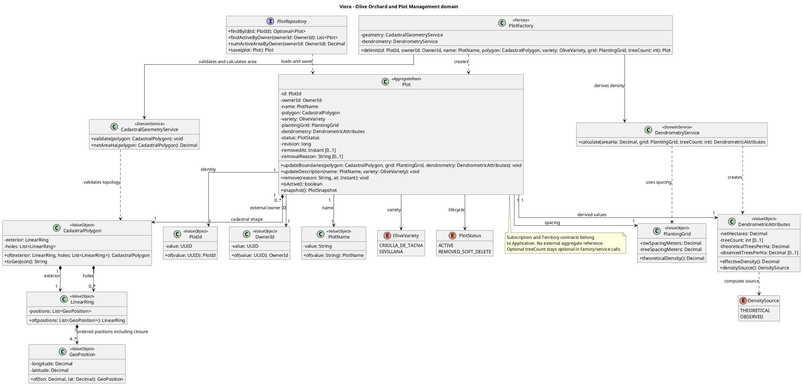

# Tactical-Level Domain-Driven Design: Olive Orchard and Plot Management

Este documento presenta el diseño táctico propuesto de **Olive Orchard and Plot Management** para Viora. Detalla responsabilidades, clases, contratos, persistencia e interacciones del bounded context y sus colaboradores. Las reglas de negocio se ejecutan en el Backend API compartido por Android Application y Cross-platform Application; los clientes implementan presentación, acceso a datos y adaptadores de plataforma.

La propuesta se basa en US06–US12, los comandos CMD09–CMD14, los eventos EV10–EV17, las políticas POL01–POL02, los agregados AGG03–AGG04, los canvases de ambos contextos y el C4 corregido de la sesión anterior. Es un diseño para implementar, no una descripción de código ya existente.

**Criterios de coherencia:**

- Se conserva el monolito modular Java/Spring Boot, PostgreSQL, Kotlin/Jetpack Compose y Flutter/Dart. Los módulos colaboran mediante contratos Java y eventos internos; no se introducen microservicios ni un broker externo.
- Mercado Pago pertenece a la infraestructura de Subscription. Mapbox se consume desde los clientes móviles; Orchard valida y calcula la geometría en el backend sin depender de una llamada a Mapbox.
- Se aplica el C4 corregido sin Cloudinary, fotografías de perfil ni evidencia fotográfica. Open-Meteo y Brevo conservan sus responsabilidades en otros contextos.
- Los productores y gestores pueden utilizar cualquiera de las dos aplicaciones. El rol no determina la tecnología del cliente.
- Los identificadores de otros contextos son referencias lógicas. No se importan sus entidades ni se crean claves foráneas entre sus tablas.
- Los ejemplos de la plantilla se adaptan al dominio: no obligan a introducir servicios externos, operaciones CRUD o clases que Viora no necesita.

**Precisiones frente a documentos anteriores:** la emisión comercial de códigos se asigna a Subscription; Territory conserva el padrón y la autorización institucional. La baja de parcelas es lógica conforme a CMD14, AGG04 y el canvas; US11 requiere corregir sus referencias a pérdida permanente de trazabilidad. Los nombres de eventos existentes se conservan sin añadirles el sufijo `Event`. Las clases auxiliares, endpoints y mecanismos de concurrencia que se desarrollan aquí constituyen decisiones tácticas propuestas.

**Convenciones del diccionario:** atributos privados y métodos públicos, salvo indicación contraria; Value Objects y mensajes inmutables, con igualdad por valor. `Decimal` equivale a `BigDecimal` en Java. `Instant` expresa tiempo UTC; los períodos son intervalos semiabiertos `[startsAt, endsAt)`. Los identificadores son UUID no nulos. Los getters de lectura se representan por `snapshot()` en las raíces y por accesores inmutables en los VO. Ningún setter permite eludir invariantes. Las dependencias de los handlers se inyectan como atributos privados finales. Los comandos llevan `actorId` y `operationId` internos; el actor procede de la sesión verificada y no de un campo libre del request.


---

### Bounded Context: Olive Orchard and Plot Management

**Propósito:** establece la base espacial y dendrométrica de las parcelas olivareras. Registra titular, nombre, polígono catastral, variedad y marco de plantación; calcula superficie neta y densidad. Es proveedor del contexto predial utilizado por Telemetry, Phenology y Thinning.

Conserva al titular como `OwnerId`, vinculado lógicamente con la identidad del productor. Consulta derechos y cuota en Subscription. Para la lectura cooperativa obtiene de Territory el alcance autorizado de productores; la parcela no almacena una copia del padrón. No calcula BBI, no ingiere clima, no registra muestreos ni emite prescripciones. Se mantiene `Plot` como raíz AGG04; el nombre del bounded context no obliga a inventar un agregado `Orchard` sin comportamiento ni requisitos propios.

#### Domain Layer

##### Aggregates y Entities

###### Plot (Aggregate Root)

**Propósito:** protege la consistencia entre geometría, superficie, caracterización y estado de una unidad predial homogénea. No contiene sensores, campañas ni listas de muestreos de otros contextos.

**Atributos:**

- `id: PlotId`, `ownerId: OwnerId`, `name: PlotName`.
- `polygon: CadastralPolygon`, `variety: OliveVariety`, `plantingGrid: PlantingGrid`, `dendrometry: DendrometricAttributes`.
- `status: PlotStatus` (`ACTIVE`, `REMOVED_SOFT_DELETE`).
- `revision: long`, `removedAt: Instant?`, `removalReason: String?`.

**Métodos:**

- `updateBoundaries(polygon: CadastralPolygon, grid: PlantingGrid, dendrometry: DendrometricAttributes): void`: aplica resultados coherentes de los servicios de dominio y aumenta revisión.
- `updateDescription(name: PlotName, variety: OliveVariety): void`: modifica caracterización de parcela activa y aumenta revisión.
- `remove(reason: String, at: Instant): void`: cambia a baja lógica y aumenta revisión; una repetición idéntica no emite un nuevo evento ni libera área dos veces.
- `isActive(): boolean`, `snapshot(): PlotSnapshot`: consulta inmutable.

**Invariantes y reglas de negocio:**

1. El polígono es un GeoJSON `Polygon`, con coordenadas longitud/latitud WGS84. Su anillo exterior tiene al menos tres vértices distintos y cuatro posiciones contando el cierre; no se admiten cruces, degeneración ni coordenadas no finitas.
2. La superficie neta es **estrictamente mayor de `0.10 ha`**, conforme a AGG04/CMD12. Es distinta del mínimo inclusivo `0.1 ha` de la cuota comercial. Una cuota de exactamente `0.1 ha` no permite registrar una parcela; el catálogo debe ofrecer cupos compatibles y no ocultar esa diferencia.
3. La superficie y densidad persistidas las calcula el backend. Los valores mostrados por el móvil son previsualizaciones, no entradas autoritativas para el cupo.
4. El marco tiene distancias positivas en metros. La densidad teórica es `10000 / (rowSpacingMeters * treeSpacingMeters)`, en árboles/ha.
5. El conteo total es opcional y representa árboles observados; nunca se presenta la estimación geométrica como un censo real. Si existe, la densidad observada es `treeCount / netHectares`. Sin conteo, se utiliza densidad teórica y se identifica su origen.
6. Una parcela activa pertenece a un único productor y una variedad: `CRIOLLA_DE_TACNA` o `SEVILLANA`. No se cambia titular mediante una actualización genérica.
7. El alta y los cambios de área requieren membresía efectiva y `sumaAreaActivaAnterior - areaAnterior + areaNueva <= cuota`. La igualdad con la cuota está permitida.
8. La baja no está condicionada por el estado de las prescripciones de aclareo. La ficha de `CMD14` enunciaba esa condición como invariante clave; una restricción que abarca dos agregados alojados en contextos distintos no puede sostenerse como invariante, dado que las invariantes se verifican dentro de un único límite transaccional. `Paso6_policies.md` la formaliza como `POL16`, política de consistencia eventual resuelta por compensación en el contexto propietario de la prescripción, que reacciona a `PlotRemoved` anulando las pendientes. Este contexto no consulta a Thinning ni inspecciona sus tablas.
9. La baja conserva identidad, geometría, revisiones e historial de otros contextos. Libera superficie del inventario activo una sola vez. La consulta de trazabilidad debe conservar autorización aunque la parcela esté archivada.

No se definen entidades internas adicionales: geometría y dendrometría son VO. Las revisiones de persistencia son registros de auditoría inmutables, no agregados `Campaign` ni entidades `Tree` inventadas para este contexto.

##### Value Objects (Conceptuales e Inmutables)

| Clase | Atributos | Métodos y validación |
|---|---|---|
| `PlotId`, `OwnerId` | `value: UUID` | `of(value): Id`; UUID no nulo; `OwnerId` traduce `ProducerId` en el límite semántico. |
| `PlotName` | `value: String` | `of(value): PlotName`; texto normalizado no vacío, máximo propuesto 120 caracteres. No se impone unicidad global. |
| `GeoPosition` | `longitude: Decimal`, `latitude: Decimal` | `of(lon, lat)`; longitud `[-180,180]`, latitud `[-90,90]`, valores finitos. |
| `LinearRing` | `positions: List<GeoPosition>` | `of(positions)`; cerrado, mínimo cuatro posiciones y tres vértices distintos. |
| `CadastralPolygon` | `exterior: LinearRing`, `holes: List<LinearRing>` | `of(exterior, holes)`, `toGeoJson(): String`; anillos simples, huecos dentro del exterior sin cruces ni solapamientos. |
| `PlantingGrid` | `rowSpacingMeters: Decimal`, `treeSpacingMeters: Decimal` | `theoreticalDensity(): Decimal`; ambos positivos. |
| `DendrometricAttributes` | `netHectares: Decimal`, `treeCount: int?`, `theoreticalTreesPerHa: Decimal`, `observedTreesPerHa: Decimal?` | `effectiveDensity(): Decimal`, `densitySource(): DensitySource`; área `>0.1`, conteo no negativo cuando exista y densidades derivadas. |

`OliveVariety`, `PlotStatus` y `DensitySource` (`THEORETICAL`, `OBSERVED`) son enumeraciones. Los huecos permiten excluir sectores no productivos del área neta, aunque la primera interfaz pueda capturar solo el anillo exterior; su soporte geométrico es una decisión táctica. Importación Shapefile/KML y subdivisión de parcelas quedan fuera del alcance definido.

##### Domain Services y Factories

- **`CadastralGeometryService`**: servicio puro, sin red; `validate(polygon): void` y `netAreaHa(polygon): Decimal`. Valida topología y calcula área geodésica exterior menos huecos. No aplica la fórmula cartesiana de área directamente a grados de latitud/longitud. Una implementación Java debe emplear cálculo geodésico o proyección métrica adecuada, con algoritmo/versionado explícito y pruebas de referencia.
- **`DendrometryService`**: `calculate(areaHa: Decimal, grid: PlantingGrid, treeCount: int?): DendrometricAttributes`. Separa densidad teórica y observada. No se inventa un umbral agronómico de tolerancia para rechazar diferencias: ese umbral no está definido en las fuentes. Las validaciones obligatorias aseguran unidades, positividad y coherencia matemática; las diferencias se muestran para revisión.
- **`PlotFactory`**: atributos `geometry: CadastralGeometryService`, `dendrometry: DendrometryService`; `delimit(id, ownerId, name, polygon, variety, grid, treeCount): Plot`. Crea un agregado válido, revisión inicial 1, emitiendo `PlotDelimited`. No consulta Subscription ni guarda datos; Application verifica cuota antes de persistir.

##### Repositories (Interfaces en Domain)

**`PlotRepository`**:

- `findById(id: PlotId): Optional<Plot>`: incluye estado para comprobar acceso o trazabilidad.
- `findActiveByOwner(ownerId: OwnerId): List<Plot>`: inventario del titular; las listas públicas paginadas usan proyecciones.
- `sumActiveAreaByOwner(ownerId: OwnerId): Decimal`: suma del área canónica de parcelas activas.
- `save(plot: Plot): Plot`: persiste actualización y revisión; no expone borrado físico.

##### Domain Events

Usan el mismo sobre inmutable `eventId`, `aggregateId`, `occurredOn`, `schemaVersion`. Incorporan `plotId`, `ownerId` y `revision` para identificar entradas y evitar aplicar revisiones antiguas.

| Evento | Payload específico | Disparador / consumidores |
|---|---|---|
| `PlotDelimited` — EV15 | `plotId`, `ownerId`, `revision`, `polygon`, `variety`, `plantingGrid`, `dendrometry` | Alta válida. Telemetry, Phenology y Thinning pueden crear/actualizar sus proyecciones propias. |
| `PlotBoundariesUpdated` — EV16 | mismos campos, instantánea completa actualizada | Modificación de límites, marco o caracterización dentro de CMD13. Se conserva el nombre histórico; el contrato documenta que contiene la caracterización vigente. |
| `PlotRemoved` — EV17 | `plotId`, `ownerId`, `revision`, `removedAt`, `reason` | Baja lógica. La UI la refleja mediante lectura; consumidores invalidan proyecciones activas sin borrar historial. Este consumo interno es refinamiento táctico del evento existente. |

La actualización del nombre/variedad forma parte del handler CMD13 y produce un solo EV16 con la revisión final. La clase no publica eventos parciales incoherentes después de cada setter; Application recoge el evento final de la operación.

#### Interface Layer

##### Controllers (REST)

**`PlotController`**, atributos `commands: PlotCommandFacade`, `queries: PlotQueryFacade`, `assembler: PlotResourceAssembler`:

- `create()` → `POST /api/v1/plots`: ejecuta `DelimitPlot`, devuelve `201` y `Location`.
- `get()` → `GET /api/v1/plots/{id}`: titular o gestor con alcance predial vigente.
- `list()` → `GET /api/v1/plots?status=ACTIVE&page=0&size=20`: ámbito propio por defecto. El filtro cooperativo exige autorización institucional y limita propietarios desde Territory.
- `update()` → `PUT /api/v1/plots/{id}`: sustituye datos editables mediante `UpdatePlotBoundaries`; exige revisión/`If-Match`. No acepta owner, área, densidad, estado comercial ni cuota como campos editables.
- `remove()` → `DELETE /api/v1/plots/{id}`: `RemovePlot`, baja lógica y `204`. El motivo puede transmitirse como query `?reason=...` con longitud limitada; la UI pide confirmación y explica que el histórico se conserva.

La sintaxis malformada produce `400`, geometría/valores inválidos `422`, falta de identidad `401`, falta de permisos `403` o `404` para no revelar recursos, y cuota excedida `409`. Una revisión obsoleta en `If-Match` produce `412`. No se confía en un `ownerId` enviado por la aplicación.

##### Resources (DTOs / Request & Response Models)

- **`CreatePlotRequest`**: `{ name: String, polygon: GeoJsonPolygonResource, variety: String, plantingGrid: PlantingGridResource, treeCount: int? }`.
- **`UpdatePlotRequest`**: mismos campos editables; versión se transmite en `If-Match`.
- **`GeoJsonPolygonResource`**: `{ type: "Polygon", coordinates: List<List<List<Decimal>>> }`; longitud antes que latitud.
- **`PlantingGridResource`**: `{ rowSpacingMeters: Decimal, treeSpacingMeters: Decimal }`.
- **`PlotResource`**: `{ id, ownerId, name, polygon, variety, plantingGrid, netHectares, treeCount?, theoreticalTreesPerHa, observedTreesPerHa?, densitySource, status, revision, audit }`.
- **`PlotPageResource`**: `{ content: List<PlotResource>, page, size, totalElements }`.

Todos son records de transporte sin comportamiento del negocio. **`PlotResourceAssembler.toResource(snapshot, audit)`** traduce VO; **`PlotCommandAssembler.toCommand(request, principal, operationId, expectedRevision)`** tipa y contextualiza comandos. La geometría y las unidades se verifican nuevamente en Domain.

#### Application Layer

##### Command Handlers

| Clase / entrada | Dependencias privadas | Flujo |
|---|---|---|
| `DelimitPlotCommandHandler` / `DelimitPlot` — CMD12 | `plots`, `factory`, `quotaPort`, `producerGate`, `idempotency`, `eventDispatcher` | Obtiene titular autenticado; construye geometría/cálculos; dentro del bloqueo por productor comprueba suscripción y suma activa; valida cuota propuesta; guarda parcela y revisión; despacha EV15. |
| `UpdatePlotBoundariesCommandHandler` / `UpdatePlotBoundaries` — CMD13 | `plots`, `geometry`, `dendrometry`, `quotaPort`, `producerGate`, `plotGate`, `idempotency`, `eventDispatcher` | Verifica titular; adquiere bloqueo productor → parcela; vuelve a cargar estado y revisión; recalcula superficie; valida sustitución de área; actualiza límites/descripción; guarda revisión y EV16. |
| `RemovePlotCommandHandler` / `RemovePlot` — CMD14 | `plots`, `producerGate`, `plotGate`, `idempotency`, `eventDispatcher` | Verifica titular; bloquea productor → parcela; aplica baja lógica; registra revisión y EV17. El área deja de contarse por el cambio de estado. |

La baja puede ejecutarse aunque la membresía haya vencido: permite ordenar el inventario sin otorgar acceso al motor agronómico. Es una decisión táctica que evita impedir al productor reducir superficie. Las altas y ediciones sí exigen membresía vigente. No se usa una caché de eventos para autorizar el cupo.

##### Query Handlers

- **`GetPlotByIdQueryHandler`**: atributos `plots`, `plotAccess`; `handle(GetPlotById): PlotSnapshot`. Devuelve detalle autorizado.
- **`ListPlotsQueryHandler`**: `plotReadStore`, `plotAccess`; `handle(ListPlots): Page<PlotSnapshot>`. Filtra propietarios y estado en servidor antes de paginar.
- **`GetPlotContextQueryHandler`**: `plots`, `moduleAccess`; `handle(GetPlotContext): PlotContextSnapshot`. Contrato interno que expone ubicación, geometría, variedad, marco, densidades, estado y revisión a Telemetry, Phenology y Thinning. No entrega la entidad JPA.

`PlotCommandFacade` y `PlotQueryFacade` son las fachadas del módulo. `PlotAccessPolicyService.requireRead(actorId, plotId)` y `requireOwner(actorId, plotId)` orquestan autorización; para un gestor consumen `CooperativeScopePort.authorizedProducerIds(actorId, cooperativeId)`. Ser gestor no concede escritura sobre parcelas ajenas. El listado cooperativo une proyecciones mediante contratos, sin SQL directo a Territory.

##### Event Handlers

**`OnSubscriptionActivatedEventHandler`**, atributo `entitlementProjection`: `handle(SubscriptionActivated): void`; actualiza una proyección para consulta, identificando evento y versión. No crea parcelas ni incrementa cuota sobre una copia anterior. La comprobación autoritativa siempre se realiza por `SubscriptionQuotaPort`.

Los manejadores de EV15/EV16 pertenecen a los módulos consumidores. Una nueva geometría invalida entradas derivadas para futuros cálculos; los resultados históricos conservan la revisión con la que se calcularon. No se crea un nodo de telemetría automáticamente: US13 mantiene su registro explícito.

##### Puertos de aplicación y consistencia entre contextos

- **`SubscriptionQuotaPort.validateChange(ownerId, currentHa, replacedHa, proposedHa, at): EntitlementSnapshot`**: traduce `OwnerId` a `ProducerId` y consume `SubscriptionQuotaFacade`.
- **`PlotTransactionGate.withLock(plotId, work)`**: serializa las operaciones internas que mutan una misma parcela, de modo que una edición de límites y una baja concurrentes no se pisen. Es un mecanismo interno de este contexto; ningún otro bounded context lo adquiere.
- **`CooperativeScopePort.authorizedProducerIds(actorId, cooperativeId)`**: usa autorización y padrón de Territory. No crea una dependencia entre entidades del dominio.

**Control de hectáreas:** todas las altas, cambios y bajas del mismo productor, junto con cambios de su derecho comercial, utilizan el mismo `ProducerTransactionGate`. En una transacción PostgreSQL, Orchard suma áreas activas, Subscription comprueba estado/vigencia y cuota por su contrato, y Orchard persiste. Dos altas concurrentes no leen el mismo saldo libre porque la segunda espera y vuelve a sumar después del commit de la primera. Los bloqueos se liberan con commit/rollback. No basta con `@Version` sobre cada parcela ni con una consulta de cuota realizada antes de empezar la transacción.

**Precisión:** el área canónica de cada parcela se redondea hacia arriba a seis decimales de ha; esa misma cifra se usa en suma, comparación y persistencia. La cifra de pantalla puede redondearse para lectura, pero no modifica el cupo. Se conserva `calculationVersion` en la revisión para reproducibilidad. La densidad se calcula sobre el área canónica; ninguna comparación comercial usa `double`.

#### Infrastructure Layer

##### 1. Paquetes y componentes principales

| Clase | Atributos, métodos y responsabilidad |
|---|---|
| `PostgresPlotRepository` | `jpa: PlotJpaRepository`, `mapper: PlotEntityMapper`, `revisionStore`; implementa los cuatro métodos de `PlotRepository`. |
| `PlotJpaEntity` | Campos de `orchard.plots`, `@Version`; `polygon` como JSONB y UUID externo simple. |
| `PlotRevisionJpaEntity` | Campos de `orchard.plot_revisions`; instantánea append-only por `(plot_id, revision)`. |
| `PlotEntityMapper` | `toDomain(entity)` y `toJpa(plot)`; rehidrata sin EV15 y conserva escalas/unidades. |
| `InProcessSubscriptionQuotaAdapter` | `subscriptionQuotaFacade`; implementa el puerto de cupo y traduce IDs/DTO sin llamadas HTTP entre módulos. |
| `InProcessCooperativeScopeAdapter` | `territoryContract`; devuelve alcance autorizado y nunca amplía permisos a partir de datos del cliente. |
| `PostgresPlotTransactionGate` | `gateStore`, `transactionManager`; implementa el bloqueo estable por parcela. |
| `PostgresPlotReadStore` | `jdbc/jpa`; consultas paginadas y proyecciones de mapa con filtros obligatorios de titularidad. |
| `OrchardJpaConfig` | Configura repositorios, JSONB, transacciones, auditoría, reloj y servicios puros de cálculo. |

La implementación geodésica es una biblioteca local de cálculo, no un nuevo servicio externo. El dominio depende de una abstracción geométrica propia; un adaptador de biblioteca puede sustituirse sin cambiar comandos, JSON público ni tablas. No se añade PostGIS como requisito no presente en C4; JSONB más cálculo validado en Java es suficiente para esta propuesta.

##### 2. Modelo de datos y mapeos

`orchard.plots` almacena el estado actual y `orchard.plot_revisions` la instantánea de cada alta, modificación y baja. `OwnerId`, `PlotName`, `PlantingGrid` y dendrometría se aplanan. Los anillos se serializan como GeoJSON JSONB. La versión de concurrencia (`lock_version`) es distinta de `revision`, que identifica la versión de negocio compartida en eventos y cálculos.

El snapshot de revisión contiene polígono, nombre, variedad, marco, área, conteo/densidades, estado y motivo de baja; incluye la versión del algoritmo. No se duplica una cosecha ni se actualizan retrospectivamente prescripciones ajenas. Las referencias externas son lógicas; solo `plot_revisions.plot_id` tiene FK interna.

##### 3. Repositories – Implementación

`save()` guarda estado y revisión dentro de la transacción del handler. `sumActiveAreaByOwner` utiliza `SUM(net_hectares)` con filtro de propietario y `ACTIVE`. La protección transaccional se adquiere antes de calcular esa suma. La base rechaza áreas fuera de rango y evita revisiones duplicadas; la validez topológica y la compatibilidad dendrométrica se garantizan por los servicios de dominio, no por un `CHECK` superficial sobre JSONB.

##### 4. Seguridad & Resiliencia

Se comprueba propiedad para mutaciones y alcance cooperativo para consultas. La falta de respuesta del contrato de cuotas produce fallo recuperable y rollback, nunca aprobación por defecto. Las actualizaciones usan revisión esperada y las creaciones claves idempotentes para impedir duplicados ante reintentos móviles.

La captura de muestras offline pertenece a Thinning. En estos dos contextos las mutaciones se confirman en línea; una geometría en edición puede ser un borrador local, pero no se considera parcela registrada ni cuota reservada hasta recibir confirmación del servidor. Las cachés locales están separadas por cuenta y se limpian/inaccesibilizan al cerrar sesión. No almacenan tokens JWT en tablas de parcelas.

#### Bounded Context Software Architecture Component Level Diagrams

##### 1. Descomposición de Componentes por Capa

En Backend API, **Mobile REST API** recibe comandos y consultas, mientras **Orchard and Plot Management** contiene orquestación, `Plot`, servicios puros, repositorios y adaptadores internos. Su conexión a **Subscription and Membership** verifica cuota. El contrato adicional con **Cooperative Operations** desarrolla la consulta cooperativa; se identifica en el DSL como refinamiento del C4, sin añadir contenedores. **Thinning Advisory** consume el contexto predial y reacciona a los eventos de ciclo de vida de la parcela, sin exponer contrato hacia este contexto.

En Android y Flutter, **Plot Management UI** delega en **Feature Repositories** y **Plot Map Adapter**. Mapbox representa y edita; **Backend API Client** transmite GeoJSON al backend. **Local Data Access** conserva caché por cuenta en la base local correspondiente. La ubicación GPS se usa en el dispositivo para captura/visualización; no se persiste el desplazamiento del gestor como entidad de Orchard.

##### 2. Flujo de Comunicación y Conectividad

1. La pantalla recibe vértices de Mapbox o GPS y los transforma en GeoJSON.
2. El controlador traduce el request a CMD12/CMD13 con identidad verificada.
3. Application calcula geometría y dendrometría con servicios puros; bajo bloqueo valida cuota autoritativa.
4. La raíz incorpora el estado válido; el repositorio guarda parcela y revisión en PostgreSQL.
5. Los eventos internos comunican la revisión a los consumidores; la respuesta presenta área y densidades del servidor.
6. En una consulta cooperativa, el backend resuelve primero el alcance del gestor. Las aplicaciones reciben solo las parcelas autorizadas.

Las vistas C4 focalizadas se encuentran en el **Anexo A**. Los almacenes PostgreSQL y SQLite se detallan con diagramas de datos; no se fuerzan componentes ficticios dentro de ellos. La landing solo presenta información comercial y enlaces, y el simulador pertenece a Telemetry: no se les atribuyen clases de estos contextos.

#### Bounded Context Software Architecture Code Level Diagrams

##### Bounded Context Domain Layer Class Diagrams

El **Anexo B.2** muestra `Plot` y sus VO, con atributos privados, métodos públicos y multiplicidades. La composición de anillos/coordenadas representa valores inmutables; no significa que existan entidades `Vertex` con identidad persistente. `PlotRepository` depende de la raíz; `PlotFactory` depende de los servicios geométrico y dendrométrico. Los contratos de Subscription y Territory pertenecen a Application y quedan fuera del diagrama de dominio puro.

##### Bounded Context Database Diagram

El **Anexo C.2** muestra `plots 1 → 1..N plot_revisions`, donde el mínimo de una revisión se asegura al crear la parcela en una transacción. `owner_id` no es FK a IAM. La FK interna de revisiones utiliza `ON DELETE RESTRICT` para proteger trazabilidad. No se utiliza `ON DELETE CASCADE` sobre información agronómica.

El índice `(owner_id, status)` acelera inventario y suma de área; `(plot_id, revision)` es único. La validación de polígonos no se reduce a comprobar que el JSON tiene una clave `type`. El DDL del **Anexo D** explicita qué garantiza PostgreSQL y qué corresponde al dominio.


#### Diccionario complementario de clases móviles de Orchard

Estas clases implementan los mismos casos de uso en ambos productos. No replican la autoridad del modelo de dominio Java. Los nombres de componentes C4 permanecen inalterados; las clases siguientes viven dentro de ellos.

| Componente | Android / Kotlin | Cross-platform / Dart | Estado y métodos |
|---|---|---|---|
| Plot Management UI | `PlotListScreen`, `PlotEditorScreen`, `PlotViewModel` | `PlotListPage`, `PlotEditorPage`, `PlotViewModel` | `state: PlotUiState`, `repository`, `mapAdapter`; `load(scope)`, `edit(id)`, `save(draft)`, `remove(id, reason)`. |
| Plot Map Adapter | `AndroidPlotMapAdapter` | `FlutterPlotMapAdapter` | `mapController`; `render(polygons)`, `captureBoundary()`, `toGeoJson()`, `showDeviceLocation()`. El GPS denegado permite encuadrar parcelas existentes. |
| Feature Repositories | `SubscriptionRepository`, `PlotRepository` (paquete cliente) | `SubscriptionRepository`, `PlotRepository` (paquete cliente) | `api`, `cache`; `getCurrentSubscription()`, `createCheckout()`, `redeemCode()`, `generateCodes()`, `listPlots()`, `savePlot()`, `removePlot()`. Contratos de datos, distintos de las interfaces de dominio del backend. |
| Backend API Client | `SubscriptionApi`, `PlotApi` con Retrofit/OkHttp | `SubscriptionApi`, `PlotApi` con Dio | `http`, `session`; métodos HTTP tipados para los recursos enumerados. JWT solo al backend, no a Mapbox ni a checkout. |
| Local Data Access | `PlotCacheDao`, `EntitlementCacheDao` | `PlotCacheStore`, `EntitlementCacheStore` | `database`; `upsert(accountId, snapshot)`, `read(accountId)`, `clear(accountId)`. Room / sqflite. |

Los ViewModels gestionan carga, éxito, error y estado pendiente. Las pantallas renderizan mediante `render(state)`/`build(context)` y despachan acciones; sus modelos inmutables contienen `isLoading`, `error?` y recursos/snapshots, sin activar suscripciones ni recalcular cupos. Las declaraciones de repositorio agrupan aquí sus métodos por módulo, aunque cada clase implementa solo los de su bounded context.

##### Persistencia local por producto

Ambas bases SQLite mantienen el mismo contrato lógico: `plot_cache` con PK compuesta `(account_id, plot_id)`, GeoJSON, caracterización, área/densidades calculadas por servidor, revisión y `fetched_at`; `entitlement_cache` con PK `account_id`, contrato, estado, cuota, período y `fetched_at`. Los payloads se almacenan como TEXT JSON, no como JSONB. Una FK externa no enlaza SQLite con PostgreSQL. El **Anexo C.3** muestra la tabla correspondiente a este bounded context y el **Anexo D** incluye SQL SQLite reutilizable por Room y sqflite.

Una caché de derechos no permite aprobar operaciones comerciales sin conexión. Los repositorios móviles refrescan después del checkout, canje o edición. En un mapa cooperativo, `account_id` es la cuenta del gestor que obtuvo autorización y `owner_id` sigue siendo el productor; no se confunden ambos campos.

---


## Matriz de trazabilidad y decisiones pendientes

| Requisito / contrato | Diseño táctico | Persistencia / frontera |
|---|---|---|
| US09, CMD12, EV15 | PlotFactory, geometría, dendrometría y cuota | Parcela/revisión en Orchard; cuota consultada a Subscription. |
| US10, CMD13, EV16 | Revisión esperada y recálculo al editar | Misma área canónica en comparación y almacenamiento. |
| US11, CMD14, EV17 | Baja lógica sin condicionamiento externo | Historial retenido; Thinning compensa por evento. |
| US12 | Lectura cooperativa autorizada y mapa | Alcance desde Territory; Mapbox en ambos clientes. |

Se requiere acordar con el equipo: precios y escalones de hectáreas; alta institucional y vigencia corporativa; reemisión/liberación de códigos vencidos; cancelación, reembolso, renovación y cambio entre modalidades; tolerancia agronómica entre densidad observada y teórica. Ninguna de esas decisiones se presenta aquí como requisito ya aprobado.

**Ajustes documentales identificados:** corregir US11 para conservar trazabilidad; unificar en todos los textos la propiedad comercial de códigos en Subscription; evitar presentar un cupo de `0.1 ha` como suficiente para una parcela cuyo mínimo es estrictamente mayor; completar el C4 global con el contrato de consulta a Territory que aquí se explicita. Estas precisiones permiten revisar diferencias reales, sin afirmar una coherencia absoluta que las fuentes originales todavía no tienen.


## Fuentes locales y uso de los anexos

- Plantilla proporcionada: `C:/Users/Daron/Downloads/plantilla-tactical-ddd.md`.
- Statement del curso: `D:/mov-chatgpt-work/Trabajo Final_1ACC0238_202620 (1).pdf`, secciones Tactical-Level DDD y Tecnología; extracción consultada en `tmp/pdfs/viora/statement.txt`.
- C4 vigente: `D:/mov-chatgpt-work/output/viora/c4/VioraArchitecture-no-cloudinary.dsl`. La memoria anterior contiene decisiones de medios ya sustituidas, por lo que no se adopta como autoridad para reincorporarlos.
- Requisitos: `D:/mov-viora-project/mov-viora-report/report/chapters/20-requirements-development-software-solution-design/24-requirements-specification.md`, US06–US12.
- Dominio: `../bounded-context-canvases/08-subscription-and-cooperative-membership.md`, `04-olive-orchard-and-plot-management.md` y `docs/event-storming/Paso1_domain_events.md`, `Paso5_commands.md`, `Paso6_policies.md`, `Paso9_aggregates.md`, dentro del repositorio del informe.

Los diagramas se entregan como fuentes editables incluidas en este Markdown autocontenido. C4 utiliza Structurizr DSL y las clases UML utilizan PlantUML, conforme a la alternativa Diagram-as-Code del Statement. Los diagramas de base de datos en PlantUML son una representación auxiliar; para la entrega institucional en **LucidChart o Vertabelo**, se proporciona DDL de importación. No se afirma haber publicado diagramas en esas herramientas ni validado visualmente un render que no se haya generado.


**Referencia de formato del equipo:** `telemetry-tactical-ddd.md` y `phenology-and-analytics-tactical-ddd.md`, ambos en `docs/tactical-ddd/`. Se conserva la organización por capas y diccionarios. Las fuentes C4/UML usan las herramientas Diagram-as-Code indicadas por el Statement. El borrador de Territory en `docs/tactical-ddd/cooperative-operations-tactical-ddd.md` aún ubica códigos comerciales en Cooperative; requiere alinear esa propiedad con Subscription según el C4 vigente, sin mantener dos autoridades de canje.


## Anexo A. Componentes C4: Backend API, Android y Flutter

```structurizr
workspace "Viora - Tactical DDD focus" "Subscription and Orchard component views, derived from the corrected C4." {
    !impliedRelationships false
    model {
        producer = person "Olive Producer" "Manages own subscription and plots."
        manager = person "Cooperative Technical Manager" "Issues financed invitations and reads authorised member plots."
        payment = softwareSystem "Mercado Pago" "Hosted checkout and authoritative payment status."
        mapbox = softwareSystem "Mapbox" "Map rendering and boundary capture."
        viora = softwareSystem "Viora" "Olive alternate-bearing mitigation." {
            api = container "Backend API" "Shared modular backend." "Java / Spring Boot" {
                httpApi = component "Mobile REST API" "Controllers, resources and command/query dispatch." "Spring MVC"
                iam = component "Identity and Access" "Identity, JWT validation and roles." "Spring Security"
                profiles = component "Profile Management" "Profile readiness and contact data." "Spring / Java"
                subscription = component "Subscription and Membership" "Handlers, contract domain, repositories, payment ACL and webhook." "Spring / Java / JPA"
                orchard = component "Orchard and Plot Management" "Handlers, Plot domain, geometry, repositories and access policies." "Spring / Java / JPA"
                territory = component "Cooperative Operations" "Institutional scope and member registry." "Spring / Java"
                telemetry = component "Agroclimatic Telemetry" "Consumes authorised plot location." "Spring / Java"
                phenology = component "Phenology and Bearing Analytics" "Consumes plot variety and revision." "Spring / Java"
                thinning = component "Thinning Advisory" "Consumes plot context and reacts to plot lifecycle events." "Spring / Java"
            }
            db = container "Viora Database" "Owned schemas and transactional persistence." "PostgreSQL"
            nativeDb = container "Android Local Database" "Account-scoped cache." "Room / SQLite"
            crossDb = container "Cross-platform Local Database" "Account-scoped cache." "sqflite / SQLite"
            native = container "Android Application" "Role-based mobile client." "Kotlin / Android" {
                aPlans = component "Subscription UI" "Plans, entitlement, redemption and invitations." "Compose / ViewModel"
                aPlots = component "Plot Management UI" "Authorised plot list and editor." "Compose / ViewModel"
                aCoop = component "Cooperative Operations UI" "Member map and invitation entry points." "Compose / ViewModel"
                aCheckout = component "Hosted Checkout Coordinator" "Opens backend-issued checkout and rechecks status." "Android Custom Tabs"
                aMaps = component "Plot Map Adapter" "Map rendering, GPS and GeoJSON capture." "Mapbox Maps SDK"
                aFeatures = component "Feature Repositories" "REST contracts and account-scoped cache." "Coroutines / Flow"
                aClient = component "Backend API Client" "HTTP resources and authenticated requests." "Retrofit / OkHttp"
                aSession = component "Session Manager" "Account scope and protected credentials." "Android Keystore"
                aLocal = component "Local Data Access" "Cache transactions and invalidation." "Room DAO"
            }
            cross = container "Cross-platform Application" "Role-based mobile client." "Flutter / Dart" {
                fPlans = component "Subscription UI" "Plans, entitlement, redemption and invitations." "Widgets / ChangeNotifier"
                fPlots = component "Plot Management UI" "Authorised plot list and editor." "Widgets / ChangeNotifier"
                fCoop = component "Cooperative Operations UI" "Member map and invitation entry points." "Widgets / ChangeNotifier"
                fCheckout = component "Hosted Checkout Coordinator" "Opens backend-issued checkout and rechecks status." "url_launcher"
                fMaps = component "Plot Map Adapter" "Map rendering, GPS and GeoJSON capture." "mapbox_maps_flutter"
                fFeatures = component "Feature Repositories" "REST contracts and account-scoped cache." "Future / Stream"
                fClient = component "Backend API Client" "HTTP resources and authenticated requests." "Dio"
                fSession = component "Session Manager" "Account scope and protected credentials." "flutter_secure_storage"
                fLocal = component "Local Data Access" "Cache transactions and invalidation." "sqflite"
            }
        }
        httpApi -> iam "Validates identity and role" "Java / in-process"
        httpApi -> subscription "Dispatches subscription commands and queries" "Java / in-process"
        httpApi -> orchard "Dispatches plot commands and queries" "Java / in-process"
        profiles -> subscription "ProfileCreated" "Internal synchronous event"
        orchard -> subscription "Checks effective entitlement and hectare change under producer lock" "Java module contract"
        subscription -> orchard "SubscriptionActivated; refreshes read projection" "Internal synchronous event"
        subscription -> territory "CooperativeCodeRedeemed; POL02 affiliation" "Cross-context domain event / eventual consistency"
        subscription -> territory "Verifies authorised institutional manager" "Java module contract / tactical refinement"
        orchard -> territory "Resolves authorised cooperative producer scope" "Java module contract / tactical refinement"
        thinning -> orchard "Reads active plot and revision before prescription" "Java module contract"
        telemetry -> orchard "Reads plot location and geometry" "Java module contract"
        phenology -> orchard "Reads variety and dendrometry" "Java module contract"
        subscription -> payment "Creates checkout and verifies payment" "HTTPS / JSON"
        payment -> subscription "Signed payment notification to module webhook" "HTTPS"
        subscription -> db "Persists owned commercial records" "JPA / JDBC"
        orchard -> db "Persists plots and revisions" "JPA / JDBC"
        producer -> aPlans "Manages own plan and membership"
        producer -> aPlots "Manages own plots"
        manager -> aCoop "Reads member plots and starts invitations"
        manager -> aPlans "Issues authorised invitations"
        aPlans -> aFeatures "Reads plans and redeems/issues codes" "In-process"
        aPlans -> aCheckout "Starts hosted checkout" "In-process"
        aCheckout -> aFeatures "Creates checkout and rechecks server status" "In-process"
        aCheckout -> payment "Opens hosted checkout" "HTTPS / browser"
        aPlots -> aFeatures "Loads and changes authorised plots" "In-process"
        aPlots -> aMaps "Renders and captures polygon" "In-process"
        aCoop -> aFeatures "Loads authorised scope and starts code issuance" "In-process"
        aCoop -> aMaps "Renders authorised member polygons" "In-process"
        aMaps -> mapbox "Loads map resources" "HTTPS / SDK"
        aFeatures -> aClient "Requests REST resources" "In-process"
        aFeatures -> aLocal "Reads and refreshes scoped cache" "In-process"
        aClient -> aSession "Reads account-scoped token" "In-process"
        aClient -> api "Sends commands and queries" "HTTPS / JSON / JWT"
        aLocal -> nativeDb "Persists local cache" "SQLite"
        producer -> fPlans "Manages own plan and membership"
        producer -> fPlots "Manages own plots"
        manager -> fCoop "Reads member plots and starts invitations"
        manager -> fPlans "Issues authorised invitations"
        fPlans -> fFeatures "Reads plans and redeems/issues codes" "In-process"
        fPlans -> fCheckout "Starts hosted checkout" "In-process"
        fCheckout -> fFeatures "Creates checkout and rechecks server status" "In-process"
        fCheckout -> payment "Opens hosted checkout" "HTTPS / browser"
        fPlots -> fFeatures "Loads and changes authorised plots" "In-process"
        fPlots -> fMaps "Renders and captures polygon" "In-process"
        fCoop -> fFeatures "Loads authorised scope and starts code issuance" "In-process"
        fCoop -> fMaps "Renders authorised member polygons" "In-process"
        fMaps -> mapbox "Loads map resources" "HTTPS / SDK"
        fFeatures -> fClient "Requests REST resources" "In-process"
        fFeatures -> fLocal "Reads and refreshes scoped cache" "In-process"
        fClient -> fSession "Reads account-scoped token" "In-process"
        fClient -> api "Sends commands and queries" "HTTPS / JSON / JWT"
        fLocal -> crossDb "Persists local cache" "SQLite"
    }
    views {

        component api "OrchardBackend" {
            include httpApi iam orchard subscription territory thinning telemetry phenology db
            autoLayout lr
        }

        component native "OrchardAndroid" {
            include producer manager aPlots aCoop aMaps aFeatures aClient aSession aLocal nativeDb api mapbox
            autoLayout lr
        }

        component cross "OrchardFlutter" {
            include producer manager fPlots fCoop fMaps fFeatures fClient fSession fLocal crossDb api mapbox
            autoLayout lr
        }
        styles {
            element "Person" {
                shape Person
                background #397146
                color #ffffff
            }
            element "Component" {
                shape Component
                background #eaf2f8
                color #17354a
            }
        }
    }
}
```


## Anexo B.2. Clases del Domain Layer




## Anexo B.3. Eventos del bounded context

```plantuml
@startuml
title Viora - immutable domain event contracts
skinparam classAttributeIconSize 0
skinparam linetype ortho
hide empty members


class PlotDelimited <<DomainEvent>> {
  -eventId: UUID
  -aggregateId: UUID
  -occurredOn: Instant
  -schemaVersion: int
  -plotId: UUID
  -ownerId: UUID
  -revision: long
  -polygon: CadastralPolygon
  -variety: OliveVariety
  -plantingGrid: PlantingGrid
  -dendrometry: DendrometricAttributes
  +payload(): ImmutableRecord
}
class PlotBoundariesUpdated <<DomainEvent>> {
  -eventId: UUID
  -aggregateId: UUID
  -occurredOn: Instant
  -schemaVersion: int
  -plotId: UUID
  -ownerId: UUID
  -revision: long
  -polygon: CadastralPolygon
  -variety: OliveVariety
  -plantingGrid: PlantingGrid
  -dendrometry: DendrometricAttributes
  +payload(): ImmutableRecord
}
class PlotRemoved <<DomainEvent>> {
  -eventId: UUID
  -aggregateId: UUID
  -occurredOn: Instant
  -schemaVersion: int
  -plotId: UUID
  -ownerId: UUID
  -revision: long
  -removedAt: Instant
  -reason: String
  +payload(): ImmutableRecord
}
note "Private final fields; public read-only record accessors.
Events are dispatched by Application inside the transaction." as N
@enduml
```


## Anexo C.2. Modelo relacional de Orchard

```plantuml
@startuml
title Viora - Orchard physical data model
hide circle
skinparam linetype ortho
entity "orchard.plots" as orchard_plots {
  * id: UUID <<PK>>
  * owner_id: UUID
  * name: VARCHAR(120)
  * polygon: JSONB
  * variety: VARCHAR(32)
  * row_spacing_m: NUMERIC(12,4)
  * tree_spacing_m: NUMERIC(12,4)
  * net_hectares: NUMERIC(18,6)
  tree_count: INTEGER
  * theoretical_trees_per_ha: NUMERIC(20,6)
  observed_trees_per_ha: NUMERIC(20,6)
  * status: VARCHAR(24)
  * revision: BIGINT
  * lock_version: BIGINT
  removed_at: TIMESTAMPTZ
  removal_reason: VARCHAR(500)
  * created_at: TIMESTAMPTZ
  * updated_at: TIMESTAMPTZ
  * created_by: UUID
  * updated_by: UUID
}
entity "orchard.plot_revisions" as orchard_plot_revisions {
  * plot_id: UUID <<PK>> <<FK>>
  * revision: BIGINT <<PK>>
  * snapshot: JSONB
  * calculation_version: VARCHAR(80)
  * recorded_at: TIMESTAMPTZ
  * recorded_by: UUID
}
entity "orchard.request_idempotency" as orchard_request_idempotency {
  * actor_id: UUID <<PK>>
  * operation_type: VARCHAR(80) <<PK>>
  * operation_key: VARCHAR(160) <<PK>>
  * request_hash: VARCHAR(128)
  plot_id: UUID
  result_revision: BIGINT
  response_json: JSONB
  * state: VARCHAR(16)
  * created_at: TIMESTAMPTZ
}
orchard_plots ||--o{ orchard_plot_revisions : "internal FK"
note "External IDs have no cross-context FK.
See DDL for composite keys, checks and partial indexes.
One or more revisions/codes are ensured by application transactions." as N
@enduml
```


## Anexo C.3. Caché en cada base local móvil

```plantuml
@startuml
title Viora - mobile cache (Room and sqflite)
hide circle
skinparam linetype ortho
entity "plot_cache" as plot_cache {
  * account_id: TEXT <<PK>>
  * plot_id: TEXT <<PK>>
  * owner_id: TEXT
  * name: TEXT
  * polygon_json: TEXT
  * variety: TEXT
  * row_spacing_m: TEXT
  * tree_spacing_m: TEXT
  * net_hectares: TEXT
  tree_count: INTEGER
  * theoretical_trees_per_ha: TEXT
  observed_trees_per_ha: TEXT
  * status: TEXT
  * revision: INTEGER
  * fetched_at: TEXT
}

note "External IDs have no cross-context FK.
See DDL for composite keys, checks and partial indexes.
Each installation maintains its own account-scoped cache." as N
@enduml
```


## Anexo D.1. Especificación SQL PostgreSQL

```sql
-- Especificación de diseño; no migración ejecutada.
CREATE SCHEMA IF NOT EXISTS orchard;
CREATE SCHEMA IF NOT EXISTS platform;

CREATE TABLE platform.producer_transaction_gates (
    producer_id UUID PRIMARY KEY
);

CREATE TABLE platform.plot_transaction_gates (
    plot_id UUID PRIMARY KEY
);

CREATE TABLE orchard.plots (
    id UUID PRIMARY KEY,
    owner_id UUID NOT NULL, -- logical reference to producer; no FK to IAM
    name VARCHAR(120) NOT NULL CHECK (length(trim(name)) > 0),
    polygon JSONB NOT NULL,
    variety VARCHAR(32) NOT NULL CHECK (variety IN ('CRIOLLA_DE_TACNA','SEVILLANA')),
    row_spacing_m NUMERIC(12,4) NOT NULL CHECK (row_spacing_m > 0),
    tree_spacing_m NUMERIC(12,4) NOT NULL CHECK (tree_spacing_m > 0),
    net_hectares NUMERIC(18,6) NOT NULL CHECK (net_hectares > 0.1),
    tree_count INTEGER CHECK (tree_count >= 0),
    theoretical_trees_per_ha NUMERIC(20,6) NOT NULL CHECK (theoretical_trees_per_ha > 0),
    observed_trees_per_ha NUMERIC(20,6) CHECK (observed_trees_per_ha >= 0),
    status VARCHAR(24) NOT NULL CHECK (status IN ('ACTIVE','REMOVED_SOFT_DELETE')),
    revision BIGINT NOT NULL CHECK (revision >= 1),
    lock_version BIGINT NOT NULL DEFAULT 0,
    removed_at TIMESTAMPTZ,
    removal_reason VARCHAR(500),
    created_at TIMESTAMPTZ NOT NULL,
    updated_at TIMESTAMPTZ NOT NULL,
    created_by UUID NOT NULL,
    updated_by UUID NOT NULL,
    CHECK (jsonb_typeof(polygon) = 'object' AND polygon ? 'type' AND polygon ? 'coordinates'
        AND polygon->>'type' = 'Polygon' AND jsonb_typeof(polygon->'coordinates') = 'array'),
    CHECK ((tree_count IS NULL AND observed_trees_per_ha IS NULL)
        OR (tree_count IS NOT NULL AND observed_trees_per_ha IS NOT NULL)),
    CHECK ((status = 'ACTIVE' AND removed_at IS NULL AND removal_reason IS NULL)
        OR (status = 'REMOVED_SOFT_DELETE' AND removed_at IS NOT NULL
            AND removal_reason IS NOT NULL AND length(trim(removal_reason)) > 0))
);

CREATE TABLE orchard.plot_revisions (
    plot_id UUID NOT NULL REFERENCES orchard.plots(id) ON DELETE RESTRICT,
    revision BIGINT NOT NULL CHECK (revision >= 1),
    snapshot JSONB NOT NULL CHECK (jsonb_typeof(snapshot) = 'object'),
    calculation_version VARCHAR(80) NOT NULL,
    recorded_at TIMESTAMPTZ NOT NULL,
    recorded_by UUID NOT NULL,
    PRIMARY KEY (plot_id, revision)
);

CREATE TABLE orchard.entitlement_projection (
    owner_id UUID PRIMARY KEY,
    subscription_id UUID NOT NULL, -- logical Subscription reference; no FK
    last_event_id UUID NOT NULL UNIQUE,
    quota_ha NUMERIC(18,6) NOT NULL CHECK (quota_ha >= 0.1),
    starts_at TIMESTAMPTZ NOT NULL,
    ends_at TIMESTAMPTZ NOT NULL,
    projected_at TIMESTAMPTZ NOT NULL,
    CHECK (starts_at < ends_at)
);

CREATE TABLE orchard.request_idempotency (
    actor_id UUID NOT NULL,
    operation_type VARCHAR(80) NOT NULL,
    operation_key VARCHAR(160) NOT NULL,
    request_hash VARCHAR(128) NOT NULL,
    plot_id UUID,
    result_revision BIGINT,
    response_json JSONB,
    state VARCHAR(16) NOT NULL CHECK (state IN ('STARTED','COMPLETED')),
    created_at TIMESTAMPTZ NOT NULL,
    PRIMARY KEY (actor_id, operation_type, operation_key)
);

CREATE INDEX idx_plot_owner_status ON orchard.plots(owner_id, status);

-- Los bloqueos, la topología, la autorización y las reglas entre tablas se aplican
-- mediante los contratos y transacciones documentados; no solo mediante CHECK.
-- Las revisiones son append-only; el rol normal carece de UPDATE/DELETE sobre ellas.
```


## Anexo D.2. Especificación SQL SQLite

```sql
CREATE TABLE plot_cache (
    account_id TEXT NOT NULL,
    plot_id TEXT NOT NULL,
    owner_id TEXT NOT NULL,
    name TEXT NOT NULL,
    polygon_json TEXT NOT NULL,
    variety TEXT NOT NULL,
    row_spacing_m TEXT NOT NULL,
    tree_spacing_m TEXT NOT NULL,
    net_hectares TEXT NOT NULL,
    tree_count INTEGER,
    theoretical_trees_per_ha TEXT NOT NULL,
    observed_trees_per_ha TEXT,
    status TEXT NOT NULL,
    revision INTEGER NOT NULL,
    fetched_at TEXT NOT NULL,
    PRIMARY KEY (account_id, plot_id)
);
```
