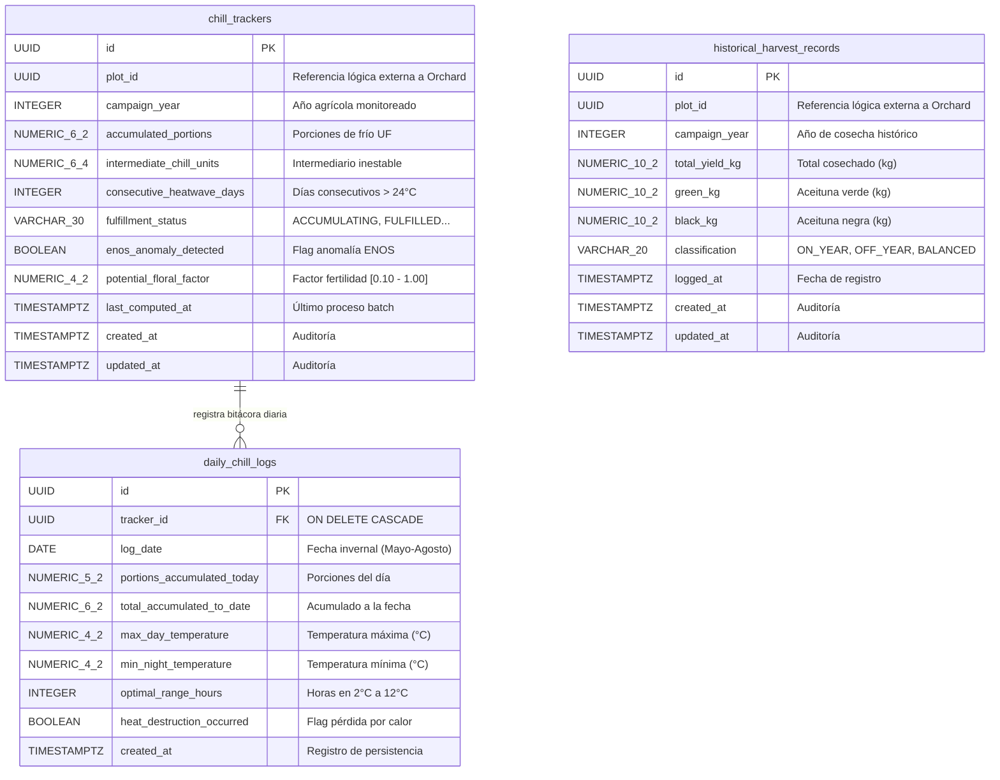

# Tactical-Level Domain-Driven Design: Phenology and Historical Bearing Analytics

---

### Bounded Context: Phenology and Historical Bearing Analytics (Phenology)

**Propósito:** El Bounded Context de **Phenology and Historical Bearing Analytics** (denominado comúnmente *Phenology*) es un subdominio central (*Core Subdomain*) del negocio de Viora, responsable de custodiar la memoria productiva plurianual del olivar, evaluar científicamente la severidad de la alternancia bienal mediante el Índice de Vecería ($BBI$ de Hoblyn et al., 1936), y computar dinámicamente el cumplimiento del reposo invernal a través del Modelo Dinámico de Porciones de Frío de Erez (*Dynamic Model* de Erez et al.). Su misión es anticipar el potencial de inducción floral y prever brotaciones heterogéneas o abortos derivados de inviernos cálidos asociados al fenómeno de El Niño (ENOS).

Agronómica y técnicamente, resuelve la incertidumbre del comportamiento productivo interanual (*On-Year* versus *Off-Year*) en el valle olivarero de Tacna (La Yarada-Los Palos y Magollo) para las variedades cultivadas *Olea europaea L.* cv. Criolla y Sevillana. Actúa como la única autoridad de cálculo del $BBI$ y del frío invernal en toda la plataforma. Mantiene una delimitación semántica estricta referenciando exclusivamente de forma lógica por identificador inmutable (`PlotId`) a las parcelas del Bounded Context *Olive Orchard and Plot Management*, proveyendo insumos biológicos determinantes para el balance de carga frutal en *Crop Load Regulation and Thinning Advisory* y para la curva de estabilización en *Harvest Settlement and Performance Reporting*.

---

#### Domain Layer

En esta capa se modela la lógica de negocio pura, independiente de frameworks, infraestructura o mecanismos de persistencia. Comprende Aggregates, Entities, Value Objects, Domain Services, Domain Events e interfaces de Repositorios.

##### Aggregates y Entities

###### ChillAccumulationTracker (Aggregate Root)
* **Propósito:** Agregado raíz que centraliza la memoria histórica plurianual de cosechas del cuartel, gobierna el cálculo de la vecería bienal ($BBI$), administra el acumulador térmico dinámico de frío invernal de Erez para la campaña en curso y salvaguarda la consistencia ante anomalías térmicas por inviernos cálidos.
* **Atributos:**
  * `id: TrackerId` (Identificador único / UUID)
  * `plotId: PlotId` (Referencia lógica foránea por ID a la parcela de *Olive Orchard and Plot Management*)
  * `currentCampaignYear: CampaignYear` (Value Object: año de la campaña agronómica actualmente monitoreada)
  * `harvestHistory: List<HistoricalHarvestEntry>` (Colección interna de registros plurianuales de cosecha)
  * `calculatedBbi: BiennialBearingIndex` (Value Object: índice de vecería de Hoblyn $0.00 - 1.00$; nulo si $<3$ campañas)
  * `erezState: DynamicModelErezState` (Value Object: estado matemático del modelo dinámico de porciones de frío)
  * `heatwaveCounter: ThermalHeatwaveCounter` (Value Object: contador de días consecutivos con calor anómalo $>24^\circ\text{C}$)
  * `chillStatus: ChillFulfillmentStatus` (Value Object / Enum: `ACCUMULATING`, `REQUIREMENT_FULFILLED`, `THERMAL_ANOMALY_DEFICIT`)
  * `dailyChillLogs: List<DailyChillLog>` (Colección interna de bitácoras diarias de frío invernal)
  * `potentialFloralYieldFactor: FloralYieldFactor` (Value Object: factor multiplicador de inducción floral $[0.10, 1.00]$)
  * `auditTrail: AuditTrail` (Value Object: metadatos de auditoría `createdAt`, `updatedAt`, `isDeleted`)
* **Métodos:**
  * `registerHarvest(entry: HistoricalHarvestEntry): void` - Registra la cosecha en kg de una campaña pasada. Si se completan $\ge 3$ campañas consecutivas, calcula automáticamente el $BBI$, clasifica la alternancia y encola `HistoricalHarvestsLoggedEvent` y `BiennialBearingIndexAssessedEvent`. Si existen $< 3$ campañas, persiste la memoria y encola `HistoricalDataInsufficiencyDetectedEvent`.
  * `rectifyHarvest(year: CampaignYear, newYield: YieldKg): void` - Modifica el volumen de una cosecha previa por error de pesaje en almazara, recalcula de inmediato el $BBI$ interanual y encola `HistoricalHarvestRectifiedEvent`.
  * `deleteHarvest(year: CampaignYear): void` - Elimina un registro erróneo o duplicado, reevalúa la suficiencia de datos ($\ge 3$ años) y encola `HistoricalHarvestDeletedEvent`.
  * `processDailyTemperatures(date: LocalDate, hourlyTemps: List<Temperature>): void` - Procesa las 24 lecturas horarias de temperatura invernal (Mayo a Agosto), ejecuta la cinética bi-etápica de Erez acumulando porciones de frío netas (`EV31`), verifica si se alcanzó el requerimiento varietal de 25 a 30 porciones (`EV32`), evalúa si ocurrió ola de calor ($>24^\circ\text{C}$ por $>3$ días consecutivos, `EV33`) y reajusta la fertilidad floral potencial (`EV34`).
  * `getCalculatedBbi(): Optional<BiennialBearingIndex>`
  * `isColdRequirementSatisfied(): boolean`
* **Invariantes y Reglas de Negocio:**
  1. **Requisito Estadístico Mínimo de Vecería:** El cálculo formal del Índice de Vecería de Hoblyn et al. ($BBI$) exige estrictamente un mínimo de tres ($3$) campañas agrícolas consecutivas registradas en la memoria del cuartel. Con menos de tres campañas, el índice permanece indeterminado y se notifica insuficiencia de datos (`EV28`).
  2. **Unicidad de Año Agrícola en Historial:** No se permite registrar dos veces la cosecha de un mismo año agrícola (`campaignYear`) para una misma parcela.
  3. **No Negatividad de Cosecha y Coherencia de Fechas:** Los pesajes en kilogramos no pueden ser negativos ($Total \ge 0$, $Verde \ge 0$, $Negra \ge 0$), la suma de calidades debe coincidir con el total, y el año no puede situarse en el futuro.
  4. **Ventana de Reposo Invernal:** La simulación y acumulación del modelo dinámico de Erez se activa únicamente durante la ventana fisiológica de reposo en el hemisferio sur (1 de Mayo al 31 de Agosto). Fuera de esta ventana, el ciclo de frío permanece inactivo.
  5. **Termolabilidad de Intermediarios de Erez:** Si durante el invierno la temperatura diurna excede los $24.0^\circ\text{C}$ durante tres o más días consecutivos, los intermediarios térmicos inestables se desacumulan por desnaturalización, reduciendo la acumulación neta y disparando una advertencia por invierno cálido de El Niño (ENOS).
  6. **Umbral Varietal de Salida de Reposo:** Al acumularse entre $25.0$ y $30.0$ Porciones de Frío (UF) en la campaña, se transiciona obligatoriamente el estado a `REQUIREMENT_FULFILLED`, certificando el estímulo para una brotación uniforme.

###### HistoricalHarvestEntry (Entity Interna de ChillAccumulationTracker)
* **Propósito:** Modela el rendimiento auditado y asentado de una campaña agrícola específica en la memoria productiva del cuartel.
* **Atributos:**
  * `id: HarvestEntryId` (Identificador único local / UUID)
  * `campaignYear: CampaignYear` (Año calendario agrícola, ej. 2023)
  * `totalYieldKg: YieldKg` (Volumen total cosechado en kilogramos)
  * `greenKg: YieldKg` (Kilogramos de aceituna verde para mesa)
  * `blackKg: YieldKg` (Kilogramos de aceituna negra para aceite/mesa)
  * `bearingClassification: BearingClassification` (Value Object / Enum: `ON_YEAR`, `OFF_YEAR`, `BALANCED`)
  * `loggedAt: Instant` (Marca temporal de ingreso)
* **Métodos:**
  * `updateYield(newTotal: YieldKg, newGreen: YieldKg, newBlack: YieldKg): void` - Actualiza los volúmenes validando que $Total = Verde + Negra$.
  * `classify(averageYield: YieldKg): void` - Clasifica la campaña como ON u OFF en base a la media histórica del predio.

###### DailyChillLog (Entity Interna de ChillAccumulationTracker)
* **Propósito:** Bitácora inmutable del progreso térmico diario dentro del ciclo invernal de Erez.
* **Atributos:**
  * `id: DailyChillLogId` (Identificador único local / UUID)
  * `logDate: LocalDate` (Fecha calendario del registro, Mayo a Agosto)
  * `portionsAccumulatedToday: ChillPortions` (Porciones de frío consolidadas en el día)
  * `totalAccumulatedToDate: ChillPortions` (Acumulado progresivo de la campaña)
  * `maxDayTemperature: Temperature` (Temperatura máxima registrada en el día)
  * `minNightTemperature: Temperature` (Temperatura mínima registrada en la noche)
  * `optimalRangeHours: Integer` (Horas en que la temperatura permaneció entre 2°C y 12°C)
  * `heatDestructionOccurred: boolean` (Indica si se desacumuló intermediario por $T > 24^\circ\text{C}$)

##### Value Objects (Conceptuales e Inmutables)
* **`TrackerId` / `HarvestEntryId` / `DailyChillLogId`**: Identificadores únicos inmutables con formato UUID y validación de no nulidad.
* **`PlotId`**: Referencia lógica foránea inmutable hacia el cuartel delimitado en *Olive Orchard and Plot Management*.
* **`CampaignYear`**: Entero inmutable que representa el año agrícola (ej. 2024). Lanza excepción de dominio si es menor a 1980 o posterior al año civil en curso.
* **`YieldKg`**: Decimal de precisión fija no negativo que representa masa de aceituna en kilogramos.
* **`BiennialBearingIndex` (BBI)**: Decimal inmutable en rango $[0.00, 1.00]$ calculado según Hoblyn et al. Provee métodos de clasificación cualitativa:
  * `isMild()`: $BBI < 0.30$ (Vecería leve / Producción regular).
  * `isModerate()`: $0.30 \le BBI \le 0.60$ (Vecería moderada).
  * `isSevere()`: $BBI > 0.60$ (Vecería severa / Alternancia pronunciada).
* **`DynamicModelErezState`**: Encapsula el estado biofísico de dos variables en el modelo de Erez:
  * `accumulatedPortions: Double` (Porciones de frío consolidadas e irreversibles).
  * `intermediateChillUnits: Double` (Nivel del intermediario termolábil antes de alcanzar la masa crítica de 1 porción).
* **`ChillPortions`**: Valor numérico no negativo que representa las unidades de frío dinámicas (UF).
* **`ThermalHeatwaveCounter`**: Entero no negativo que lleva el conteo de días consecutivos con $T_{max} > 24.0^\circ\text{C}$ en invierno.
* **`ChillFulfillmentStatus`**: Enum inmutable (`ACCUMULATING`, `REQUIREMENT_FULFILLED`, `THERMAL_ANOMALY_DEFICIT`).
* **`FloralYieldFactor`**: Factor decimal entre $0.10$ y $1.00$ que cuantifica la proporción de fertilidad floral remanente tras episodios de estrés térmico invernal.
* **`AuditTrail`**: Marcas inmutables de trazabilidad (`createdAt`, `updatedAt`, `isDeleted`).

##### Domain Services
* **`HoblynBbiCalculator`**:
  * **Propósito:** Servicio de dominio sin estado que encapsula rigurosamente la fórmula matemática de Hoblyn et al. (1936) para la cuantificación formal de la alternancia productiva bienal.
  * **Fórmula:**
    $$BBI = \frac{1}{n-1} \sum_{t=1}^{n-1} \frac{|Y_t - Y_{t+1}|}{Y_t + Y_{t+1}}$$
  * **Métodos:**
    * `calculate(harvests: List<HistoricalHarvestEntry>): Optional<BiennialBearingIndex>` - Valida que existan al menos $n \ge 3$ campañas consecutivas. De cumplirse, computa la sumatoria de diferencias relativas dividida entre $n-1$. Si $n < 3$, retorna vacío.
* **`ErezDynamicChillModel`**:
  * **Propósito:** Implementa el modelo bioclimático diferencial de Erez, Fishman y Couvillon para el cálculo dinámico de Porciones de Frío en base a 24 lecturas horarias de temperatura.
  * **Métodos:**
    * `computeDailyPortions(currentState: DynamicModelErezState, hourlyTemps: List<Temperature>): ErezComputationResult` - Aplica la ecuación diferencial de formación del intermediario a temperaturas de $2^\circ\text{C}$ a $12^\circ\text{C}$, modela la destrucción térmica a $>24^\circ\text{C}$ y consolida incrementos de porciones de frío.

##### Repositories (Interfaces en Domain)
Contratos agnósticos de base de datos definidos en el dominio:
* **`ChillAccumulationTrackerRepository`**:
  * `findById(id: TrackerId): Optional<ChillAccumulationTracker>`
  * `findByPlotId(plotId: PlotId): Optional<ChillAccumulationTracker>`
  * `findByPlotIdAndCampaign(plotId: PlotId, year: CampaignYear): Optional<ChillAccumulationTracker>`
  * `save(tracker: ChillAccumulationTracker): ChillAccumulationTracker`
  * `existsByPlotId(plotId: PlotId): boolean`
* **`HistoricalHarvestRepository`**:
  * `findByPlotId(plotId: PlotId): List<HistoricalHarvestEntry>`
  * `findByPlotIdAndYear(plotId: PlotId, year: CampaignYear): Optional<HistoricalHarvestEntry>`
  * `save(entry: HistoricalHarvestEntry): HistoricalHarvestEntry`
  * `deleteByPlotIdAndYear(plotId: PlotId, year: CampaignYear): void`

##### Domain Events
Eventos inmutables en tiempo pasado que comunican hechos significativos del ciclo fenológico y la alternancia:
* **`HistoricalHarvestsLoggedEvent`**: `{ plotId: UUID, campaignYear: Integer, totalYieldKg: Double, occurredOn: Instant }` (EV26)
  * *Disparado cuando:* El agricultor registra una cosecha pasada en el historial de la parcela.
* **`BiennialBearingIndexAssessedEvent`**: `{ plotId: UUID, bbiValue: Double, severityCategory: String, validCampaignsCount: Integer, occurredOn: Instant }` (EV27)
  * *Disparado cuando:* Se evalúa y formaliza el índice BBI tras alcanzar $\ge 3$ campañas consecutivas.
* **`HistoricalDataInsufficiencyDetectedEvent`**: `{ plotId: UUID, registeredCampaignsCount: Integer, requiredCampaignsCount: Integer, occurredOn: Instant }` (EV28)
  * *Disparado cuando:* Se registran menos de 3 campañas, impidiendo el cálculo formal de alternancia.
* **`HistoricalHarvestRectifiedEvent`**: `{ plotId: UUID, campaignYear: Integer, newTotalYieldKg: Double, recalculatedBbi: Double, occurredOn: Instant }` (EV29)
  * *Disparado cuando:* Se corrige el pesaje de una cosecha y se recalculan las series interanuales.
* **`HistoricalHarvestDeletedEvent`**: `{ plotId: UUID, campaignYear: Integer, remainingCampaignsCount: Integer, occurredOn: Instant }` (EV30)
  * *Disparado cuando:* Se suprime un registro de cosecha erróneo de la memoria del predio.
* **`WinterChillPortionsAccumulatedEvent`**: `{ plotId: UUID, campaignYear: Integer, dailyPortions: Double, totalAccumulatedPortions: Double, occurredOn: Instant }` (EV31)
  * *Disparado cuando:* El modelo de Erez acumula nuevas porciones dinámicas de frío a partir de telemetría horaria.
* **`ColdRequirementFulfilledEvent`**: `{ plotId: UUID, campaignYear: Integer, totalPortions: Double, fulfilledOnDate: LocalDate, occurredOn: Instant }` (EV32)
  * *Disparado cuando:* El olivar alcanza las 25 a 30 porciones de frío varietales, garantizando la salida del reposo.
* **`WinterThermalAnomalyDetectedEvent`**: `{ plotId: UUID, campaignYear: Integer, heatwaveDaysCount: Integer, peakTemperature: Double, occurredOn: Instant }` (EV33)
  * *Disparado cuando:* Se registran $>24^\circ\text{C}$ durante $>3$ días en invierno, destruyendo intermediarios de frío (efecto ENOS).
* **`PotentialFloralYieldReadjustedEvent`**: `{ plotId: UUID, campaignYear: Integer, previousFactor: Double, revisedFactor: Double, reductionReason: String, occurredOn: Instant }` (EV34)
  * *Disparado cuando:* Se castiga la expectativa de floración y carga frutal potencial ante un déficit térmico invernal.

---

#### Interface Layer

En esta capa se definen los puntos de entrada y salida del sistema. Transforma solicitudes HTTP entrantes en Commands o Queries para la Application Layer y serializa los resultados del dominio en Resources (DTOs).

##### Controllers (REST)
Diseño basado estrictamente en recursos, sustantivos en plural y verbos HTTP estándar, implementando los contratos de las Historias Técnicas TS21, TS22 y TS23:

* **`PlotHarvestRecordController`** (Ruta base: `/api/v1/plots/{plotId}/harvest-records`):
  * `POST /api/v1/plots/{plotId}/harvest-records` - Asienta el volumen cosechado de una campaña anual (`TS21` / `US20`). Responde `201 Created` con `HarvestRecordResource`, `409 Conflict` si la campaña ya existe, o `400 Bad Request` ante valores negativos o año futuro.
  * `GET /api/v1/plots/{plotId}/harvest-records` - Lista el historial plurianual cronológico de cosechas de la parcela (`TS22`). Responde `200 OK` con un arreglo de `HarvestRecordResource`, o `404 Not Found` si el predio no existe.
  * `PUT /api/v1/plots/{plotId}/harvest-records/{year}` - Rectifica el pesaje histórico de una campaña específica (`US21` Escenario 1). Responde `200 OK` con el registro actualizado y el recálculo del BBI.
  * `DELETE /api/v1/plots/{plotId}/harvest-records/{year}` - Elimina un registro de cosecha erróneo (`US21` Escenario 2). Responde `204 No Content` o `404 Not Found`.

* **`PlotMetricController`** (Ruta base: `/api/v1/plots/{plotId}/metrics`):
  * `GET /api/v1/plots/{plotId}/metrics?name=BBI` - Entrega el Índice de Vecería de Hoblyn ($BBI$) y su categoría cualitativa (`TS23` / `US20`). Responde `200 OK` con `MetricResource`, o `400 Bad Request` si existen menos de 3 campañas registradas.
  * `GET /api/v1/plots/{plotId}/metrics?name=CHILLING` - Entrega el estado de acumulación de porciones de frío de Erez y alertas ENOS (`TS23` / `US22` / `US23`). Responde `200 OK` con `MetricResource` detallando unidades de frío, estado de satisfacción y flag `enosAnomalyDetected`.

* **`PlotChillComputationController`** (Ruta base: `/api/v1/plots/{plotId}/chill-computations`):
  * `POST /api/v1/plots/{plotId}/chill-computations/daily-process` - Disparador programado nocturno (`CMD23`) para procesar las temperaturas telemétricas del día en el modelo de Erez. Responde `200 OK`.

##### Resources (DTOs / Request & Response Models)
* **`CreateHarvestRecordRequest`**: `{ campaignYear: Integer, totalYieldKg: Double, greenKg: Double, blackKg: Double }` (Payload recibido en POST).
* **`RectifyHarvestRecordRequest`**: `{ totalYieldKg: Double, greenKg: Double, blackKg: Double }` (Payload recibido en PUT).
* **`HarvestRecordResource`**: `{ id: UUID, plotId: UUID, campaignYear: Integer, totalYieldKg: Double, greenKg: Double, blackKg: Double, classification: String, loggedAt: Instant }` (DTO de respuesta).
* **`MetricResource`**: `{ plotId: UUID, metricName: String, value: Double, severityCategory: String, validCampaignsCount: Integer, enosAnomalyDetected: boolean, evaluatedAt: Instant }` (DTO de respuesta polymorphic para BBI o Chilling).
* **`ChillTrackerResource`**: `{ plotId: UUID, campaignYear: Integer, accumulatedPortions: Double, targetPortions: Double, fulfillmentStatus: String, consecutiveHeatwaveDays: Integer, enosAnomalyDetected: boolean, floralYieldFactor: Double, lastComputedAt: Instant }` (DTO detallado de reposo invernal).
* **`DailyChillLogResource`**: `{ logDate: LocalDate, portionsAccumulatedToday: Double, maxTemp: Double, minTemp: Double, optimalRangeHours: Integer, heatDestructionOccurred: boolean }`

##### Assemblers / Mappers
* **`HarvestRecordResourceAssembler`**: Convierte la entidad de dominio `HistoricalHarvestEntry` en el DTO `HarvestRecordResource`.
* **`CreateHarvestCommandAssembler`**: Transforma `CreateHarvestRecordRequest` y el parámetro de ruta `{plotId}` en el comando `LogHistoricalHarvestsCommand`.
* **`BbiMetricResourceAssembler`**: Mapea el Value Object `BiennialBearingIndex` y metadatos del Aggregate en `MetricResource`.
* **`ChillMetricResourceAssembler`**: Mapea el estado del acumulador de frío de Erez en `MetricResource` o `ChillTrackerResource`.

---

#### Application Layer

Coordina y orquesta los casos de uso del sistema. No implementa reglas de negocio agronómicas, sino que gestiona transacciones, delega a repositorios y servicios de dominio, y publica eventos.

##### Command Handlers
* **`LogHistoricalHarvestsCommandHandler`** (CMD20 / US20 / TS21):
  * *Entrada:* `LogHistoricalHarvestsCommand` (`plotId`, `campaignYear`, `totalYieldKg`, `greenKg`, `blackKg`)
  * *Flujo:* Valida que el año no sea futuro ni esté duplicado -> recupera o inicializa `ChillAccumulationTracker` para el cuartel -> crea `HistoricalHarvestEntry` -> invoca `registerHarvest()` en el agregado delegando el cálculo matemático en `HoblynBbiCalculator` -> persiste en `ChillAccumulationTrackerRepository` -> despacha eventos encolados (`HistoricalHarvestsLoggedEvent` y `BiennialBearingIndexAssessedEvent` o `HistoricalDataInsufficiencyDetectedEvent`).
* **`RectifyHistoricalHarvestCommandHandler`** (CMD21 / US21):
  * *Entrada:* `RectifyHistoricalHarvestCommand` (`plotId`, `campaignYear`, `totalYieldKg`, `greenKg`, `blackKg`)
  * *Flujo:* Recupera el tracker del predio -> invoca `rectifyHarvest()` actualizando el pesaje -> recalcula el $BBI$ con `HoblynBbiCalculator` -> guarda cambios en el repositorio -> despacha `HistoricalHarvestRectifiedEvent`.
* **`DeleteHistoricalHarvestCommandHandler`** (CMD22 / US21):
  * *Entrada:* `DeleteHistoricalHarvestCommand` (`plotId`, `campaignYear`)
  * *Flujo:* Recupera el tracker -> invoca `deleteHarvest()` removiendo la campaña -> reevalúa el número de campañas remanentes y recalcula o invalida el BBI -> persiste cambios -> despacha `HistoricalHarvestDeletedEvent`.
* **`ComputeDailyChillAccumulationCommandHandler`** (CMD23 / US22 / US23):
  * *Entrada:* `ComputeDailyChillAccumulationCommand` (`plotId`, `date`, `hourlyTemperatures`)
  * *Flujo:* Verifica que la fecha pertenezca a la ventana invernal (Mayo-Agosto) -> carga el agregado `ChillAccumulationTracker` del predio -> invoca `processDailyTemperatures()` apoyándose en el servicio de dominio `ErezDynamicChillModel` -> actualiza acumulador de porciones, contador de olas de calor y factor de fertilidad floral -> persiste en el repositorio -> publica eventos generados (`WinterChillPortionsAccumulatedEvent`, alertas de cumplimiento o anomalías ENOS).

##### Query Handlers
* **`ListPlotHarvestRecordsQueryHandler`** (TS22 / US20):
  * Resuelve `ListPlotHarvestRecordsQuery` recuperando las cosechas históricas de la parcela ordenadas cronológicamente por `campaignYear`. Si el lote no existe, lanza excepción de recurso no encontrado.
* **`GetBbiMetricQueryHandler`** (TS23 / US20):
  * Resuelve `GetBbiMetricQuery`. Carga el agregado `ChillAccumulationTracker`, verifica que la serie tenga al menos 3 campañas; si no las tiene, lanza excepción de datos insuficientes (`400 Bad Request`). Si es válido, retorna el $BBI$ y su severidad en `MetricResource`.
* **`GetChillMetricQueryHandler`** (TS23 / US22 / US23):
  * Resuelve `GetChillMetricQuery` retornando las porciones de frío dinámicas acumuladas, estado de cumplimiento frente a la meta (25-30 UF) y el flag de anomalía térmica ENOS.
* **`GetChillTrackerDetailQueryHandler`**:
  * Resuelve `GetChillTrackerDetailQuery` entregando el detalle histórico de bitácoras diarias de frío (`dailyChillLogs`).

##### Event Handlers
* **`OnTelemetryDataIngestedEventHandler`** (Flujo C08 / Mensaje 5 en Domain Message Flows):
  * *Disparador:* Escucha `TelemetryDataIngestedEvent` emitido por *Agroclimatic Telemetry & Sensor Monitoring*.
  * *Acción:* Al finalizar la jornada en meses de reposo invernal (Mayo a Agosto), despacha el comando `ComputeDailyChillAccumulationCommand` con las series horarias de temperatura medidas en campo para actualizar dinámicamente las porciones de Erez.
* **`OnWinterThermalAnomalyDetectedEventHandler`** (POL08 / US23):
  * *Disparador:* Escucha `WinterThermalAnomalyDetectedEvent`.
  * *Acción:* Ejecuta la política de reajuste predictivo floral, castigando el factor de carga potencial y publicando `PotentialFloralYieldReadjustedEvent` hacia el Bounded Context de *Crop Load Regulation and Thinning Advisory* para ajustar las metas de aclareo frutal de primavera.
* **`OnLateThinningExecutionRecordedEventHandler`** (POL11 / US28 Escenario 2):
  * *Disparador:* Escucha `LateThinningExecutionRecordedEvent` emitido por *Crop Load Regulation and Thinning Advisory*.
  * *Acción:* Aplica un factor de penalización del 70% sobre la eficiencia de mitigación de vecería del lote, registrando que la labor tardía no frenó la inducción floral inhibitoria.

---

#### Infrastructure Layer

Clases que acceden a la base de datos relacional PostgreSQL e implementaciones concretas de los Repositorios y publicadores de eventos.

##### 1. Paquetes y componentes principales
* **Persistence:**
  * `PostgresChillAccumulationTrackerRepository`: Implementa `ChillAccumulationTrackerRepository` de Dominio delegando en Spring Data JPA.
  * `PostgresHistoricalHarvestRepository`: Implementa `HistoricalHarvestRepository`.
  * `ChillTrackerJpaEntity`, `HistoricalHarvestJpaEntity`, `DailyChillLogJpaEntity`: Entidades JPA mapeadas con `@Entity`, `@Table`.
  * `ChillTrackerEntityMapper` y `HistoricalHarvestEntityMapper`: Conversores bidireccionales Dominio <-> JPA.
* **Events:**
  * `SpringDomainEventPublisher`: Publicador de eventos en memoria vía `ApplicationEventPublisher`.
* **Configuration:**
  * `PhenologyJpaConfig`: Configuración JPA con auditoría `@EnableJpaAuditing` y transacciones `@EnableTransactionManagement`.
  * `PhenologySecurityConfig`: Validación de JWT y verificación de permisos prediales.

##### 2. Modelo de datos y mapeos
Estructura relacional en PostgreSQL para las tablas de este Bounded Context:

* **Tabla: `historical_harvest_records`**
  ```sql
  CREATE TABLE historical_harvest_records (
      id             UUID PRIMARY KEY,
      plot_id        UUID NOT NULL,                    -- Referencia lógica a Orchard BC
      campaign_year  INTEGER NOT NULL,
      total_yield_kg NUMERIC(10, 2) NOT NULL,
      green_kg       NUMERIC(10, 2) NOT NULL,
      black_kg       NUMERIC(10, 2) NOT NULL,
      classification VARCHAR(20) NOT NULL,             -- 'ON_YEAR', 'OFF_YEAR', 'BALANCED'
      logged_at      TIMESTAMPTZ NOT NULL,
      created_at     TIMESTAMPTZ NOT NULL,
      updated_at     TIMESTAMPTZ NOT NULL,
      CONSTRAINT uq_harvest_plot_year UNIQUE (plot_id, campaign_year),
      CONSTRAINT chk_yield_non_neg CHECK (total_yield_kg >= 0 AND green_kg >= 0 AND black_kg >= 0),
      CONSTRAINT chk_harvest_sum CHECK (total_yield_kg = green_kg + black_kg),
      CONSTRAINT chk_harvest_class CHECK (classification IN ('ON_YEAR', 'OFF_YEAR', 'BALANCED'))
  );
  ```

* **Tabla: `chill_trackers`**
  ```sql
  CREATE TABLE chill_trackers (
      id                         UUID PRIMARY KEY,
      plot_id                    UUID NOT NULL,        -- Referencia lógica a Orchard BC
      campaign_year              INTEGER NOT NULL,
      accumulated_portions       NUMERIC(6, 2) NOT NULL DEFAULT 0.00,
      intermediate_chill_units   NUMERIC(6, 4) NOT NULL DEFAULT 0.0000,
      consecutive_heatwave_days  INTEGER NOT NULL DEFAULT 0,
      fulfillment_status         VARCHAR(30) NOT NULL, -- 'ACCUMULATING', 'REQUIREMENT_FULFILLED', 'THERMAL_ANOMALY_DEFICIT'
      enos_anomaly_detected      BOOLEAN NOT NULL DEFAULT FALSE,
      potential_floral_factor    NUMERIC(4, 2) NOT NULL DEFAULT 1.00,
      last_computed_at           TIMESTAMPTZ,
      created_at                 TIMESTAMPTZ NOT NULL,
      updated_at                 TIMESTAMPTZ NOT NULL,
      CONSTRAINT uq_chill_plot_campaign UNIQUE (plot_id, campaign_year),
      CONSTRAINT chk_chill_status CHECK (fulfillment_status IN ('ACCUMULATING', 'REQUIREMENT_FULFILLED', 'THERMAL_ANOMALY_DEFICIT')),
      CONSTRAINT chk_floral_factor CHECK (potential_floral_factor BETWEEN 0.10 AND 1.00)
  );
  ```

* **Tabla: `daily_chill_logs`**
  ```sql
  CREATE TABLE daily_chill_logs (
      id                         UUID PRIMARY KEY,
      tracker_id                 UUID NOT NULL REFERENCES chill_trackers(id) ON DELETE CASCADE,
      log_date                   DATE NOT NULL,
      portions_accumulated_today NUMERIC(5, 2) NOT NULL,
      total_accumulated_to_date  NUMERIC(6, 2) NOT NULL,
      max_day_temperature        NUMERIC(4, 2) NOT NULL,
      min_night_temperature      NUMERIC(4, 2) NOT NULL,
      optimal_range_hours        INTEGER NOT NULL,     -- Horas entre 2°C y 12°C
      heat_destruction_occurred  BOOLEAN NOT NULL DEFAULT FALSE,
      created_at                 TIMESTAMPTZ NOT NULL,
      CONSTRAINT uq_daily_chill_date UNIQUE (tracker_id, log_date)
  );
  ```

* **Índices y Restricciones Físicas:**
  * Índice de búsqueda rápida para cosechas de una parcela:
    ```sql
    CREATE INDEX idx_hhr_plot_year ON historical_harvest_records (plot_id, campaign_year DESC);
    ```
  * Índice para el acumulador térmico por campaña:
    ```sql
    CREATE INDEX idx_ct_plot_campaign ON chill_trackers (plot_id, campaign_year);
    ```
  * Índice cronológico sobre las bitácoras diarias de frío:
    ```sql
    CREATE INDEX idx_dcl_tracker_date ON daily_chill_logs (tracker_id, log_date);
    ```

* **Mapeo Entity <-> Persistencia:**
  * Dominio -> DB: El mapper agranda el objeto de valor `DynamicModelErezState` descomponiéndolo en las columnas `accumulated_portions` e `intermediate_chill_units`. El $BBI$ se recalcula en memoria a partir de las cosechas persistidas para asegurar consistencia matemática determinista.
  * DB -> Dominio: Reconstrucción limpia de agregados mediante constructores de fábrica controlados sin emitir eventos retroactivos.

##### 3. Repositories – Implementación
* **`PostgresChillAccumulationTrackerRepository`**:
  * Implementa persistencia sobre `chill_trackers` utilizando `SpringDataJpaChillTrackerRepository`.
  * Gestiona las bitácoras diarias `daily_chill_logs` como colección subordinada mediante `@OneToMany(cascade = CascadeType.ALL, orphanRemoval = true)`.
  * Asegura transaccionalidad atómica `@Transactional` en las actualizaciones del modelo dinámico de frío.
* **`PostgresHistoricalHarvestRepository`**:
  * Implementa consultas ordenadas `findAllByPlotIdOrderByCampaignYearAsc(UUID plotId)` para alimentar de forma secuencial al calculador del $BBI$ de Hoblyn.

##### 4. Seguridad & Resiliencia
* **Autorización Estricta por Predio:** Validación de que el productor autenticado sea el titular del `plotId` antes de consultar o rectificar cosechas históricas.
* **Idempotencia en Registro de Cosechas:** Restricción `UNIQUE (plot_id, campaign_year)` que previene duplicación de campañas ante reintentos de red del cliente móvil.
* **Manejo Centralizado de Excepciones (RFC 7807):** Retorno estructurado `ProblemDetail` ante insuficiencia de campañas ($<3$), años agrícolas futuros o rendimientos negativos (`TS31`).
* **Auditoría Inmutable:** Marcas temporales automáticas `@CreatedDate` y `@LastModifiedDate` en todos los registros históricos.

---

#### Bounded Context Software Architecture Component Level Diagrams

En esta sección se describe la descomposición y el flujo de comunicación entre los componentes de software dentro del contenedor Backend (Spring Boot), detallando cómo interactúan las cuatro capas del Bounded Context:

##### 1. Descomposición de Componentes por Capa
* **Interface / API Layer:**
  * `PlotHarvestRecordController`: Expone endpoints REST para registro, listado, rectificación y borrado de cosechas.
  * `PlotMetricController`: Expone el cálculo oficial del $BBI$ y la entrega de porciones de frío de Erez.
  * `PlotChillComputationController`: Expone el trigger del proceso batch diario de acumulación de frío.
* **Application Layer:**
  * Command Handlers (`LogHistoricalHarvestsCommandHandler`, `RectifyHarvestCommandHandler`, `DeleteHarvestCommandHandler`, `ComputeDailyChillAccumulationCommandHandler`): Orquestan transacciones y coordinan servicios.
  * Query Handlers (`ListPlotHarvestRecordsQueryHandler`, `GetBbiMetricQueryHandler`, `GetChillMetricQueryHandler`): Resuelven consultas y aplican validaciones estadísticas.
  * Event Handlers (`OnTelemetryDataIngestedEventHandler`, `OnWinterThermalAnomalyDetectedEventHandler`, `OnLateThinningExecutionRecordedEventHandler`): Procesan flujos reactivos e integración inter-contexto.
* **Domain Layer:**
  * Agregado Raíz `ChillAccumulationTracker`, Entidades Internas `HistoricalHarvestEntry` y `DailyChillLog`, Value Objects biofísicos y los servicios puros `HoblynBbiCalculator` y `ErezDynamicChillModel`.
  * Interfaces de Repositorio `ChillAccumulationTrackerRepository` y `HistoricalHarvestRepository`.
* **Infrastructure Layer:**
  * `PostgresChillAccumulationTrackerRepository` y `PostgresHistoricalHarvestRepository` sobre PostgreSQL.
  * `SpringDomainEventPublisher` para la emisión del bus interno de eventos.

```mermaid
graph TD
    subgraph ClientLayer ["Clientes & Contextos Externos"]
        MobileApp["Aplicación Móvil Viora (Android / Flutter)"]
        TelemetryBC["Agroclimatic Telemetry BC (Emisor EV21)"]
        ThinningBC["Crop Load Regulation BC (Consumidor EV27 / EV32 / EV34)"]
        HarvestBC["Harvest Settlement BC (Consumidor EV27)"]
    end

    subgraph InterfaceLayer ["Interface Layer"]
        HarvestCtrl["PlotHarvestRecordController"]
        MetricCtrl["PlotMetricController"]
        ChillCtrl["PlotChillComputationController"]
    end

    subgraph ApplicationLayer ["Application Layer"]
        HarvestCmdHandlers["Harvest Command Handlers<br/>(Log, Rectify, Delete)"]
        ChillCmdHandler["ComputeDailyChillAccumulationHandler"]
        QueryHandlers["Query Handlers<br/>(GetBBI, GetChilling, ListHarvests)"]
        EventHandlers["Event Handlers / Policies<br/>(POL07, POL08, POL11)"]
    end

    subgraph DomainLayer ["Domain Layer"]
        TrackerAR["ChillAccumulationTracker (Aggregate Root)"]
        HarvestEntity["HistoricalHarvestEntry (Entity)"]
        DailyLogEntity["DailyChillLog (Entity)"]
        HoblynService["HoblynBbiCalculator (Domain Service)"]
        ErezService["ErezDynamicChillModel (Domain Service)"]
        RepoInterfaces["Interfaces de Repositorio<br/>(ChillTrackerRepo, HistoricalHarvestRepo)"]
        DomainEvents["Domain Events<br/>(EV26 - EV34)"]
    end

    subgraph InfrastructureLayer ["Infrastructure Layer"]
        PostgresTrackerRepo["PostgresChillAccumulationTrackerRepository"]
        PostgresHarvestRepo["PostgresHistoricalHarvestRepository"]
        EventPublisher["SpringDomainEventPublisher"]
        PostgreSQL[("Base de Datos PostgreSQL")]
    end

    MobileApp -->|HTTPS / REST| HarvestCtrl
    MobileApp -->|HTTPS / REST| MetricCtrl
    TelemetryBC -.->|EV21 TelemetryDataIngested| EventHandlers

    HarvestCtrl --> HarvestCmdHandlers
    HarvestCtrl --> QueryHandlers
    MetricCtrl --> QueryHandlers
    ChillCtrl --> ChillCmdHandler

    HarvestCmdHandlers --> TrackerAR
    HarvestCmdHandlers --> HoblynService
    HarvestCmdHandlers --> RepoInterfaces

    ChillCmdHandler --> TrackerAR
    ChillCmdHandler --> ErezService
    ChillCmdHandler --> RepoInterfaces

    QueryHandlers --> RepoInterfaces
    QueryHandlers --> HoblynService

    TrackerAR --> DomainEvents
    HarvestCmdHandlers --> EventPublisher
    ChillCmdHandler --> EventPublisher
    EventPublisher --> EventHandlers
    EventPublisher -.->|EV32, EV34| ThinningBC
    EventPublisher -.->|EV27| ThinningBC
    EventPublisher -.->|EV27| HarvestBC

    RepoInterfaces <|.. PostgresTrackerRepo
    RepoInterfaces <|.. PostgresHarvestRepo
    PostgresTrackerRepo --> PostgreSQL
    PostgresHarvestRepo --> PostgreSQL
```

##### 2. Flujo de Comunicación y Conectividad
1. **Entrada:** La aplicación móvil emite una solicitud HTTP (`POST` para registrar cosechas pasadas o `GET` para consultar el $BBI$ y el avance de frío) hacia `PlotHarvestRecordController` o `PlotMetricController`.
2. **Transformación:** El controlador valida los campos sintácticos, convierte el request JSON en un Command o Query mediante su Assembler y delega en la capa de aplicación.
3. **Orquestación de Dominio:** El Command Handler inicia una transacción (`@Transactional`), carga el historial previo desde `HistoricalHarvestRepository` y delega en el agregado `ChillAccumulationTracker`.
4. **Ejecución y Reglas:** Se ejecutan los métodos de negocio. Si es registro de cosechas, `HoblynBbiCalculator` verifica el umbral de $\ge 3$ campañas y calcula el índice de vecería; si es acumulación de frío, `ErezDynamicChillModel` procesa las temperaturas horarias evaluando horas efectivas ($2^\circ\text{C}$ a $12^\circ\text{C}$) y destrucción por calor ($>24^\circ\text{C}$).
5. **Persistencia:** El Handler invoca `save()` sobre el repositorio. La capa de infraestructura mapea las entidades JPA y ejecuta las sentencias SQL sobre PostgreSQL garantizando consistencia.
6. **Integración Externa / Eventos:** Los eventos de dominio generados (`EV26` a `EV34`) se despachan mediante `SpringDomainEventPublisher`. Si se completó el frío (`EV32`) o hubo anomalía ENOS (`EV33`/`EV34`), se notifica a *Crop Load Regulation and Thinning Advisory* para calibrar el aclareo. Si se calculó el BBI (`EV27`), se publica hacia *Harvest Settlement* y hacia *Crop Load Regulation and Thinning Advisory*, que lo incorpora como entrada opcional de su motor de carga admisible. Con menos de tres campañas el índice permanece indeterminado y se emite `EV28` en su lugar, de modo que ambos consumidores deben operar sin él.
7. **Respuesta:** El controlador convierte el resultado en `HarvestRecordResource` o `MetricResource` y devuelve la respuesta HTTP estándar (`200 OK` o `201 Created`).

---

#### Bounded Context Software Architecture Code Level Diagrams

##### Bounded Context Domain Layer Class Diagrams

En esta sección se describe la estructura formal del modelo de clases del Domain Layer, detallando clases participantes, visibilidad, signaturas de métodos y relaciones:

##### 1. Estructura de Clases y Estereotipos
* **`ChillAccumulationTracker` (Aggregate Root):** Centraliza la memoria de cosechas y el tracking de frío invernal. Sus campos son privados (`-`) y sus métodos son públicos (`+`).
* **`HistoricalHarvestEntry` (Entity Interna):** Representa la cosecha auditada de un año agrícola.
* **`DailyChillLog` (Entity Interna):** Registro cronológico diario del modelo de Erez.
* **Value Objects:** `TrackerId`, `PlotId`, `CampaignYear`, `YieldKg`, `BiennialBearingIndex`, `DynamicModelErezState`, `ChillPortions`, `ThermalHeatwaveCounter`, `FloralYieldFactor`, `AuditTrail`.
* **Domain Services:** `HoblynBbiCalculator` y `ErezDynamicChillModel`.
* **Interfaces:** `ChillAccumulationTrackerRepository` y `HistoricalHarvestRepository`.

```mermaid
classDiagram
    class ChillAccumulationTracker {
        -TrackerId id
        -PlotId plotId
        -CampaignYear currentCampaignYear
        -List~HistoricalHarvestEntry~ harvestHistory
        -BiennialBearingIndex calculatedBbi
        -DynamicModelErezState erezState
        -ThermalHeatwaveCounter heatwaveCounter
        -ChillFulfillmentStatus chillStatus
        -List~DailyChillLog~ dailyChillLogs
        -FloralYieldFactor potentialFloralYieldFactor
        -AuditTrail auditTrail
        +registerHarvest(entry) void
        +rectifyHarvest(year, newYield) void
        +deleteHarvest(year) void
        +processDailyTemperatures(date, hourlyTemps) void
        +getCalculatedBbi() Optional~BiennialBearingIndex~
        +isColdRequirementSatisfied() boolean
    }

    class HistoricalHarvestEntry {
        -HarvestEntryId id
        -CampaignYear campaignYear
        -YieldKg totalYieldKg
        -YieldKg greenKg
        -YieldKg blackKg
        -BearingClassification bearingClassification
        -Instant loggedAt
        +updateYield(newTotal, newGreen, newBlack) void
        +classify(averageYield) void
    }

    class DailyChillLog {
        -DailyChillLogId id
        -LocalDate logDate
        -ChillPortions portionsAccumulatedToday
        -ChillPortions totalAccumulatedToDate
        -Temperature maxDayTemperature
        -Temperature minNightTemperature
        -Integer optimalRangeHours
        -boolean heatDestructionOccurred
    }

    class BiennialBearingIndex {
        -Double value
        +getValue() Double
        +isMild() boolean
        +isModerate() boolean
        +isSevere() boolean
        +getSeverityCategory() String
    }

    class DynamicModelErezState {
        -Double accumulatedPortions
        -Double intermediateChillUnits
        +addPortions(portions) DynamicModelErezState
        +decayIntermediate() DynamicModelErezState
    }

    class HoblynBbiCalculator {
        +calculate(harvests) Optional~BiennialBearingIndex~
    }

    class ErezDynamicChillModel {
        +computeDailyPortions(currentState, hourlyTemps) ErezComputationResult
    }

    class ChillAccumulationTrackerRepository {
        <<interface>>
        +findById(id) Optional~ChillAccumulationTracker~
        +findByPlotId(plotId) Optional~ChillAccumulationTracker~
        +findByPlotIdAndCampaign(plotId, year) Optional~ChillAccumulationTracker~
        +save(tracker) ChillAccumulationTracker
        +existsByPlotId(plotId) boolean
    }

    class HistoricalHarvestRepository {
        <<interface>>
        +findByPlotId(plotId) List~HistoricalHarvestEntry~
        +findByPlotIdAndYear(plotId, year) Optional~HistoricalHarvestEntry~
        +save(entry) HistoricalHarvestEntry
        +deleteByPlotIdAndYear(plotId, year) void
    }

    ChillAccumulationTracker "1" --> "1" TrackerId
    ChillAccumulationTracker "1" --> "1" PlotId
    ChillAccumulationTracker "1" --> "1" CampaignYear
    ChillAccumulationTracker "1" --> "0..1" BiennialBearingIndex
    ChillAccumulationTracker "1" --> "1" DynamicModelErezState
    ChillAccumulationTracker "1" --> "1" FloralYieldFactor
    ChillAccumulationTracker "1" *-- "0..*" HistoricalHarvestEntry : composición
    ChillAccumulationTracker "1" *-- "0..*" DailyChillLog : composición

    HistoricalHarvestEntry "1" --> "1" CampaignYear
    HistoricalHarvestEntry "1" --> "3" YieldKg

    ChillAccumulationTracker ..> HoblynBbiCalculator : utiliza
    ChillAccumulationTracker ..> ErezDynamicChillModel : utiliza
    ChillAccumulationTrackerRepository ..> ChillAccumulationTracker : gestiona
    HistoricalHarvestRepository ..> HistoricalHarvestEntry : gestiona
```



##### 2. Relaciones y Conectividad entre Clases
* **Composición (`1 *-- 0..*`):** `ChillAccumulationTracker` ejerce gobierno transaccional sobre `HistoricalHarvestEntry` y `DailyChillLog`. Si el tracker desaparece, sus registros históricos y bitácoras asociadas se eliminan en cascada.
* **Asociación / Atributo (`-->`):** Los agregados y entidades encapsulan Value Objects inmutables (`BiennialBearingIndex`, `DynamicModelErezState`, `YieldKg`, `CampaignYear`).
* **Dependencia (`..>`):** La raíz del agregado depende de los servicios de dominio `HoblynBbiCalculator` y `ErezDynamicChillModel` para ejecutar cálculos matemáticos puros.
* **Referencias externas por ID:** La asociación hacia el olivar se modela únicamente a través de `PlotId`, sin asociar referencias de objetos directas al contexto de *Orchard*.

---

##### Bounded Context Database Design Diagram

En esta sección se detalla el diseño físico y relacional de la base de datos en PostgreSQL, describiendo tablas, tipos de datos, claves primarias, claves foráneas, restricciones de integridad e índices:

##### 1. Tablas y Estructura de Claves
* **Tabla Principal `chill_trackers`:** Encabezado del seguimiento de frío y estado fenológico por parcela y campaña.
  * Clave primaria: `id` (UUID).
  * Clave foránea lógica: `plot_id` (UUID, referencia desacoplada a Orchard).
* **Tabla `historical_harvest_records`:** Serie histórica plurianual de cosechas del cuartel.
  * Clave primaria: `id` (UUID).
  * Clave foránea lógica: `plot_id` (UUID).
* **Tabla Subordinada `daily_chill_logs`:** Bitácora diaria del avance de Erez.
  * Clave primaria: `id` (UUID).
  * Clave foránea física: `tracker_id` (UUID) con regla `ON DELETE CASCADE` referenciando a `chill_trackers(id)`.

##### 2. Relaciones y Cardinalidad Relacional
* **Relación 1 a N (`chill_trackers` a `daily_chill_logs`):** Un registro de seguimiento acumula una bitácora diaria por cada jornada invernal (~123 días entre mayo y agosto).
* **Relación 1 a N Lógica (`plot_id` a `historical_harvest_records`):** Una parcela acumula múltiples registros anuales de cosecha.



##### 3. Índices y Reglas de Integridad
* **Restricciones `CHECK` a Nivel de Motor:**
  * Estados del seguimiento de frío: `fulfillment_status IN ('ACCUMULATING', 'REQUIREMENT_FULFILLED', 'THERMAL_ANOMALY_DEFICIT')`.
  * Factor de floración: `potential_floral_factor BETWEEN 0.10 AND 1.00`.
  * No negatividad de cosechas: `total_yield_kg >= 0 AND green_kg >= 0 AND black_kg >= 0`.
  * Consistencia de calidades: `total_yield_kg = green_kg + black_kg`.
  * Clasificación agronómica: `classification IN ('ON_YEAR', 'OFF_YEAR', 'BALANCED')`.
* **Índices Únicos:**
  * `CREATE UNIQUE INDEX uq_harvest_plot_year ON historical_harvest_records (plot_id, campaign_year);` (Garantiza que no existan cosechas duplicadas para un mismo año en una parcela).
  * `CREATE UNIQUE INDEX uq_chill_plot_campaign ON chill_trackers (plot_id, campaign_year);` (Un único acumulador por cuartel y campaña).
  * `CREATE UNIQUE INDEX uq_daily_chill_date ON daily_chill_logs (tracker_id, log_date);` (Una sola entrada diaria de frío por tracker).
* **Índices de Optimización de Búsqueda:**
  * B-tree sobre `(plot_id, campaign_year DESC)` en `historical_harvest_records` para recuperar ágilmente la serie cronológica requerida por el cálculo del $BBI$ (`TS22`, `TS23`).
  * B-tree sobre `(tracker_id, log_date)` en `daily_chill_logs` para graficar el avance dinámico en el velocímetro de frío (`RM08` / `US22`).
