# Tactical-Level Domain-Driven Design: Subscription and Cooperative Membership

Este documento presenta el diseño táctico propuesto de **Subscription and Cooperative Membership** para Viora. Detalla responsabilidades, clases, contratos, persistencia e interacciones del bounded context y sus colaboradores. Las reglas de negocio se ejecutan en el Backend API compartido por Android Application y Cross-platform Application; los clientes implementan presentación, acceso a datos y adaptadores de plataforma.

La propuesta se basa en US06–US12, los comandos CMD09–CMD14, los eventos EV10–EV17, las políticas POL01–POL02, los agregados AGG03–AGG04, los canvases de ambos contextos y el C4 corregido de la sesión anterior. Es un diseño para implementar, no una descripción de código ya existente.

**Criterios de coherencia:**

- Se conserva el monolito modular Java/Spring Boot, PostgreSQL, Kotlin/Jetpack Compose y Flutter/Dart. Los módulos colaboran mediante contratos Java y eventos internos; no se introducen microservicios ni un broker externo.
- Mercado Pago pertenece a la infraestructura de Subscription. Mapbox se consume desde los clientes móviles; Orchard valida y calcula la geometría en el backend sin depender de una llamada a Mapbox.
- Se aplica el C4 corregido sin Cloudinary, fotografías de perfil ni evidencia fotográfica. Open-Meteo y Brevo conservan sus responsabilidades en otros contextos.
- Los productores y gestores pueden utilizar cualquiera de las dos aplicaciones. El rol no determina la tecnología del cliente.
- Los identificadores de otros contextos son referencias lógicas. No se importan sus entidades ni se crean claves foráneas entre sus tablas.
- Los ejemplos de la plantilla se adaptan al dominio: no obligan a introducir servicios externos, operaciones CRUD o clases que Viora no necesita.

**Precisiones frente a documentos anteriores:** la emisión comercial de códigos se asigna a Subscription; Territory conserva el padrón y la autorización institucional. La baja de parcelas es lógica conforme a CMD14, AGG04 y el canvas; US11 requiere corregir sus referencias a pérdida permanente de trazabilidad. Los nombres de eventos existentes se conservan sin añadirles el sufijo `Event`. Las clases auxiliares, endpoints y mecanismos de concurrencia que se desarrollan aquí constituyen decisiones tácticas propuestas.

**Convenciones del diccionario:** atributos privados y métodos públicos, salvo indicación contraria; Value Objects y mensajes inmutables, con igualdad por valor. `Decimal` equivale a `BigDecimal` en Java. `Instant` expresa tiempo UTC; los períodos son intervalos semiabiertos `[startsAt, endsAt)`. Los identificadores son UUID no nulos. Los getters de lectura se representan por `snapshot()` en las raíces y por accesores inmutables en los VO. Ningún setter permite eludir invariantes. Las dependencias de los handlers se inyectan como atributos privados finales. Los comandos llevan `actorId` y `operationId` internos; el actor procede de la sesión verificada y no de un campo libre del request.


---

### Bounded Context: Subscription and Cooperative Membership

**Propósito:** regula los derechos de uso de Viora mediante la suscripción anual individual al Plan Productor o una membresía patrocinada por una cooperativa. Es propietario de la modalidad comercial, vigencia, cuota de hectáreas, intentos y comprobantes de pago y emisión/canje de códigos. Una membresía activa habilita las capacidades agronómicas; el cupo contratado determina la superficie que puede catastrarse.

Referencia al productor por `ProducerId`, identidad proveniente de IAM y perfil confirmado por Profiles, y a la cooperativa por `CooperativeId`, cuya identidad y padrón pertenecen a Territory. No administra contraseñas, datos de contacto, polígonos, prescripciones ni nóminas cooperativas. Pagar individualmente no afilia a una cooperativa: esa vinculación se origina en `CooperativeCodeRedeemed` y se materializa mediante POL02 en Territory.

#### Domain Layer

##### Aggregates y Entities

###### Subscription (Aggregate Root)

**Propósito:** representa el contrato de acceso de un productor y la consistencia de su activación. Mantiene el historial de intentos y comprobantes, sin contener parcelas ni cuentas de usuario.

**Atributos:**

- `id: SubscriptionId`, `producerId: ProducerId`.
- `plan: SubscriptionPlan`, `quota: HectaresQuota`, `period: SubscriptionPeriod?`.
- `status: SubscriptionStatus`; inicialmente `PENDING_PAYMENT` para una contratación individual.
- `cooperativeId: CooperativeId?`, `redeemedCodeId: InvitationCodeId?`; informados exclusivamente para la modalidad patrocinada activada.
- `paymentIntents: List<PaymentIntent>`, `paymentReceipts: List<PaymentReceipt>`; entidades internas.

**Métodos:**

- `requestPayment(intentId: PaymentIntentId, terms: PaymentTerms): PaymentIntent`: registra importe y cuota resueltos por el servidor antes de crear el checkout.
- `recordPayment(result: VerifiedPaymentResult): void`: aplica una confirmación verificada y emite aprobación o rechazo únicamente ante una transición nueva.
- `activateFromPayment(receiptId: PaymentReceiptId, period: SubscriptionPeriod): void`: exige comprobante aprobado asociado a un intento propio.
- `activateFromCode(code: RedeemedCode, period: SubscriptionPeriod): void`: activa la modalidad patrocinada utilizando la evidencia de canje producida dentro de la transacción.
- `expire(at: Instant): void`: cambia a `EXPIRED` cuando termina el período.
- `hasActiveEntitlement(at: Instant): boolean`: exige `ACTIVE` y pertenencia al período; no depende de que un proceso programado ya haya marcado el vencimiento.
- `snapshot(): SubscriptionSnapshot`: devuelve una vista inmutable; no expone colecciones mutables.

**Invariantes y reglas de negocio:**

1. Solo un cobro aprobado y comprobado o el canje de un código válido permite activar la suscripción. El retorno del navegador no constituye una confirmación.
2. Un productor tiene como máximo una suscripción en curso, entendida como `PENDING_PAYMENT` o `ACTIVE`. Antes de crear otra, se normaliza cualquier vigencia vencida bajo bloqueo.
3. La cuota es al menos `0.1 ha`. Los importes se expresan en PEN, son positivos para pago individual y provienen de una tarifa del servidor; el cliente no decide el precio ni aumenta la cuota en el webhook.
4. La modalidad individual no tiene cooperativa ni código. La patrocinada activa tiene ambos y no exige un cobro individual.
5. El período individual es anual: se calcula sumando un año de calendario a la fecha de activación con una convención UTC definida. No se sustituye por 365 días fijos. La vigencia patrocinada procede del contrato corporativo y no supera su fin.
6. La misma transacción de la pasarela no activa dos veces ni extiende dos veces la vigencia. Un rechazo de otro intento no desactiva una suscripción ya activa.
7. La superficie se valida mediante colaboración con Orchard. Subscription conserva la cuota; Orchard conserva y suma las áreas. Ninguno replica la entidad del otro.

`CANCELLED` se conserva en el vocabulario de estados, pero no se inventa un flujo público de cancelación, reembolso, renovación automática ni cambio de plan. Las transiciones de ese tipo requieren reglas comerciales adicionales.

###### PaymentIntent (Entity interna de Subscription)

**Propósito:** identifica un intento de contratación anterior al pago para asociar el checkout con términos inalterables del servidor.

**Atributos:** `id: PaymentIntentId`, `terms: PaymentTerms`, `checkoutReference: String?`, `status: PaymentIntentStatus` (`CREATED`, `PENDING`, `APPROVED`, `FAILED`), `createdAt: Instant`.

**Métodos:** `attachCheckout(reference: String): void`, `applyVerifiedStatus(status: PaymentIntentStatus): void`. La referencia no puede cambiar a otra operación; la aprobación es terminal para el flujo de alta descrito. La vigencia del checkout queda acotada por `terms.checkoutExpiresAt` y se valida también en reconciliación.

###### PaymentReceipt (Entity interna de Subscription)

**Propósito:** conserva la evidencia normalizada de un pago aprobado; es inmutable una vez registrada.

**Atributos:** `id: PaymentReceiptId`, `intentId: PaymentIntentId`, `gatewayTransactionId: String`, `paid: Money`, `approvedAt: Instant`.

**Métodos:** `matches(intent: PaymentIntent): boolean`. La moneda y el importe deben coincidir exactamente con los términos del intento. No almacena tarjeta, CVV ni credenciales de Mercado Pago. Los rechazos se conservan en el intento y en el registro técnico de procesamiento, no como comprobantes aprobados.

###### CooperativeLicense (Aggregate Root auxiliar)

**Propósito:** representa la bolsa comercial contratada que respalda los códigos de US08. Es un refinamiento táctico de Subscription, no una segunda entidad `Cooperative` ni un nuevo bounded context.

**Atributos:** `id: CooperativeLicenseId`, `cooperativeId: CooperativeId`, `seatLimit: int`, `issuedSeats: int`, `maxQuotaPerCode: HectaresQuota`, `period: SubscriptionPeriod`.

**Métodos:** `reserveSeats(quantity: int, at: Instant): void`, `availableSeats(): int`, `validateCodeTerms(quota: HectaresQuota, expiresAt: Instant): void`.

**Invariantes:** `0 <= issuedSeats <= seatLimit`; se descuenta un cupo **al emitir** el código, como exige US08, y no nuevamente al canjearlo. El lote no excede la capacidad disponible, la cuota por código no supera la autorizada y la expiración no supera la vigencia corporativa. El alta de esta licencia es una precondición institucional controlada; no se expone un endpoint que permita al gestor inventar cupos financiados. No se libera automáticamente el cupo de códigos vencidos mientras no exista una política aprobada de reemisión.

###### InvitationCodeBatch (Aggregate Root auxiliar) e InvitationCode (Entity interna)

**Propósito:** el lote mantiene los códigos emitidos bajo una licencia y su consumo único. La generación del lote y la reserva de plazas constituyen una operación atómica explícita que coordina dos agregados del mismo contexto.

**Atributos del lote:** `id: InvitationCodeBatchId`, `licenseId: CooperativeLicenseId`, `issuedBy: ActorId`, `issuedAt: Instant`, `codes: List<InvitationCode>`.

**Métodos del lote:** `redeem(codeId: InvitationCodeId, producerId: ProducerId, license: CooperativeLicense, at: Instant): RedeemedCode`, `snapshot(): InvitationBatchSnapshot`.

**Atributos del código:** `id: InvitationCodeId`, `fingerprint: CodeFingerprint`, `quota: HectaresQuota`, `expiresAt: Instant`, `status: InvitationCodeStatus` (`AVAILABLE`, `REDEEMED`), `redeemedBy: ProducerId?`, `redeemedAt: Instant?`.

**Métodos del código:** `isRedeemable(at: Instant): boolean`, `redeem(producerId: ProducerId, at: Instant): void`. El segundo solo se invoca a través del lote. La expiración se determina por fecha, aunque el estado almacenado siga siendo `AVAILABLE`.

**Invariantes:** un lote no está vacío; cada código tiene huella única; solo se canjea una vez, antes de expirar y con licencia vigente. La suscripción del productor, el código consumido y la afiliación en Territory se confirman juntos o se revierten juntos. El canje no modifica el rol IAM del productor ni le concede permisos de gestor.

##### Value Objects (Conceptuales e Inmutables)

| Clase | Atributos y propósito | Métodos / validación |
|---|---|---|
| `SubscriptionId`, `ProducerId`, `CooperativeId`, `ActorId`, `PaymentIntentId`, `PaymentReceiptId`, `CooperativeLicenseId`, `InvitationCodeBatchId`, `InvitationCodeId` | Cada clase encapsula `value: UUID`. Los IDs externos no contienen referencias a objetos externos. | `of(value): Id`; UUID obligatorio; igualdad por tipo y valor. |
| `SubscriptionPlan` | `mode: PlanMode`; modalidades `PLAN_PRODUCTOR_INDIVIDUAL`, `PLAN_COOPERATIVO_PATROCINADO`. | `isSponsored(): boolean`; no es un catálogo mutable dentro del agregado. |
| `HectaresQuota` | `value: Decimal`, en ha. | `allows(totalHa: Decimal): boolean`; mínimo `0.1`, escala de persistencia 6 decimales. |
| `SubscriptionPeriod` | `startsAt: Instant`, `endsAt: Instant`. | `contains(at): boolean`; inicio anterior al fin. |
| `Money` | `amount: Decimal`, `currency: Currency` con `PEN`. | `equals(other): boolean`; importe positivo, dos decimales. |
| `PaymentTerms` | `price: Money`, `quota: HectaresQuota`, `tariffVersion: String`, `checkoutExpiresAt: Instant`. | `matches(result: VerifiedPaymentResult): boolean`; instantánea de tarifa versionada e inalterable. |
| `VerifiedPaymentResult` | `intentId: PaymentIntentId`, `transactionId: String`, `status: PaymentIntentStatus`, `amount: Money`, `approvedAt: Instant?`. | Construcción después de verificar la operación y traducir la respuesta externa; `isApproved(): boolean`. El nombre no sustituye la verificación del adaptador. |
| `CodeFingerprint` | `value: String`; huella criptográfica del código normalizado. | `of(value): CodeFingerprint`; no contiene el secreto recuperable. |
| `RedeemedCode` | `codeId: InvitationCodeId`, `cooperativeId: CooperativeId`, `producerId: ProducerId`, `quota: HectaresQuota`, `licensePeriod: SubscriptionPeriod`. | Evidencia interna del canje; creación restringida al flujo del lote/licencia. |

`SubscriptionStatus`, `PlanMode`, `PaymentIntentStatus`, `InvitationCodeStatus` y `Currency` son enumeraciones, no entidades. La autorización efectiva comprueba la vigencia en cada operación protegida, aunque la interfaz muestre un estado cacheado.

##### Domain Services y Factories

- **`SubscriptionActivationPolicy`**: sin estado. `annualPeriod(approvedAt: Instant): SubscriptionPeriod` y `sponsoredPeriod(at: Instant, licensePeriod: SubscriptionPeriod): SubscriptionPeriod`; calcula la vigencia sin HTTP ni SQL.
- **`HectareQuotaPolicy`**: sin estado. `requireWithinQuota(quota: HectaresQuota, currentHa: Decimal, replacedHa: Decimal, proposedHa: Decimal): void`; exige `currentHa - replacedHa + proposedHa <= quota.value`, con operandos no negativos y `replacedHa <= currentHa`. Recibe valores; no consulta tablas de Orchard.
- **`InvitationBatchFactory`**: `create(id, licenseId, actorId, codes, issuedAt): InvitationCodeBatch`; valida colección, ausencia de duplicados y términos ya autorizados. La aleatoriedad y el hashing de códigos se proporcionan mediante un puerto de aplicación, no se ejecutan dentro del dominio.

##### Repositories (Interfaces en Domain)

| Interfaz | Operaciones |
|---|---|
| `SubscriptionRepository` | `findById(id): Optional<Subscription>`, `findCurrentByProducer(producerId): Optional<Subscription>`, `save(subscription): Subscription`. |
| `CooperativeLicenseRepository` | `findById(id): Optional<CooperativeLicense>`, `findCurrentByCooperative(cooperativeId): Optional<CooperativeLicense>`, `save(license): CooperativeLicense`. |
| `InvitationCodeBatchRepository` | `findById(id): Optional<InvitationCodeBatch>`, `findByFingerprint(fingerprint): Optional<InvitationCodeBatch>`, `save(batch): InvitationCodeBatch`. |

La ausencia de `delete()` es intencional: contratos, comprobantes y códigos conservan trazabilidad. Los bloqueos y las proyecciones paginadas son contratos técnicos de Application, no operaciones SQL incrustadas en las raíces.

##### Domain Events

Todos los eventos son registros inmutables con `eventId: UUID`, `aggregateId: UUID`, `occurredOn: Instant` y `schemaVersion: int`, además del payload indicado. Se producen por métodos del agregado, se despachan en Application y no se envían directamente al móvil mediante un broker.

| Evento | Payload específico | Disparador y consumidor |
|---|---|---|
| `SubscriptionPaymentApproved` — EV10 | `subscriptionId`, `producerId`, `receiptId`, `intentId` | Nuevo comprobante aprobado. POL01 activa dentro de Subscription. |
| `SubscriptionActivated` — EV11 | `subscriptionId`, `producerId`, `mode`, `quotaHa`, `startsAt`, `endsAt`, `cooperativeId?` | Activación por pago o código. Orchard puede refrescar sus proyecciones de consulta. |
| `SubscriptionPaymentFailed` — EV12 | `subscriptionId`, `intentId`, `reasonCode` | Rechazo confirmado de un intento pendiente. La aplicación obtiene el resultado mediante consulta REST. |
| `CooperativeCodeRedeemed` — EV13 | `subscriptionId`, `producerId`, `cooperativeId`, `codeId` | Canje válido. Territory ejecuta POL02 para afiliar al productor. |
| `InvitationCodesBatchGenerated` — EV14 | `batchId`, `licenseId`, `cooperativeId`, `quantity` | Reserva de plazas y creación del lote. No transporta códigos secretos. |

---

#### Interface Layer

##### Controllers (REST)

| Clase y atributos de colaboración | Métodos / rutas | Responsabilidad |
|---|---|---|
| `SubscriptionController`; `commands: SubscriptionCommandFacade`, `queries: SubscriptionQueryFacade`, `assembler: SubscriptionResourceAssembler` | `create()` → `POST /api/v1/subscriptions`; `get()` → `GET /api/v1/subscriptions/{id}`; `getCurrent()` → `GET /api/v1/subscriptions?scope=current`; `getPlans()` → `GET /api/v1/subscription-plans` | Crea la intención contractual y consulta estado/planes. Solo el titular accede al contrato. |
| `CheckoutController`; `handler: CreateCheckoutCommandHandler` | `create()` → `POST /api/v1/subscriptions/{id}/checkouts` | Solicita checkout para términos resueltos en el servidor. |
| `CooperativeInvitationController`; `commands`, `queries`, `assembler` | `generate()` → `POST /api/v1/cooperatives/{id}/invitation-code-batches`; `list()` → `GET /api/v1/cooperatives/{id}/invitation-code-batches?page=0&size=20`; `redeem()` → `POST /api/v1/cooperative-code-redemptions` | Generación solo por gestor autorizado; canje por productor autenticado. El path cooperativo no transfiere la propiedad comercial a Territory. |
| `MercadoPagoWebhookController`; `authenticator: PaymentWebhookAuthenticator`, `handler: ProcessPaymentConfirmationCommandHandler` | `receive()` → `POST /api/v1/payment-notifications/mercado-pago` | Entrada del proveedor con autenticación propia; no utiliza JWT del productor ni confía en el estado recibido sin reconciliación. |

No se expone `PATCH {status: ACTIVE}` ni un `PUT` genérico sobre suscripciones. Las rutas son recursos; la activación es un comportamiento del dominio. Operaciones mutantes admiten `Idempotency-Key`; `201` identifica creación, `200` consulta/repetición ya procesada, `409` conflicto de estado/cupo y `422` datos semánticamente inválidos. Los fallos externos transitorios devuelven error recuperable; no se confunden con rechazo bancario. Un webhook solo recibe confirmación de procesamiento después de persistir el resultado; ante indisponibilidad recuperable se conserva la posibilidad de reintento.

##### Resources (DTOs / Request & Response Models)

| Clase | Campos y propósito |
|---|---|
| `CreateSubscriptionRequest` | `planCode: String`, `requestedQuotaHa: Decimal`; selección comercial, contrastada con catálogo del servidor. |
| `CreateCheckoutRequest` | Sin importe editable; contexto de retorno de una lista permitida, si se requiere. |
| `SubscriptionResource` | `id`, `mode`, `status`, `quotaHa`, `startsAt?`, `endsAt?`, `cooperativeId?`, `entitlementActive`, `audit: AuditResource`. |
| `CheckoutResource` | `intentId`, `checkoutUrl`, `expiresAt`; URL emitida por el adaptador y validada antes de abrirla. |
| `GenerateInvitationCodesBatchRequest` | `quantity: int`, `hectaresCapPerCode: Decimal`, `expiresAt: Instant`; validados contra licencia. |
| `InvitationBatchResource` | `id`, `quantity`, `issuedAt`, `availableSeats`, `codes: List<String>` únicamente en entrega autorizada; las consultas posteriores devuelven IDs, estados y vencimientos enmascarados. |
| `RedeemCooperativeCodeRequest` | `code: String`; el productor se deriva del principal autenticado. |
| `PaymentNotificationRequest` | `externalNotificationId`, `externalPaymentId`; formato externo confinado al adaptador. |
| `AuditResource` | `createdAt`, `updatedAt`, `createdBy`, `updatedBy`; metadatos técnicos de respuesta. |

Estos records tienen accesores públicos y ningún método de negocio. `SubscriptionResourceAssembler.toResource(snapshot, audit)` y `SubscriptionCommandAssembler.toCommand(request, actor, operationId)` convierten datos; no activan planes ni calculan derechos.

#### Application Layer

##### Command Handlers

Cada handler implementa `handle(command): Result`. Las fachadas `SubscriptionCommandFacade` y `SubscriptionQueryFacade` solo despachan a los handlers y presentan el contrato público del módulo.

| Clase / entrada | Dependencias privadas principales | Flujo y resultado |
|---|---|---|
| `CreateSubscriptionCommandHandler` / `CreateSubscription` | `subscriptions`, `profilesPort`, `tariffCatalog`, `producerGate`, `idempotency` | Comprueba perfil y titular; serializa por productor; normaliza vencimiento; verifica ausencia de contrato vigente; obtiene tarifa; crea pendiente y guarda. |
| `CreateCheckoutCommandHandler` / `CreateCheckout` | `subscriptions`, `paymentGateway`, `tariffCatalog`, `idempotency`, `clock` | Persiste `PaymentIntent` con términos; fuera de la transacción llama al proveedor; adjunta la referencia en otra transacción. Usa un identificador estable por intento y reconciliación ante resultado incierto, sin crear otro cobro a ciegas. |
| `ProcessPaymentConfirmationCommandHandler` / `ProcessPaymentConfirmation` — CMD09 | `paymentGateway`, `subscriptions`, `paymentInbox`, `producerGate`, `eventDispatcher` | Consulta estado autoritativo fuera de la transacción; valida cuenta receptora, referencia interna, importe y moneda; bajo bloqueo aplica estado nuevo; registra comprobante; despacha POL01; confirma todo junto. |
| `ActivateSubscriptionCommandHandler` / `ActivateSubscription` | `subscriptions`, `activationPolicy`, `eventDispatcher` | Manejador interno de POL01. Activa utilizando un comprobante aprobado de ese agregado y emite EV11 en la misma transacción. |
| `GenerateInvitationCodesBatchCommandHandler` / `GenerateInvitationCodesBatch` — CMD11 | `licenses`, `batches`, `institutionalAccess`, `codeGenerator`, `factory`, `idempotency` | Verifica gestor y cooperativa; bloquea licencia; reserva plazas; genera códigos; guarda lote y reserva; emite EV14. |
| `RedeemCooperativeCodeCommandHandler` / `RedeemCooperativeCode` — CMD10 | `batches`, `licenses`, `subscriptions`, `producerGate`, `profilesPort`, `eventDispatcher`, `idempotency` | Verifica perfil y ausencia de membresía activa; bloquea productor, licencia y lote; consume código; activa patrocinio; emite EV13 y EV11; ejecuta afiliación síncrona en Territory; commit único. |

No se hace HTTP a Mercado Pago mientras se retiene un bloqueo de base de datos. El procesamiento reconsulta el estado externo si recibe eventos fuera de orden. Un `PENDING` se conserva como pendiente; un error de red no genera EV12. Reembolsos o contracargos requieren una política adicional y no se traducen silenciosamente al flujo de alta.

##### Query Handlers

- **`GetSubscriptionByIdQueryHandler`**: `subscriptions`, `authorization`, `clock`; `handle(GetSubscriptionById): SubscriptionSnapshot`. Autoriza titular y calcula vigencia efectiva.
- **`GetCurrentSubscriptionQueryHandler`**: mismas dependencias; `handle(GetCurrentSubscription): Optional<SubscriptionSnapshot>`.
- **`ListSubscriptionPlansQueryHandler`**: `tariffCatalog`; `handle(ListSubscriptionPlans): List<PlanOffer>`; precio, moneda, cuota y versión del catálogo, sin inventar tarifas fijas en el informe.
- **`ListInvitationBatchesQueryHandler`**: `invitationReadStore`, `institutionalAccess`; `handle(ListInvitationBatches): Page<InvitationBatchSummary>`; nunca revela códigos persistidos en forma recuperable.
- **`GetEntitlementQueryHandler`**: `subscriptions`, `clock`; `handle(GetEntitlement): EntitlementSnapshot`, con productor, estado efectivo, cuota y período. Es el contrato público para operaciones protegidas.

##### Event Handlers

- **`OnProfileCreatedEventHandler`**, atributo `readinessStore`: `handle(ProfileCreated): void`; registra idempotentemente que se completó el perfil para iniciar contratación. No crea una suscripción gratuita ni activa derechos. La precondición se confirma por `ProfileReadinessPort` para no depender de una proyección atrasada.
- **`OnSubscriptionPaymentApprovedEventHandler`**, atributo `activationHandler`: `handle(SubscriptionPaymentApproved): void`; aplica POL01 síncronamente antes del commit. No inicia una segunda transacción independiente.
- **POL02** se implementa en Territory mediante su manejador de `CooperativeCodeRedeemed`. Subscription publica el contrato y no escribe el padrón directamente. Los IDs del evento y de la operación permiten deduplicar afiliaciones.

##### Puertos de aplicación

`PaymentGatewayPort.createCheckout(intent): CheckoutReference` y `verifyPayment(externalPaymentId): VerifiedPaymentResult` aíslan Mercado Pago. `TariffCatalogPort.resolve(planCode, quota): PaymentTerms` representa la configuración comercial versionada. `InstitutionalAccessPort.requireManager(actorId, cooperativeId): void` y `ProfileReadinessPort.requireReady(producerId): void` consumen contratos de Territory/Profiles. `InvitationCodeGenerator.generate(quantity): List<GeneratedCode>` devuelve secreto y huella; el secreto no se introduce en el dominio.

`ProducerTransactionGate.withLock(producerId, work)` establece el orden de exclusión por productor. `SubscriptionQuotaFacade.validateChange(producerId, currentHa, replacedHa, proposedHa, at): EntitlementSnapshot` expone la regla a Orchard dentro de esa unidad de trabajo. `InternalEventDispatcher.dispatch(events): void` ejecuta listeners internos síncronos. `IdempotencyStore.begin/complete` y `PaymentInboxStore.claim/complete` conservan procesamiento durable; no son agregados del negocio.

#### Infrastructure Layer

##### 1. Paquetes y componentes principales

| Clase / paquete | Atributos, métodos y responsabilidad |
|---|---|
| `PostgresSubscriptionRepository` | `jpa: SubscriptionJpaRepository`, `mapper: SubscriptionEntityMapper`; implementa el repositorio de dominio y sus tres operaciones. |
| `PostgresCooperativeLicenseRepository` | `jpa`, `mapper`; carga y guarda licencias; bloquea la fila al reservar cupos dentro de Application. |
| `PostgresInvitationCodeBatchRepository` | `jpa`, `mapper`; reconstruye lote/códigos, busca por huella y persiste consumo único. |
| `SubscriptionJpaEntity`, `PaymentIntentJpaEntity`, `PaymentReceiptJpaEntity`, `CooperativeLicenseJpaEntity`, `InvitationBatchJpaEntity`, `InvitationCodeJpaEntity` | Campos del modelo físico descrito al final. `@Version` en raíces. Relaciones JPA restringidas a este contexto; las hijas se modifican por su raíz. |
| `SubscriptionEntityMapper`, `CooperativeLicenseEntityMapper`, `InvitationBatchEntityMapper` | `toDomain(entity)` y `toJpa(aggregate)`; reconstrucción sin emitir eventos históricos. |
| `MercadoPagoPaymentGatewayAdapter` | `httpClient`, `credentials`, `responseMapper`; implementa `createCheckout` y `verifyPayment`. ACL que evita que el dominio dependa de nombres de estados del proveedor. |
| `MercadoPagoWebhookAuthenticator` | `secretProvider`; `verify(headers, rawPayload): VerifiedNotification`; valida el mecanismo vigente del proveedor antes de procesar. |
| `SecureInvitationCodeGenerator` | `secureRandom`, `fingerprintKey`; `generate(quantity)` y `fingerprint(code)`; alfabeto normalizado y entropía suficiente, huella HMAC almacenada y comparación segura. |
| `PostgresProducerTransactionGate` | `transactionManager`, `gateStore`; `withLock(producerId, work)` adquiere una fila estable por productor, incluso cuando aún no existe suscripción. Contrato técnico transversal; no repositorio global de dominio. |
| `PostgresIdempotencyStore`, `PostgresPaymentInboxStore` | SQL/JPA, huella de solicitud y resultado; reserva y confirmación dentro de la transacción de negocio. |
| `SpringInternalEventDispatcher` | `listeners`; `dispatch(events)` síncrono, propagando fallos para rollback. No promete entrega fiable por callbacks en memoria posteriores al commit. |
| `SubscriptionJpaConfig` | Configura repositorios, transacciones, reloj, auditoría y mappers. `SubscriptionSecurityRules` integra permisos por ruta con el IAM existente. |

##### 2. Modelo de datos y mapeos

El esquema lógico `subscription` contiene `subscriptions`, `payment_intents`, `payment_receipts`, `cooperative_licenses`, `invitation_batches` e `invitation_codes`. Se incluyen también tablas técnicas `profile_readiness`, `request_idempotency` y `payment_inbox`. `platform.producer_transaction_gates` es un mecanismo de exclusión compartido por contratos de infraestructura; no aloja usuarios ni datos agronómicos.

Los VO se aplanan en columnas; `Money` se mapea a importe y moneda, `SubscriptionPeriod` a dos instantes y las referencias externas a UUID sin FK externa. `subscriptions` guarda una versión para concurrencia y auditoría. Los períodos no existen antes de la activación. El comprobante tiene FK al intento y a la suscripción mediante una clave compuesta para impedir asociarlo a un intento de otro titular.

##### 3. Repositories – Implementación

Spring Data JPA implementa almacenamiento y consultas. Los métodos del repositorio de dominio se delegan a adaptadores; el dominio no conoce `EntityManager`, DTO de Mercado Pago ni anotaciones JPA. La transacción se delimita en el handler. La reserva de plazas bloquea la licencia, y el canje serializa productor → licencia → lote en un orden estable. La restricción única de transacción externa complementa la idempotencia; un `@Version` aislado no protege por sí solo todos los cambios entre agregados.

##### 4. Seguridad & Resiliencia

IAM valida JWT y rol; Subscription verifica titularidad y autoridad sobre la cooperativa. Los secretos del proveedor y del hashing se suministran por configuración segura. Se limitan intentos de canje y creación de checkout. No se registran códigos completos, firmas ni credenciales en logs.

Las operaciones con `Idempotency-Key` vinculan clave, actor, tipo de operación y huella del payload. Un reintento idéntico devuelve el resultado previo; otro payload produce conflicto. Para entregar nuevamente los códigos de una generación cuyo response se perdió, el resultado idempotente conserva temporalmente el sobre de respuesta cifrado, con expiración y acceso exclusivo del gestor original; la tabla comercial conserva solo huellas. Después de ese plazo no se promete recuperar secretos ni se emite otro lote automáticamente.

Una notificación se deduplica por identidad de entrega; adicionalmente la transacción externa es única y la transición de negocio es idempotente. No se deduplica exclusivamente por `paymentId`, porque un mismo pago puede pasar de pendiente a aprobado. La auditoría registra actor y marcas temporales sin convertir `updatedAt` en un historial inmutable; cuando se requiera historial de cambios se utiliza un registro append-only separado.

#### Bounded Context Software Architecture Component Level Diagrams

##### 1. Descomposición de Componentes por Capa

En Backend API, **Mobile REST API** contiene los controladores generales y DTO; **Subscription and Membership** encapsula handlers, agregados, políticas, repositorios y el adaptador Mercado Pago. Su webhook permanece dentro de Subscription, como en el C4 vigente. No se presenta cada clase como un nuevo componente C4 de primer nivel.

En Android, **Subscription UI** utiliza ViewModels y **Feature Repositories**; **Hosted Checkout Coordinator** abre Custom Tabs y vuelve a consultar el backend. En Flutter se mantienen esos componentes con Widgets/ChangeNotifier, Future/Stream y `url_launcher`. Las interfaces corporativas pueden iniciar la emisión desde **Cooperative Operations UI**, delegando en los mismos contratos comerciales. Las bases locales no son autoridad sobre vigencia ni cupos.

##### 2. Flujo de Comunicación y Conectividad

1. El cliente consulta planes y crea suscripción/checkout mediante HTTPS y JWT.
2. Los handlers resuelven términos comerciales, registran intención y utilizan el adaptador del proveedor.
3. El móvil abre el checkout alojado. Mercado Pago comunica el resultado al webhook.
4. Subscription verifica la operación externa, registra EV10 y aplica POL01; persistencia y activación se confirman juntas.
5. El cliente consulta el estado del servidor al retornar. Si aún está pendiente, muestra ese estado y permite refrescar.
6. En la ruta cooperativa, el canje emite EV13, Territory afilia al socio y EV11 comunica derechos. No se abre Mercado Pago.
7. Orchard consulta el contrato de cuota de Subscription para registrar o modificar superficie dentro de la transacción protegida por productor.

Las tres vistas focalizadas de componentes —Backend API, Android Application y Cross-platform Application— se incluyen en el **Anexo A** en Structurizr DSL. Conservan los nombres de componentes del modelo corregido. Las tablas de clase siguientes desarrollan su estructura interna en el nivel Code.

#### Bounded Context Software Architecture Code Level Diagrams

##### Bounded Context Domain Layer Class Diagrams

El **Anexo B.1** presenta las raíces, entidades internas, VO, enumeraciones, interfaces y servicios con atributos/métodos y visibilidad. `Subscription 1 *-- 0..* PaymentIntent` y `Subscription 1 *-- 0..* PaymentReceipt` expresan pertenencia al agregado, no autorización para borrar físicamente el historial. `InvitationCodeBatch 1 *-- 1..* InvitationCode` expresa control del canje por el lote. `CooperativeLicense` y `InvitationCodeBatch` son raíces distintas relacionadas por ID.

Los eventos se enumeran con sus miembros en el **Anexo B.3**. Los mensajes y proyecciones no se convierten en entidades persistentes de negocio. Las firmas de las operaciones y las multiplicidades hacen visible qué estado puede modificarse y mediante qué raíz.

##### Bounded Context Database Diagram

El **Anexo C.1** presenta el modelo relacional y el **Anexo D** contiene DDL PostgreSQL para generar/importar sus tablas. Las FK son internas al contexto. `producer_id`, `cooperative_id` y los actores de auditoría son referencias lógicas externas. La relación licencia → lotes es `1 a 0..N`; lote → códigos es `1 a 1..N` por regla de aplicación; suscripción → intentos/comprobantes es `1 a 0..N`.

Los índices garantizan una suscripción en curso por productor, una transacción de pago aprobada por identificador externo y una huella por código. Los `CHECK` impiden cuota negativa, fechas invertidas, sobreemisión de plazas e inconsistencias entre estado de código y canje. El SQL no sustituye la verificación externa del pago ni la coordinación de cupos.


#### Diccionario complementario de clases móviles de Subscription

Estas clases implementan los mismos casos de uso en ambos productos. No replican la autoridad del modelo de dominio Java. Los nombres de componentes C4 permanecen inalterados; las clases siguientes viven dentro de ellos.

| Componente | Android / Kotlin | Cross-platform / Dart | Estado y métodos |
|---|---|---|---|
| Subscription UI | `SubscriptionScreen`, `SubscriptionViewModel` | `SubscriptionPage`, `SubscriptionViewModel extends ChangeNotifier` | `state: SubscriptionUiState`, `repository`; `load()`, `subscribe(planCode, quota)`, `redeem(code)`, `refreshStatus()`. |
| Subscription UI / Cooperative Operations UI | `InvitationCodesScreen`, `InvitationCodesViewModel` | `InvitationCodesPage`, `InvitationCodesViewModel` | `state: InvitationUiState`, `repository`; `loadCapacity()`, `generate(quantity, quota, expiresAt)`. Muestra códigos al gestor autorizado. |
| Hosted Checkout Coordinator | `AndroidHostedCheckoutCoordinator` | `FlutterHostedCheckoutCoordinator` | `repository`, `browserLauncher`; `start(subscriptionId)`, `onReturn()`. Custom Tabs / `url_launcher`; consulta servidor al retorno. |
| Feature Repositories | `SubscriptionRepository`, `PlotRepository` (paquete cliente) | `SubscriptionRepository`, `PlotRepository` (paquete cliente) | `api`, `cache`; `getCurrentSubscription()`, `createCheckout()`, `redeemCode()`, `generateCodes()`, `listPlots()`, `savePlot()`, `removePlot()`. Contratos de datos, distintos de las interfaces de dominio del backend. |
| Backend API Client | `SubscriptionApi`, `PlotApi` con Retrofit/OkHttp | `SubscriptionApi`, `PlotApi` con Dio | `http`, `session`; métodos HTTP tipados para los recursos enumerados. JWT solo al backend, no a Mapbox ni a checkout. |
| Local Data Access | `PlotCacheDao`, `EntitlementCacheDao` | `PlotCacheStore`, `EntitlementCacheStore` | `database`; `upsert(accountId, snapshot)`, `read(accountId)`, `clear(accountId)`. Room / sqflite. |

Los ViewModels gestionan carga, éxito, error y estado pendiente. Las pantallas renderizan mediante `render(state)`/`build(context)` y despachan acciones; sus modelos inmutables contienen `isLoading`, `error?` y recursos/snapshots, sin activar suscripciones ni recalcular cupos. Las declaraciones de repositorio agrupan aquí sus métodos por módulo, aunque cada clase implementa solo los de su bounded context.

##### Persistencia local por producto

Ambas bases SQLite mantienen el mismo contrato lógico: `plot_cache` con PK compuesta `(account_id, plot_id)`, GeoJSON, caracterización, área/densidades calculadas por servidor, revisión y `fetched_at`; `entitlement_cache` con PK `account_id`, contrato, estado, cuota, período y `fetched_at`. Los payloads se almacenan como TEXT JSON, no como JSONB. Una FK externa no enlaza SQLite con PostgreSQL. El **Anexo C.3** muestra la tabla correspondiente a este bounded context y el **Anexo D** incluye SQL SQLite reutilizable por Room y sqflite.

Una caché de derechos no permite aprobar operaciones comerciales sin conexión. Los repositorios móviles refrescan después del checkout, canje o edición. En un mapa cooperativo, `account_id` es la cuenta del gestor que obtuvo autorización y `owner_id` sigue siendo el productor; no se confunden ambos campos.

---


## Matriz de trazabilidad y decisiones pendientes

| Requisito / contrato | Diseño táctico | Persistencia / frontera |
|---|---|---|
| US06, CMD09, EV10–EV12, POL01 | Subscription, PaymentIntent, PaymentReceipt, activación verificada | Subscription; Mercado Pago vía ACL. |
| US07, CMD10, EV13, POL02 | Canje atómico y afiliación por evento | Código/contrato en Subscription; padrón en Territory. |
| US08, CMD11, EV14 | CooperativeLicense, InvitationCodeBatch; descuento al emitir | Bloqueo de licencia; consumo único del código. |

Se requiere acordar con el equipo: precios y escalones de hectáreas; alta institucional y vigencia corporativa; reemisión/liberación de códigos vencidos; cancelación, reembolso, renovación y cambio entre modalidades; tolerancia agronómica entre densidad observada y teórica. Ninguna de esas decisiones se presenta aquí como requisito ya aprobado.

**Ajustes documentales identificados:** corregir US11 para conservar trazabilidad; unificar en todos los textos la propiedad comercial de códigos en Subscription; evitar presentar un cupo de `0.1 ha` como suficiente para una parcela cuyo mínimo es estrictamente mayor; completar el C4 global con los contratos de consulta a Territory y guardia de baja en Thinning que aquí se explicitan. Estas precisiones permiten revisar diferencias reales, sin afirmar una coherencia absoluta que las fuentes originales todavía no tienen.


## Fuentes locales y uso de los anexos

- Plantilla proporcionada: `C:/Users/Daron/Downloads/plantilla-tactical-ddd.md`.
- Statement del curso: `D:/mov-chatgpt-work/Trabajo Final_1ACC0238_202620 (1).pdf`, secciones Tactical-Level DDD y Tecnología; extracción consultada en `tmp/pdfs/viora/statement.txt`.
- C4 vigente: `D:/mov-chatgpt-work/output/viora/c4/VioraArchitecture-no-cloudinary.dsl`. La memoria anterior contiene decisiones de medios ya sustituidas, por lo que no se adopta como autoridad para reincorporarlos.
- Requisitos: `D:/mov-viora-project/mov-viora-report/report/chapters/20-requirements-development-software-solution-design/24-requirements-specification.md`, US06–US12.
- Dominio: `../bounded-context-canvases/08-subscription-and-cooperative-membership.md`, `04-olive-orchard-and-plot-management.md` y `docs/event-storming/Paso1_domain_events.md`, `Paso5_commands.md`, `Paso6_policies.md`, `Paso9_aggregates.md`, dentro del repositorio del informe.

Los diagramas se entregan como fuentes editables incluidas en este Markdown autocontenido. C4 utiliza Structurizr DSL y las clases UML utilizan PlantUML, conforme a la alternativa Diagram-as-Code del Statement. Los diagramas de base de datos en PlantUML son una representación auxiliar; para la entrega institucional en **LucidChart o Vertabelo**, se proporciona DDL de importación. No se afirma haber publicado diagramas en esas herramientas ni validado visualmente un render que no se haya generado.


**Referencia de formato del equipo:** `../strategic-ddd/telemetry-ddd.md` y `docs/strategic-ddd/phenology-and-analytics-ddd.md`. Se conserva la organización por capas y diccionarios. Las fuentes C4/UML usan las herramientas Diagram-as-Code indicadas por el Statement. El borrador de Territory en `docs/tactical-ddd/cooperative-operations-tactical-ddd.md` aún ubica códigos comerciales en Cooperative; requiere alinear esa propiedad con Subscription según el C4 vigente, sin mantener dos autoridades de canje.


## Anexo A. Componentes C4: Backend API, Android y Flutter

```structurizr
workspace "Viora - Tactical DDD focus" "Subscription and Orchard component views, derived from the corrected C4." {
    !impliedRelationships false
    model {
        producer = person "Olive Producer" "Manages own subscription and plots."
        manager = person "Cooperative Technical Manager" "Issues financed invitations and reads authorised member plots."
        payment = softwareSystem "Mercado Pago" "Hosted checkout and authoritative payment status."
        mapbox = softwareSystem "Mapbox" "Map rendering and boundary capture."
        viora = softwareSystem "Viora" "Olive alternate-bearing mitigation." {
            api = container "Backend API" "Shared modular backend." "Java / Spring Boot" {
                httpApi = component "Mobile REST API" "Controllers, resources and command/query dispatch." "Spring MVC"
                iam = component "Identity and Access" "Identity, JWT validation and roles." "Spring Security"
                profiles = component "Profile Management" "Profile readiness and contact data." "Spring / Java"
                subscription = component "Subscription and Membership" "Handlers, contract domain, repositories, payment ACL and webhook." "Spring / Java / JPA"
                orchard = component "Orchard and Plot Management" "Handlers, Plot domain, geometry, repositories and access policies." "Spring / Java / JPA"
                territory = component "Cooperative Operations" "Institutional scope and member registry." "Spring / Java"
                telemetry = component "Agroclimatic Telemetry" "Consumes authorised plot location." "Spring / Java"
                phenology = component "Phenology and Bearing Analytics" "Consumes plot variety and revision." "Spring / Java"
                thinning = component "Thinning Advisory" "Consumes plot context and exposes removal guard." "Spring / Java"
            }
            db = container "Viora Database" "Owned schemas and transactional persistence." "PostgreSQL"
            nativeDb = container "Android Local Database" "Account-scoped cache." "Room / SQLite"
            crossDb = container "Cross-platform Local Database" "Account-scoped cache." "sqflite / SQLite"
            native = container "Android Application" "Role-based mobile client." "Kotlin / Android" {
                aPlans = component "Subscription UI" "Plans, entitlement, redemption and invitations." "Compose / ViewModel"
                aPlots = component "Plot Management UI" "Authorised plot list and editor." "Compose / ViewModel"
                aCoop = component "Cooperative Operations UI" "Member map and invitation entry points." "Compose / ViewModel"
                aCheckout = component "Hosted Checkout Coordinator" "Opens backend-issued checkout and rechecks status." "Android Custom Tabs"
                aMaps = component "Plot Map Adapter" "Map rendering, GPS and GeoJSON capture." "Mapbox Maps SDK"
                aFeatures = component "Feature Repositories" "REST contracts and account-scoped cache." "Coroutines / Flow"
                aClient = component "Backend API Client" "HTTP resources and authenticated requests." "Retrofit / OkHttp"
                aSession = component "Session Manager" "Account scope and protected credentials." "Android Keystore"
                aLocal = component "Local Data Access" "Cache transactions and invalidation." "Room DAO"
            }
            cross = container "Cross-platform Application" "Role-based mobile client." "Flutter / Dart" {
                fPlans = component "Subscription UI" "Plans, entitlement, redemption and invitations." "Widgets / ChangeNotifier"
                fPlots = component "Plot Management UI" "Authorised plot list and editor." "Widgets / ChangeNotifier"
                fCoop = component "Cooperative Operations UI" "Member map and invitation entry points." "Widgets / ChangeNotifier"
                fCheckout = component "Hosted Checkout Coordinator" "Opens backend-issued checkout and rechecks status." "url_launcher"
                fMaps = component "Plot Map Adapter" "Map rendering, GPS and GeoJSON capture." "mapbox_maps_flutter"
                fFeatures = component "Feature Repositories" "REST contracts and account-scoped cache." "Future / Stream"
                fClient = component "Backend API Client" "HTTP resources and authenticated requests." "Dio"
                fSession = component "Session Manager" "Account scope and protected credentials." "flutter_secure_storage"
                fLocal = component "Local Data Access" "Cache transactions and invalidation." "sqflite"
            }
        }
        httpApi -> iam "Validates identity and role" "Java / in-process"
        httpApi -> subscription "Dispatches subscription commands and queries" "Java / in-process"
        httpApi -> orchard "Dispatches plot commands and queries" "Java / in-process"
        profiles -> subscription "ProfileCreated" "Internal synchronous event"
        orchard -> subscription "Checks effective entitlement and hectare change under producer lock" "Java module contract"
        subscription -> orchard "SubscriptionActivated; refreshes read projection" "Internal synchronous event"
        subscription -> territory "CooperativeCodeRedeemed; POL02 affiliation" "Internal synchronous event"
        subscription -> territory "Verifies authorised institutional manager" "Java module contract / tactical refinement"
        orchard -> territory "Resolves authorised cooperative producer scope" "Java module contract / tactical refinement"
        orchard -> thinning "Checks removal guard under shared plot lock" "Java module contract / tactical refinement"
        thinning -> orchard "Reads active plot and revision before prescription" "Java module contract"
        telemetry -> orchard "Reads plot location and geometry" "Java module contract"
        phenology -> orchard "Reads variety and dendrometry" "Java module contract"
        subscription -> payment "Creates checkout and verifies payment" "HTTPS / JSON"
        payment -> subscription "Signed payment notification to module webhook" "HTTPS"
        subscription -> db "Persists owned commercial records" "JPA / JDBC"
        orchard -> db "Persists plots and revisions" "JPA / JDBC"
        producer -> aPlans "Manages own plan and membership"
        producer -> aPlots "Manages own plots"
        manager -> aCoop "Reads member plots and starts invitations"
        manager -> aPlans "Issues authorised invitations"
        aPlans -> aFeatures "Reads plans and redeems/issues codes" "In-process"
        aPlans -> aCheckout "Starts hosted checkout" "In-process"
        aCheckout -> aFeatures "Creates checkout and rechecks server status" "In-process"
        aCheckout -> payment "Opens hosted checkout" "HTTPS / browser"
        aPlots -> aFeatures "Loads and changes authorised plots" "In-process"
        aPlots -> aMaps "Renders and captures polygon" "In-process"
        aCoop -> aFeatures "Loads authorised scope and starts code issuance" "In-process"
        aCoop -> aMaps "Renders authorised member polygons" "In-process"
        aMaps -> mapbox "Loads map resources" "HTTPS / SDK"
        aFeatures -> aClient "Requests REST resources" "In-process"
        aFeatures -> aLocal "Reads and refreshes scoped cache" "In-process"
        aClient -> aSession "Reads account-scoped token" "In-process"
        aClient -> api "Sends commands and queries" "HTTPS / JSON / JWT"
        aLocal -> nativeDb "Persists local cache" "SQLite"
        producer -> fPlans "Manages own plan and membership"
        producer -> fPlots "Manages own plots"
        manager -> fCoop "Reads member plots and starts invitations"
        manager -> fPlans "Issues authorised invitations"
        fPlans -> fFeatures "Reads plans and redeems/issues codes" "In-process"
        fPlans -> fCheckout "Starts hosted checkout" "In-process"
        fCheckout -> fFeatures "Creates checkout and rechecks server status" "In-process"
        fCheckout -> payment "Opens hosted checkout" "HTTPS / browser"
        fPlots -> fFeatures "Loads and changes authorised plots" "In-process"
        fPlots -> fMaps "Renders and captures polygon" "In-process"
        fCoop -> fFeatures "Loads authorised scope and starts code issuance" "In-process"
        fCoop -> fMaps "Renders authorised member polygons" "In-process"
        fMaps -> mapbox "Loads map resources" "HTTPS / SDK"
        fFeatures -> fClient "Requests REST resources" "In-process"
        fFeatures -> fLocal "Reads and refreshes scoped cache" "In-process"
        fClient -> fSession "Reads account-scoped token" "In-process"
        fClient -> api "Sends commands and queries" "HTTPS / JSON / JWT"
        fLocal -> crossDb "Persists local cache" "SQLite"
    }
    views {
        component api "SubscriptionBackend" {
            include httpApi iam profiles subscription orchard territory db payment
            autoLayout lr
        }

        component native "SubscriptionAndroid" {
            include producer manager aPlans aCoop aCheckout aFeatures aClient aSession aLocal nativeDb api payment
            autoLayout lr
        }

        component cross "SubscriptionFlutter" {
            include producer manager fPlans fCoop fCheckout fFeatures fClient fSession fLocal crossDb api payment
            autoLayout lr
        }

        styles {
            element "Person" {
                shape Person
                background #397146
                color #ffffff
            }
            element "Component" {
                shape Component
                background #eaf2f8
                color #17354a
            }
        }
    }
}
```


## Anexo B.1. Clases de contrato y pago

```plantuml
@startuml
title Viora - Subscription: contract and payment domain
skinparam classAttributeIconSize 0
skinparam linetype ortho
hide empty members
class Subscription <<AggregateRoot>> {
  -id: SubscriptionId
  -producerId: ProducerId
  -plan: SubscriptionPlan
  -quota: HectaresQuota
  -period: SubscriptionPeriod [0..1]
  -status: SubscriptionStatus
  -cooperativeId: CooperativeId [0..1]
  -redeemedCodeId: InvitationCodeId [0..1]
  -paymentIntents: List<PaymentIntent>
  -paymentReceipts: List<PaymentReceipt>
  +requestPayment(intentId: PaymentIntentId, terms: PaymentTerms): PaymentIntent
  +recordPayment(result: VerifiedPaymentResult): void
  +activateFromPayment(receiptId: PaymentReceiptId, period: SubscriptionPeriod): void
  +activateFromCode(code: RedeemedCode, period: SubscriptionPeriod): void
  +expire(at: Instant): void
  +hasActiveEntitlement(at: Instant): boolean
  +snapshot(): SubscriptionSnapshot
}
class PaymentIntent <<Entity>> {
  -id: PaymentIntentId
  -terms: PaymentTerms
  -checkoutReference: String [0..1]
  -status: PaymentIntentStatus
  -createdAt: Instant
  +attachCheckout(reference: String): void
  +applyVerifiedStatus(status: PaymentIntentStatus): void
}
class PaymentReceipt <<Entity>> {
  -id: PaymentReceiptId
  -intentId: PaymentIntentId
  -gatewayTransactionId: String
  -paid: Money
  -approvedAt: Instant
  +matches(intent: PaymentIntent): boolean
}
class SubscriptionPlan <<ValueObject>> {
  -mode: PlanMode
  +isSponsored(): boolean
}
class HectaresQuota <<ValueObject>> {
  -value: Decimal
  +allows(totalHa: Decimal): boolean
}
class SubscriptionPeriod <<ValueObject>> {
  -startsAt: Instant
  -endsAt: Instant
  +contains(at: Instant): boolean
}
class Money <<ValueObject>> {
  -amount: Decimal
  -currency: Currency
  +equals(other: Money): boolean
}
class PaymentTerms <<ValueObject>> {
  -price: Money
  -quota: HectaresQuota
  -tariffVersion: String
  -checkoutExpiresAt: Instant
  +matches(result: VerifiedPaymentResult): boolean
}
class VerifiedPaymentResult <<ValueObject>> {
  -intentId: PaymentIntentId
  -transactionId: String
  -status: PaymentIntentStatus
  -amount: Money
  -approvedAt: Instant [0..1]
  +isApproved(): boolean
}
class SubscriptionActivationPolicy <<DomainService>> {

  +annualPeriod(approvedAt: Instant): SubscriptionPeriod
  +sponsoredPeriod(at: Instant, licensePeriod: SubscriptionPeriod): SubscriptionPeriod
}
class HectareQuotaPolicy <<DomainService>> {

  +requireWithinQuota(quota: HectaresQuota, currentHa: Decimal, replacedHa: Decimal, proposedHa: Decimal): void
}
interface SubscriptionRepository {
 +findById(id: SubscriptionId): Optional<Subscription>
 +findCurrentByProducer(producerId: ProducerId): Optional<Subscription>
 +save(subscription: Subscription): Subscription
}
enum SubscriptionStatus {
  PENDING_PAYMENT
  ACTIVE
  EXPIRED
  CANCELLED
}
enum PlanMode {
  PLAN_PRODUCTOR_INDIVIDUAL
  PLAN_COOPERATIVO_PATROCINADO
}
enum PaymentIntentStatus {
  CREATED
  PENDING
  APPROVED
  FAILED
}
enum Currency {
  PEN
}
class SubscriptionId <<ValueObject>> {
  -value: UUID
  +of(value: UUID): SubscriptionId
}

class ProducerId <<ValueObject>> {
  -value: UUID
  +of(value: UUID): ProducerId
}

class CooperativeId <<ValueObject>> {
  -value: UUID
  +of(value: UUID): CooperativeId
}

class InvitationCodeId <<ValueObject>> {
  -value: UUID
  +of(value: UUID): InvitationCodeId
}

class PaymentIntentId <<ValueObject>> {
  -value: UUID
  +of(value: UUID): PaymentIntentId
}

class PaymentReceiptId <<ValueObject>> {
  -value: UUID
  +of(value: UUID): PaymentReceiptId
}
Subscription "1" *--> "0..*" PaymentIntent : owns attempts
Subscription "1" *--> "0..*" PaymentReceipt : owns receipts
Subscription "1" --> "1" SubscriptionPlan : selected plan
Subscription "1" --> "1" HectaresQuota : contracted quota
Subscription "1" --> "0..1" SubscriptionPeriod : active term
Subscription --> SubscriptionStatus : status
Subscription "1" --> "1" SubscriptionId : identity
Subscription "0..*" --> "1" ProducerId : external owner ID
Subscription "0..*" --> "0..1" CooperativeId : external sponsor ID
Subscription "0..1" --> "0..1" InvitationCodeId : redeemed code ID
SubscriptionPlan --> PlanMode : mode
PaymentIntent "1" --> "1" PaymentTerms : frozen terms
PaymentIntent "1" --> "1" PaymentIntentId : identity
PaymentIntent --> PaymentIntentStatus : status
PaymentReceipt "1" --> "1" PaymentReceiptId : identity
PaymentReceipt "0..1" --> "1" PaymentIntentId : attempt ID
PaymentReceipt "1" --> "1" Money : paid
PaymentTerms "1" --> "1" Money : price
PaymentTerms "1" --> "1" HectaresQuota : purchased quota
Money --> Currency : denomination
SubscriptionRepository ..> Subscription : loads and saves
SubscriptionActivationPolicy ..> SubscriptionPeriod : constructs
HectareQuotaPolicy ..> HectaresQuota : validates values
Subscription ..> VerifiedPaymentResult : records verified outcome
VerifiedPaymentResult --> PaymentIntentStatus : normalized state
VerifiedPaymentResult "1" --> "1" Money : verified amount
note bottom of Subscription
RedeemedCode is defined in the invitation diagram.
IDs do not reference external aggregate instances.
Read-only snapshot accessors omitted.
end note
@enduml
```




## Anexo B.1b. Clases de invitación cooperativa

```plantuml
@startuml
title Viora - Subscription: cooperative invitation domain
skinparam classAttributeIconSize 0
skinparam linetype ortho
hide empty members
class CooperativeLicense <<AggregateRoot>> {
  -id: CooperativeLicenseId
  -cooperativeId: CooperativeId
  -seatLimit: int
  -issuedSeats: int
  -maxQuotaPerCode: HectaresQuota
  -period: SubscriptionPeriod
  +reserveSeats(quantity: int, at: Instant): void
  +availableSeats(): int
  +validateCodeTerms(quota: HectaresQuota, expiresAt: Instant): void
}
class InvitationCodeBatch <<AggregateRoot>> {
  -id: InvitationCodeBatchId
  -licenseId: CooperativeLicenseId
  -issuedBy: ActorId
  -issuedAt: Instant
  -codes: List<InvitationCode>
  +redeem(codeId: InvitationCodeId, producerId: ProducerId, license: CooperativeLicense, at: Instant): RedeemedCode
  +snapshot(): InvitationBatchSnapshot
}
class InvitationCode <<Entity>> {
  -id: InvitationCodeId
  -fingerprint: CodeFingerprint
  -quota: HectaresQuota
  -expiresAt: Instant
  -status: InvitationCodeStatus
  -redeemedBy: ProducerId [0..1]
  -redeemedAt: Instant [0..1]
  +isRedeemable(at: Instant): boolean
  +redeem(producerId: ProducerId, at: Instant): void
}
class CodeFingerprint <<ValueObject>> {
  -value: String
  +of(value: String): CodeFingerprint
}
class RedeemedCode <<ValueObject>> {
  -codeId: InvitationCodeId
  -cooperativeId: CooperativeId
  -producerId: ProducerId
  -quota: HectaresQuota
  -licensePeriod: SubscriptionPeriod

}
class InvitationBatchFactory <<Factory>> {

  +create(id: InvitationCodeBatchId, licenseId: CooperativeLicenseId, actorId: ActorId, codes: List<InvitationCode>, issuedAt: Instant): InvitationCodeBatch
}
enum InvitationCodeStatus {
  AVAILABLE
  REDEEMED
}
class CooperativeLicenseId <<ValueObject>> {
  -value: UUID
  +of(value: UUID): CooperativeLicenseId
}

class CooperativeId <<ValueObject>> {
  -value: UUID
  +of(value: UUID): CooperativeId
}

class InvitationCodeBatchId <<ValueObject>> {
  -value: UUID
  +of(value: UUID): InvitationCodeBatchId
}

class InvitationCodeId <<ValueObject>> {
  -value: UUID
  +of(value: UUID): InvitationCodeId
}

class ActorId <<ValueObject>> {
  -value: UUID
  +of(value: UUID): ActorId
}

class ProducerId <<ValueObject>> {
  -value: UUID
  +of(value: UUID): ProducerId
}
class HectaresQuota <<ValueObject>> {
  -value: Decimal
  +allows(totalHa: Decimal): boolean
}
class SubscriptionPeriod <<ValueObject>> {
  -startsAt: Instant
  -endsAt: Instant
  +contains(at: Instant): boolean
}
interface CooperativeLicenseRepository {
 +findById(id: CooperativeLicenseId): Optional<CooperativeLicense>
 +findCurrentByCooperative(cooperativeId: CooperativeId): Optional<CooperativeLicense>
 +save(license: CooperativeLicense): CooperativeLicense
}
interface InvitationCodeBatchRepository {
 +findById(id: InvitationCodeBatchId): Optional<InvitationCodeBatch>
 +findByFingerprint(fingerprint: CodeFingerprint): Optional<InvitationCodeBatch>
 +save(batch: InvitationCodeBatch): InvitationCodeBatch
}
InvitationCodeBatch "1" *--> "1..*" InvitationCode : owns
InvitationCodeBatch "0..*" --> "1" CooperativeLicenseId : license reference
CooperativeLicense "1" --> "1" CooperativeLicenseId : identity
CooperativeLicense "0..*" --> "1" CooperativeId : external sponsor ID
CooperativeLicense "1" --> "1" HectaresQuota : maximum per code
CooperativeLicense "1" --> "1" SubscriptionPeriod : financed term
InvitationCodeBatch "1" --> "1" InvitationCodeBatchId : identity
InvitationCodeBatch "0..*" --> "1" ActorId : issuer
InvitationCode "1" --> "1" InvitationCodeId : identity
InvitationCode "1" --> "1" CodeFingerprint : secret fingerprint
InvitationCode "1" --> "1" HectaresQuota : granted quota
InvitationCode "0..*" --> "0..1" ProducerId : redeemer ID
InvitationCode --> InvitationCodeStatus : state
InvitationCodeBatch ..> RedeemedCode : returns validated evidence
RedeemedCode "1" --> "1" SubscriptionPeriod : sponsor validity
RedeemedCode "1" --> "1" HectaresQuota : granted quota
InvitationBatchFactory ..> InvitationCodeBatch : creates
CooperativeLicenseRepository ..> CooperativeLicense : loads and saves
InvitationCodeBatchRepository ..> InvitationCodeBatch : loads and saves
note bottom of InvitationCodeBatch
The batch verifies licenseId against the supplied license
and returns RedeemedCode in the same transaction.
Public child methods are invoked only by the root.
end note
@enduml
```




## Anexo B.3. Eventos del bounded context

```plantuml
@startuml
title Viora - immutable domain event contracts
skinparam classAttributeIconSize 0
skinparam linetype ortho
hide empty members
class SubscriptionPaymentApproved <<DomainEvent>> {
  -eventId: UUID
  -aggregateId: UUID
  -occurredOn: Instant
  -schemaVersion: int
  -subscriptionId: UUID
  -producerId: UUID
  -receiptId: UUID
  -intentId: UUID
  +payload(): ImmutableRecord
}
class SubscriptionActivated <<DomainEvent>> {
  -eventId: UUID
  -aggregateId: UUID
  -occurredOn: Instant
  -schemaVersion: int
  -subscriptionId: UUID
  -producerId: UUID
  -mode: String
  -quotaHa: Decimal
  -startsAt: Instant
  -endsAt: Instant
  -cooperativeId: UUID [0..1]
  +payload(): ImmutableRecord
}
class SubscriptionPaymentFailed <<DomainEvent>> {
  -eventId: UUID
  -aggregateId: UUID
  -occurredOn: Instant
  -schemaVersion: int
  -subscriptionId: UUID
  -intentId: UUID
  -reasonCode: String
  +payload(): ImmutableRecord
}
class CooperativeCodeRedeemed <<DomainEvent>> {
  -eventId: UUID
  -aggregateId: UUID
  -occurredOn: Instant
  -schemaVersion: int
  -subscriptionId: UUID
  -producerId: UUID
  -cooperativeId: UUID
  -codeId: UUID
  +payload(): ImmutableRecord
}
class InvitationCodesBatchGenerated <<DomainEvent>> {
  -eventId: UUID
  -aggregateId: UUID
  -occurredOn: Instant
  -schemaVersion: int
  -batchId: UUID
  -licenseId: UUID
  -cooperativeId: UUID
  -quantity: int
  +payload(): ImmutableRecord
}


note "Private final fields; public read-only record accessors.
Events are dispatched by Application inside the transaction." as N
@enduml
```


## Anexo C.1. Modelo relacional de Subscription

```plantuml
@startuml
title Viora - Subscription physical data model
hide circle
skinparam linetype ortho
entity "subscription.cooperative_licenses" as subscription_cooperative_licenses {
  * id: UUID <<PK>>
  * cooperative_id: UUID
  * seat_limit: INTEGER
  * issued_seats: INTEGER
  * max_quota_per_code: NUMERIC(18,6)
  * starts_at: TIMESTAMPTZ
  * ends_at: TIMESTAMPTZ
  * lock_version: BIGINT
  * created_at: TIMESTAMPTZ
  * updated_at: TIMESTAMPTZ
  * created_by: UUID
  * updated_by: UUID
}
entity "subscription.invitation_batches" as subscription_invitation_batches {
  * id: UUID <<PK>>
  * license_id: UUID <<FK>>
  * issued_by: UUID
  * issued_at: TIMESTAMPTZ
  * lock_version: BIGINT
  * created_at: TIMESTAMPTZ
  * updated_at: TIMESTAMPTZ
  * created_by: UUID
  * updated_by: UUID
}
entity "subscription.invitation_codes" as subscription_invitation_codes {
  * id: UUID <<PK>>
  * batch_id: UUID <<FK>>
  * fingerprint: VARCHAR(128) <<UQ>>
  * quota_ha: NUMERIC(18,6)
  * expires_at: TIMESTAMPTZ
  * status: VARCHAR(16)
  redeemed_by: UUID,
  redeemed_at: TIMESTAMPTZ
}
entity "subscription.subscriptions" as subscription_subscriptions {
  * id: UUID <<PK>>
  * producer_id: UUID
  * plan_mode: VARCHAR(40)
  * quota_ha: NUMERIC(18,6)
  * status: VARCHAR(24)
  starts_at: TIMESTAMPTZ
  ends_at: TIMESTAMPTZ
  cooperative_id: UUID,
  redeemed_code_id: UUID <<FK>> <<UQ>>
  * lock_version: BIGINT
  * created_at: TIMESTAMPTZ
  * updated_at: TIMESTAMPTZ
  * created_by: UUID
  * updated_by: UUID
}
entity "subscription.payment_intents" as subscription_payment_intents {
  * id: UUID <<PK>>
  * subscription_id: UUID <<FK>>
  * expected_amount: NUMERIC(14,2)
  * currency: VARCHAR(3)
  * quota_ha: NUMERIC(18,6)
  * tariff_version: VARCHAR(80)
  * checkout_expires_at: TIMESTAMPTZ
  checkout_reference: VARCHAR(160) <<UQ>>
  * status: VARCHAR(16)
  * created_at: TIMESTAMPTZ
}
entity "subscription.payment_receipts" as subscription_payment_receipts {
  * id: UUID <<PK>>
  * subscription_id: UUID <<FK>>
  * intent_id: UUID <<FK>> <<UQ>>
  * gateway_transaction_id: VARCHAR(160) <<UQ>>
  * paid_amount: NUMERIC(14,2)
  * currency: VARCHAR(3)
  * approved_at: TIMESTAMPTZ
}
subscription_cooperative_licenses ||--o{ subscription_invitation_batches : "internal FK"
subscription_invitation_batches ||--o{ subscription_invitation_codes : "internal FK"
subscription_invitation_codes |o--o| subscription_subscriptions : "internal FK"
subscription_subscriptions ||--o{ subscription_payment_intents : "internal FK"
subscription_subscriptions ||--o{ subscription_payment_receipts : "internal FK"
subscription_payment_intents ||--o| subscription_payment_receipts : "internal FK"
note "External IDs have no cross-context FK.
See DDL for composite keys, checks and partial indexes.
One or more revisions/codes are ensured by application transactions." as N
@enduml
```


## Anexo C.3. Caché en cada base local móvil

```plantuml
@startuml
title Viora - mobile cache (Room and sqflite)
hide circle
skinparam linetype ortho

entity "entitlement_cache" as entitlement_cache {
  * account_id: TEXT <<PK>>
  * subscription_id: TEXT
  * plan_mode: TEXT
  * status: TEXT
  * quota_ha: TEXT
  starts_at: TEXT
  ends_at: TEXT
  * fetched_at: TEXT
}
note "External IDs have no cross-context FK.
See DDL for composite keys, checks and partial indexes.
Each installation maintains its own account-scoped cache." as N
@enduml
```


## Anexo D.1. Especificación SQL PostgreSQL

```sql
-- Especificación de diseño; no migración ejecutada.
CREATE SCHEMA IF NOT EXISTS subscription;
CREATE SCHEMA IF NOT EXISTS platform;

CREATE TABLE subscription.cooperative_licenses (
    id UUID PRIMARY KEY,
    cooperative_id UUID NOT NULL, -- logical reference to Territory
    seat_limit INTEGER NOT NULL CHECK (seat_limit > 0),
    issued_seats INTEGER NOT NULL DEFAULT 0,
    max_quota_per_code NUMERIC(18,6) NOT NULL CHECK (max_quota_per_code >= 0.1),
    starts_at TIMESTAMPTZ NOT NULL,
    ends_at TIMESTAMPTZ NOT NULL,
    lock_version BIGINT NOT NULL DEFAULT 0,
    created_at TIMESTAMPTZ NOT NULL,
    updated_at TIMESTAMPTZ NOT NULL,
    created_by UUID NOT NULL,
    updated_by UUID NOT NULL,
    CHECK (starts_at < ends_at),
    CHECK (issued_seats >= 0 AND issued_seats <= seat_limit)
);

CREATE TABLE subscription.invitation_batches (
    id UUID PRIMARY KEY,
    license_id UUID NOT NULL REFERENCES subscription.cooperative_licenses(id) ON DELETE RESTRICT,
    issued_by UUID NOT NULL,
    issued_at TIMESTAMPTZ NOT NULL,
    lock_version BIGINT NOT NULL DEFAULT 0,
    created_at TIMESTAMPTZ NOT NULL,
    updated_at TIMESTAMPTZ NOT NULL,
    created_by UUID NOT NULL,
    updated_by UUID NOT NULL
);

CREATE TABLE subscription.invitation_codes (
    id UUID PRIMARY KEY,
    batch_id UUID NOT NULL REFERENCES subscription.invitation_batches(id) ON DELETE RESTRICT,
    fingerprint VARCHAR(128) NOT NULL UNIQUE,
    quota_ha NUMERIC(18,6) NOT NULL CHECK (quota_ha >= 0.1),
    expires_at TIMESTAMPTZ NOT NULL,
    status VARCHAR(16) NOT NULL CHECK (status IN ('AVAILABLE','REDEEMED')),
    redeemed_by UUID, -- logical producer reference
    redeemed_at TIMESTAMPTZ,
    CHECK ((status = 'AVAILABLE' AND redeemed_by IS NULL AND redeemed_at IS NULL)
        OR (status = 'REDEEMED' AND redeemed_by IS NOT NULL AND redeemed_at IS NOT NULL)),
    CHECK (redeemed_at IS NULL OR redeemed_at < expires_at)
);

CREATE TABLE subscription.subscriptions (
    id UUID PRIMARY KEY,
    producer_id UUID NOT NULL, -- logical reference to IAM/Profiles
    plan_mode VARCHAR(40) NOT NULL CHECK (plan_mode IN ('PLAN_PRODUCTOR_INDIVIDUAL','PLAN_COOPERATIVO_PATROCINADO')),
    quota_ha NUMERIC(18,6) NOT NULL CHECK (quota_ha >= 0.1),
    status VARCHAR(24) NOT NULL CHECK (status IN ('PENDING_PAYMENT','ACTIVE','EXPIRED','CANCELLED')),
    starts_at TIMESTAMPTZ,
    ends_at TIMESTAMPTZ,
    cooperative_id UUID, -- logical reference to Territory
    redeemed_code_id UUID UNIQUE REFERENCES subscription.invitation_codes(id) ON DELETE RESTRICT,
    lock_version BIGINT NOT NULL DEFAULT 0,
    created_at TIMESTAMPTZ NOT NULL,
    updated_at TIMESTAMPTZ NOT NULL,
    created_by UUID NOT NULL,
    updated_by UUID NOT NULL,
    CHECK ((starts_at IS NULL AND ends_at IS NULL) OR
           (starts_at IS NOT NULL AND ends_at IS NOT NULL AND starts_at < ends_at)),
    CHECK (status NOT IN ('ACTIVE','EXPIRED') OR (starts_at IS NOT NULL AND ends_at IS NOT NULL)),
    CHECK ((plan_mode = 'PLAN_PRODUCTOR_INDIVIDUAL' AND cooperative_id IS NULL AND redeemed_code_id IS NULL)
        OR (plan_mode = 'PLAN_COOPERATIVO_PATROCINADO' AND cooperative_id IS NOT NULL AND redeemed_code_id IS NOT NULL)),
    CHECK (status <> 'PENDING_PAYMENT' OR plan_mode = 'PLAN_PRODUCTOR_INDIVIDUAL')
);

CREATE TABLE subscription.payment_intents (
    id UUID PRIMARY KEY,
    subscription_id UUID NOT NULL REFERENCES subscription.subscriptions(id) ON DELETE RESTRICT,
    expected_amount NUMERIC(14,2) NOT NULL CHECK (expected_amount > 0),
    currency VARCHAR(3) NOT NULL CHECK (currency = 'PEN'),
    quota_ha NUMERIC(18,6) NOT NULL CHECK (quota_ha >= 0.1),
    tariff_version VARCHAR(80) NOT NULL,
    checkout_expires_at TIMESTAMPTZ NOT NULL,
    checkout_reference VARCHAR(160) UNIQUE,
    status VARCHAR(16) NOT NULL CHECK (status IN ('CREATED','PENDING','APPROVED','FAILED')),
    created_at TIMESTAMPTZ NOT NULL,
    UNIQUE (id, subscription_id),
    CHECK (created_at < checkout_expires_at)
);

CREATE TABLE subscription.payment_receipts (
    id UUID PRIMARY KEY,
    subscription_id UUID NOT NULL REFERENCES subscription.subscriptions(id) ON DELETE RESTRICT,
    intent_id UUID NOT NULL UNIQUE,
    gateway_transaction_id VARCHAR(160) NOT NULL UNIQUE,
    paid_amount NUMERIC(14,2) NOT NULL CHECK (paid_amount > 0),
    currency VARCHAR(3) NOT NULL CHECK (currency = 'PEN'),
    approved_at TIMESTAMPTZ NOT NULL,
    FOREIGN KEY (intent_id, subscription_id)
        REFERENCES subscription.payment_intents(id, subscription_id) ON DELETE RESTRICT
);

CREATE TABLE subscription.profile_readiness (
    producer_id UUID PRIMARY KEY,
    profile_created_event_id UUID NOT NULL UNIQUE,
    confirmed_at TIMESTAMPTZ NOT NULL
);

CREATE TABLE subscription.payment_inbox (
    provider VARCHAR(40) NOT NULL,
    notification_id VARCHAR(160) NOT NULL,
    external_payment_id VARCHAR(160) NOT NULL,
    payload_hash VARCHAR(128) NOT NULL,
    processing_status VARCHAR(16) NOT NULL CHECK (processing_status IN ('RECEIVED','PROCESSED')),
    received_at TIMESTAMPTZ NOT NULL,
    processed_at TIMESTAMPTZ,
    PRIMARY KEY (provider, notification_id),
    CHECK ((processing_status = 'RECEIVED' AND processed_at IS NULL)
        OR (processing_status = 'PROCESSED' AND processed_at IS NOT NULL))
);

CREATE TABLE subscription.request_idempotency (
    actor_id UUID NOT NULL,
    operation_type VARCHAR(80) NOT NULL,
    operation_key VARCHAR(160) NOT NULL,
    request_hash VARCHAR(128) NOT NULL,
    result_id UUID,
    response_ciphertext BYTEA, -- encrypted short-lived response when secrets must be re-delivered
    state VARCHAR(16) NOT NULL CHECK (state IN ('STARTED','COMPLETED')),
    created_at TIMESTAMPTZ NOT NULL,
    response_expires_at TIMESTAMPTZ,
    PRIMARY KEY (actor_id, operation_type, operation_key)
);

CREATE TABLE platform.producer_transaction_gates (
    producer_id UUID PRIMARY KEY
);

CREATE INDEX idx_license_cooperative ON subscription.cooperative_licenses(cooperative_id, ends_at);
CREATE INDEX idx_batch_license ON subscription.invitation_batches(license_id, issued_at);
CREATE INDEX idx_code_batch_status ON subscription.invitation_codes(batch_id, status);
CREATE UNIQUE INDEX uq_subscription_current ON subscription.subscriptions(producer_id)
    WHERE status IN ('PENDING_PAYMENT','ACTIVE');
CREATE INDEX idx_subscription_owner_status ON subscription.subscriptions(producer_id, status);
CREATE INDEX idx_intent_subscription ON subscription.payment_intents(subscription_id, status);

-- Los bloqueos, la topología, la autorización y las reglas entre tablas se aplican
-- mediante los contratos y transacciones documentados; no solo mediante CHECK.
-- Las revisiones son append-only; el rol normal carece de UPDATE/DELETE sobre ellas.
```


## Anexo D.2. Especificación SQL SQLite

```sql
CREATE TABLE entitlement_cache (
    account_id TEXT PRIMARY KEY,
    subscription_id TEXT NOT NULL,
    plan_mode TEXT NOT NULL,
    status TEXT NOT NULL,
    quota_ha TEXT NOT NULL,
    starts_at TEXT,
    ends_at TEXT,
    fetched_at TEXT NOT NULL
);
```
