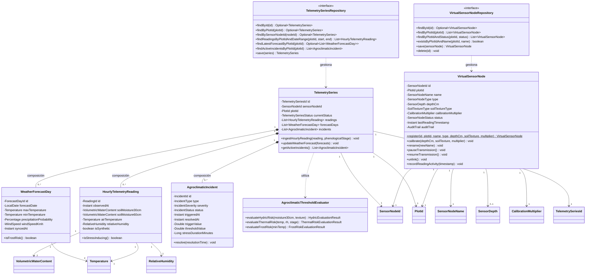
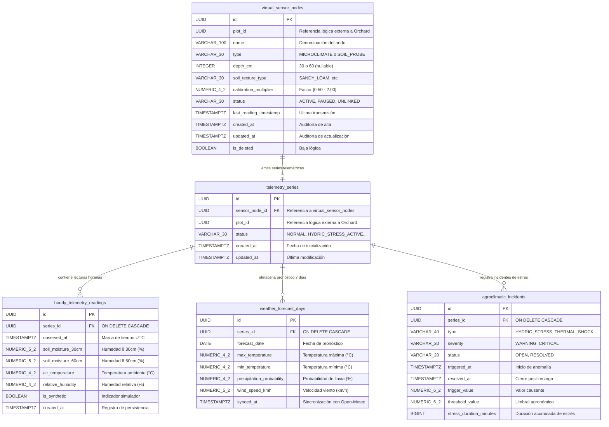
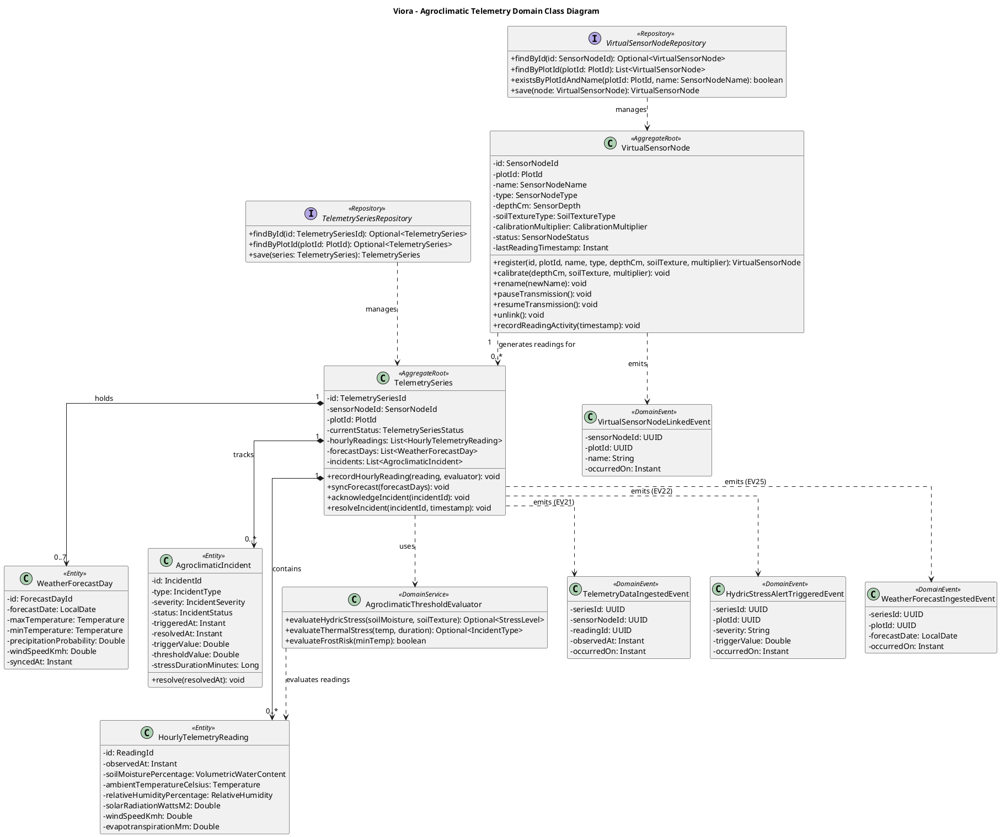
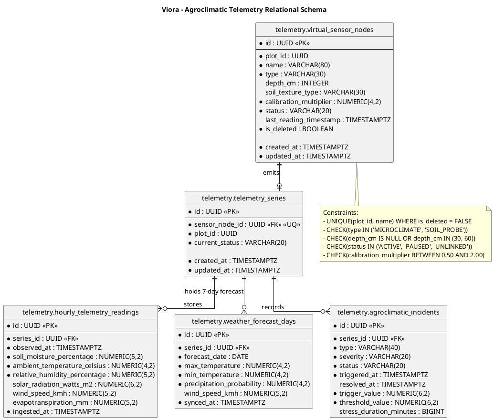

# Tactical-Level Domain-Driven Design: Agroclimatic Telemetry and Sensor Monitoring

---

### Bounded Context: Agroclimatic Telemetry and Sensor Monitoring (Telemetry)

**Propósito:** El Bounded Context de **Agroclimatic Telemetry and Sensor Monitoring** (denominado comúnmente *Telemetry*) es un subdominio de soporte (*Supporting Subdomain*) responsable de la sensometría edáfica virtual, la ingesta continua de series temporales agroclimáticas y la vigilancia activa de riesgos microclimáticos para los olivares. Administra el ciclo de vida operativo de los nodos sensores virtuales (estaciones microclimáticas y sondas edáficas multinivel a 30 y 60 cm), procesa e ingesta series horarias de lecturas sintéticas procedentes de un simulador telemétrico certificado, sincroniza pronósticos meteorológicos geolocalizados a 7 días mediante el proveedor meteorológico externo Open-Meteo, y evalúa umbrales agronómicos críticos para la detección y disparo reactivo de alertas por estrés hídrico radicular, choques térmicos en floración y heladas radiativas invernales.

Técnica y agronómicamente, resuelve la carencia de instrumentalización física de bajo costo en las cuencas y valles olivareros, posibilitando la simulación precisa del balance hídrico en el bulbo de absorción radicular activo del olivo (*Olea europaea L.* cv. Criolla y Sevillana). Aísla semánticamente la lógica de series de tiempo e incidentes agroclimáticos de la delimitación geográfica predial, referenciando exclusivamente de forma lógica por identificador inmutable (`PlotId`) a las parcelas georreferenciadas pertenecientes al Bounded Context *Olive Orchard and Plot Management*, sin acoplar modelos de datos ni dependencias directas entre capas de dominio.

---

#### Domain Layer

En esta capa se modela la lógica de negocio pura, independiente de frameworks, infraestructura o mecanismos de persistencia. Comprende Aggregates, Entities, Value Objects, Domain Services, Domain Events e interfaces de Repositorios.

##### Aggregates y Entities

###### VirtualSensorNode (Aggregate Root)
* **Propósito:** Delimita la frontera de consistencia transaccional para el alta, configuración, calibración edáfica y retiro de dispositivos sensores virtuales vinculados a una unidad productiva olivarera delimitada.
* **Atributos:**
  * `id: SensorNodeId` (Identificador único / UUID)
  * `plotId: PlotId` (Referencia lógica por ID al cuartel de *Olive Orchard and Plot Management*)
  * `name: SensorNodeName` (Value Object: denominación descriptiva única en el predio, ej. "Sonda Radicular Cuartel Norte")
  * `type: SensorNodeType` (Value Object / Enum: `MICROCLIMATE`, `SOIL_PROBE`)
  * `depthCm: SensorDepth` (Value Object: profundidad de monitoreo edáfico de 30 cm o 60 cm; nulo para estaciones microclimáticas)
  * `soilTextureType: SoilTextureType` (Value Object / Enum: `SANDY_LOAM`, `SANDY`, `LOAM`, `CLAY_LOAM`)
  * `calibrationMultiplier: CalibrationMultiplier` (Value Object: factor volumétrico de ajuste en rango agronómico [0.50, 2.00])
  * `status: SensorNodeStatus` (Value Object / Enum: `ACTIVE`, `PAUSED`, `UNLINKED`)
  * `lastReadingTimestamp: Instant` (Marca temporal de la última lectura sintética procesada)
  * `auditTrail: AuditTrail` (Value Object: metadatos de auditoría `createdAt`, `updatedAt`, `isDeleted`)
* **Métodos:**
  * `register(id: SensorNodeId, plotId: PlotId, name: SensorNodeName, type: SensorNodeType, depthCm: SensorDepth, soilTexture: SoilTextureType, multiplier: CalibrationMultiplier): VirtualSensorNode` - Fábrica estática que verifica invariantes de tipo y profundidad, inicializa el nodo en estado `ACTIVE` y encola `VirtualSensorNodeLinkedEvent`.
  * `calibrate(depthCm: SensorDepth, soilTexture: SoilTextureType, multiplier: CalibrationMultiplier): void` - Valida y reconfigura el estrato radicular objetivo y factores de textura, emitiendo `VirtualSensorNodeCalibratedEvent`.
  * `rename(newName: SensorNodeName): void` - Actualiza la denominación del nodo garantizando unicidad en el predio.
  * `pauseTransmission(): void` - Suspende transitoriamente la ingesta de series horarias para labores de mantenimiento.
  * `resumeTransmission(): void` - Restablece la admisión de lecturas en estado activo.
  * `unlink(): void` - Ejecuta la baja lógica del nodo transicionando su estado a `UNLINKED`, encolando `VirtualSensorNodeUnlinkedEvent` y preservando intacta la trazabilidad histórica de lecturas previas.
  * `recordReadingActivity(timestamp: Instant): void` - Actualiza la marca temporal de transmisión activa.
* **Invariantes y Reglas de Negocio:**
  1. **Unicidad de Denominación por Parcela:** No puede coexistir más de un nodo sensor virtual con la misma denominación en estado activo o pausado dentro de la misma parcela (`plotId`).
  2. **Coherencia de Estrato Radicular:** Si el dispositivo es clasificado como sonda de suelo (`SOIL_PROBE`), la profundidad configurada debe corresponder estrictamente a 30 cm o 60 cm (horizontes de máxima absorción radicular del olivo). Si es de tipo `MICROCLIMATE`, no admite profundidad.
  3. **Inmutabilidad y Preservación Histórica:** La desvinculación de un nodo no purga físicamente el registro ni sus series temporales asociadas; transiciona el estado a `UNLINKED` para garantizar trazabilidad agronómica plurianual.

###### TelemetrySeries (Aggregate Root)
* **Propósito:** Raíz de consistencia que encapsula la ingesta cronológica de series horarias de microclima y humedad de suelo, el almacenamiento de pronósticos meteorológicos a 7 días y el ciclo de vida de los incidentes agroclimáticos de estrés hídrico y choque térmico.
* **Atributos:**
  * `id: TelemetrySeriesId` (Identificador único / UUID)
  * `sensorNodeId: SensorNodeId` (Referencia por ID al nodo sensor virtual emisor)
  * `plotId: PlotId` (Referencia lógica por ID a la parcela monitoreada)
  * `readings: List<HourlyTelemetryReading>` (Colección interna de lecturas horarias continuas)
  * `forecastDays: List<WeatherForecastDay>` (Colección interna de proyecciones meteorológicas a 7 días)
  * `incidents: List<AgroclimaticIncident>` (Colección interna de incidentes y estados de alerta agroclimática)
  * `currentStatus: TelemetrySeriesStatus` (Value Object / Enum: `NORMAL`, `HYDRIC_STRESS_ACTIVE`, `THERMAL_SHOCK_ACTIVE`, `CRITICAL_COMBINED`)
* **Métodos:**
  * `ingestHourlyReading(reading: HourlyTelemetryReading, phenologicalStage: String): void` - Valida la consistencia temporal de la lectura, la incorpora a la serie, evalúa umbrales fisiológicos de estrés y emite los eventos `TelemetryDataIngestedEvent`, `HydricStressAlertTriggeredEvent`, `ThermalThresholdAlertTriggeredEvent` o `AgroclimaticAlertResolvedEvent` según corresponda.
  * `updateWeatherForecast(forecasts: List<WeatherForecastDay>): void` - Sobrescribe la proyección a 7 días, valida continuidad temporal, evalúa riesgo de helada radiativa invernal y encola `WeatherForecastIngestedEvent`.
  * `getActiveIncidents(): List<AgroclimaticIncident>` - Devuelve incidentes vigentes no normalizados.
* **Invariantes y Reglas de Negocio:**
  1. **Disparo Obligatorio de Estrés Hídrico:** Si la lectura de humedad volumétrica de suelo a 30 cm desciende por debajo de $\theta < 18\%$ (punto de recarga crítico en suelos arenosos y franco-arenosos áridos), el agregado transiciona obligatoriamente a estado de estrés hídrico y genera un incidente de severidad crítica.
  2. **Resolución Automática Post-Riego:** Si una nueva lectura registra recuperación hídrica a $\theta \ge 22\%$ (capacidad de campo del bulbo radicular), el incidente abierto se clausura de forma automática, calculando el tiempo total bajo estrés y normalizando el estado.
  3. **Protección Térmica en Floración:** Si la temperatura ambiental supera los $32.0^\circ\text{C}$ con humedad relativa menor al $20.0\%$ durante la fase fenológica de floración (*Flowering*), se activa obligatoriamente una advertencia por riesgo de desecación estigmática y aborto floral.
  4. **Alerta Preventiva de Helada en Pronóstico:** Si la temperatura mínima proyectada a $\le 48$ horas es inferior o igual a $1.5^\circ\text{C}$, se califica la condición como riesgo inminente de helada radiativa invernal.

###### HourlyTelemetryReading (Entity Interna de TelemetrySeries)
* **Propósito:** Modela una medición horaria puntual de variables edáficas y ambientales en el estrato del olivar.
* **Atributos:**
  * `id: ReadingId` (Identificador único local / UUID)
  * `observedAt: Instant` (Marca temporal en UTC de la medición)
  * `soilMoisture30cm: VolumetricWaterContent` (Value Object: humedad volumétrica a 30 cm de profundidad)
  * `soilMoisture60cm: VolumetricWaterContent` (Value Object: humedad volumétrica a 60 cm de profundidad)
  * `airTemperature: Temperature` (Value Object: temperatura ambiental en $^{\\circ}\\text{C}$)
  * `relativeHumidity: RelativeHumidity` (Value Object: humedad relativa ambiental en $\\%$)
  * `isSynthetic: boolean` (Indicador de lectura simulada generada por *Telemetry Simulator*, por defecto `true`)
* **Métodos:**
  * `isStressInducing(): boolean` - Evalúa si la lectura individual cae en umbrales de riesgo.

###### WeatherForecastDay (Entity Interna de TelemetrySeries)
* **Propósito:** Modela la previsión agrometeorológica diaria dentro del horizonte de 7 días geolocalizado para la parcela.
* **Atributos:**
  * `id: ForecastDayId` (Identificador único local / UUID)
  * `forecastDate: LocalDate` (Fecha calendario de la proyección)
  * `maxTemperature: Temperature` (Temperatura máxima diurna proyectada)
  * `minTemperature: Temperature` (Temperatura mínima nocturna proyectada)
  * `precipitationProbability: Percentage` (Probabilidad de lluvia estimada [0% - 100%])
  * `windSpeedKmh: WindSpeed` (Velocidad estimada del viento en $\\text{km/h}$)
  * `syncedAt: Instant` (Marca temporal de sincronización con Open-Meteo)
* **Métodos:**
  * `isFrostRisk(): boolean` - Retorna verdadero si `minTemperature <= 1.5°C`.

###### AgroclimaticIncident (Entity Interna de TelemetrySeries)
* **Propósito:** Registra el ciclo de vida de un evento anómalo de estrés fisiológico edáfico o microclimático.
* **Atributos:**
  * `id: IncidentId` (Identificador único local / UUID)
  * `type: IncidentType` (Enum: `HYDRIC_STRESS`, `THERMAL_SHOCK`, `FROST_WARNING`)
  * `severity: IncidentSeverity` (Enum: `WARNING`, `CRITICAL`)
  * `status: IncidentStatus` (Enum: `OPEN`, `RESOLVED`)
  * `triggeredAt: Instant` (Momento de detección de la anomalía)
  * `resolvedAt: Instant` (Momento de normalización o resolución, anulable)
  * `triggerValue: Double` (Valor métrico que causó el disparo, ej. 16.2% de humedad o 33.5°C)
  * `thresholdValue: Double` (Umbral agronómico transgredido, ej. 18.0% o 32.0°C)
  * `stressDurationMinutes: Long` (Duración acumulada de estrés en minutos calculada al resolverse)
* **Métodos:**
  * `resolve(resolutionTime: Instant): void` - Cierra el incidente, fija la fecha de resolución y computa la duración acumulada.

##### Value Objects (Conceptuales e Inmutables)
* **`SensorNodeId`**: Encapsula el identificador UUID inmutable del nodo sensor virtual. Valida formato canónico y no nulidad en constructor.
* **`TelemetrySeriesId`**: Identificador UUID de la serie temporal de lecturas e incidentes agroclimáticos.
* **`ReadingId` / `ForecastDayId` / `IncidentId`**: Identificadores UUID de las entidades subordinadas a la raíz `TelemetrySeries`.
* **`PlotId`**: Referencia lógica foránea inmutable hacia el cuartel delimitado en el Bounded Context de *Olive Orchard and Plot Management*.
* **`SensorNodeName`**: Cadena inmutable no vacía, entre 3 y 100 caracteres, normalizada sin espacios superfluos.
* **`SensorDepth`**: Entero inmutable restringido rigurosamente a los valores `30` o `60` (representando centímetros de profundidad radicular). Lanza excepción de dominio ante cualquier otro valor numérico.
* **`VolumetricWaterContent`**: Decimal de precisión fija que representa el contenido volumétrico de agua en suelo ($\\theta$). Rango válido de $0.00$ a $1.00$ ($0\\%$ a $100\\%$). Provee métodos `isBelowRefillPoint()` ($\\theta < 0.18$) e `isAtOrAboveFieldCapacity()` ($\\theta \\ge 0.22$).
* **`Temperature`**: Decimal inmutable en grados Celsius ($^{\\circ}\\text{C}$) en rango biofísicamente admitido ($-20.0^\\circ\\text{C}$ a $+60.0^\\circ\\text{C}$). Provee métodos de comparación de umbrales térmicos.
* **`RelativeHumidity`**: Decimal inmutable de porcentaje de humedad relativa del aire en rango $[0.0, 100.0]$.
* **`Percentage`**: Decimal genérico para probabilidades e índices acotado en $[0.0, 100.0]$.
* **`WindSpeed`**: Decimal no negativo que representa la velocidad del viento en $\\text{km/h}$.
* **`CalibrationMultiplier`**: Factor de escala volumétrica edáfica acotado en $[0.50, 2.00]$, con valor estándar neutro de $1.00$.
* **`AuditTrail`**: Metadatos inmutables de trazabilidad temporal (`createdAt: Instant`, `updatedAt: Instant`, `isDeleted: boolean`).

##### Domain Services
* **`AgroclimaticThresholdEvaluator`**:
  * **Propósito:** Servicio puro sin estado que encapsula los modelos biofísicos de tolerancia al estrés hídrico y térmico del olivo según las características edafológicas de la cuenca olivícola y la variedad cultivada.
  * **Métodos:**
    * `evaluateHydricRisk(moisture30cm: VolumetricWaterContent, texture: SoilTextureType): HydricEvaluationResult` - Evalúa si la humedad edáfica cayó bajo el punto de recarga o retornó a capacidad de campo.
    * `evaluateThermalRisk(temp: Temperature, rh: RelativeHumidity, stage: String): ThermalRiskEvaluationResult` - Evalúa si la combinación de temperatura diurna y sequedad atmosférica genera aborto estigmático en floración.
    * `evaluateFrostRisk(minTemp: Temperature): FrostRiskEvaluationResult` - Determina severidad y horas críticas ante temperaturas nocturnas próximas al punto de congelación ($\\le 1.5^\\circ\\text{C}$).

##### Repositories (Interfaces en Domain)
Contratos agnósticos de base de datos definidos en el dominio:
* **`VirtualSensorNodeRepository`**:
  * `findById(id: SensorNodeId): Optional<VirtualSensorNode>`
  * `findByPlotId(plotId: PlotId): List<VirtualSensorNode>`
  * `findByPlotIdAndStatus(plotId: PlotId, status: SensorNodeStatus): List<VirtualSensorNode>`
  * `existsByPlotIdAndName(plotId: PlotId, name: SensorNodeName): boolean`
  * `save(sensorNode: VirtualSensorNode): VirtualSensorNode`
  * `delete(id: SensorNodeId): void`
* **`TelemetrySeriesRepository`**:
  * `findById(id: TelemetrySeriesId): Optional<TelemetrySeries>`
  * `findByPlotId(plotId: PlotId): Optional<TelemetrySeries>`
  * `findBySensorNodeId(nodeId: SensorNodeId): Optional<TelemetrySeries>`
  * `findReadingsByPlotIdAndDateRange(plotId: PlotId, start: Instant, end: Instant): List<HourlyTelemetryReading>`
  * `findLatestForecastByPlotId(plotId: PlotId): Optional<List<WeatherForecastDay>>`
  * `findActiveIncidentsByPlotId(plotId: PlotId): List<AgroclimaticIncident>`
  * `save(series: TelemetrySeries): TelemetrySeries`

##### Domain Events
Eventos inmutables en tiempo pasado que informan cambios relevantes de estado en los agregados de telemetría:
* **`VirtualSensorNodeLinkedEvent`**: `{ sensorNodeId: UUID, plotId: UUID, name: String, type: String, depthCm: Integer, occurredOn: Instant }` (EV18)
  * *Disparado cuando:* El productor da de alta y asocia con éxito un nodo sensor virtual a un cuartel en estado activo.
* **`VirtualSensorNodeCalibratedEvent`**: `{ sensorNodeId: UUID, depthCm: Integer, soilTexture: String, multiplier: Double, occurredOn: Instant }` (EV19)
  * *Disparado cuando:* Se ajusta la profundidad radicular (30 cm o 60 cm) y el factor de calibración edáfica de una sonda.
* **`VirtualSensorNodeUnlinkedEvent`**: `{ sensorNodeId: UUID, plotId: UUID, unlinkedAt: Instant, occurredOn: Instant }` (EV20)
  * *Disparado cuando:* Se desvincula lógicamente un nodo virtual de la parcela, preservando sus series históricas.
* **`TelemetryDataIngestedEvent`**: `{ plotId: UUID, sensorNodeId: UUID, telemetryBatchId: UUID, periodStart: Instant, periodEnd: Instant, readingsCount: Integer, occurredOn: Instant }` (EV21)
  * *Disparado cuando:* Se persisten nuevas lecturas horarias de humedad y microclima; alimenta al modelo de frío dinámico de Erez en *Phenology*.
* **`HydricStressAlertTriggeredEvent`**: `{ plotId: UUID, sensorNodeId: UUID, soilMoisture30cm: Double, threshold: Double, severity: String, occurredOn: Instant }` (EV22)
  * *Disparado cuando:* La humedad de suelo a 30 cm cae por debajo del punto de recarga ($\\theta < 18\\%$).
* **`ThermalThresholdAlertTriggeredEvent`**: `{ plotId: UUID, sensorNodeId: UUID, temperature: Double, relativeHumidity: Double, thresholdTemp: Double, occurredOn: Instant }` (EV23)
  * *Disparado cuando:* La temperatura ambiental supera $32^\\circ\\text{C}$ con humedad $<20\\%$ durante la floración.
* **`AgroclimaticAlertResolvedEvent`**: `{ plotId: UUID, incidentId: UUID, incidentType: String, soilMoisture30cm: Double, stressDurationMinutes: Long, occurredOn: Instant }` (EV24)
  * *Disparado cuando:* La humedad del suelo retorna a niveles seguros ($\\theta \\ge 22\\%$) tras un turno de riego.
* **`WeatherForecastIngestedEvent`**: `{ plotId: UUID, forecastDate: LocalDate, minTemperature: Double, maxTemperature: Double, frostRisk: boolean, occurredOn: Instant }` (EV25)
  * *Disparado cuando:* Se sincroniza el pronóstico meteorológico a 7 días y se evalúa el riesgo de heladas zonales.

---

#### Interface Layer

En esta capa se definen los puntos de entrada y salida del sistema. Transforma solicitudes HTTP entrantes en Commands o Queries para la Application Layer y serializa los resultados del dominio en Resources (DTOs).

##### Controllers (REST)
Diseño basado estrictamente en recursos, sustantivos en plural y verbos HTTP estándar, implementando los contratos de las Historias Técnicas TS16, TS17, TS18, TS19, TS20 y TS42:

* **`PlotIotDeviceController`** (Ruta base: `/api/v1/plots/{plotId}/iot-devices`):
  * `POST /api/v1/plots/{plotId}/iot-devices` - Da de alta un nodo sensor virtual en la parcela (`TS16` / `CMD15` / `US13`). Responde `201 Created` con `IotDeviceResource`, `409 Conflict` ante nombre duplicado en el lote, o `400 Bad Request` por datos inválidos.
  * `GET /api/v1/plots/{plotId}/iot-devices` - Lista el inventario de nodos virtuales vinculados a la parcela (`TS17` / `US14`). Responde `200 OK` con arreglo de `IotDeviceResource`, o `404 Not Found` si la parcela no existe.
  * `GET /api/v1/plots/{plotId}/iot-devices/{deviceId}` - Obtiene el detalle operativo de un nodo sensor virtual específico. Responde `200 OK` o `404 Not Found`.
  * `PUT /api/v1/plots/{plotId}/iot-devices/{deviceId}` - Renombra el nodo y configura y calibra la profundidad de la sonda edáfica y factores edafológicos (`TS42` / `CMD16` / `US15`). Responde `200 OK` con `IotDeviceResource` o `400 Bad Request`.
  * `DELETE /api/v1/plots/{plotId}/iot-devices/{deviceId}` - Desvincula lógicamente el nodo virtual preservando el historial previo (`TS18` / `CMD17` / `US16`). Responde `204 No Content` o `404 Not Found`.

* **`PlotTelemetryController`** (Ruta base: `/api/v1/plots/{plotId}/telemetries`):
  * `GET /api/v1/plots/{plotId}/telemetries` - Consulta series temporales horarias de microclima y humedad edáfica (`TS19` / `US17`). Admite filtros obligatorios `?startDate={ISO}&endDate={ISO}`. Responde `200 OK` con `TelemetrySeriesResource`, o `400 Bad Request` ante rangos temporales ilógicos.
  * `POST /api/v1/plots/{plotId}/telemetries` - Ingesta horaria de telemetría (lectura individual o arreglo en lote procedente del simulador de sensores o sondas de campo) (`TS19` / `CMD18` / `US17`). Responde `202 Accepted` con cabecera `Location` o resumen de lecturas procesadas.

* **`PlotForecastController`** (Ruta base: `/api/v1/plots/{plotId}/forecasts`):
  * `GET /api/v1/plots/{plotId}/forecasts` - Consulta el pronóstico meteorológico geolocalizado a 7 días calculado a partir del centroide de la parcela (`TS20` / `US19`). Implementa almacenamiento en caché local con caducidad de 3 horas y sincronización automática vía `WeatherSyncScheduler`. Responde `200 OK` con `ForecastResource`, o `400 Bad Request` si la parcela carece de coordenadas perimétricas.
  * `POST /api/v1/plots/{plotId}/forecasts` - Ingesta o actualización de lote de pronóstico a 7 días para la parcela (`TS20` / `CMD19`). Responde `200 OK` o `202 Accepted`.

* **`PlotIncidentController`** (Ruta base: `/api/v1/plots/{plotId}/incidents`):
  * `GET /api/v1/plots/{plotId}/incidents` - Lista los incidentes agroclimáticos registrados en el lote (activos e históricos). Responde `200 OK`.

##### Resources (DTOs / Request & Response Models)
* **`CreateIotDeviceRequest`**: `{ name: String, type: String, depthCm: Integer, soilTextureType: String, calibrationMultiplier: Double }`
* **`CalibrateIotDeviceRequest`**: `{ name: String, depthCm: Integer, soilTextureType: String, calibrationMultiplier: Double }`
* **`IotDeviceResource`**: `{ id: UUID, plotId: UUID, name: String, type: String, depthCm: Integer, soilTextureType: String, calibrationMultiplier: Double, status: String, lastReadingTimestamp: Instant, createdAt: Instant }`
* **`IngestTelemetryBatchRequest`**: `{ sensorNodeId: UUID, readings: List<HourlyReadingItemRequest> }`
* **`HourlyReadingItemRequest`**: `{ observedAt: Instant, soilMoisture30cm: Double, soilMoisture60cm: Double, airTemperature: Double, relativeHumidity: Double }`
* **`HourlyTelemetryReadingResource`**: `{ id: UUID, observedAt: Instant, soilMoisture30cm: Double, soilMoisture60cm: Double, airTemperature: Double, relativeHumidity: Double, isSynthetic: boolean }`
* **`TelemetrySeriesResource`**: `{ plotId: UUID, sensorNodeId: UUID, currentStatus: String, readings: List<HourlyTelemetryReadingResource>, activeIncidents: List<AgroclimaticIncidentResource> }`
* **`ForecastDayResource`**: `{ forecastDate: LocalDate, maxTemperature: Double, minTemperature: Double, precipitationProbability: Double, windSpeedKmh: Double, frostRisk: boolean }`
* **`ForecastResource`**: `{ plotId: UUID, syncedAt: Instant, cached: boolean, dailyForecasts: List<ForecastDayResource> }`
* **`AgroclimaticIncidentResource`**: `{ id: UUID, type: String, severity: String, status: String, triggeredAt: Instant, resolvedAt: Instant, triggerValue: Double, thresholdValue: Double, stressDurationMinutes: Long }`

##### Assemblers / Mappers
* **`IotDeviceResourceAssembler`**: Convierte la entidad de dominio `VirtualSensorNode` en el DTO `IotDeviceResource`.
* **`CreateIotDeviceCommandAssembler`**: Transforma el payload JSON `CreateIotDeviceRequest` y el parámetro de ruta `{plotId}` en el comando de aplicación `LinkVirtualSensorNodeCommand`.
* **`TelemetrySeriesResourceAssembler`**: Mapea el agregado de dominio `TelemetrySeries` y sus colecciones de lecturas e incidentes en el DTO consolidado `TelemetrySeriesResource`.
* **`ForecastResourceAssembler`**: Transforma la lista de `WeatherForecastDay` y metadatos de sincronización en `ForecastResource`.

---

#### Application Layer

Coordina y orquesta los casos de uso del sistema. No implementa reglas de negocio agronómicas, sino que gestiona transacciones, delega a repositorios y servicios de dominio, y publica eventos.

##### Command Handlers
* **`LinkVirtualSensorNodeCommandHandler`** (CMD15 / US13 / TS16):
  * *Entrada:* `LinkVirtualSensorNodeCommand` (`plotId`, `name`, `type`, `depthCm`, `soilTextureType`, `calibrationMultiplier`)
  * *Flujo:* Valida existencia de la parcela en el sistema -> verifica unicidad del nombre en el predio (`existsByPlotIdAndName`) -> instancia el agregado `VirtualSensorNode` mediante su fábrica de dominio -> persiste a través de `VirtualSensorNodeRepository` -> despacha `VirtualSensorNodeLinkedEvent`.
* **`CalibrateVirtualSensorNodeCommandHandler`** (CMD16 / US15):
  * *Entrada:* `CalibrateVirtualSensorNodeCommand` (`sensorNodeId`, `depthCm`, `soilTextureType`, `calibrationMultiplier`)
  * *Flujo:* Recupera el nodo sensor por ID -> invoca el método de dominio `calibrate()` asegurando la validez del estrato (30/60 cm) -> persiste cambios -> publica `VirtualSensorNodeCalibratedEvent`.
* **`UnlinkVirtualSensorNodeCommandHandler`** (CMD17 / US16 / TS18):
  * *Entrada:* `UnlinkVirtualSensorNodeCommand` (`plotId`, `sensorNodeId`)
  * *Flujo:* Valida pertenencia del nodo a la parcela especificada -> ejecuta `unlink()` en el agregado transicionándolo a `UNLINKED` -> guarda cambios en el repositorio -> despacha `VirtualSensorNodeUnlinkedEvent`.
* **`IngestHourlyTelemetryCommandHandler`** (CMD18 / US17 / US18 / TS19):
  * *Entrada:* `IngestHourlyTelemetryCommand` (`plotId`, `sensorNodeId`, `readingsList`)
  * *Flujo:* Recupera o inicializa la raíz `TelemetrySeries` del cuartel -> para cada lectura recibida, obtiene el estado fenológico actual e invoca `ingestHourlyReading()` evaluando umbrales biofísicos con `AgroclimaticThresholdEvaluator` -> actualiza el estado de incidentes -> persiste en `TelemetrySeriesRepository` -> publica eventos encolados (`TelemetryDataIngestedEvent`, alertas de estrés o resolución).
* **`IngestWeatherForecastCommandHandler`** (CMD19 / US19 / TS20):
  * *Entrada:* `IngestWeatherForecastCommand` (`plotId`, `forecastDaysList`)
  * *Flujo:* Recupera `TelemetrySeries` de la parcela -> invoca `updateWeatherForecast()` validando el horizonte de 7 días -> evalúa riesgo de heladas invernales -> persiste en repositorio -> despacha `WeatherForecastIngestedEvent`.

##### Query Handlers
* **`ListPlotIotDevicesQueryHandler`** (TS17 / US14):
  * Resuelve `ListPlotIotDevicesQuery` obteniendo los nodos sensores vinculados a la parcela especificada desde `VirtualSensorNodeRepository`. Si el lote no existe, lanza excepción de recurso no encontrado.
* **`GetIotDeviceByIdQueryHandler`**:
  * Resuelve `GetIotDeviceByIdQuery` recuperando el nodo sensor virtual por su `SensorNodeId`.
* **`GetPlotTelemetrySeriesQueryHandler`** (TS19 / US17):
  * Resuelve `GetPlotTelemetrySeriesQuery` validando coherencia temporal (`startDate <= endDate`) y proyectando las lecturas horarias de humedad y microclima junto con el estado del semáforo.
* **`GetPlotWeatherForecastQueryHandler`** (TS20 / US19):
  * Resuelve `GetPlotWeatherForecastQuery`. Consulta primero la caché local en memoria (TTL 3 horas); ante ausencia, invoca el puerto del proveedor meteorológico Open-Meteo usando el centroide geográfico del lote, almacena en caché y retorna `ForecastResource`.
* **`ListPlotAgroclimaticIncidentsQueryHandler`**:
  * Resuelve `ListPlotAgroclimaticIncidentsQuery` retornando el histórico de alertas emitidas y resueltas.

##### Event Handlers
* **`OnHydricStressAlertTriggeredEventHandler`** (POL04 / US18 Escenario 1):
  * *Disparador:* Escucha `HydricStressAlertTriggeredEvent`.
  * *Acción:* Registra y emite una alerta in-app inmediata de emergencia agronómica asociada a la parcela con recomendación de horas sugeridas de riego por goteo, manteniéndola disponible offline sin dependencia de infraestructura push externa (RF-20).
* **`OnThermalThresholdAlertTriggeredEventHandler`** (POL05 / US18 Escenario 2):
  * *Disparador:* Escucha `ThermalThresholdAlertTriggeredEvent`.
  * *Acción:* Emite advertencia in-app de riesgo por choque térmico en floración recomendando riegos cortos de refrescamiento microclimático.
* **`OnAgroclimaticAlertResolvedEventHandler`** (POL06 / US18 Escenario 3):
  * *Disparador:* Escucha `AgroclimaticAlertResolvedEvent`.
  * *Acción:* Actualiza el estado visual del semáforo agronómico a normalizado y archiva el tiempo total acumulado de estrés hídrico.
* **`OnWeatherForecastIngestedEventHandler`** (POL14 / US19):
  * *Disparador:* Escucha `WeatherForecastIngestedEvent`.
  * *Acción:* Si se detecta $T_{min} \le 1.5^\circ\text{C}$ dentro de las próximas 48 horas, despacha un evento de integración hacia *Cooperative Operations and Territorial Intelligence* para la emisión de un aviso zonal preventivo de helada radiativa.

---

#### Infrastructure Layer

Clases que acceden a servicios externos (base de datos relacional PostgreSQL, adaptadores de clima agrometeorológico Open-Meteo, generador sintético de telemetría) e implementaciones concretas de los Repositorios.

##### 1. Paquetes y componentes principales
* **Persistence:**
  * `PostgresVirtualSensorNodeRepository`: Implementa `VirtualSensorNodeRepository` delegando en `SpringDataJpaVirtualSensorNodeRepository`.
  * `PostgresTelemetrySeriesRepository`: Implementa `TelemetrySeriesRepository` delegando en `SpringDataJpaTelemetrySeriesRepository`.
  * `VirtualSensorNodeJpaEntity`, `TelemetrySeriesJpaEntity`, `HourlyTelemetryReadingJpaEntity`, `WeatherForecastDayJpaEntity`, `AgroclimaticIncidentJpaEntity`: Entidades ORM con anotaciones JPA (`@Entity`, `@Table`).
  * `VirtualSensorNodeEntityMapper` y `TelemetrySeriesEntityMapper`: Conversores bidireccionales entre el modelo de Dominio puro y las entidades JPA.
* **Adapters / External Services:**
  * `OpenMeteoWeatherAdapter`: Implementa el puerto agrometeorológico del dominio mediante cliente HTTP (Spring WebClient / RestClient) consumiendo los endpoints de series horarias y pronóstico a 7 días de Open-Meteo, aplicando una política de tolerancia a fallos con caché local de 3 horas vía Caffeine (`@Cacheable("weatherForecasts")`).
  * `TelemetrySimulatorAdapter`: Componente programado (`@Scheduled`) o servicio de soporte que genera lecturas sintéticas consistentes con la física del suelo olivarero regional y las inyecta en el sistema marcándolas con `is_synthetic = true`.
* **Events:**
  * `SpringDomainEventPublisher`: Implementa el publicador de eventos del dominio mediante `ApplicationEventPublisher` de Spring Framework para despacho atómico síncrono/asíncrono en memoria.
* **Configuration:**
  * `TelemetryJpaConfig`: Habilita auditoría JPA (`@EnableJpaAuditing`) y administración de transacciones (`@EnableTransactionManagement`).
  * `TelemetrySecurityConfig`: Asegura que los endpoints de telemetría requieran token JWT válido y rol `PRODUCER` o credenciales de servicio para el simulador.

##### 2. Modelo de datos y mapeos
Estructura relacional en PostgreSQL para las tablas de este Bounded Context:

* **Tabla: `virtual_sensor_nodes`**
  ```sql
  CREATE TABLE virtual_sensor_nodes (
      id                     UUID PRIMARY KEY,
      plot_id                UUID NOT NULL,            -- Referencia lógica a Orchard BC
      name                   VARCHAR(100) NOT NULL,
      type                   VARCHAR(30) NOT NULL,     -- 'MICROCLIMATE', 'SOIL_PROBE'
      depth_cm               INTEGER,                  -- 30 o 60 (nulo si MICROCLIMATE)
      soil_texture_type      VARCHAR(30) NOT NULL,     -- 'SANDY_LOAM', 'SANDY', etc.
      calibration_multiplier NUMERIC(4, 2) NOT NULL DEFAULT 1.00,
      status                 VARCHAR(30) NOT NULL,     -- 'ACTIVE', 'PAUSED', 'UNLINKED'
      last_reading_timestamp TIMESTAMPTZ,
      created_at             TIMESTAMPTZ NOT NULL,
      updated_at             TIMESTAMPTZ NOT NULL,
      is_deleted             BOOLEAN NOT NULL DEFAULT FALSE,
      CONSTRAINT chk_vsn_type CHECK (type IN ('MICROCLIMATE', 'SOIL_PROBE')),
      CONSTRAINT chk_vsn_depth CHECK (depth_cm IS NULL OR depth_cm IN (30, 60)),
      CONSTRAINT chk_vsn_status CHECK (status IN ('ACTIVE', 'PAUSED', 'UNLINKED')),
      CONSTRAINT chk_vsn_multiplier CHECK (calibration_multiplier BETWEEN 0.50 AND 2.00)
  );
  ```

* **Tabla: `telemetry_series`**
  ```sql
  CREATE TABLE telemetry_series (
      id             UUID PRIMARY KEY,
      sensor_node_id UUID NOT NULL,                    -- Referencia a virtual_sensor_nodes
      plot_id        UUID NOT NULL,                    -- Referencia lógica a Orchard BC
      status         VARCHAR(30) NOT NULL,             -- 'NORMAL', 'HYDRIC_STRESS_ACTIVE', etc.
      created_at     TIMESTAMPTZ NOT NULL,
      updated_at     TIMESTAMPTZ NOT NULL,
      CONSTRAINT chk_ts_status CHECK (status IN ('NORMAL', 'HYDRIC_STRESS_ACTIVE', 'THERMAL_SHOCK_ACTIVE', 'CRITICAL_COMBINED'))
  );
  ```

* **Tabla: `hourly_telemetry_readings`**
  ```sql
  CREATE TABLE hourly_telemetry_readings (
      id                UUID PRIMARY KEY,
      series_id         UUID NOT NULL REFERENCES telemetry_series(id) ON DELETE CASCADE,
      observed_at       TIMESTAMPTZ NOT NULL,
      soil_moisture_30cm NUMERIC(5, 2) NOT NULL,       -- Contenido volumétrico θ (%)
      soil_moisture_60cm NUMERIC(5, 2) NOT NULL,       -- Contenido volumétrico θ (%)
      air_temperature   NUMERIC(4, 2) NOT NULL,       -- °C
      relative_humidity NUMERIC(4, 2) NOT NULL,       -- %
      is_synthetic      BOOLEAN NOT NULL DEFAULT TRUE, -- Bandera de simulación
      created_at        TIMESTAMPTZ NOT NULL,
      CONSTRAINT chk_htr_moisture_30 CHECK (soil_moisture_30cm BETWEEN 0.00 AND 100.00),
      CONSTRAINT chk_htr_moisture_60 CHECK (soil_moisture_60cm BETWEEN 0.00 AND 100.00),
      CONSTRAINT chk_htr_rh CHECK (relative_humidity BETWEEN 0.00 AND 100.00)
  );
  ```

* **Tabla: `weather_forecast_days`**
  ```sql
  CREATE TABLE weather_forecast_days (
      id                        UUID PRIMARY KEY,
      series_id                 UUID NOT NULL REFERENCES telemetry_series(id) ON DELETE CASCADE,
      forecast_date             DATE NOT NULL,
      max_temperature           NUMERIC(4, 2) NOT NULL,
      min_temperature           NUMERIC(4, 2) NOT NULL,
      precipitation_probability NUMERIC(4, 2) NOT NULL, -- %
      wind_speed_kmh            NUMERIC(5, 2) NOT NULL,
      synced_at                 TIMESTAMPTZ NOT NULL,
      CONSTRAINT chk_wfd_precip CHECK (precipitation_probability BETWEEN 0.00 AND 100.00)
  );
  ```

* **Tabla: `agroclimatic_incidents`**
  ```sql
  CREATE TABLE agroclimatic_incidents (
      id                      UUID PRIMARY KEY,
      series_id               UUID NOT NULL REFERENCES telemetry_series(id) ON DELETE CASCADE,
      type                    VARCHAR(40) NOT NULL,     -- 'HYDRIC_STRESS', 'THERMAL_SHOCK', 'FROST_WARNING'
      severity                VARCHAR(20) NOT NULL,     -- 'WARNING', 'CRITICAL'
      status                  VARCHAR(20) NOT NULL,     -- 'OPEN', 'RESOLVED'
      triggered_at            TIMESTAMPTZ NOT NULL,
      resolved_at             TIMESTAMPTZ,
      trigger_value           NUMERIC(6, 2) NOT NULL,
      threshold_value         NUMERIC(6, 2) NOT NULL,
      stress_duration_minutes BIGINT,
      CONSTRAINT chk_ai_type CHECK (type IN ('HYDRIC_STRESS', 'THERMAL_SHOCK', 'FROST_WARNING')),
      CONSTRAINT chk_ai_status CHECK (status IN ('OPEN', 'RESOLVED'))
  );
  ```

* **Índices y Restricciones Físicas:**
  * Índice de unicidad parcial en `virtual_sensor_nodes`:
    ```sql
    CREATE UNIQUE INDEX idx_vsn_plot_name_unique
    ON virtual_sensor_nodes (plot_id, name)
    WHERE is_deleted = FALSE;
    ```
  * Índice compuesto para filtros de inventario y estado:
    ```sql
    CREATE INDEX idx_vsn_plot_status ON virtual_sensor_nodes (plot_id, status);
    ```
  * Índice cronológico descendente para consultas de series horarias (`TS19`):
    ```sql
    CREATE INDEX idx_htr_series_observed_at ON hourly_telemetry_readings (series_id, observed_at DESC);
    ```
  * Índice para consulta de incidentes activos:
    ```sql
    CREATE INDEX idx_ai_series_status ON agroclimatic_incidents (series_id, status);
    ```
  * Índice de búsqueda rápida para pronósticos vigentes:
    ```sql
    CREATE INDEX idx_wfd_series_date ON weather_forecast_days (series_id, forecast_date);
    ```

* **Mapeo Entity <-> Persistencia:**
  * Dominio -> DB: El mapper descompone los Value Objects (`SensorDepth`, `VolumetricWaterContent`, `Temperature`, `SensorNodeName`) en columnas primitivas `INTEGER`, `NUMERIC` y `VARCHAR`.
  * DB -> Dominio: Reconstrucción mediante métodos estáticos de fábrica (`fromPersistence`) que reinstancian los agregados sin disparar eventos retroactivos.

##### 3. Repositories – Implementación
* **`PostgresVirtualSensorNodeRepository`**:
  * Utiliza `SpringDataJpaVirtualSensorNodeRepository` para operaciones CRUD y consultas derivadas.
  * Implementa `@Transactional(readOnly = true)` en métodos de lectura y `@Transactional` en modificaciones.
  * Gestiona control de concurrencia optimista y filtrado de bajas lógicas mediante cláusulas `@Where(clause = "is_deleted = false")` en consultas ordinarias de inventario.
* **`PostgresTelemetrySeriesRepository`**:
  * Implementa recuperación eficiente de series con `@EntityGraph` para evitar problemas de consultas $N+1$ al cargar lecturas e incidentes.
  * Emplea paginación o ventanas temporales acotadas por rangos `BETWEEN :start AND :end` para proteger la memoria de la máquina virtual Java ante millones de registros temporales.

##### 4. Seguridad & Resiliencia
* **Validación de Identidad y Autorización:** Todos los endpoints HTTP son autenticados mediante `JwtAuthenticationFilter`. Se valida criptográficamente que el `plotId` pertenezca al usuario autenticado mediante un interceptor de autorización predial antes de permitir el alta o consulta de telemetría.
* **Tolerancia a Fallos del Servicio Meteorológico:** Open-Meteo se consume mediante un circuito resiliente con caché local en memoria (Caffeine) con un TTL de 3 horas. Si la API externa no responde o falla por conectividad, se retorna de inmediato el último pronóstico almacenado en caché notificando la antigüedad de la sincronización (`TS20` / `US19` Escenario 2).
* **Manejo Centralizado de Excepciones (RFC 7807):** Toda violación de invariantes de dominio (ej. profundidad inválida, nombre duplicado, rangos de fechas ilógicos) se traduce en un payload estructurado `ProblemDetail` conforme al estándar RFC 7807 (`TS31`), retornando códigos `400 Bad Request`, `404 Not Found` o `409 Conflict`.
* **Auditoría Inmutable:** Marcas temporales `created_at` y `updated_at` administradas automáticamente vía Spring Data JPA Auditing (`@CreatedDate`, `@LastModifiedDate`).

##### 5. Perspectiva Táctica de la Aplicación Móvil (Android / Flutter)
* **Caché Local de Telemetría y Pronóstico Offline:**
  * *Android Nativo (Room / SQLite):* `TelemetryCacheDao` y entidades `LocalTelemetrySeriesEntity`, `LocalWeatherForecastEntity` que cachean las últimas 24 lecturas horarias y el pronóstico a 7 días de la parcela activa para consulta en campo sin red.
  * *Cross-Platform (sqflite / SQLite):* Tablas `telemetry_cache` y `forecast_cache` con clave compuesta `(plot_id, fetched_at)` gestionadas por `LocalDataAccess`.
* **Visualización y Alertas en Dispositivo:**
  * Componentes de interfaz móvil (`Agronomy and Harvest UI`) que renderizan curvas de humedad de suelo a 30/60 cm y activan banners de alerta local inmediata ante incidentes críticos de estrés hídrico (`HydricStressAlertTriggeredEvent`).

---

#### Bounded Context Software Architecture Component Level Diagrams

En esta sección se describe la descomposición y el flujo de comunicación entre los componentes de software dentro del contenedor Backend (Spring Boot), detallando cómo interactúan las cuatro capas del Bounded Context:

##### 1. Descomposición de Componentes por Capa
* **Interface / API Layer:** 
  * `PlotIotDeviceController`: Expone endpoints para el inventario, alta, calibración y desvinculación de nodos sensores virtuales.
  * `PlotTelemetryController`: Expone endpoints de lectura e ingesta consolidada de series temporales horarias.
  * `PlotForecastController`: Expone la consulta de pronósticos geolocalizados a 7 días.
  * `PlotIncidentController`: Expone la consulta de incidentes y alertas agroclimáticas.
* **Application Layer:**
  * Command Handlers (`LinkVirtualSensorNodeCommandHandler`, `CalibrateVirtualSensorNodeCommandHandler`, `UnlinkVirtualSensorNodeCommandHandler`, `IngestHourlyTelemetryCommandHandler`, `IngestWeatherForecastCommandHandler`): Coordinan la ejecución de casos de uso y la transaccionalidad.
  * Query Handlers (`ListPlotIotDevicesQueryHandler`, `GetPlotTelemetrySeriesQueryHandler`, `GetPlotWeatherForecastQueryHandler`): Ejecutan lecturas optimizadas y gestionan la caché local.
  * Event Handlers (`OnHydricStressAlertTriggeredEventHandler`, `OnThermalThresholdAlertTriggeredEventHandler`, `OnAgroclimaticAlertResolvedEventHandler`, `OnWeatherForecastIngestedEventHandler`): Ejecutan políticas reactivas de alerta in-app e integración entre contextos.
* **Domain Layer:**
  * Agregados Raíz `VirtualSensorNode` y `TelemetrySeries`, Entidades Internas (`HourlyTelemetryReading`, `WeatherForecastDay`, `AgroclimaticIncident`), Value Objects agronómicos y el servicio `AgroclimaticThresholdEvaluator`.
  * Interfaces de Repositorio `VirtualSensorNodeRepository` y `TelemetrySeriesRepository`.
* **Infrastructure Layer:**
  * Repositorios concretos `PostgresVirtualSensorNodeRepository` y `PostgresTelemetrySeriesRepository` sobre PostgreSQL.
  * `OpenMeteoWeatherAdapter`: Adaptador cliente para el pronóstico climático externo.
  * `TelemetrySimulatorAdapter`: Adaptador programado para generación de series sintéticas.
  * `SpringDomainEventPublisher`: Despachador de eventos de dominio.

```mermaid
graph TD
    subgraph ClientLayer ["Clientes Externos & Aplicaciones"]
        MobileApp["Aplicación Móvil Viora (Android / Flutter)"]
        Simulator["Telemetry Simulator (Ejecución Programada)"]
        OpenMeteoAPI["Servicio Externo Open-Meteo API"]
    end

    subgraph InterfaceLayer ["Interface Layer"]
        IotCtrl["PlotIotDeviceController"]
        TelemCtrl["PlotTelemetryController"]
        ForeCtrl["PlotForecastController"]
        IncCtrl["PlotIncidentController"]
    end

    subgraph ApplicationLayer ["Application Layer"]
        CmdHandlers["Command Handlers: (Link, Calibrate, Unlink, Ingest)"]
        QueryHandlers["Query Handlers: (ListDevices, GetTelemetry, GetForecast)"]
        EventHandlers["Event Handlers / Policies: (POL04, POL05, POL06, POL14)"]
    end

    subgraph DomainLayer ["Domain Layer"]
        VSN["VirtualSensorNode (Aggregate Root)"]
        TS["TelemetrySeries (Aggregate Root)"]
        DomainService["AgroclimaticThresholdEvaluator"]
        RepoInterfaces["Interfaces de Repositorio: (VirtualSensorNodeRepo, TelemetrySeriesRepo)"]
        DomainEvents["Domain Events: (EV18 - EV25)"]
    end

    subgraph InfrastructureLayer ["Infrastructure Layer"]
        PostgresVSNRepo["PostgresVirtualSensorNodeRepository"]
        PostgresTSRepo["PostgresTelemetrySeriesRepository"]
        WeatherAdapter["OpenMeteoWeatherAdapter (Caffeine Cache 3h)"]
        EventPublisher["SpringDomainEventPublisher"]
        PostgreSQL[("Base de Datos PostgreSQL")]
    end

    MobileApp -->|HTTPS / REST| IotCtrl
    MobileApp -->|HTTPS / REST| TelemCtrl
    MobileApp -->|HTTPS / REST| ForeCtrl
    MobileApp -->|HTTPS / REST| IncCtrl
    Simulator -->|POST /telemetries| TelemCtrl

    IotCtrl --> CmdHandlers
    IotCtrl --> QueryHandlers
    TelemCtrl --> CmdHandlers
    TelemCtrl --> QueryHandlers
    ForeCtrl --> QueryHandlers
    IncCtrl --> QueryHandlers

    CmdHandlers --> VSN
    CmdHandlers --> TS
    CmdHandlers --> DomainService
    CmdHandlers --> RepoInterfaces
    QueryHandlers --> RepoInterfaces
    QueryHandlers --> WeatherAdapter
    WeatherAdapter -->|HTTP GET| OpenMeteoAPI

    VSN --> DomainEvents
    TS --> DomainEvents
    CmdHandlers --> EventPublisher
    EventPublisher --> EventHandlers

    RepoInterfaces <|.. PostgresVSNRepo
    RepoInterfaces <|.. PostgresTSRepo
    PostgresVSNRepo --> PostgreSQL
    PostgresTSRepo --> PostgreSQL
```

##### 2. Flujo de Comunicación y Conectividad
1. **Entrada:** La aplicación móvil (o el *Telemetry Simulator*) emite una solicitud HTTP hacia uno de los controladores REST del Bounded Context (`PlotIotDeviceController` o `PlotTelemetryController`).
2. **Transformación:** El controlador valida las restricciones sintácticas básicas, transforma el payload JSON en un Command o Query mediante su Assembler y delega la ejecución al Handler correspondiente en la capa de aplicación.
3. **Orquestación de Dominio:** El Command Handler inicia una transacción de base de datos (`@Transactional`), verifica precondiciones y recupera o instancia el agregado de dominio (`VirtualSensorNode` o `TelemetrySeries`) a través de la interfaz del repositorio.
4. **Ejecución y Reglas:** Se ejecutan los métodos de negocio del Aggregate Root o se consulta al servicio de dominio `AgroclimaticThresholdEvaluator`, comprobando invariantes agronómicas (unicidad de nombre, estratos radiculares de 30/60 cm, umbrales de estrés hídrico $\\theta < 18\\%$).
5. **Persistencia:** El Handler invoca `save()` sobre el repositorio. La implementación concreta en Infrastructure (`PostgresVirtualSensorNodeRepository` o `PostgresTelemetrySeriesRepository`) mapea el modelo de dominio a entidades JPA y ejecuta las sentencias SQL sobre PostgreSQL.
6. **Integración Externa / Eventos:** Los eventos de dominio generados durante la transacción se publican mediante `SpringDomainEventPublisher`. Si se dispara estrés hídrico (`EV22`), `OnHydricStressAlertTriggeredEventHandler` genera la notificación in-app. Si se ingiere telemetría horaria (`EV21`), el evento queda disponible para que el contexto *Phenology* acumule porciones de frío de Erez.
7. **Respuesta:** El controlador toma el agregado o proyección devuelto, lo serializa en un Resource DTO (`IotDeviceResource`, `TelemetrySeriesResource` o `ForecastResource`) y entrega la respuesta HTTP estándar (`200 OK`, `201 Created` o `204 No Content`) al cliente.

---

#### Bounded Context Software Architecture Code Level Diagrams

##### Bounded Context Domain Layer Class Diagrams

En esta sección se describe la estructura formal del modelo de clases del Domain Layer, detallando clases participantes, visibilidad, signaturas de métodos y relaciones:

##### 1. Estructura de Clases y Estereotipos
* **`VirtualSensorNode` (Aggregate Root):** Centraliza la identidad y el ciclo de vida del nodo sensor virtual. Sus atributos son privados (`-`) y sus métodos de mutación son públicos (`+`), salvaguardando sus invariantes.
* **`TelemetrySeries` (Aggregate Root):** Raíz transaccional para lecturas continuas, pronósticos e incidentes de estrés.
* **`HourlyTelemetryReading` (Entity Interna):** Registro puntual de variables edafoclimáticas horarias.
* **`WeatherForecastDay` (Entity Interna):** Registro meteorológico diario a 7 días vista.
* **`AgroclimaticIncident` (Entity Interna):** Entidad con identidad local que modela anomalías fisiológicas.
* **Value Objects:** Clases inmutables de soporte (`SensorNodeId`, `TelemetrySeriesId`, `PlotId`, `SensorNodeName`, `SensorDepth`, `VolumetricWaterContent`, `Temperature`, `RelativeHumidity`, `CalibrationMultiplier`, `AuditTrail`).
* **`AgroclimaticThresholdEvaluator` (Domain Service):** Servicio evaluador sin estado.
* **`VirtualSensorNodeRepository` y `TelemetrySeriesRepository` (Interfaces):** Contratos de persistencia agnósticos.



##### 2. Relaciones y Conectividad entre Clases
* **Composición (`1 *-- 0..*`):** La raíz `TelemetrySeries` ejerce control transaccional absoluto sobre las entidades internas `HourlyTelemetryReading`, `WeatherForecastDay` y `AgroclimaticIncident`. Si la raíz se elimina, todas sus lecturas e incidentes subordinados desaparecen con ella.
* **Asociación / Atributo (`-->`):** Los agregados contienen Value Objects inmutables (`SensorNodeName`, `SensorDepth`, `VolumetricWaterContent`, `Temperature`) como tipos de sus atributos.
* **Dependencia (`..>`):** La raíz `TelemetrySeries` se apoya en el servicio de dominio `AgroclimaticThresholdEvaluator` para calcular estados fisiológicos sin acoplar estado interno.
* **Referencias externas por ID:** La vinculación con el Bounded Context de *Olive Orchard and Plot Management* se establece exclusivamente mediante el identificador inmutable `PlotId`, sin asociar referencias directas a entidades externas.

---

##### Bounded Context Database Design Diagram

En esta sección se detalla el diseño físico y relacional de la base de datos en PostgreSQL, describiendo tablas, tipos de datos, claves primarias, claves foráneas, restricciones de integridad e índices:

##### 1. Tablas y Estructura de Claves
* **Tabla Principal `virtual_sensor_nodes`:** Contiene el registro de nodos virtuales asociados a parcelas.
  * Clave primaria: `id` (UUID).
  * Clave foránea lógica: `plot_id` (UUID, sin constraint de clave foránea física en base de datos para garantizar autonomía de despliegue).
* **Tabla Principal `telemetry_series`:** Encabezado de la serie temporal para una parcela y nodo sensor.
  * Clave primaria: `id` (UUID).
  * Claves foráneas: `sensor_node_id` (UUID), `plot_id` (UUID lógico).
* **Tablas Subordinadas (`hourly_telemetry_readings`, `weather_forecast_days`, `agroclimatic_incidents`):**
  * Clave primaria: `id` (UUID).
  * Clave foránea física: `series_id` (UUID) con regla de integridad `ON DELETE CASCADE` referenciando a `telemetry_series(id)`.

##### 2. Relaciones y Cardinalidad Relacional
* **Relación 1 a N (`telemetry_series` a `hourly_telemetry_readings`):** Un registro de serie temporal agrupa miles de lecturas horarias cronológicas.
* **Relación 1 a N (`telemetry_series` a `weather_forecast_days`):** Un registro de serie almacena el lote vigente de pronóstico a 7 días.
* **Relación 1 a N (`telemetry_series` a `agroclimatic_incidents`):** Un registro de serie mantiene el histórico de eventos de estrés hídrico y térmico.



##### 3. Índices y Reglas de Integridad
* **Restricciones `CHECK` a Nivel de Motor:**
  * Tipos admitidos en `virtual_sensor_nodes`: `type IN ('MICROCLIMATE', 'SOIL_PROBE')`.
  * Profundidades admitidas: `depth_cm IS NULL OR depth_cm IN (30, 60)`.
  * Estados del nodo: `status IN ('ACTIVE', 'PAUSED', 'UNLINKED')`.
  * Multiplicador: `calibration_multiplier BETWEEN 0.50 AND 2.00`.
  * Humedad y humedad relativa: acotadas entre `0.00` y `100.00`.
* **Índice Único Parcial:** 
  * `CREATE UNIQUE INDEX idx_vsn_plot_name_unique ON virtual_sensor_nodes (plot_id, name) WHERE is_deleted = FALSE;` que asegura la invariante de no duplicidad de nombres en la misma parcela para dispositivos activos o en pausa.
* **Índices de Optimización de Búsqueda:**
  * B-tree sobre `(plot_id, status)` en `virtual_sensor_nodes` para listados rápidos de inventario.
  * B-tree sobre `(series_id, observed_at DESC)` en `hourly_telemetry_readings` para optimizar la consulta de curvas cronológicas por rangos de fecha (`TS19`).
  * B-tree sobre `(series_id, status)` en `agroclimatic_incidents` para recuperación inmediata de alertas abiertas.

---

### Anexo de Diagramas como Código (3 Herramientas)

#### 1. Structurizr DSL (C4 Model - Component Level)

```structurizr
workspace "Viora - Telemetry Component Architecture" "Agroclimatic Telemetry Component View" {
    model {
        openMeteo = softwareSystem "Open-Meteo API" "External weather forecast provider."
        simulator = softwareSystem "Telemetry Simulator" "Ingests synthetic hourly agroclimatic readings via edge API."

        viora = softwareSystem "Viora Platform" {
            nativeApp = container "Android Application" "Mobile client with Room offline telemetry cache" "Kotlin / Jetpack Compose"
            crossApp = container "Cross-Platform Application" "Mobile client with sqflite offline telemetry cache" "Flutter / Dart"
            
            androidDb = container "Android Local Database" "Local offline SQLite database for telemetry series and forecast cache" "Room / SQLite" {
                tags "Database"
            }
            crossDb = container "Cross-Platform Local Database" "Local offline SQLite database for telemetry series and forecast cache" "sqflite / SQLite" {
                tags "Database"
            }

            backend = container "Modular Backend API" "Spring Boot core service" "Java / Spring Boot" {
                iotCtrl = component "PlotIotDeviceController" "Exposes IoT sensor node registration, calibration and lifecycle endpoints" "Spring MVC Controller"
                telemCtrl = component "PlotTelemetryController" "Exposes hourly telemetry query and ingestion endpoints" "Spring MVC Controller"
                forecastCtrl = component "PlotForecastController" "Exposes 7-day weather forecast queries" "Spring MVC Controller"
                
                telemCommandService = component "TelemetryCommandService" "Coordinates IoT node registration/calibration and hourly reading ingestion" "Spring Service / Command Service"
                telemQueryService = component "TelemetryQueryService" "Handles queries for telemetry series, active sensor nodes, and 7-day weather forecast" "Spring Service / Query Service"
                forecastScheduler = component "ForecastSyncScheduler" "Scheduled background task synchronizing weather forecast cache" "Spring @Scheduled Component"
                
                evaluatorService = component "AgroclimaticThresholdEvaluator" "Domain service evaluating hydric stress (SWP), heat shock, and frost risk" "Domain Service"
                
                vsnRepo = component "VirtualSensorNodeRepository" "Domain repository interface for virtual sensor node persistence" "Domain Port / Interface"
                seriesRepo = component "TelemetrySeriesRepository" "Domain repository interface for telemetry series persistence" "Domain Port / Interface"
                
                vsnRepoAdapter = component "JpaVirtualSensorNodeRepositoryAdapter" "PostgreSQL Spring Data JPA implementation for virtual sensor nodes" "Spring Data JPA Adapter"
                seriesRepoAdapter = component "JpaTelemetrySeriesRepositoryAdapter" "PostgreSQL Spring Data JPA implementation for telemetry series" "Spring Data JPA Adapter"
                
                weatherAdapter = component "OpenMeteoWeatherAdapter" "Fetches weather forecasts and applies 3-hour Caffeine in-memory cache" "HTTP Client Adapter"
                eventPublisher = component "SpringDomainEventPublisher" "Dispatches telemetry ingested and stress alert domain events" "Spring ApplicationEventPublisher"
            }
            db = container "Viora Database" "PostgreSQL Relational Store" "PostgreSQL" {
                tags "Database"
            }
        }

        nativeApp -> androidDb "Reads / writes telemetry and forecast cache [SQLite / Room]"
        crossApp -> crossDb "Reads / writes telemetry and forecast cache [SQLite / sqflite]"
        nativeApp -> iotCtrl "Manages sensors [HTTPS/REST]"
        crossApp -> iotCtrl "Manages sensors [HTTPS/REST]"
        nativeApp -> telemCtrl "Queries telemetry [HTTPS/REST]"
        crossApp -> telemCtrl "Queries telemetry [HTTPS/REST]"
        nativeApp -> forecastCtrl "Queries forecast [HTTPS/REST]"
        crossApp -> forecastCtrl "Queries forecast [HTTPS/REST]"
        simulator -> telemCtrl "Ingests hourly readings [HTTPS/REST]"

        iotCtrl -> telemCommandService "Delegates sensor commands"
        telemCtrl -> telemCommandService "Delegates telemetry ingestion"
        telemCtrl -> telemQueryService "Delegates telemetry series and threshold queries"
        forecastCtrl -> telemQueryService "Delegates forecast queries"
        forecastScheduler -> weatherAdapter "Triggers 3-hour forecast cache sync"

        telemCommandService -> evaluatorService "Evaluates microclimatic stress thresholds"
        telemCommandService -> vsnRepo "Loads / persists sensor nodes via domain port"
        telemCommandService -> seriesRepo "Persists telemetry series via domain port"
        telemCommandService -> eventPublisher "Publishes domain events"
        
        telemQueryService -> vsnRepo "Fetches sensor nodes via domain port"
        telemQueryService -> seriesRepo "Fetches telemetry series via domain port"
        telemQueryService -> weatherAdapter "Fetches cached forecasts"
        
        weatherAdapter -> openMeteo "HTTP GET hourly forecast"

        vsnRepoAdapter -> vsnRepo "Implements persistence contract"
        seriesRepoAdapter -> seriesRepo "Implements persistence contract"
        vsnRepoAdapter -> db "CRUD operations on telemetry.virtual_sensor_nodes [JDBC/JPA]"
        seriesRepoAdapter -> db "CRUD operations on telemetry.telemetry_series [JDBC/JPA]"
    }
    views {
        component backend "TelemetryComponentView" "Telemetry Component Architecture" {
            include *
            autoLayout lr
        }
        styles {
            element "Database" {
                shape Cylinder
                background #1168bd
                color #ffffff
            }
        }
        theme default
    }
}
```

#### 2. PlantUML (Domain Layer Class Diagram)



#### 3. PlantUML (Database Relational Diagram - ERD)



